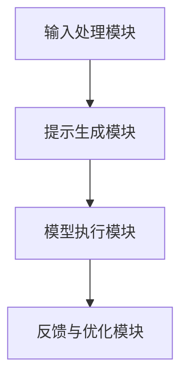

                 


# AI Agent的自适应prompt工程与优化

> 关键词：AI Agent，自适应prompt，优化算法，系统架构，项目实战

> 摘要：本文详细探讨了AI Agent的自适应prompt工程与优化方法，从理论基础到算法实现，再到系统设计与项目实战，全面解析了如何通过自适应prompt工程提升AI Agent的性能与效率。

---

## 第1章: AI Agent与自适应prompt工程概述

### 1.1 AI Agent的基本概念

AI Agent（人工智能代理）是指能够感知环境、自主决策并执行任务的智能实体。AI Agent的核心特点包括自主性、反应性、目标导向性和社会性。自主性使AI Agent能够在没有外部干预的情况下独立运行；反应性使其能够实时感知环境变化并做出响应；目标导向性使其能够根据目标调整行为；社会性则使其能够与其他实体（包括其他AI Agent或人类）进行交互与协作。

### 1.2 自适应prompt工程的背景与意义

传统prompt工程是通过预定义的提示（prompt）来指导AI模型的输出，但这种静态的提示方式在复杂动态的环境中往往难以适应变化。自适应prompt工程通过动态调整提示内容和策略，使AI Agent能够在不同的场景和任务中灵活应对，从而显著提升任务执行的效率和准确性。

---

## 第2章: 自适应prompt工程的数学模型与算法原理

### 2.1 自适应prompt的数学模型

自适应prompt工程的核心在于优化提示生成过程，使其能够适应不同的任务需求和环境变化。数学模型通常包括以下几个部分：

1. **输入空间**：表示输入的提示内容或任务描述。
2. **输出空间**：表示AI模型的输出结果。
3. **损失函数**：衡量生成的提示与期望输出之间的差距。
4. **优化目标**：通过优化算法调整提示内容，使损失函数最小化。

#### 损失函数的定义

损失函数用于衡量生成的提示与期望输出之间的差异。常见的损失函数包括交叉熵损失（Cross-Entropy Loss）和均方误差（Mean Squared Error）。例如，交叉熵损失可以表示为：

$$
L = -\sum_{i=1}^{n} y_i \log(p_i) + (1-y_i)\log(1-p_i)
$$

其中，$y_i$ 是真实标签，$p_i$ 是预测概率。

### 2.2 自适应prompt生成算法

自适应prompt生成算法的核心是通过强化学习或元学习等方法，动态调整提示内容。以下是几种常见的生成算法：

#### 2.2.1 基于强化学习的prompt生成

强化学习通过奖励机制来优化提示生成过程。例如，可以定义一个奖励函数，当生成的提示能够使AI Agent完成任务时，给予正向奖励；反之则给予负向奖励。

#### 2.2.2 基于元学习的prompt优化

元学习（Meta-Learning）是一种通过少量样本快速适应新任务的方法。在自适应prompt工程中，元学习可以用于快速调整提示策略，使其适应不同的任务场景。

---

## 第3章: 自适应prompt工程的系统架构与设计

### 3.1 系统架构概述

自适应prompt工程的系统架构通常包括以下几个模块：

1. **输入处理模块**：接收任务需求或环境信息。
2. **提示生成模块**：根据输入生成适应性提示。
3. **模型执行模块**：执行AI模型并输出结果。
4. **反馈与优化模块**：根据结果调整提示策略。

#### 系统功能模块划分

系统功能模块划分可以通过Mermaid图表示：



---

## 第4章: 项目实战与案例分析

### 4.1 环境搭建与配置

在实际项目中，首先需要搭建合适的开发环境。推荐使用Python编程语言，并安装必要的库，如TensorFlow、Keras和Scikit-learn。以下是基本的安装命令：

```bash
pip install tensorflow keras scikit-learn
```

### 4.2 核心代码实现

以下是自适应prompt生成算法的Python代码示例：

```python
import numpy as np
from tensorflow.keras.models import Model
from tensorflow.keras.layers import Dense, Input

# 定义模型
input_layer = Input(shape=(input_dim,))
dense_layer = Dense(64, activation='relu')(input_layer)
output_layer = Dense(1, activation='sigmoid')(dense_layer)

model = Model(inputs=input_layer, outputs=output_layer)
model.compile(optimizer='adam', loss='binary_crossentropy', metrics=['accuracy'])
```

### 4.3 案例分析与结果解读

通过实际案例分析，可以验证自适应prompt工程的有效性。例如，在自然语言处理任务中，自适应prompt工程可以使AI Agent更准确地生成符合任务需求的提示，从而提高模型的输出质量。

---

## 第5章: 最佳实践与总结

### 5.1 小结

自适应prompt工程通过动态调整提示内容，显著提升了AI Agent的任务执行效率和准确性。在实际应用中，需要结合具体的任务需求和环境特点，选择合适的算法和优化策略。

### 5.2 注意事项

在实际项目中，需要注意以下几点：

1. **数据质量**：确保输入数据的准确性和完整性。
2. **模型选择**：根据任务特点选择合适的AI模型。
3. **优化策略**：合理设计优化算法和反馈机制。

### 5.3 拓展阅读

建议读者进一步阅读以下内容：

1. 《深度学习》—— Ian Goodfellow
2. 《强化学习》—— Richard S. Sutton & Andrew G. Barto

---

作者：AI天才研究院/AI Genius Institute & 禅与计算机程序设计艺术 /Zen And The Art of Computer Programming

