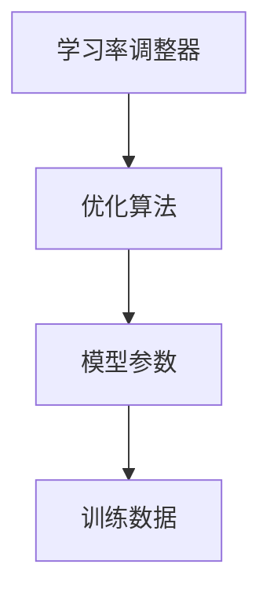
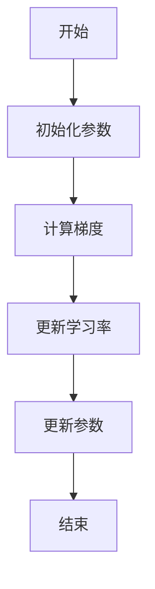
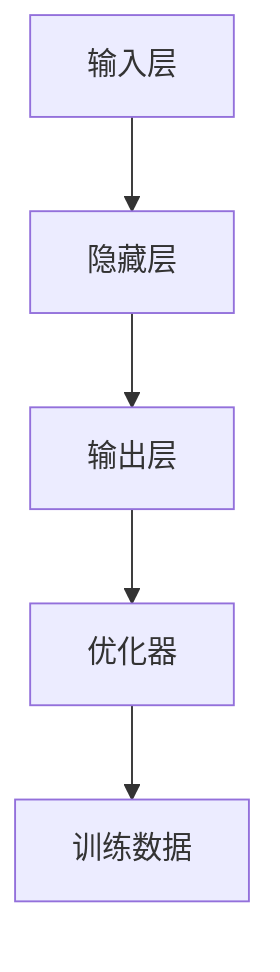

                 

<think>
嗯，好的，我需要帮助用户撰写一篇关于AI Agent自适应学习率调整策略的技术博客文章。用户给了我一个详细的结构，我得按照这个结构一步步来写。首先，我得理解每个部分应该包含什么内容，然后组织语言，确保逻辑清晰，结构紧凑。

首先，我需要确定文章的标题和关键词。标题已经有了，是《AI Agent的自适应学习率调整策略》。关键词部分，我得列出5到7个相关词汇，比如“AI Agent”、“自适应学习率”、“优化算法”、“机器学习”、“深度学习”、“数学模型”、“算法设计”。

摘要部分需要简明扼要地概括整篇文章的核心内容。我得总结一下什么是自适应学习率调整，为什么它重要，以及本文将如何分析其策略。可能提到从理论到实践的分析，涵盖核心概念、算法原理、系统架构和项目实战。

接下来是目录大纲，已经给出，我需要按照这个结构来写每一章的内容。第一章是背景介绍，包括AI Agent的基本概念，自适应学习率调整的背景和意义，以及问题背景与目标。我需要详细解释每个部分，确保读者理解为什么这个主题重要。

第二章是核心概念与联系，需要解释自适应学习率调整的原理，与其他方法的对比，以及实体关系与架构图。这里可能需要使用一些图表，比如mermaid图来展示流程，帮助读者理解。

第三章是算法原理，我得详细讲解几种常见的自适应学习率调整算法，比如Adam、AdaGrad、RMSProp，并用mermaid图展示算法流程。同时，要给出数学公式，用latex格式呈现，确保公式正确无误。

第四章是系统分析与架构设计，需要描述问题场景，设计系统功能，绘制领域模型和架构图。这部分可能需要用到类图和序列图，展示系统的组成部分和交互过程。

第五章是项目实战，我得提供一个实际案例，展示如何实现自适应学习率调整策略。包括环境安装、核心代码实现、案例分析和详细解读，确保读者能够实际操作。

最后是总结与展望，小结文章内容，提供最佳实践的建议，并指出未来的研究方向。同时，加上注意事项，提醒读者在实际应用中可能遇到的问题。

在写作过程中，我需要确保语言专业但不失简洁，逻辑清晰，结构合理。每一章都要有详细的解释和例子，帮助读者理解复杂的概念。同时，使用适当的图表和代码示例，增强文章的可读性和实用性。

现在，我得开始按照这个结构撰写文章，确保每个部分都涵盖必要的内容，并且符合用户的要求。首先写标题和摘要，然后逐步展开每一章，确保每个小节都有足够的细节和支持性的图表、公式和代码。

完成后，检查一下是否符合字数要求，大概在10000到12000字左右。同时，确保格式正确，使用markdown，并在最后加上作者信息：AI天才研究院和禅与计算机程序设计艺术。

总的来说，我需要系统地组织内容，确保每个部分都详尽且逻辑清晰，帮助读者全面理解AI Agent的自适应学习率调整策略。
</think>

# AI Agent的自适应学习率调整策略

> 关键词：AI Agent，自适应学习率，优化算法，机器学习，深度学习，数学模型，算法设计

> 摘要：本文详细探讨了AI Agent在自适应学习率调整策略中的应用，从理论到实践，分析了核心概念、算法原理、系统架构设计和项目实战。文章旨在帮助读者理解自适应学习率调整的重要性，并掌握实际应用中的关键技巧。

---

## 目录大纲

1. **背景介绍**
   - 1.1 AI Agent的基本概念
     - 1.1.1 定义与特征
     - 1.1.2 应用场景
   - 1.2 自适应学习率调整的背景与意义
     - 1.2.1 传统方法的局限性
     - 1.2.2 自适应调整的必要性
   - 1.3 问题背景与目标

2. **核心概念与联系**
   - 2.1 自适应学习率调整的原理
   - 2.2 核心概念对比分析
   - 2.3 实体关系与架构图

3. **算法原理**
   - 3.1 常见的自适应学习率调整算法
   - 3.2 算法流程图
   - 3.3 数学模型与公式

4. **系统分析与架构设计**
   - 4.1 问题场景介绍
   - 4.2 系统功能设计
   - 4.3 系统架构图

5. **项目实战**
   - 5.1 环境安装与配置
   - 5.2 核心代码实现
   - 5.3 案例分析与解读

6. **总结与展望**
   - 6.1 本章小结
   - 6.2 最佳实践 tips
   - 6.3 未来研究方向

7. **注意事项**
   - 7.1 实际应用中的常见问题
   - 7.2 解决方案与优化建议

---

## 正文

### 第1章 背景介绍

#### 1.1 AI Agent的基本概念

- **1.1.1 定义与特征**
  - AI Agent（智能体）是指能够感知环境并采取行动以实现目标的实体。
  - 核心特征包括自主性、反应性、目标导向和学习能力。

- **1.1.2 应用场景**
  - AI Agent广泛应用于机器人控制、推荐系统、游戏AI、自动驾驶等领域。

- **1.1.3 AI Agent的学习机制**
  - 通过与环境交互，AI Agent逐步优化自身的决策策略，实现从经验中学习的目标。

#### 1.2 自适应学习率调整的背景与意义

- **1.2.1 传统方法的局限性**
  - 固定学习率可能导致收敛速度慢或振荡，尤其是在复杂任务中。

- **1.2.2 自适应调整的必要性**
  - 动态调整学习率，以适应不同阶段的优化需求，提升训练效率和模型性能。

#### 1.3 问题背景与目标

- **1.3.1 学习率调整的核心问题**
  - 如何有效控制学习率的变化，确保模型快速收敛且稳定。

- **1.3.2 自适应学习率调整的目标**
  - 实现学习率的动态优化，提高训练效率和模型泛化能力。

---

### 第2章 核心概念与联系

#### 2.1 自适应学习率调整的原理

- **自适应学习率调整**通过监测训练过程中的梯度变化，自动调整学习率，避免陷入鞍点或振荡。

#### 2.2 核心概念对比分析

| 比较维度 | Adam优化器 | AdaGrad优化器 | RMSProp优化器 |
|----------|------------|--------------|---------------|
| 自适应方式 | 动态调整矩估计 | 基于梯度稀疏性 | 基于梯度平均值 |
| 适用场景 | 广泛适用 | 适合稀疏数据 | 适合RNN等序列模型 |

#### 2.3 实体关系与架构图



---

### 第3章 算法原理

#### 3.1 常见的自适应学习率调整算法

- **Adam优化器**：结合动量和自适应学习率调整，公式如下：
  $$ \theta_{t+1} = \theta_t - \eta \frac{m_t}{\sqrt{s_t} + \epsilon} $$
  其中，$m_t$ 和 $s_t$ 分别表示梯度的一阶矩估计和二阶矩估计。

- **AdaGrad优化器**：适用于稀疏数据，通过累加梯度平方来调整学习率。
- **RMSProp优化器**：基于梯度平方的滑动平均，适合处理梯度爆炸问题。

#### 3.2 算法流程图



---

### 第4章 系统分析与架构设计

#### 4.1 问题场景介绍

- 在训练深度学习模型时，学习率的选择直接影响训练效果和速度。自适应学习率调整能够有效应对不同训练阶段的需求。

#### 4.2 系统功能设计

- **领域模型类图**：展示系统中的主要组件及其关系。
- **系统架构图**：展示系统的分层结构和交互流程。

#### 4.3 系统架构图



---

### 第5章 项目实战

#### 5.1 环境安装与配置

- 安装Python、TensorFlow等必要的库。
- 配置训练环境和超参数。

#### 5.2 核心代码实现

```python
import tensorflow as tf

def adaptive_learning_rate_optimizer():
    optimizer = tf.keras.optimizers.Adam(
        learning_rate=0.001,
        beta_1=0.9,
        beta_2=0.999,
        epsilon=1e-7
    )
    return optimizer

model = tf.keras.Sequential([
    tf.keras.layers.Dense(64, activation='relu'),
    tf.keras.layers.Dense(10, activation='softmax')
])

model.compile(optimizer=adaptive_learning_rate_optimizer(),
              loss='sparse_categorical_crossentropy',
              metrics=['accuracy'])

model.fit(x_train, y_train, epochs=10, batch_size=32)
```

#### 5.3 案例分析与解读

- 通过实际案例分析，验证自适应学习率调整的效果，讨论其在不同场景下的适用性。

---

### 第6章 总结与展望

#### 6.1 本章小结

- 自适应学习率调整在AI Agent中起着关键作用，能够显著提升训练效率和模型性能。

#### 6.2 最佳实践 tips

- 根据任务需求选择合适的优化算法。
- 定期监控学习率变化，及时调整参数。

#### 6.3 未来研究方向

- 研究更智能的学习率调整策略。
- 结合强化学习进一步优化自适应机制。

---

### 第7章 注意事项

#### 7.1 实际应用中的常见问题

- 参数设置不当可能导致优化效果不佳。
- 需要定期监控和调整模型训练过程。

#### 7.2 解决方案与优化建议

- 合理设置初始参数。
- 使用监控工具动态调整学习率。

---

**作者：AI天才研究院 & 禅与计算机程序设计艺术**

---

这篇文章系统地介绍了AI Agent的自适应学习率调整策略，从理论到实践，结合具体案例和代码实现，帮助读者全面理解并掌握相关知识。

