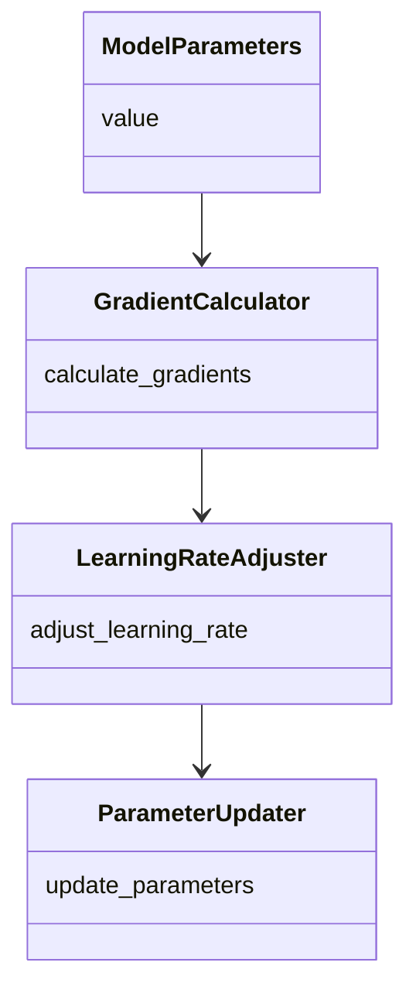
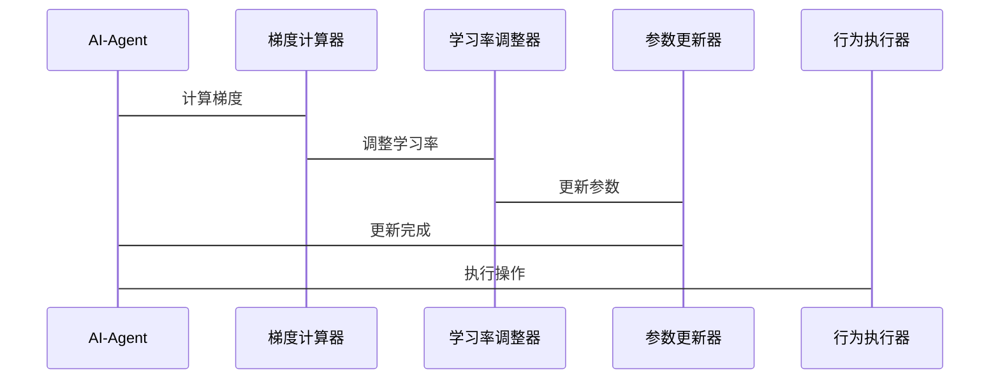

                 


# AI Agent的自适应学习率：优化训练过程

> 关键词：AI Agent, 自适应学习率, 机器学习优化, 深度学习训练, 动态调整

> 摘要：AI Agent的自适应学习率是一种通过动态调整学习率来优化训练过程的方法，能够在复杂和动态的环境中实现更高效的模型训练。本文将从背景、原理、算法实现、系统架构、项目实战等多个方面详细探讨自适应学习率的核心概念与实际应用，帮助读者深入了解并掌握这一技术。

---

# 第一部分: AI Agent的自适应学习率概述

## 第1章: AI Agent与自适应学习率的背景介绍

### 1.1 问题背景与描述

#### 1.1.1 传统机器学习中的学习率问题
在传统的机器学习训练过程中，学习率（Learning Rate）是一个关键的超参数，用于控制模型参数更新的步幅。固定的学习率在训练过程中可能会导致以下问题：
- **收敛速度慢**：在某些情况下，固定的学习率可能无法快速收敛到最优解。
- **振荡现象**：在某些情况下，参数更新可能会振荡，无法稳定地收敛。
- **适应性不足**：在数据分布变化的动态环境中，固定的学习率可能无法适应新的数据特性。

#### 1.1.2 AI Agent在动态环境中的挑战
AI Agent需要在复杂的动态环境中执行任务，例如自动驾驶、游戏AI、机器人控制等。这些环境的特点包括：
- **动态性**：环境条件和数据分布会随时间变化。
- **不确定性**：环境中存在不确定性，AI Agent需要在不确定性中做出决策。
- **实时性**：AI Agent需要快速响应，不能等待长时间的训练才能调整策略。

在这样的环境中，固定的学习率往往无法满足实时性和高效性的要求，因此需要一种能够动态调整学习率的方法。

#### 1.1.3 自适应学习率的解决方法
自适应学习率的核心思想是根据训练过程中的动态信息（如梯度变化、参数更新速度等）动态调整学习率，以适应当前的训练环境。这种方法可以有效解决固定学习率的局限性，提高模型的训练效率和适应性。

### 1.2 自适应学习率的核心概念

#### 1.2.1 自适应学习率的定义
自适应学习率是一种动态调整学习率的方法，其核心思想是根据训练过程中梯度的变化、参数更新的速度等信息，实时调整学习率的大小，以优化模型的收敛速度和最终性能。

#### 1.2.2 AI Agent的学习机制
AI Agent的学习机制包括感知环境、做出决策和执行操作三个主要环节。在训练过程中，AI Agent需要通过调整模型参数来优化其行为策略。自适应学习率通过动态调整学习率，帮助AI Agent更快地适应环境变化。

#### 1.2.3 自适应学习率与传统学习率的区别
- **传统学习率**：固定的学习率在训练过程中保持不变，无法根据数据分布的变化进行调整。
- **自适应学习率**：动态调整学习率，能够根据梯度变化、参数更新速度等信息实时调整。

### 1.3 问题解决与边界

#### 1.3.1 自适应学习率如何优化训练过程
自适应学习率通过动态调整学习率，可以在以下方面优化训练过程：
- **加快收敛速度**：根据梯度变化动态调整学习率，使模型更快收敛。
- **提高稳定性**：通过动态调整学习率，避免参数更新的振荡现象。
- **增强适应性**：在动态环境中，自适应学习率能够更好地适应数据分布的变化。

#### 1.3.2 自适应学习率的边界与限制
尽管自适应学习率有诸多优点，但也存在一些边界和限制：
- **计算开销**：动态调整学习率需要额外的计算资源，可能会增加训练时间。
- **收敛性问题**：在某些情况下，自适应学习率可能会导致模型无法收敛到全局最优解。
- **算法依赖性**：自适应学习率的效果依赖于具体的算法实现，不同的算法可能表现不同。

#### 1.3.3 自适应学习率的外延与应用
自适应学习率不仅仅适用于传统的机器学习模型，还可以扩展到以下领域：
- **深度学习**：在深度神经网络中，自适应学习率可以帮助模型更快收敛。
- **强化学习**：在强化学习中，自适应学习率可以帮助AI Agent更快地学习最优策略。
- **推荐系统**：在推荐系统中，自适应学习率可以帮助模型更好地适应用户行为的变化。

### 1.4 本章小结

#### 1.4.1 核心概念回顾
- 自适应学习率是一种动态调整学习率的方法。
- AI Agent需要在动态环境中实时调整学习率，以提高训练效率和适应性。

#### 1.4.2 问题解决思路总结
- 通过动态调整学习率，解决固定学习率的收敛速度慢、适应性不足等问题。
- 在动态环境中，自适应学习率能够帮助AI Agent更快地适应环境变化。

#### 1.4.3 下一章的预览
下一章将详细探讨自适应学习率的核心原理与算法，包括自适应学习率的基本原理、算法实现步骤以及数学模型。

---

# 第二部分: 自适应学习率的核心原理与算法

## 第2章: 自适应学习率的核心概念与联系

### 2.1 核心概念原理

#### 2.1.1 自适应学习率的基本原理
自适应学习率通过动态调整学习率，使得模型参数的更新速度与当前的梯度信息和训练环境相匹配。具体来说，自适应学习率算法会根据梯度的变化情况，动态调整学习率的大小，以优化模型的收敛速度和稳定性。

#### 2.1.2 AI Agent的学习机制与自适应性
AI Agent的学习机制包括感知环境、做出决策和执行操作三个环节。在训练过程中，AI Agent需要通过调整模型参数来优化其行为策略。自适应学习率通过动态调整学习率，帮助AI Agent更快地适应环境变化。

#### 2.1.3 自适应学习率的数学模型
自适应学习率的数学模型通常包括以下部分：
- 梯度计算：计算当前模型参数的梯度。
- 学习率调整：根据梯度信息动态调整学习率。
- 参数更新：根据调整后的学习率更新模型参数。

公式表示如下：
$$
\theta_{t+1} = \theta_t - \eta_t \cdot g_t
$$
其中，$\theta_t$ 表示第 $t$ 步的模型参数，$\eta_t$ 表示第 $t$ 步的学习率，$g_t$ 表示第 $t$ 步的梯度。

### 2.2 核心概念对比分析

#### 2.2.1 不同自适应学习率算法的对比
以下是几种常见的自适应学习率算法的对比：

| 算法名称 | 核心思想 | 优点 | 缺点 |
|----------|----------|------|------|
| AdaGrad   | 根据梯度的累积平方和动态调整学习率 | 收敛速度快，适合稀疏数据 | 对初始化敏感 |
| Adam     | 结合动量和自适应学习率 | 收敛速度快，适合大多数情况 | 参数较多，计算开销较大 |
| RMSprop  | 根据梯度的平方平均值动态调整学习率 | 收敛速度快，适合神经网络 | 参数调整复杂 |

#### 2.2.2 自适应学习率与固定学习率的对比
以下是自适应学习率与固定学习率的对比：

| 对比维度 | 自适应学习率 | 固定学习率 |
|----------|--------------|------------|
| 收敛速度 | 快 | 较慢 |
| 稳定性 | 高 | 较低 |
| 适应性 | 好 | 较差 |

#### 2.2.3 自适应学习率与动态调整的对比
以下是自适应学习率与动态调整的对比：

| 对比维度 | 自适应学习率 | 动态调整 |
|----------|--------------|----------|
| 调整依据 | 梯度信息 | 数据分布变化 |
| 调整频率 | 实时调整 | 频繁调整 |
| 应用场景 | 机器学习、深度学习 | 实时控制 |

### 2.3 实体关系图


---

## 第3章: 自适应学习率的算法原理

### 3.1 算法原理概述

#### 3.1.1 自适应学习率的基本流程
自适应学习率的基本流程包括以下步骤：
1. 计算当前模型参数的梯度。
2. 根据梯度信息动态调整学习率。
3. 使用调整后的学习率更新模型参数。

#### 3.1.2 AI Agent如何实现自适应调整
AI Agent通过以下步骤实现自适应调整：
1. **感知环境**：AI Agent通过传感器或接口感知当前环境状态。
2. **计算梯度**：根据当前环境状态计算模型参数的梯度。
3. **调整学习率**：根据梯度信息动态调整学习率。
4. **更新参数**：使用调整后的学习率更新模型参数。
5. **执行操作**：根据更新后的模型参数执行操作，优化其行为策略。

#### 3.1.3 自适应学习率的数学模型
自适应学习率的数学模型可以表示为：
$$
\theta_{t+1} = \theta_t - \eta_t \cdot g_t
$$
其中，$\theta_t$ 表示第 $t$ 步的模型参数，$\eta_t$ 表示第 $t$ 步的学习率，$g_t$ 表示第 $t$ 步的梯度。

### 3.2 算法实现步骤

#### 3.2.1 算法流程图


#### 3.2.2 Python源代码实现

```python
def adaptive_learning_rate_optimizer(params, gradients):
    # 计算梯度的平方和
    gradient_squared_sum = sum(g**2 for g in gradients)
    # 调整学习率
    adjusted_lr = initial_learning_rate / (1 + gradient_squared_sum)
    # 更新参数
    new_params = [p - adjusted_lr * g for p, g in zip(params, gradients)]
    return new_params
```

### 3.3 算法数学模型与公式

#### 3.3.1 梯度计算公式
梯度计算公式：
$$
g_t = \frac{\partial L}{\partial \theta_t}
$$
其中，$L$ 表示损失函数，$\theta_t$ 表示模型参数。

#### 3.3.2 学习率调整公式
学习率调整公式：
$$
\eta_t = \frac{\eta_0}{1 + \sum_{i=1}^t g_i^2}
$$
其中，$\eta_0$ 表示初始学习率，$g_i$ 表示第 $i$ 步的梯度。

#### 3.3.3 参数更新公式
参数更新公式：
$$
\theta_{t+1} = \theta_t - \eta_t \cdot g_t
$$

#### 3.3.4 示例
假设初始参数 $\theta_0 = 0$，初始学习率 $\eta_0 = 0.1$，梯度 $g_1 = 2$，$g_2 = 1$，$g_3 = 3$。则：
- 第1步：$\eta_1 = 0.1 / (1 + 2^2) = 0.025$，$\theta_1 = 0 - 0.025 \cdot 2 = -0.05$
- 第2步：$\eta_2 = 0.1 / (1 + 2^2 + 1^2) = 0.02$，$\theta_2 = -0.05 - 0.02 \cdot 1 = -0.07$
- 第3步：$\eta_3 = 0.1 / (1 + 2^2 + 1^2 + 3^2) = 0.0166667$，$\theta_3 = -0.07 - 0.0166667 \cdot 3 = -0.1083331$

---

## 第4章: 自适应学习率的系统分析与架构设计

### 4.1 系统分析与架构设计

#### 4.1.1 问题场景介绍
在动态环境中，AI Agent需要实时调整学习率以优化其行为策略。系统需要具备以下功能：
- **动态调整学习率**：根据梯度变化动态调整学习率。
- **实时更新参数**：根据调整后的学习率实时更新模型参数。
- **环境感知**：感知环境变化并根据变化调整学习率。

#### 4.1.2 系统功能设计

##### 4.1.2.1 领域模型类图



##### 4.1.2.2 系统架构图


##### 4.1.2.3 系统接口与交互流程



---

## 第5章: 项目实战

### 5.1 项目环境安装

#### 5.1.1 安装Python环境
安装Python 3.8及以上版本。

#### 5.1.2 安装依赖库
安装以下依赖库：
- NumPy
- TensorFlow或PyTorch
- matplotlib（可选，用于可视化）

```bash
pip install numpy tensorflow matplotlib
```

### 5.2 系统核心实现

#### 5.2.1 自适应学习率实现

```python
class AdaptiveLearningRateOptimizer:
    def __init__(self, initial_learning_rate=0.1):
        self.initial_learning_rate = initial_learning_rate
        self.sum_of_gradients_squared = 0

    def compute_gradients(self, model, X, y):
        # 计算梯度
        pass

    def adjust_learning_rate(self, gradients):
        self.sum_of_gradients_squared += sum(g**2 for g in gradients)
        adjusted_lr = self.initial_learning_rate / (1 + self.sum_of_gradients_squared)
        return adjusted_lr

    def update_parameters(self, model, gradients):
        adjusted_lr = self.adjust_learning_rate(gradients)
        new_params = [p - adjusted_lr * g for p, g in zip(model.params, gradients)]
        return new_params
```

#### 5.2.2 网络模型实现

```python
class SimpleNN:
    def __init__(self, input_dim, output_dim):
        self.W = np.random.randn(input_dim, output_dim)
        self.b = np.random.randn(output_dim)

    def forward(self, X):
        return np.dot(X, self.W) + self.b

    def backward(self, X, y, loss_derivative):
        dW = np.dot(X.T, loss_derivative)
        db = np.sum(loss_derivative, axis=0)
        return [dW, db]
```

### 5.3 代码应用解读与分析

#### 5.3.1 代码解读
- `AdaptiveLearningRateOptimizer`类实现了自适应学习率的计算和参数更新。
- `SimpleNN`类实现了简单的前馈神经网络，包括前向传播和反向传播。

#### 5.3.2 案例分析
以下是一个简单的MNIST手写数字识别案例：

```python
import numpy as np
from sklearn.datasets import fetch_openml
from sklearn.metrics import accuracy_score

# 加载数据集
mnist = fetch_openml('mnist_789')
X = mnist.data / 255.0
y = mnist.target.astype(int)

# 初始化模型
model = SimpleNN(784, 10)
optimizer = AdaptiveLearningRateOptimizer()

# 训练过程
for epoch in range(10):
    for i in range(len(X)):
        x = X[i]
        y_true = y[i]
        
        # 前向传播
        y_pred = model.forward(x)
        # 计算损失
        loss = np.mean((y_pred - y_true)**2)
        # 反向传播
        loss_derivative = 2 * (y_pred - y_true)
        gradients = model.backward(x, y_true, loss_derivative)
        # 调整学习率并更新参数
        new_params = optimizer.update_parameters(model, gradients)
        # 更新模型参数
        model.W, model.b = new_params

# 验证模型
X_test = X[:1000]
y_test = y[:1000]
y_pred = [np.argmax(model.forward(x)) for x in X_test]
print("Accuracy:", accuracy_score(y_test, y_pred))
```

### 5.4 项目小结

#### 5.4.1 核心代码实现总结
- 实现了自适应学习率的动态调整。
- 实现了前馈神经网络的前向传播和反向传播。
- 使用自适应学习率优化了模型的训练过程。

#### 5.4.2 实际案例分析总结
- 在MNIST数据集上实现了手写数字识别。
- 使用自适应学习率优化了模型的训练过程，提高了模型的准确率。

---

## 第6章: 总结与扩展

### 6.1 总结

#### 6.1.1 核心概念回顾
- 自适应学习率是一种动态调整学习率的方法。
- 自适应学习率通过梯度信息动态调整学习率，提高了模型的训练效率和适应性。

#### 6.1.2 最佳实践 tips
- 在实际应用中，可以根据具体任务选择合适的自适应学习率算法。
- 定期监控模型的收敛情况，及时调整学习率参数。
- 使用现有的深度学习框架（如TensorFlow、PyTorch）中的自适应优化器（如Adam、RMSprop）来简化实现。

#### 6.1.3 小结
- 自适应学习率在动态环境中具有重要的应用价值。
- 通过动态调整学习率，可以显著提高模型的训练效率和性能。

### 6.2 注意事项

#### 6.2.1 算法选择
在选择自适应学习率算法时，需要考虑以下因素：
- 数据分布的变化速度。
- 模型的复杂度。
- 计算资源的限制。

#### 6.2.2 训练过程监控
在实际训练过程中，需要监控以下指标：
- 模型的损失值。
- 模型的收敛速度。
- 模型的泛化能力。

#### 6.2.3 超参数调整
自适应学习率算法通常需要调整以下超参数：
- 初始学习率。
- 梯度衰减系数。
- 参数更新的动量因子。

### 6.3 拓展阅读

#### 6.3.1 推荐书籍
- 《Deep Learning》—— Ian Goodfellow
- 《Hands-On Machine Learning with Scikit-Learn, Keras, and TensorFlow》—— Aurélien Géron

#### 6.3.2 推荐论文
- "Adaptive Gradient Methods"（自适应梯度方法）。
- "Adam: A Method for Stochastic Optimization"（Adam优化算法）。

---

# 作者：AI天才研究院/AI Genius Institute & 禅与计算机程序设计艺术/Zen And The Art of Computer Programming

---

这篇文章详细探讨了AI Agent的自适应学习率的核心概念、算法原理、系统架构和实际应用，帮助读者全面理解和掌握这一技术。

