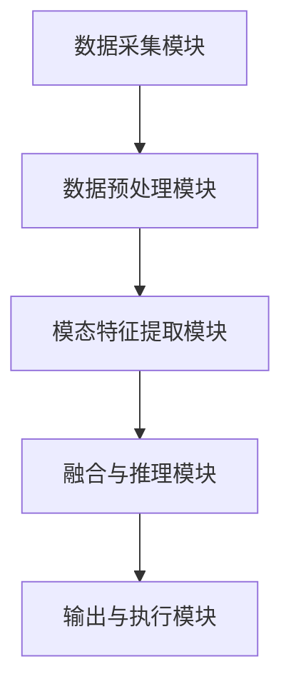

                 


# AI Agent的视觉-语言-行为三模态融合

## 关键词
AI Agent, 视觉模态, 语言模态, 行为模态, 多模态融合, 深度学习

## 摘要
AI Agent的视觉-语言-行为三模态融合技术旨在将视觉、语言和行为三种模态的数据进行深度融合，从而提升AI Agent的感知、理解和决策能力。本文从三模态融合的背景、核心概念、算法原理、系统架构、项目实战等方面展开详细分析，最后总结了三模态融合的关键点和未来发展方向。

---

## 第一部分: AI Agent的视觉-语言-行为三模态融合基础

## 第1章: AI Agent的背景与概述

### 1.1 AI Agent的基本概念
AI Agent是一种具备自主决策能力的智能体，能够在复杂环境中感知、理解、推理和执行任务。AI Agent的核心目标是通过多模态数据的融合，实现对现实世界的全面感知和高效决策。

#### 1.1.1 AI Agent的定义与特点
- **定义**: AI Agent是一个能够感知环境、做出决策并执行动作的智能实体。
- **特点**: 智能性、自主性、反应性、社会性。

#### 1.1.2 AI Agent的应用场景
- 智能助手（如Siri、Alexa）
- 智能机器人
- 智能驾驶系统
- 虚拟助手

#### 1.1.3 三模态融合的意义与价值
- 提升AI Agent的感知能力
- 增强AI Agent的理解和决策能力
- 实现跨模态信息的协同优化

### 1.2 视觉-语言-行为三模态融合的背景
#### 1.2.1 多模态数据的定义
多模态数据是指来自不同感知渠道（如视觉、语言、行为）的数据类型，具有互补性和冗余性。

#### 1.2.2 三模态融合的必要性
- 单一模态数据的局限性
- 三模态数据的互补性
- 复杂场景中的应用需求

#### 1.2.3 当前技术发展趋势
- 深度学习技术的快速发展
- 多模态数据处理方法的不断优化
- 跨学科融合的推动

### 1.3 三模态融合的核心目标
#### 1.3.1 提升AI Agent的感知能力
通过多模态数据的融合，AI Agent能够更全面地感知环境。

#### 1.3.2 增强AI Agent的决策能力
结合视觉、语言和行为信息，AI Agent能够做出更准确的决策。

#### 1.3.3 实现跨模态信息的协同优化
通过模态间的协同优化，提升整体系统的性能。

### 1.4 本章小结
本章介绍了AI Agent的基本概念和三模态融合的背景，强调了三模态融合的重要性和必要性。

---

## 第2章: 视觉-语言-行为三模态的核心概念

### 2.1 视觉模态的核心特征
#### 2.1.1 视觉数据的表示方式
- 图像表示（如RGB图像）
- 视频表示（如RGB-D视频）
- 特征向量表示

#### 2.1.2 视觉感知的关键技术
- 目标检测
- 语义分割
- 视频理解

#### 2.1.3 视觉信息的特征提取
- 卷积神经网络（CNN）
- 转换器（Transformer）

### 2.2 语言模态的核心特征
#### 2.2.1 语言数据的表示方式
- 文本序列
- 词嵌入（如Word2Vec、BERT）
- 语言模型（如GPT）

#### 2.2.2 语言理解的关键技术
- 词性分析（POS tagging）
- 句法分析
- 情感分析

#### 2.2.3 语言信息的特征提取
- 递归神经网络（RNN）
- Transformer模型

### 2.3 行为模态的核心特征
#### 2.3.1 行为数据的表示方式
- 动作序列
- 加速度和速度数据
- 关键点跟踪

#### 2.3.2 行为识别的关键技术
- 基于时间序列的分类（如LSTM）
- 基于骨架的分析（如OpenPose）

#### 2.3.3 行为信息的特征提取
- 时间序列模型（如LSTM、GRU）
- 骨骼关键点特征

### 2.4 三模态特征的对比分析
#### 2.4.1 模态特征的异同点对比
- 视觉模态：高维、空间信息丰富
- 语言模态：序列性、语义信息丰富
- 行为模态：时间相关性、动态信息丰富

#### 2.4.2 模态特征的互补性分析
- 视觉和行为模态的互补性
- 语言模态对语义的理解能力
- 行为模态对动态信息的捕捉能力

#### 2.4.3 模态特征的融合方式
- 晚融合（在特征层融合）
- 中融合（在模型层融合）
- 早融合（在输入层融合）

### 2.5 本章小结
本章详细分析了视觉、语言和行为三模态的核心特征及其互补性，为后续的融合方法奠定了基础。

---

## 第3章: 多模态数据的表示与建模

### 3.1 多模态数据的表示方法
#### 3.1.1 向量空间表示
- 将不同模态的数据映射到同一向量空间。
- 例如，将视觉、语言和行为特征映射到一个共同的向量空间。

#### 3.1.2 图结构表示
- 将多模态数据建模为图结构，节点代表不同的模态特征，边表示模态间的关联关系。

#### 3.1.3 深度学习表示
- 使用深度学习模型（如BERT、Transformer）对多模态数据进行联合表示。

### 3.2 多模态数据的融合模型
#### 3.2.1 晚融合模型
- 在特征提取阶段分别处理每个模态的数据，然后在特征层进行融合。

#### 3.2.2 中融合模型
- 在模型的中间层进行融合，例如在BERT的中间层进行多模态信息的交互。

#### 3.2.3 早融合模型
- 在输入阶段就进行模态间的融合，例如将视觉和语言特征直接拼接作为模型的输入。

### 3.3 多模态数据的对齐方法
#### 3.3.1 时间对齐
- 根据时间戳对齐多模态数据，例如视频和音频数据的时间对齐。

#### 3.3.2 空间对齐
- 根据空间位置对齐多模态数据，例如图像和三维数据的空间对齐。

#### 3.3.3 特征对齐
- 通过特征提取模型将不同模态的数据映射到相同的特征空间，从而实现特征对齐。

### 3.4 本章小结
本章介绍了多模态数据的表示方法和融合模型，并探讨了模态数据的对齐方法。

---

## 第4章: 三模态融合的算法原理

### 4.1 多模态融合的基本原理
#### 4.1.1 多模态数据的联合分布
- 考虑多个模态的数据分布，建立联合概率模型。

#### 4.1.2 融合函数的设计原则
- 线性融合、非线性融合、自适应融合。

#### 4.1.3 融合效果的评估指标
- 精准率、召回率、F1分数、困惑度等。

### 4.2 基于深度学习的三模态融合算法
#### 4.2.1 多模态编码
- 使用编码器将不同模态的数据编码为统一的向量表示。

#### 4.2.2 跨模态注意力机制
- 使用注意力机制（如Transformer中的self-attention）进行跨模态信息交互。

#### 4.2.3 融合与解码
- 将编码后的向量融合后进行解码，生成最终的输出。

### 4.3 三模态融合的数学模型
#### 4.3.1 融合函数
$$ f(x_v, x_l, x_b) = \sigma(W_v x_v + W_l x_l + W_b x_b + b) $$

#### 4.3.2 注意力机制
$$ \alpha_i = \frac{\exp(s_i)}{\sum_{j} \exp(s_j)} $$
$$ f(x) = \sum_{i} \alpha_i x_i $$

### 4.4 本章小结
本章详细介绍了三模态融合的算法原理，包括融合函数的设计和深度学习模型的构建。

---

## 第5章: 三模态融合的系统架构

### 5.1 系统功能设计
#### 5.1.1 功能模块划分
- 数据采集模块
- 数据预处理模块
- 模态特征提取模块
- 融合与推理模块
- 输出与执行模块

#### 5.1.2 功能模块的交互流程
1. 数据采集模块获取多模态数据。
2. 数据预处理模块对数据进行标准化处理。
3. 模态特征提取模块分别提取视觉、语言和行为特征。
4. 融合与推理模块对特征进行融合并进行决策。
5. 输出与执行模块将决策结果输出并执行。

### 5.2 系统架构设计
#### 5.2.1 系统架构图


#### 5.2.2 系统接口设计
- 输入接口：多模态数据流
- 输出接口：决策结果

### 5.3 本章小结
本章设计了三模态融合系统的架构，并详细描述了各个功能模块的交互流程。

---

## 第6章: 三模态融合的项目实战

### 6.1 项目背景与目标
- 项目目标：实现一个基于三模态融合的AI Agent，能够通过视觉、语言和行为信息进行交互和决策。

### 6.2 系统实现
#### 6.2.1 环境安装
- 安装深度学习框架（如TensorFlow、PyTorch）
- 安装相关库（如OpenCV、NLTK）

#### 6.2.2 核心代码实现
```python
import tensorflow as tf
from tensorflow.keras import layers

# 定义多模态融合模型
class MultimodalFusionModel(tf.keras.Model):
    def __init__(self):
        super().__init__()
        self.vision_encoder = VisionEncoder()
        self.language_encoder = LanguageEncoder()
        self.behavior_encoder = BehaviorEncoder()
        self.fusion_layer = layers.Dense(128, activation='relu')
        self.classifier = layers.Dense(num_classes, activation='softmax')

    def call(self, inputs):
        v = self.vision_encoder(inputs['vision'])
        l = self.language_encoder(inputs['language'])
        b = self.behavior_encoder(inputs['behavior'])
        fused = tf.keras.layers.concatenate([v, l, b])
        features = self.fusion_layer(fused)
        output = self.classifier(features)
        return output
```

### 6.3 项目小结
本章通过一个实际项目展示了三模态融合技术的应用，详细描述了项目的实现过程和核心代码。

---

## 第7章: 总结与展望

### 7.1 三模态融合的关键点
- 多模态数据的对齐与融合
- 跨模态注意力机制的设计
- 系统架构的优化

### 7.2 本章小结
本章总结了三模态融合的关键点，并展望了未来的研究方向。

### 7.3 最佳实践 tips
- 在实际应用中，注意不同模态数据的对齐和预处理
- 使用先进的深度学习模型（如Transformer）进行跨模态交互
- 根据具体场景优化模型参数和架构

---

## 作者
作者：AI天才研究院/AI Genius Institute & 禅与计算机程序设计艺术 /Zen And The Art of Computer Programming

