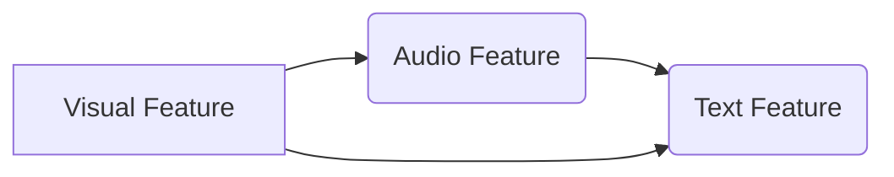
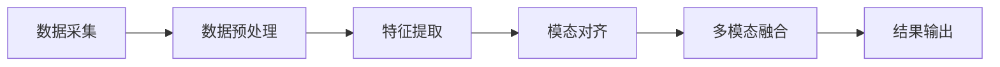
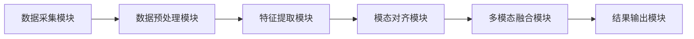
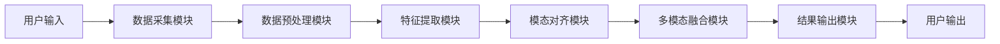

                 


# AI Agent的视觉-语音-文本多模态融合

> 关键词：AI Agent, 多模态融合, 视觉, 语音, 文本, 注意力机制, 图神经网络

> 摘要：本文深入探讨了AI Agent在视觉、语音和文本多模态数据融合领域的应用，从基本概念到核心算法，再到系统架构设计，最后通过实际项目案例分析，全面解析多模态数据融合的技术要点和实现方法。文章内容涵盖多模态数据融合的背景、原理、算法实现、系统架构设计、项目实战以及最佳实践，为读者提供了从理论到实践的完整指南。

---

# 第一部分: AI Agent的视觉-语音-文本多模态融合概述

---

# 第1章: 多模态数据融合的背景与意义

## 1.1 多模态数据融合的背景

### 1.1.1 多模态数据的概念与特点

多模态数据是指来自不同感官渠道（如视觉、听觉、触觉等）的数据形式。在AI Agent的应用中，视觉、语音和文本是三种主要的模态。每种模态都有其独特的特征：

- **视觉模态**：通过图像或视频提供空间信息，具有丰富的细节和场景描述能力。
- **语音模态**：通过音频提供时间序列信息，能够捕捉语调、语气和情感特征。
- **文本模态**：通过文字提供语义信息，能够直接表达意图和概念。

多模态数据的融合可以弥补单一模态的不足，提高AI Agent的理解能力和决策能力。

### 1.1.2 多模态数据融合的必要性

在实际应用中，单一模态的数据往往不足以满足复杂场景的需求。例如，在智能客服系统中，结合用户的语音情感和文本意图可以更准确地理解用户需求。多模态数据融合能够提升系统的鲁棒性和准确性。

### 1.1.3 多模态数据融合的应用场景

- **智能助手**：结合语音和文本指令，提供更自然的交互体验。
- **视频分析**：融合视觉和语音信息，提升场景理解和事件检测的准确性。
- **教育技术**：结合学生的视觉行为和语音情感，提供个性化的学习建议。

---

## 1.2 AI Agent的基本概念

### 1.2.1 AI Agent的定义与分类

AI Agent（智能体）是指在计算机系统中，能够感知环境并采取行动以实现目标的实体。AI Agent可以分为以下几类：

- **反应式AI Agent**：基于当前感知做出反应，适用于实时任务。
- **认知式AI Agent**：具备推理和规划能力，适用于复杂决策任务。
- **学习式AI Agent**：通过机器学习算法不断优化自身性能。

### 1.2.2 AI Agent的核心能力

AI Agent的核心能力包括：

- **感知能力**：通过多模态传感器获取环境信息。
- **推理能力**：基于获取的信息进行逻辑推理和决策。
- **学习能力**：通过机器学习算法不断优化自身性能。

### 1.2.3 AI Agent与多模态数据的关系

AI Agent需要通过多模态数据来感知和理解环境，而多模态数据融合技术则是AI Agent实现复杂任务的核心技术。

---

## 1.3 视觉-语音-文本多模态融合的特征

### 1.3.1 视觉模态的特征

视觉模态的主要特征包括：

- **空间性**：图像或视频提供的是空间信息。
- **多样性**：同一场景可以通过不同视角和分辨率的图像表示。
- **丰富性**：视觉信息通常包含丰富的细节和背景信息。

### 1.3.2 语音模态的特征

语音模态的主要特征包括：

- **时间性**：语音是时间序列数据，反映了说话者的动态特征。
- **情感性**：语音中的语调、语速和音量可以反映说话者的情感状态。
- **鲁棒性**：在噪声干扰下，语音识别和理解仍然具有一定的鲁棒性。

### 1.3.3 文本模态的特征

文本模态的主要特征包括：

- **语义性**：文本直接表达了语义信息。
- **结构化**：文本可以是结构化的（如自然语言句子）或非结构化的（如自由文本）。
- **可解释性**：文本信息通常具有较高的可解释性。

### 1.3.4 多模态融合的优势与挑战

#### 优势

- **互补性**：不同模态的信息可以互补，提高系统的整体性能。
- **鲁棒性**：通过融合多模态信息，可以降低单一模态信息的不确定性。
- **准确性**：多模态融合可以提高对复杂场景的识别和理解能力。

#### 挑战

- **异构性**：不同模态的数据具有不同的特征和结构，如何有效地融合这些数据是一个挑战。
- **计算复杂度**：多模态数据的处理通常需要较高的计算资源。
- **模型设计**：如何设计高效的多模态融合模型是一个复杂的任务。

---

## 1.4 本章小结

本章主要介绍了多模态数据融合的背景、AI Agent的基本概念以及视觉、语音和文本模态的特征。通过对比分析不同模态的特征，揭示了多模态数据融合的优势和挑战，为后续章节的深入分析奠定了基础。

---

# 第2章: 多模态数据融合的原理与方法

## 2.1 多模态数据融合的原理

### 2.1.1 多模态数据的表示方法

多模态数据的表示方法通常包括以下几种：

- **向量表示**：将数据转换为向量形式，便于计算和分析。
- **特征提取**：通过特征提取算法（如CNN、RNN）提取数据的关键特征。
- **符号表示**：将数据表示为符号或语义单元，便于语义分析。

### 2.1.2 多模态数据的对齐与配准

多模态数据的对齐与配准是多模态融合的重要步骤，主要包括以下内容：

- **时间对齐**：将不同模态的时间序列数据对齐到同一时间轴。
- **空间对齐**：将不同模态的空间数据对齐到同一空间坐标系。
- **语义对齐**：通过语义分析，将不同模态的数据对齐到相同的语义空间。

### 2.1.3 多模态数据的融合策略

多模态数据的融合策略可以分为以下几种：

- **早期融合**：在数据预处理阶段进行融合，适用于实时性要求较高的场景。
- **晚期融合**：在特征提取阶段进行融合，适用于需要较高准确性但对实时性要求不高的场景。
- **混合融合**：结合早期融合和晚期融合的优点，适用于复杂场景。

---

## 2.2 多模态数据融合的核心算法

### 2.2.1 注意力机制在多模态融合中的应用

注意力机制是一种基于权重分配的机制，广泛应用于多模态数据融合中。其基本原理如下：

$$
\text{Attention}(Q, K, V) = \text{softmax}\left(\frac{QK^T}{\sqrt{d_k}}\right)V
$$

其中，$Q$、$K$、$V$分别是查询、键和值向量，$d_k$是键的维度。

### 2.2.2 对比学习在多模态融合中的应用

对比学习是一种通过对比不同模态数据之间的相似性来提升模型性能的方法。其基本原理如下：

$$
\text{loss} = -\log\left(\frac{\exp(s(x_i, y_i))}{\exp(s(x_i, y_i)) + \sum_{j \neq i} \exp(s(x_i, y_j))}
\right)
$$

其中，$s(x_i, y_j)$是模态数据$x_i$和$y_j$之间的相似性评分。

### 2.2.3 图神经网络在多模态融合中的应用

图神经网络（Graph Neural Network, GNN）是一种适用于处理图结构数据的深度学习方法。其基本原理如下：

$$
Z = \text{AGC}(A, X)
$$

其中，$A$是图的邻接矩阵，$X$是节点特征矩阵，$Z$是融合后的特征向量。

---

## 2.3 多模态数据融合的特征对比

### 2.3.1 视觉、语音、文本特征的对比分析

| 特征维度 | 视觉模态 | 语音模态 | 文本模态 |
|----------|----------|----------|----------|
| 表示形式 | 图像/视频 | 音频信号 | 文本序列 |
| 时间性   | 无/低 | 高 | 无/低 |
| 空间性   | 高 | 无 | 无 |
| 语义性   | 低 | 中 | 高 |

### 2.3.2 不同模态特征的相似性与互补性

- **视觉和文本**：视觉信息可以通过文本描述进行语义对齐，但两者的信息维度不同。
- **语音和文本**：语音信息可以反映文本的情感特征，但两者的时间序列特性不同。
- **视觉和语音**：视觉和语音信息可以通过时间对齐进行融合，但两者的信息维度不同。

### 2.3.3 多模态特征融合的权重分配

多模态特征融合的权重分配可以通过以下方法实现：

- **基于模态重要性的加权融合**：根据模态的重要性分配不同的权重。
- **基于注意力机制的自适应权重分配**：通过注意力机制动态调整模态权重。

---

## 2.4 多模态数据融合的实体关系图



---

## 2.5 本章小结

本章主要介绍了多模态数据融合的原理与方法，包括多模态数据的表示方法、对齐与配准策略，以及注意力机制、对比学习和图神经网络等核心算法。通过对比分析不同模态的特征，揭示了多模态数据融合的优势和挑战，为后续章节的深入分析奠定了基础。

---

# 第3章: 多模态数据融合的算法实现

## 3.1 注意力机制的实现

### 3.1.1 注意力机制的基本实现

注意力机制的核心实现步骤如下：

1. **计算查询向量**：将输入数据转换为查询向量$Q$。
2. **计算键向量**：将输入数据转换为键向量$K$。
3. **计算值向量**：将输入数据转换为值向量$V$。
4. **计算注意力权重**：通过$\text{softmax}(\frac{QK^T}{\sqrt{d_k}})$计算注意力权重。
5. **加权求和**：通过$\text{softmax}(\frac{QK^T}{\sqrt{d_k}})V$计算最终的注意力向量。

### 3.1.2 多模态注意力机制的实现

多模态注意力机制的实现可以通过以下步骤实现：

1. **模态对齐**：将不同模态的数据对齐到同一空间或时间坐标系。
2. **模态特征提取**：通过特征提取网络提取不同模态的特征向量。
3. **多模态注意力计算**：通过注意力机制计算不同模态之间的注意力权重。
4. **融合特征向量**：通过注意力权重对不同模态的特征向量进行加权求和，得到最终的融合特征向量。

---

## 3.2 对比学习的实现

### 3.2.1 对比学习的基本实现

对比学习的基本实现步骤如下：

1. **数据预处理**：将输入数据分为正样本和负样本对。
2. **特征提取**：通过特征提取网络提取正样本和负样本的特征向量。
3. **相似性计算**：通过相似性函数计算正样本和负样本之间的相似性评分。
4. **损失函数计算**：通过对比损失函数计算最终的损失值。
5. **模型优化**：通过梯度下降等优化算法优化模型参数。

### 3.2.2 多模态对比学习的实现

多模态对比学习的实现可以通过以下步骤实现：

1. **模态对齐**：将不同模态的数据对齐到同一空间或时间坐标系。
2. **模态特征提取**：通过特征提取网络提取不同模态的特征向量。
3. **跨模态对比学习**：通过对比学习方法计算不同模态之间的相似性评分。
4. **损失函数计算**：通过对比损失函数计算最终的损失值。
5. **模型优化**：通过梯度下降等优化算法优化模型参数。

---

## 3.3 图神经网络的实现

### 3.3.1 图神经网络的基本实现

图神经网络的基本实现步骤如下：

1. **图构建**：根据输入数据构建图的邻接矩阵$A$。
2. **特征提取**：通过特征提取网络提取节点的特征向量$X$。
3. **图传播**：通过图传播机制将特征向量传播到图中的其他节点。
4. **融合特征向量**：通过聚合函数将传播后的特征向量进行融合，得到最终的融合特征向量。

### 3.3.2 多模态图神经网络的实现

多模态图神经网络的实现可以通过以下步骤实现：

1. **模态对齐**：将不同模态的数据对齐到同一空间或时间坐标系。
2. **模态特征提取**：通过特征提取网络提取不同模态的特征向量。
3. **多模态图构建**：根据不同模态的特征向量构建多模态图的邻接矩阵。
4. **多模态图传播**：通过图传播机制将不同模态的特征向量传播到图中的其他节点。
5. **融合特征向量**：通过聚合函数将传播后的特征向量进行融合，得到最终的融合特征向量。

---

## 3.4 本章小结

本章主要介绍了多模态数据融合的算法实现，包括注意力机制、对比学习和图神经网络等核心算法的实现步骤和具体应用。通过详细的代码实现和数学公式推导，揭示了这些算法在多模态数据融合中的具体应用和优势。

---

# 第4章: 多模态数据融合的系统架构设计

## 4.1 系统功能设计

### 4.1.1 系统功能模块划分

多模态数据融合系统的功能模块划分如下：

1. **数据采集模块**：负责采集视觉、语音和文本数据。
2. **数据预处理模块**：负责对采集的数据进行预处理，包括数据清洗和标准化。
3. **特征提取模块**：负责通过特征提取网络提取数据的特征向量。
4. **模态对齐模块**：负责将不同模态的数据对齐到同一空间或时间坐标系。
5. **多模态融合模块**：负责通过多模态融合算法对不同模态的特征向量进行融合。
6. **结果输出模块**：负责输出最终的融合结果。

### 4.1.2 系统功能流程图



---

## 4.2 系统架构设计

### 4.2.1 系统架构图



---

## 4.3 系统接口设计

### 4.3.1 系统接口描述

1. **数据输入接口**：负责接收视觉、语音和文本数据。
2. **数据输出接口**：负责输出融合结果。
3. **特征提取接口**：负责提取数据的特征向量。
4. **模态对齐接口**：负责将不同模态的数据对齐到同一空间或时间坐标系。
5. **多模态融合接口**：负责通过多模态融合算法对不同模态的特征向量进行融合。

### 4.3.2 系统交互流程图



---

## 4.4 本章小结

本章主要介绍了多模态数据融合系统的功能设计和架构设计，包括系统功能模块划分、系统架构图以及系统接口设计。通过详细的系统交互流程图，揭示了多模态数据融合系统的具体实现步骤和交互过程。

---

# 第5章: 多模态数据融合的项目实战

## 5.1 环境安装

### 5.1.1 系统需求

- **操作系统**：Linux/Windows/MacOS
- **Python版本**：Python 3.6+
- **深度学习框架**：TensorFlow/PyTorch
- **图像处理库**：OpenCV
- **语音处理库**： librosa
- **文本处理库**：nltk

### 5.1.2 安装依赖

```bash
pip install numpy
pip install matplotlib
pip install tensorflow
pip install pytorch
pip install opencv-python
pip install librosa
pip install nltk
```

---

## 5.2 系统核心实现

### 5.2.1 多模态数据融合实现

```python
import numpy as np
import torch
import torch.nn as nn
import torch.nn.functional as F

class MultiModalFuse(nn.Module):
    def __init__(self, visual_dim, audio_dim, text_dim, hidden_dim):
        super(MultiModalFuse, self).__init__()
        self.visual_proj = nn.Linear(visual_dim, hidden_dim)
        self.audio_proj = nn.Linear(audio_dim, hidden_dim)
        self.text_proj = nn.Linear(text_dim, hidden_dim)
        self.visual_attn = nn.MultiheadAttention(hidden_dim, 1)
        self.audio_attn = nn.MultiheadAttention(hidden_dim, 1)
        self.text_attn = nn.MultiheadAttention(hidden_dim, 1)
        self.fuse = nn.Linear(hidden_dim * 3, 1)

    def forward(self, visual, audio, text):
        v = self.visual_proj(visual)
        a = self.audio_proj(audio)
        t = self.text_proj(text)
        v_attn = self.visual_attn(v, v, v)[0]
        a_attn = self.audio_attn(a, a, a)[0]
        t_attn = self.text_attn(t, t, t)[0]
        fused = torch.cat([v_attn, a_attn, t_attn], dim=-1)
        output = self.fuse(fused)
        return output
```

### 5.2.2 多模态数据融合流程

1. **数据预处理**：将视觉、语音和文本数据进行预处理，包括归一化和格式转换。
2. **特征提取**：通过特征提取网络提取不同模态的特征向量。
3. **模态对齐**：将不同模态的特征向量对齐到同一空间或时间坐标系。
4. **多模态融合**：通过多模态融合算法对不同模态的特征向量进行融合。
5. **结果输出**：输出最终的融合结果。

---

## 5.3 案例分析

### 5.3.1 案例描述

假设我们有一个智能客服系统，用户可以通过语音和文本与AI Agent交互。我们需要将用户的语音情感和文本意图进行融合，以提供更准确的服务。

### 5.3.2 数据预处理

```python
# 语音数据预处理
import librosa

def preprocess_audio(audio_path):
    audio, sr = librosa.load(audio_path, sr=16000)
    audio = librosa.feature.mfcc(y=audio, sr=sr, n_mfcc=13)
    return audio

# 文本数据预处理
import nltk

def preprocess_text(text):
    tokens = nltk.word_tokenize(text.lower())
    return tokens
```

### 5.3.3 特征提取与融合

```python
# 特征提取
visual_feature = preprocess_image(image_path)
audio_feature = preprocess_audio(audio_path)
text_feature = preprocess_text(text)

# 多模态融合
model = MultiModalFuse(visual_dim=13, audio_dim=13, text_dim=13, hidden_dim=64)
output = model(visual_feature, audio_feature, text_feature)
```

---

## 5.4 项目小结

本章通过一个实际的项目案例，详细讲解了多模态数据融合的实现过程，包括环境安装、系统核心实现和案例分析。通过具体的代码实现和案例分析，帮助读者更好地理解多模态数据融合的技术要点和实际应用。

---

# 第6章: 多模态数据融合的总结与展望

## 6.1 总结

本篇文章全面介绍了AI Agent在视觉、语音和文本多模态数据融合领域的应用，从基本概念到核心算法，再到系统架构设计，最后通过实际项目案例分析，全面解析了多模态数据融合的技术要点和实现方法。通过详细的代码实现和数学公式推导，揭示了多模态数据融合的核心算法和具体应用。

---

## 6.2 展望

随着人工智能技术的不断发展，多模态数据融合技术将在更多领域得到广泛应用。未来的研究方向包括：

1. **更高效的多模态融合算法**：开发更高效的多模态融合算法，降低计算复杂度。
2. **跨模态交互技术**：研究跨模态交互技术，提升AI Agent的交互能力和用户体验。
3. **实时性优化**：优化多模态数据融合的实时性，满足实时应用场景的需求。

---

# 作者

作者：AI天才研究院/AI Genius Institute & 禅与计算机程序设计艺术 /Zen And The Art of Computer Programming

