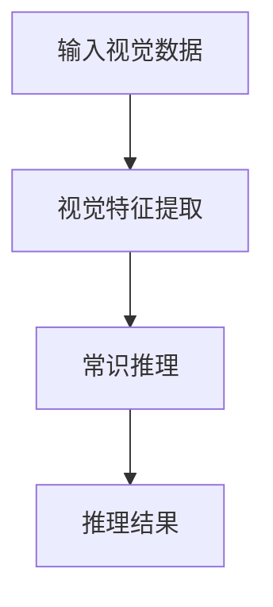
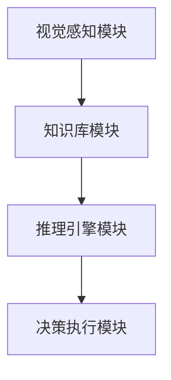

                 


# AI Agent的视觉常识推理能力开发

> 关键词：AI Agent, 视觉推理, 常识推理, 深度学习, 计算机视觉, 智能系统

> 摘要：AI Agent的视觉常识推理能力开发是一项前沿技术，结合了计算机视觉和常识推理，使得AI Agent能够理解并解释视觉信息中的深层含义。本文将详细探讨AI Agent的视觉常识推理能力的开发过程，包括核心概念、算法原理、系统架构设计以及项目实战，为读者提供全面的技术指导。

---

# 目录

1. **AI Agent与视觉常识推理概述**  
   - 1.1 AI Agent的基本概念  
   - 1.2 视觉常识推理的定义与特点  
   - 1.3 AI Agent视觉常识推理的背景与意义  

2. **AI Agent视觉常识推理的核心概念与联系**  
   - 2.1 核心概念原理  
   - 2.2 核心概念属性特征对比  
   - 2.3 ER实体关系图架构  

3. **AI Agent视觉常识推理的算法原理**  
   - 3.1 算法原理概述  
   - 3.2 算法流程图  
   - 3.3 算法实现代码示例  

4. **AI Agent视觉常识推理的系统分析与架构设计**  
   - 4.1 问题场景介绍  
   - 4.2 系统功能设计  
   - 4.3 系统架构设计  
   - 4.4 系统接口设计和交互流程  

5. **AI Agent视觉常识推理的项目实战**  
   - 5.1 环境安装与配置  
   - 5.2 核心代码实现  
   - 5.3 代码解读与分析  
   - 5.4 实际案例分析  

6. **总结与展望**  
   - 6.1 核心内容回顾  
   - 6.2 开发中的注意事项  
   - 6.3 未来的发展方向  

---

## 正文

### 第1章 AI Agent与视觉常识推理概述

#### 1.1 AI Agent的基本概念
- **什么是AI Agent**  
  AI Agent（人工智能代理）是一种智能系统，能够感知环境、理解任务需求，并通过自主决策和行动来实现目标。AI Agent可以是软件程序、机器人或其他智能设备，具备学习、推理和自适应能力。

- **AI Agent的核心特点**  
  1. **自主性**：能够在没有外部干预的情况下独立运作。  
  2. **反应性**：能够实时感知环境变化并做出响应。  
  3. **目标导向性**：通过设定目标来指导行为和决策。  
  4. **学习能力**：能够通过经验改进性能和适应新环境。

- **AI Agent的应用场景**  
  AI Agent广泛应用于自动驾驶、智能助手、智能安防、机器人控制等领域。例如，自动驾驶汽车中的AI Agent能够实时感知道路状况、识别障碍物并做出驾驶决策。

#### 1.2 视觉常识推理的定义与特点
- **视觉常识推理的定义**  
  视觉常识推理是指AI Agent能够结合视觉信息（如图像或视频）和常识知识，理解场景中的物体、事件及其关系，进而进行推理和决策的能力。

- **视觉常识推理的核心特点**  
  1. **多模态融合**：结合视觉数据和常识知识，实现更强大的理解能力。  
  2. **上下文理解**：能够理解场景中的上下文信息，推理出隐藏在视觉数据背后的深层含义。  
  3. **动态推理**：能够在动态变化的环境中，实时更新理解和推理结果。

- **视觉常识推理与传统视觉识别的区别**  
  - 传统视觉识别主要关注物体的识别和分类，依赖于图像中的低级特征（如颜色、纹理、形状）和高级语义信息。  
  - 视觉常识推理不仅关注物体的识别，还关注物体之间的关系、场景的语义理解和动态推理。

#### 1.3 AI Agent视觉常识推理的背景与意义
- **问题背景**  
  传统的视觉识别技术虽然在物体识别和分类方面取得了显著进展，但在理解场景的上下文信息和动态推理方面存在不足。例如，AI Agent在自动驾驶场景中需要理解交通规则、预测其他车辆的行驶意图，这仅靠视觉识别技术是无法实现的。

- **问题描述**  
  AI Agent需要具备视觉常识推理能力，以便在复杂动态的环境中做出更智能的决策。例如，在智能安防领域，AI Agent需要能够识别异常行为并预测可能的安全威胁。

- **问题解决**  
  通过结合视觉数据和常识知识，AI Agent能够理解场景中的物体关系、事件因果关系，并进行推理和决策，从而实现更智能的交互和操作。

- **边界与外延**  
  视觉常识推理的边界在于如何有效地结合视觉数据和常识知识，以及如何在动态环境中实时更新和推理。其外延包括多模态数据融合、知识图谱构建和动态推理算法的优化。

- **概念结构与核心要素组成**  
  - **视觉输入**：图像或视频数据。  
  - **常识知识库**：包含物体属性、事件因果关系、场景语义等。  
  - **推理引擎**：基于视觉输入和常识知识，进行推理和决策的算法。  
  - **输出结果**：推理结果，如场景描述、事件预测、动作建议等。

---

### 第2章 AI Agent视觉常识推理的核心概念与联系

#### 2.1 核心概念原理
- **AI Agent的感知与推理机制**  
  AI Agent通过视觉传感器获取环境中的视觉数据，利用感知算法提取特征信息，结合常识知识进行推理，最终生成决策指令。

- **视觉常识推理的实现原理**  
  视觉常识推理通过将视觉数据与常识知识进行融合，利用深度学习模型（如图神经网络、Transformer）进行推理和决策。例如，AI Agent可以利用知识图谱中的语义关系，结合视觉数据中的物体关系进行推理。

#### 2.2 核心概念属性特征对比
- **AI Agent与传统视觉识别的对比**  
  | 属性 | AI Agent视觉常识推理 | 传统视觉识别 |
  |------|----------------------|---------------|
  | 输入 | 视觉数据 + 常识知识    | 视觉数据      |
  | 输出 | 场景描述 + 推理结果   | 物体类别      |
  | 能力 | 多模态理解、动态推理  | 单一任务处理  |

- **视觉常识推理与逻辑推理的对比**  
  | 属性 | 视觉常识推理 | 逻辑推理 |
  |------|-------------|----------|
  | 输入 | 视觉数据 + 常识知识 | 命题逻辑 |
  | 输出 | 场景描述 + 推理结果 | 推理结论 |
  | 能力 | 多模态理解、动态推理 | 命题推理 |

#### 2.3 ER实体关系图架构
```mermaid
erDiagram
    actor User {
        string id
        string name
    }
    agent AI-Agent {
        string id
        string type
    }
    knowledge_base KB {
        string id
        string content
    }
    relation BelongsTo {
        User -> KB
        AI-Agent -> KB
    }
```

---

### 第3章 AI Agent视觉常识推理的算法原理

#### 3.1 算法原理概述
- **视觉识别与常识推理的结合**  
  AI Agent视觉常识推理算法的核心是将视觉识别结果与常识知识进行融合。例如，视觉识别可以识别出图像中的物体类别，常识推理则可以推断出物体之间的关系（如“猫在沙发上”）。

- **基于深度学习的视觉常识推理算法**  
  深度学习模型（如Transformer、Graph Neural Network）被广泛应用于视觉常识推理任务。例如，视觉数据经过特征提取后，与常识知识图谱中的语义信息进行融合，生成最终的推理结果。

#### 3.2 算法流程图


#### 3.3 算法实现代码示例
```python
import torch
import torch.nn as nn

class VisualReasoningModel(nn.Module):
    def __init__(self, visual_features_dim, knowledge_dim):
        super().__init__()
        self.visual_encoder = nn.Linear(visual_features_dim, 256)
        self.knowledge_encoder = nn.Linear(knowledge_dim, 256)
        self.reasoning_layer = nn.Linear(256, 256)
        self.dropout = nn.Dropout(0.5)
        self.relu = nn.ReLU()

    def forward(self, visual_features, knowledge_embeddings):
        visual_embeddings = self.visual_encoder(visual_features)
        knowledge_embeddings = self.knowledge_encoder(knowledge_embeddings)
        combined_embeddings = visual_embeddings + knowledge_embeddings
        x = self.reasoning_layer(combined_embeddings)
        x = self.dropout(x)
        x = self.relu(x)
        return x

# 示例输入
visual_features = torch.randn(1, 512)  # 假设视觉特征维度为512
knowledge_embeddings = torch.randn(1, 128)  # 假设知识嵌入维度为128

# 前向传播
model = VisualReasoningModel(512, 128)
output = model(visual_features, knowledge_embeddings)

print(output)
```

#### 3.4 数学模型与公式
- **视觉特征提取**  
  视觉特征提取通常使用卷积神经网络（CNN）进行，其输出为视觉特征向量：  
  $$ F_v = \text{CNN}(I) $$  
  其中，$I$ 是输入图像，$F_v$ 是视觉特征向量。

- **常识知识嵌入**  
  常识知识嵌入通常使用预训练的语言模型（如BERT）进行，其输出为知识嵌入向量：  
  $$ F_k = \text{BERT}(S) $$  
  其中，$S$ 是常识语句，$F_k$ 是知识嵌入向量。

- **特征融合**  
  视觉特征和知识嵌入进行融合，生成最终的推理结果：  
  $$ F_{\text{combined}} = \sigma(W_v F_v + W_k F_k + b) $$  
  其中，$W_v$ 和 $W_k$ 是权重矩阵，$b$ 是偏置项，$\sigma$ 是激活函数。

---

### 第4章 AI Agent视觉常识推理的系统分析与架构设计

#### 4.1 问题场景介绍
AI Agent视觉常识推理系统需要解决的问题包括：  
1. 如何将视觉数据与常识知识进行有效融合？  
2. 如何设计高效的推理算法以实现实时推理？  
3. 如何构建和管理动态更新的常识知识库？

#### 4.2 系统功能设计
- **视觉感知模块**：负责获取和处理视觉数据，提取视觉特征。  
- **知识库模块**：存储和管理常识知识，支持快速查询和推理。  
- **推理引擎模块**：结合视觉特征和常识知识，进行推理和决策。  
- **决策执行模块**：根据推理结果生成决策指令并执行。

#### 4.3 系统架构设计


#### 4.4 系统接口设计和交互流程
- **接口设计**  
  - 视觉感知模块提供API，输出视觉特征向量。  
  - 知识库模块提供API，支持常识知识的查询和推理。  
  - 推理引擎模块提供API，输出推理结果。  

- **交互流程**  
  1. 视觉感知模块获取视觉数据，提取视觉特征。  
  2. 推理引擎模块调用知识库模块，获取相关常识知识。  
  3. 推理引擎模块结合视觉特征和常识知识，进行推理。  
  4. 推理结果传递给决策执行模块，生成决策指令。  

---

### 第5章 AI Agent视觉常识推理的项目实战

#### 5.1 环境安装与配置
- **安装依赖**  
  安装必要的深度学习框架（如PyTorch、TensorFlow）和视觉处理库（如OpenCV、Matplotlib）。  
  ```bash
  pip install torch torchvision opencv-python matplotlib
  ```

- **配置开发环境**  
  安装Jupyter Notebook或其他IDE，配置虚拟环境。

#### 5.2 核心代码实现
- **视觉特征提取**  
  使用预训练的CNN模型提取图像特征。  
  ```python
  import torch
  import torch.nn as nn
  import torchvision.transforms as transforms

  # 预训练ResNet模型
  model = torch.hub.load('torchvision', 'resnet18', pretrained=True)
  model.eval()

  # 图像预处理
  transform = transforms.Compose([
      transforms.Resize(224),
      transforms.ToTensor(),
      transforms.Normalize(mean=[0.485, 0.456, 0.406], std=[0.229, 0.224, 0.225])
  ])

  # 提取特征
  image = ...  # 输入图像
  image_tensor = transform(image).unsqueeze(0)
  features = model(image_tensor)
  ```

- **常识知识嵌入**  
  使用预训练的BERT模型生成常识嵌入。  
  ```python
  from transformers import BertTokenizer, BertModel

  tokenizer = BertTokenizer.from_pretrained('bert-base-uncased')
  model = BertModel.from_pretrained('bert-base-uncased')
  model.eval()

  # 生成常识嵌入
  input_sentence = "A cat is sitting on the sofa."
  inputs = tokenizer(input_sentence, return_tensors='np')
  outputs = model(**inputs)
  knowledge_embeddings = outputs.last_hidden_state
  ```

- **特征融合与推理**  
  结合视觉特征和常识嵌入，进行推理。  
  ```python
  visual_features = ...  # 视觉特征向量
  knowledge_embeddings = ...  # 常识嵌入向量

  combined_embeddings = torch.cat((visual_features, knowledge_embeddings), dim=1)
  output = model(combined_embeddings)
  ```

#### 5.3 代码解读与分析
- **视觉特征提取**  
  使用预训练的ResNet模型提取图像特征，特征维度为512。  

- **常识知识嵌入**  
  使用BERT模型生成常识嵌入，嵌入维度为128。  

- **特征融合与推理**  
  将视觉特征和常识嵌入进行拼接，输入到推理模型中，生成最终的推理结果。  

#### 5.4 实际案例分析
- **案例背景**  
  一个AI Agent需要识别图像中的物体，并理解物体之间的关系。例如，图像中有一只猫坐在沙发上。  

- **推理过程**  
  1. 视觉感知模块提取图像特征，识别出“猫”和“沙发”。  
  2. 知识库模块提供常识知识：“猫通常会坐在沙发上”。  
  3. 推理引擎模块结合视觉特征和常识知识，推理出“猫在沙发上”。  
  4. 决策执行模块根据推理结果生成相应的决策指令，例如“注意，猫可能跳上茶几”。  

---

### 第6章 总结与展望

#### 6.1 核心内容回顾
AI Agent的视觉常识推理能力开发是一项复杂的任务，需要结合视觉数据和常识知识，设计高效的算法和系统架构。本文详细探讨了AI Agent视觉常识推理的核心概念、算法原理、系统架构设计以及项目实战，为读者提供了全面的技术指导。

#### 6.2 开发中的注意事项
- **数据质量**：视觉数据和常识知识的质量直接影响推理的准确性。  
- **模型性能**：需要不断优化模型，提高推理速度和准确率。  
- **知识库构建**：常识知识的规模和准确性是推理能力的关键。  

#### 6.3 未来的发展方向
- **多模态融合**：进一步研究视觉、听觉、语言等多种模态数据的融合。  
- **动态推理**：研究动态变化环境下的实时推理算法。  
- **人机协作**：探索人与AI Agent之间的高效协作方式。  

---

### 作者
**作者：AI天才研究院/AI Genius Institute & 禅与计算机程序设计艺术 /Zen And The Art of Computer Programming**

