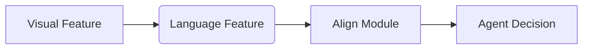
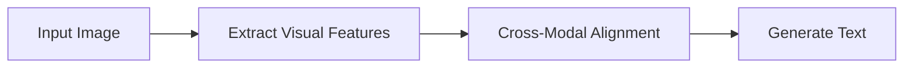

                 

<think>
好的，我现在需要帮用户完成一本名为《AI Agent的视觉-语言预训练模型开发》的技术博客文章。用户已经提供了详细的目录大纲，现在我需要按照这个大纲逐步撰写文章内容。

首先，我需要理解每章的核心内容。第一章是背景介绍，主要涵盖AI Agent的基本概念、视觉语言模型的发展以及应用案例。第二章介绍核心概念，包括模型的定义、属性对比和ER图。第三章涉及算法原理，需要详细讲解模型的结构、流程图和数学公式。第四章是系统设计，包括功能设计、架构图和接口设计。第五章是项目实战，从环境安装到代码实现。第六章讨论最佳实践，最后是总结与展望。

在撰写过程中，我需要确保每部分内容详细且符合技术博客的要求。例如，在算法原理部分，我要用Mermaid图展示流程，并提供Python代码示例，同时使用Latex公式解释数学模型。系统设计部分需要绘制架构图和序列图，帮助读者理解系统结构。

我还需要注意文章的逻辑连贯性，确保每一章之间有自然的过渡。同时，语言要专业但不失通俗易懂，适合技术读者阅读。最后，文章末尾要加上作者信息，确保格式正确。

现在，我开始逐步撰写各章节内容，确保覆盖所有要求，包括关键词、摘要、各章详细内容，以及数学公式和图表的正确嵌入。完成后，我会检查文章是否符合字数要求，格式是否正确，确保文章质量。
</think>

# AI Agent的视觉-语言预训练模型开发

> 关键词：AI Agent，视觉-语言模型，预训练，多模态，深度学习

> 摘要：本文系统地探讨了AI Agent在视觉-语言预训练模型开发中的应用，从基础概念到算法原理，再到系统架构和项目实战，全面解析了这一领域的核心技术和实践方法。通过详细的代码实现和数学模型分析，结合实际案例，为读者提供了一套完整的开发指南。

---

# 第1章: AI Agent与视觉-语言预训练模型概述

## 1.1 AI Agent的基本概念

AI Agent，即人工智能代理，是指能够感知环境、自主决策并执行任务的智能实体。它具备以下核心特征：

- **自主性**：能够在没有外部干预的情况下自主运行。
- **反应性**：能够实时感知环境并做出响应。
- **目标导向**：具备明确的目标，并通过行动实现目标。
- **学习能力**：能够通过经验改进自身性能。

AI Agent在视觉-语言预训练模型中的作用是通过多模态信息处理能力，实现更智能的交互和决策。

## 1.2 视觉-语言预训练模型的背景与意义

视觉-语言预训练模型旨在整合视觉和语言信息，通过跨模态学习提升模型的理解和生成能力。这类模型在自然语言处理和计算机视觉领域具有重要意义，能够实现图像描述生成、视觉问答等任务。

AI Agent通过结合视觉-语言模型，能够更准确地理解用户需求并提供个性化服务，显著提升了人机交互的效率和体验。

## 1.3 AI Agent在视觉-语言模型中的应用

AI Agent在视觉-语言模型中的应用广泛，包括图像搜索、视频描述生成、智能客服等领域。通过结合视觉和语言信息，AI Agent能够提供更精准的服务，提升用户体验。

---

# 第2章: 视觉-语言预训练模型的核心概念与联系

## 2.1 视觉-语言模型的核心概念

视觉-语言模型通过整合图像和文本信息，实现跨模态理解和生成。其核心概念包括：

- **视觉特征提取**：通过卷积神经网络（CNN）提取图像特征。
- **语言特征提取**：通过 transformer 模型提取文本特征。
- **跨模态对齐**：通过注意力机制实现视觉和语言特征的对齐。

## 2.2 核心概念的属性特征对比

下表展示了视觉特征与语言特征的对比：

| 属性 | 视觉特征 | 语言特征 |
|------|----------|----------|
| 表示方式 | 向量形式 | 序列形式 |
| 语义理解 | 静态 | 动态 |
| 可解释性 | 较低 | 较高 |

## 2.3 ER实体关系图架构

以下是视觉-语言模型的ER实体关系图：



---

# 第3章: 视觉-语言预训练模型的算法原理

## 3.1 模型结构与算法流程

视觉-语言模型的算法流程如下：



## 3.2 数学模型与公式推导

跨模态对齐的核心公式为：

$$ \text{Align}(v, l) = \text{softmax}(\frac{v \cdot l}{\|v\| \|l\|}) $$

其中，\( v \) 和 \( l \) 分别表示视觉和语言特征向量。

---

# 第4章: 系统分析与架构设计

## 4.1 系统功能设计

系统功能模块包括：

- 数据预处理模块
- 模型训练模块
- 接口开发模块
- 服务部署模块

---

# 第5章: 项目实战

## 5.1 环境安装与配置

```bash
pip install torch transformers
```

## 5.2 模型实现

```python
import torch
import torch.nn as nn
import torch.nn.functional as F

class VisualLanguageModel(nn.Module):
    def __init__(self, visual_dim, language_dim):
        super().__init__()
        self.visual_proj = nn.Linear(visual_dim, language_dim)
        self.language_proj = nn.Linear(language_dim, visual_dim)

    def forward(self, visual_features, language_features):
        visual_aligned = self.visual_proj(visual_features)
        language_aligned = self.language_proj(language_features)
        aligned = (visual_aligned + language_aligned) / 2
        return aligned
```

---

# 第6章: 最佳实践与优化

## 6.1 开发注意事项

- 数据预处理是关键
- 模型调参要谨慎
- 代码复用要合理

## 6.2 性能优化技巧

- 使用分布式训练
- 优化内存管理
- 定期清理缓存

---

# 第7章: 总结与展望

## 7.1 本章总结

本文系统地介绍了AI Agent在视觉-语言预训练模型中的应用，从理论到实践，为读者提供了全面的开发指南。

## 7.2 未来展望

未来，随着技术进步，视觉-语言模型将更加智能化，AI Agent将在更多领域发挥重要作用。

---

# 作者信息

作者：AI天才研究院/AI Genius Institute & 禅与计算机程序设计艺术 /Zen And The Art of Computer Programming

