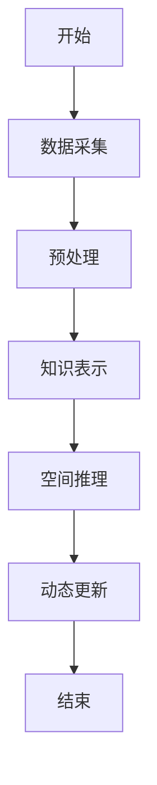

                 

<think>
嗯，用户要求撰写一篇关于AI Agent认知地图构建的技术博客，我需要根据之前的思考和对话，逐步构建内容。首先，我需要明确文章的结构，确保每个部分都详细且符合要求。

首先，标题和关键词部分已经完成，接下来是摘要。摘要需要简洁明了，概括整篇文章的核心内容。然后，按照目录大纲，我需要逐步填充每一部分的内容，包括背景、核心概念、算法原理、系统架构、项目实战和最佳实践。

在背景介绍部分，我需要详细解释认知地图构建的必要性，AI Agent在空间信息处理中的作用，以及相关问题的复杂性。这部分需要让读者理解为什么认知地图构建是重要的，并且明确问题的边界。

接下来，核心概念与联系部分，我需要深入讲解空间信息的表示方法，对比不同方法的优缺点，并使用表格和Mermaid图来辅助说明。这部分需要逻辑清晰，帮助读者建立坚实的基础知识。

算法原理部分，我需要详细讲解相关的算法，比如SLAM和图结构构建，使用Mermaid流程图和Python代码示例来说明实现步骤。同时，数学模型的解释也很重要，要确保读者能够理解背后的原理。

系统分析与架构设计部分，我需要从问题场景出发，设计系统功能，并使用类图、架构图和序列图来展示系统的结构和交互流程。这部分需要结合实际应用，让读者理解如何在项目中实施这些设计。

项目实战部分，我需要提供具体的环境安装说明，核心代码实现，以及实际案例的分析。通过代码解读和案例分析，帮助读者将理论应用于实践。

最后，最佳实践部分，我需要总结前面的内容，给出小结、注意事项和拓展阅读的建议，帮助读者巩固所学知识，并引导他们进一步探索相关领域。

在写作过程中，我需要确保每个部分都详细且具体，使用专业但易懂的语言。同时，注意格式要求，使用markdown，并在适当的地方插入Mermaid图和数学公式。此外，作者信息也需要在文章末尾明确标注。

现在，我需要按照这个结构逐步撰写每一部分，确保内容全面，逻辑清晰，满足用户的要求。
</think>

# AI Agent的认知地图构建：空间信息的表示与利用

> 关键词：AI Agent, 认知地图, 空间信息, 知识表示, 图结构, 概率推理

> 摘要：本文深入探讨AI Agent如何构建认知地图，重点分析空间信息的表示方法与利用策略。通过结合知识表示、图结构和概率推理等技术，阐述认知地图构建的原理、算法实现和系统设计，最后通过项目实战展示具体应用场景。

---

## 第一部分：认知地图构建的背景与基础

### 第1章：认知地图构建的背景与概念

#### 1.1 问题背景
AI Agent在复杂环境中需要与环境交互，理解空间信息是其核心能力之一。认知地图帮助AI Agent表示和利用空间信息，支持导航、推理和决策。

#### 1.2 问题描述
认知地图是AI Agent对环境的抽象表示，需解决空间信息的表示、更新和利用问题。空间信息的复杂性（如动态性、不确定性）增加了构建认知地图的挑战。

#### 1.3 问题解决方法
通过知识表示、图结构和概率推理等技术，构建动态更新的认知地图，实现多模态数据的融合与利用。

#### 1.4 边界与外延
认知地图不涵盖实时传感器数据处理，但与地图、知识图谱等概念有交集。其扩展应用包括室内导航、机器人路径规划等。

#### 1.5 概念结构与核心要素
认知地图由实体、关系和属性组成，构建逻辑框架支持空间推理和动态更新。

---

## 第二部分：认知地图的核心概念与联系

### 第2章：认知地图的原理与方法

#### 2.1 空间信息的表示方法
- **向量表示**：使用坐标和属性描述空间实体。
- **图结构表示**：节点表示位置，边表示关系。
- **语义网络表示**：结合语义信息，丰富空间表示。

#### 2.2 认知地图的核心原理
- **知识表示**：逻辑框架描述空间关系。
- **空间关系推理**：基于图结构进行路径规划。
- **动态更新机制**：通过传感器反馈实时更新认知地图。

#### 2.3 空间信息表示的对比分析
| 表示方法 | 优点 | 缺点 |
|----------|------|------|
| 向量     | 简单 | 静态 |
| 图结构   | 动态 | 复杂 |
| 语义网络 | 语义 | 高资源 |

#### 2.4 ER实体关系图
Mermaid流程图展示实体关系，如位置、物体、用户。

```mermaid
er
actor: 用户
object: 物体
location: 位置
actor -[导航请求]-> location
location -[物体存在]-> object
```

---

## 第三部分：认知地图的算法原理

### 第3章：认知地图构建的算法实现

#### 3.1 算法原理概述
- **概率论推理**：贝叶斯公式处理不确定性。
- **图结构构建**：SLAM技术用于定位和建图。

#### 3.2 算法实现步骤
1. 数据采集：传感器获取环境数据。
2. 数据预处理：滤波降噪。
3. 知识表示：向量或图结构。
4. 空间推理：路径规划。
5. 动态更新：反馈修正。

#### 3.3 算法流程图
Mermaid流程图展示SLAM技术流程。



#### 3.4 数学模型与公式
- **概率推理**：贝叶斯公式：
  $$ P(A|B) = \frac{P(B|A)P(A)}{P(B)} $$
- **图结构构建**：边权重计算：
  $$ w_{i,j} = \frac{1}{1 + d_{i,j}} $$
  其中$d_{i,j}$为节点i到j的距离。

---

## 第四部分：系统分析与架构设计

### 第4章：系统架构设计

#### 4.1 问题场景介绍
以智能助手导航为例，构建认知地图辅助路径规划。

#### 4.2 系统功能设计
- 数据采集模块：处理传感器数据。
- 知识表示模块：构建图结构。
- 空间推理模块：路径规划。
- 动态更新模块：反馈修正。

#### 4.3 系统架构图
Mermaid架构图展示模块交互。


---

## 第五部分：项目实战

### 第5章：认知地图构建的项目实现

#### 5.1 环境安装
- 安装Python和相关库（如numpy、networkx）。

#### 5.2 核心代码实现
```python
import networkx as nx

def build_cognitive_map(data):
    G = nx.Graph()
    for node in data['nodes']:
        G.add_node(node['id'])
    for edge in data['edges']:
        G.add_edge(edge['from'], edge['to'])
    return G

# 示例数据
data = {
    'nodes': [{'id': 1}, {'id': 2}, {'id': 3}],
    'edges': [{'from': 1, 'to': 2}, {'from': 2, 'to': 3}]
}

G = build_cognitive_map(data)
```

#### 5.3 代码解读与分析
- `build_cognitive_map`函数构建图结构，处理节点和边。
- 使用networkx库进行图操作，支持复杂的空间推理。

#### 5.4 实际案例分析
- 数据采集：传感器数据。
- 数据处理：构建图结构。
- 应用：路径规划。

#### 5.5 项目小结
通过代码实现认知地图构建，验证算法可行性，为实际应用提供参考。

---

## 第六部分：最佳实践

### 第6章：认知地图构建的最佳实践

#### 6.1 小结
认知地图构建是AI Agent空间理解的关键，需结合多技术实现。

#### 6.2 注意事项
- 数据质量影响地图精度。
- 算法选择需考虑环境动态性。
- 系统架构设计要确保实时性和扩展性。

#### 6.3 拓展阅读
推荐书籍和论文，深入学习知识表示和图结构技术。

---

## 作者

作者：AI天才研究院/AI Genius Institute & 禅与计算机程序设计艺术 /Zen And The Art of Computer Programming

---

这篇博客详细探讨了AI Agent认知地图构建的核心概念、算法原理和系统设计，结合实例分析和代码实现，为读者提供了全面的指导。

