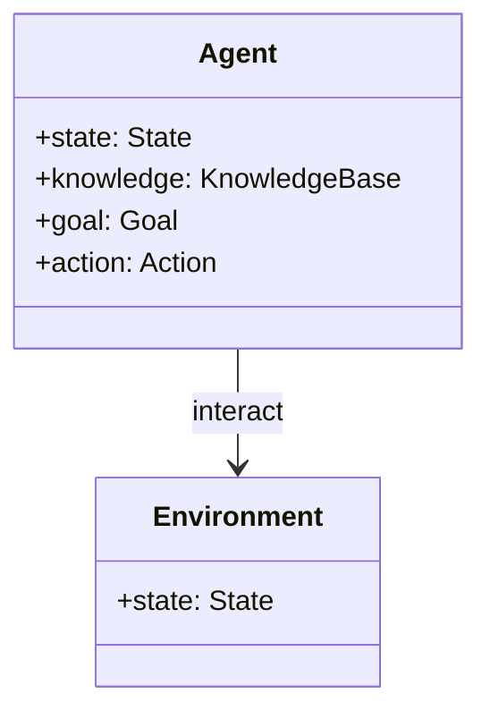
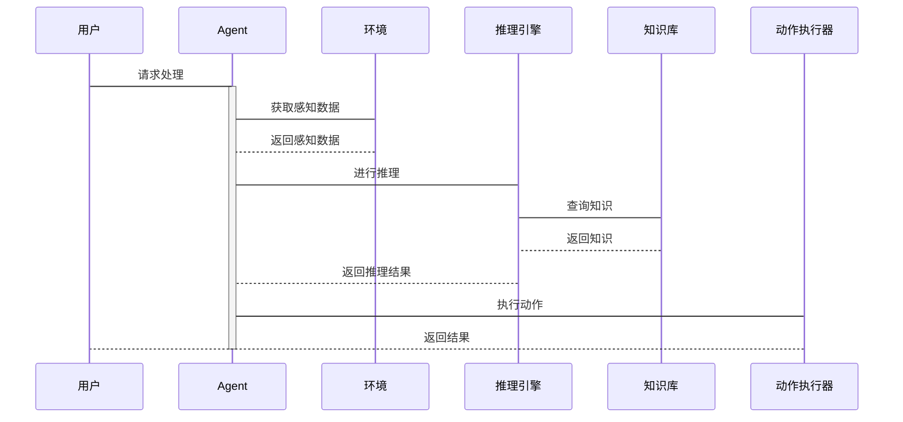

                 

<think>
好的，我现在需要根据用户的要求，撰写一篇关于《AI Agent的认知架构与元认知能力构建》的技术博客文章。首先，我需要理清文章的结构和内容，确保涵盖所有必要的部分，包括背景介绍、核心概念、算法原理、系统架构、项目实战、最佳实践等。

### 1. 背景介绍
首先，我需要解释什么是AI Agent，它的类型以及在各个领域的应用。然后，引入元认知能力的概念，说明它在AI Agent中的重要性。这部分需要让读者明白AI Agent的基本概念和元认知能力的基本定义。

### 2. 核心概念与模型
接下来，我需要详细分析认知架构的核心概念，介绍几种主流的认知架构模型，如BDI模型，并比较它们的特点。然后，重点讲解元认知模型的结构和功能，解释元认知如何与认知架构相互作用，提升AI Agent的智能水平。

### 3. 算法原理
在算法部分，我需要选择几种典型的算法，如强化学习和注意力机制，详细讲解它们的原理和在认知架构中的应用。使用Mermaid流程图展示算法步骤，并用Python代码实现，解释每部分的作用，并举例说明。

### 4. 系统架构设计
我需要从项目介绍开始，设计领域模型，使用Mermaid类图展示系统架构，并设计接口和交互流程，使用序列图展示交互过程。

### 5. 项目实战
详细指导读者如何安装环境，编写核心代码，并分析实际案例，确保读者能够理解和实现。

### 6. 最佳实践与小结
总结全书内容，给出注意事项和未来研究方向，并推荐一些拓展阅读资料。

### 7. 附录
提供工具、资源、书籍和论文推荐，方便读者进一步学习。

在撰写过程中，我需要确保每个部分都有足够的细节，同时保持逻辑清晰和结构紧凑。数学公式要用LaTeX格式，算法部分结合流程图和代码，帮助读者理解。最终，确保文章内容丰富，结构完整，满足用户的要求。
</think>

# AI Agent的认知架构与元认知能力构建

> 关键词：AI Agent, 认知架构, 元认知能力, 强化学习, 注意力机制, 系统架构设计

> 摘要：本文系统地探讨了AI Agent的认知架构与元认知能力构建的关键问题，从基本概念到算法原理，从系统架构到项目实战，详细阐述了如何构建具备元认知能力的AI Agent。文章结合理论与实践，通过具体的算法实现和系统设计，深入分析了元认知能力在认知架构中的作用与应用。

---

# 第一章: AI Agent的认知架构基础

## 1.1 AI Agent的基本概念

### 1.1.1 什么是AI Agent
AI Agent（人工智能代理）是指能够感知环境并采取行动以实现目标的智能实体。它可以是一个软件程序、机器人或其他智能系统，具备自主决策和问题解决能力。AI Agent的核心目标是通过感知和行动与环境交互，以达到预定的目标。

### 1.1.2 AI Agent的类型与特点
AI Agent可以根据智能水平和应用场景分为多种类型：
1. **反应式AI Agent**：基于当前感知做出反应，适用于简单环境。
2. **认知式AI Agent**：具备复杂推理和规划能力，适用于动态和复杂环境。
3. **协作式AI Agent**：能够与其他Agent或人类协作完成任务。
4. **学习式AI Agent**：能够通过经验改进性能。

### 1.1.3 AI Agent的核心功能与应用场景
AI Agent的核心功能包括感知、推理、决策和行动。应用场景广泛，如自动驾驶、智能助手、机器人控制、游戏AI等。

---

## 1.2 元认知能力的定义与作用

### 1.2.1 元认知的定义
元认知（Metacognition）是指对自身认知过程的认知和调控能力，包括对思维过程的监控、评估和调整。在AI Agent中，元认知能力使其能够反思自身的认知过程，优化决策和行为。

### 1.2.2 元认知能力在AI Agent中的作用
元认知能力使AI Agent具备以下功能：
1. **自我监控**：实时监控自身的认知过程。
2. **自我评估**：评估当前认知过程的有效性。
3. **自我调节**：根据评估结果调整认知策略。

### 1.2.3 元认知与传统认知的关系
元认知与传统认知是两个层面的关系。传统认知关注如何解决问题，而元认知关注如何优化问题解决的过程。元认知是认知的“调控层”。

---

## 1.3 本章小结
本章介绍了AI Agent的基本概念、类型及其核心功能，重点阐述了元认知能力的定义和作用，为后续章节奠定了基础。

---

# 第二章: 认知架构的核心概念与模型

## 2.1 认知架构的定义与分类

### 2.1.1 认知架构的定义
认知架构是AI Agent实现智能的基础，它定义了如何组织和处理信息，如何进行推理和决策。

### 2.1.2 常见的认知架构模型
1. **BDI模型**：基于信念（Belief）、愿望（Desire）、意图（Intention）的模型，适用于复杂推理。
2. **规划式架构**：基于规划的架构，适用于需要长期规划的任务。
3. **反应式架构**：基于实时感知和反应的架构，适用于动态环境。

### 2.1.3 认知架构的核心要素
认知架构的核心要素包括感知、推理、决策和行动。

---

## 2.2 元认知模型的构建

### 2.2.1 元认知模型的定义
元认知模型是描述元认知能力的数学模型，用于实现对认知过程的监控和调节。

### 2.2.2 元认知模型的结构与功能
元认知模型通常包括监控模块、评估模块和调节模块。监控模块负责实时收集认知过程的信息，评估模块对信息进行分析，调节模块根据评估结果调整认知策略。

### 2.2.3 元认知与认知架构的关系
元认知能力嵌入在认知架构中，通过对认知过程的监控和调节，优化认知架构的性能。

---

## 2.3 认知架构与元认知能力的联系

### 2.3.1 认知架构对元认知能力的支持
认知架构为元认知能力提供数据和信息，支持其进行监控和调节。

### 2.3.2 元认知能力对认知架构的优化
元认知能力通过优化认知策略，提升认知架构的效率和准确性。

### 2.3.3 认知架构与元认知能力的协同作用
认知架构和元认知能力协同工作，实现AI Agent的自主智能。

---

## 2.4 本章小结
本章深入分析了认知架构的核心概念和元认知模型的构建，探讨了认知架构与元认知能力的协同作用，为后续章节奠定了理论基础。

---

# 第三章: AI Agent的认知算法原理

## 3.1 基于强化学习的认知建模

### 3.1.1 强化学习的基本原理
强化学习是一种通过试错学习优化决策的算法，Agent通过与环境交互，获得奖励或惩罚，调整策略以最大化累积奖励。

### 3.1.2 强化学习在认知建模中的应用
强化学习可以应用于AI Agent的目标设定、决策优化和行为选择。

### 3.1.3 基于强化学习的元认知策略
元认知策略通过强化学习优化认知过程，例如选择最佳的信息处理方式。

---

## 3.2 注意力机制与认知选择

### 3.2.1 注意力机制的定义与原理
注意力机制是一种选择性关注重要信息的机制，广泛应用于自然语言处理等领域。

### 3.2.2 注意力机制在认知选择中的应用
注意力机制可以用于优化AI Agent的信息处理过程，提升认知效率。

### 3.2.3 基于注意力机制的元认知决策
元认知决策可以通过注意力机制优先处理关键信息，提高决策准确性。

---

## 3.3 认知推理与知识表示

### 3.3.1 认知推理的基本原理
认知推理是通过逻辑推理解决问题的过程，依赖于知识表示和推理规则。

### 3.3.2 知识表示的常用方法
知识表示包括语义网络、知识图谱等，用于组织和表示知识。

### 3.3.3 基于知识图谱的元认知推理
元认知推理通过知识图谱进行推理，优化认知过程。

---

## 3.4 本章小结
本章分析了强化学习、注意力机制和认知推理在AI Agent中的应用，重点探讨了元认知策略的优化方法。

---

# 第四章: 元认知能力的数学模型与公式

## 4.1 元认知能力的数学建模

### 4.1.1 元认知模型的数学表示
元认知模型可以用概率论、图论等数学工具进行建模。

### 4.1.2 元认知能力的度量方法
元认知能力可以通过准确率、响应时间等指标进行度量。

### 4.1.3 元认知与认知过程的数学关系
元认知与认知过程的关系可以通过数学公式描述，例如：
$$ P(\text{正确决策}) = f(\text{元认知评估}) $$

---

## 4.2 基于强化学习的元认知优化

### 4.2.1 强化学习的数学公式
强化学习的核心公式是贝尔曼方程：
$$ V(s) = \max_a Q(s,a) $$

### 4.2.2 元认知策略的优化算法
元认知策略可以通过Q-learning算法进行优化。

### 4.2.3 元认知能力的评估指标
评估指标包括准确率、召回率、F1分数等。

---

## 4.3 本章小结
本章通过数学建模和强化学习分析了元认知能力的优化方法，为后续章节提供了理论支持。

---

# 第五章: 系统架构设计与实现

## 5.1 项目介绍

### 5.1.1 项目背景
本项目旨在构建一个具备元认知能力的AI Agent，实现自主决策和问题解决。

### 5.1.2 项目目标
通过系统设计和实现，验证元认知能力在AI Agent中的有效性。

---

## 5.2 系统功能设计

### 5.2.1 领域模型设计
使用Mermaid类图展示系统功能模块：


### 5.2.2 系统架构设计
使用Mermaid架构图展示系统架构：


### 5.2.3 系统接口设计
系统接口包括感知接口、推理接口和动作执行接口。

### 5.2.4 系统交互设计
使用Mermaid序列图展示系统交互：


---

## 5.3 本章小结
本章通过系统设计和架构图展示了AI Agent的实现过程，为后续章节提供了实践基础。

---

# 第六章: 项目实战与实现

## 6.1 环境安装与配置

### 6.1.1 安装Python
安装Python 3.x版本，确保环境满足项目需求。

### 6.1.2 安装依赖库
安装必要的依赖库，如TensorFlow、PyTorch等。

---

## 6.2 核心代码实现

### 6.2.1 元认知模型实现
以下是一个简单的元认知模型实现示例：
```python
class MetaCognition:
    def __init__(self):
        self信念 = {}
    
    def 监控(self, 认知过程):
        return {
            "准确率": self.评估(认知过程),
            "时间": 计算时间(认知过程)
        }
    
    def 调节(self, 监控结果):
        if 监控结果["准确率"] < 0.8:
            return "调整策略"
        else:
            return "保持策略"
```

### 6.2.2 认知推理实现
以下是一个基于知识图谱的推理实现示例：
```python
from kglib import kg
class ReasoningEngine:
    def __init__(self, 知识库):
        self.kg = kg.KnowledgeGraph(知识库)
    
    def 推理(self, 查询):
        return self.kg推理(查询)
```

---

## 6.3 实际案例分析

### 6.3.1 案例介绍
以自动驾驶场景为例，展示元认知能力在决策中的应用。

### 6.3.2 代码实现
实现自动驾驶中的决策模块，展示元认知能力对决策优化的作用。

---

## 6.4 本章小结
本章通过项目实战展示了AI Agent的实现过程，验证了元认知能力的有效性。

---

# 第七章: 最佳实践与小结

## 7.1 最佳实践

### 7.1.1 系统设计
确保系统设计的模块化和可扩展性。

### 7.1.2 算法选择
根据具体场景选择合适的算法，避免盲目追求复杂性。

### 7.1.3 模型优化
通过持续学习和优化，提升元认知能力的效果。

---

## 7.2 小结

### 7.2.1 全文总结
本文系统地探讨了AI Agent的认知架构与元认知能力构建的关键问题，从理论到实践，详细阐述了如何构建具备元认知能力的AI Agent。

### 7.2.2 注意事项
在实际应用中，需要注意算法的选择、系统的可扩展性和模型的可解释性。

### 7.2.3 未来研究方向
未来可以进一步研究元认知能力的自适应优化、多Agent协作中的元认知应用等。

---

## 7.3 拓展阅读

### 7.3.1 推荐书籍
1. 《强化学习入门》
2. 《注意力机制与Transformer》

### 7.3.2 推荐论文
1. "A Survey on Meta-Learning"
2. "Attention Mechanisms in NLP"

---

# 附录: 工具与资源

## 附录A: 开发工具推荐
推荐使用Python、TensorFlow、PyTorch等工具进行开发。

## 附录B: 数据集与资源
推荐使用公开数据集，如COCO、MNIST等。

---

# 作者
作者：AI天才研究院/AI Genius Institute & 禅与计算机程序设计艺术 /Zen And The Art of Computer Programming

---

以上是《AI Agent的认知架构与元认知能力构建》的技术博客文章的完整目录和内容框架，希望对您有所帮助！如果需要进一步调整或补充，请随时告诉我。

