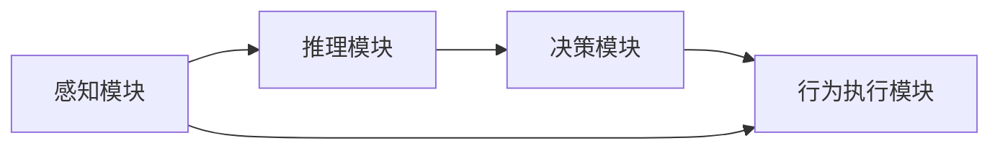
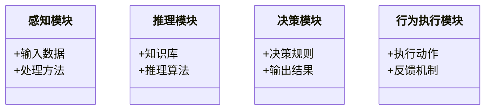

                 

<think>
好的，我现在需要为用户撰写一篇关于AI Agent认知架构的技术博客文章。用户已经提供了详细的要求，包括文章标题、关键词、摘要和目录大纲。首先，我需要仔细理解用户的需求，确保文章符合他们的期望。

用户希望文章结构清晰，逻辑严谨，使用专业的技术语言，同时包含详细的分析和实例。我注意到用户特别强调了每个部分需要有小结，以及使用mermaid图表和数学公式来解释概念和算法。

首先，我会从摘要开始，概述文章的核心内容。然后按照目录大纲，逐步展开每个章节的内容。在背景介绍部分，我需要解释AI Agent的基本概念、发展历程和应用场景，确保读者能够理解其重要性。

接下来，在核心概念部分，我会详细讨论感知、推理、决策等模块，用mermaid图表展示它们的关系和流程。这部分需要清晰展示每个模块的作用和相互之间的联系。

算法原理部分，我会选择几个关键算法，如强化学习和图神经网络，并用mermaid流程图展示算法的步骤。同时，我会添加数学公式，解释其工作原理，帮助读者深入理解。

系统架构设计是关键部分，我会介绍整体架构，使用类图和序列图展示模块划分和系统交互。这部分需要详细说明每个模块的职责和它们如何协同工作。

项目实战部分，我会选择一个实际案例，从环境安装到代码实现，逐步引导读者完成项目。同时，我会分析结果，帮助读者理解理论在实践中的应用。

最后，在总结与展望部分，我会回顾文章内容，并指出未来的发展方向，帮助读者巩固所学知识，并激发进一步学习的兴趣。

在写作过程中，我需要确保语言简洁明了，逻辑严谨，同时兼顾技术深度和可读性。我会反复检查每个部分，确保符合用户的要求，特别是格式和内容的完整性。

现在，我可以开始按照大纲逐步撰写每个部分，确保每个章节都有足够的细节和实例支持，同时保持整体结构的连贯性和逻辑性。
</think>

# AI Agent的认知架构：从感知到决策的全流程设计

> 关键词：AI Agent，认知架构，感知，推理，决策，强化学习，图神经网络

> 摘要：本文系统地探讨了AI Agent的认知架构，从感知到决策的全流程设计，包括背景介绍、核心概念、算法原理、系统架构以及项目实战。通过理论与实践相结合的方式，深入剖析了AI Agent的设计与实现过程，帮助读者全面理解AI Agent的认知架构。

---

## 第一部分: AI Agent的认知架构概述

### 第1章: AI Agent的基本概念与背景

#### 1.1 AI Agent的定义与特点
AI Agent（智能体）是指在计算机系统中，能够感知环境、自主决策并执行动作的智能实体。与传统的被动执行任务的程序不同，AI Agent具备以下核心特点：
- **自主性**：能够在没有外部干预的情况下自主运行。
- **反应性**：能够实时感知环境并做出响应。
- **目标导向性**：具有明确的目标，并通过规划和推理实现目标。
- **学习能力**：能够通过经验优化自身的决策和行为。

#### 1.2 AI Agent的应用场景
AI Agent广泛应用于多个领域，以下是一些典型场景：
- **智能助手**：如Siri、Alexa等，能够通过语音交互帮助用户完成日常任务。
- **自动驾驶**：如特斯拉的Autopilot系统，能够实时感知环境并做出驾驶决策。
- **智能推荐系统**：如Netflix的推荐算法，能够根据用户行为推荐个性化内容。

#### 1.3 AI Agent的发展历程
AI Agent的发展经历了多个阶段：
- **专家系统阶段**：基于规则的推理，如医疗诊断系统。
- **机器学习阶段**：引入数据驱动的模型，如支持向量机、随机森林等。
- **大模型阶段**：基于深度学习的大模型（如GPT系列），具备强大的生成能力和理解能力。

---

### 第2章: AI Agent的认知架构原理

#### 2.1 感知模块
感知模块是AI Agent认知架构的输入端，负责从环境中获取信息并进行处理。

- **数据采集与处理**：通过传感器、摄像头等设备获取环境数据，并进行预处理（如降噪、特征提取）。
- **知识表示与存储**：将感知到的信息转化为结构化的知识表示，并存储在知识库中。
- **感知模型的构建**：基于感知数据构建模型，用于后续的推理和决策。

#### 2.2 推理与决策模块
推理与决策模块是AI Agent的核心，负责根据感知到的信息做出决策。

- **推理机制**：基于知识库中的知识，通过逻辑推理或概率推理生成可能的结论。
- **决策算法**：根据推理结果和环境状态，选择最优的动作或策略。
- **状态空间与动作空间**：定义AI Agent可能处的状态及其可执行的动作。

#### 2.3 行为执行模块
行为执行模块负责将决策结果转化为具体的动作。

- **动作规划**：根据决策结果生成具体的行为序列。
- **行为执行**：通过执行机构（如机器人）或软件接口（如API）执行动作。
- **反馈机制**：通过环境反馈不断优化决策和推理过程。

---

## 第二部分: AI Agent的认知架构核心概念

### 第3章: AI Agent的认知架构核心概念

#### 3.1 感知、推理、决策的实体关系图
以下是一个简单的实体关系图，展示了AI Agent认知架构的核心模块：



#### 3.2 算法原理与流程图
以下是AI Agent从感知到决策的流程图：


#### 3.3 数学模型与公式
以下是AI Agent认知架构中常用的数学模型：

- **知识表示的向量空间模型**：
  $$v_i = \sum_{j=1}^{n} w_{ij}x_j$$

- **推理过程的逻辑表达式**：
  $$p(h|e) = \frac{P(e|h)P(h)}{P(e)}$$

---

## 第三部分: AI Agent的认知架构设计

### 第4章: 系统分析与架构设计方案

#### 4.1 问题场景介绍
我们以一个智能助手为例，介绍AI Agent的认知架构设计。智能助手需要完成以下任务：
- **感知环境**：通过语音或文本获取用户输入。
- **推理意图**：根据用户输入推理其意图。
- **决策回应**：根据推理结果生成合适的回应。

#### 4.2 系统功能设计
以下是智能助手的领域模型类图：



---

## 第四部分: 项目实战

### 第5章: 项目实战

#### 5.1 环境安装
以下是实现一个简单的AI Agent所需的环境：

- **编程语言**：Python 3.8+
- **深度学习框架**：TensorFlow或PyTorch
- **自然语言处理库**：spaCy或NLTK

#### 5.2 系统核心实现源代码
以下是AI Agent的核心实现代码：

```python
class PerceptionModule:
    def __init__(self):
        self.sensors = []
    
    def perceive(self, environment):
        return self.sensors.process(environment)

class ReasoningModule:
    def __init__(self, knowledge_base):
        self.knowledge_base = knowledge_base
    
    def infer(self, input_data):
        return self.knowledge_base.inference(input_data)

class DecisionModule:
    def __init__(self, policies):
        self.policies = policies
    
    def decide(self, input_data):
        return self.policies.select_best_policy(input_data)

class ActionExecutionModule:
    def __init__(self, actuators):
        self.actuators = actuators
    
    def execute(self, action):
        self.actuators.do_action(action)
```

#### 5.3 代码应用解读与分析
以上代码展示了AI Agent的核心模块：
- **PerceptionModule**：负责感知环境数据。
- **ReasoningModule**：负责基于知识库进行推理。
- **DecisionModule**：负责根据推理结果做出决策。
- **ActionExecutionModule**：负责执行决策结果。

---

## 第五部分: 总结与展望

### 第6章: 总结与展望

#### 6.1 小结
本文系统地探讨了AI Agent的认知架构，从感知到决策的全流程设计，包括背景介绍、核心概念、算法原理、系统架构以及项目实战。通过理论与实践相结合的方式，深入剖析了AI Agent的设计与实现过程。

#### 6.2 注意事项
在实际应用中，需要注意以下几点：
- **数据质量问题**：感知模块需要处理高质量的数据。
- **知识表示的复杂性**：知识库的构建需要考虑知识的层次化和语义关联。
- **决策的实时性**：决策模块需要在限定时间内做出决策。

#### 6.3 拓展阅读
建议读者进一步阅读以下内容：
- **强化学习**：学习强化学习的原理和应用。
- **图神经网络**：学习图神经网络在知识图谱中的应用。

---

## 作者：AI天才研究院/AI Genius Institute & 禅与计算机程序设计艺术 /Zen And The Art of Computer Programming

