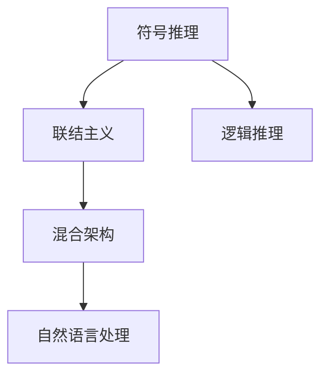
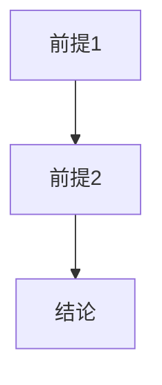
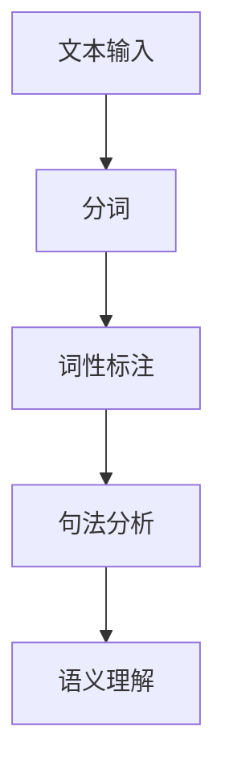
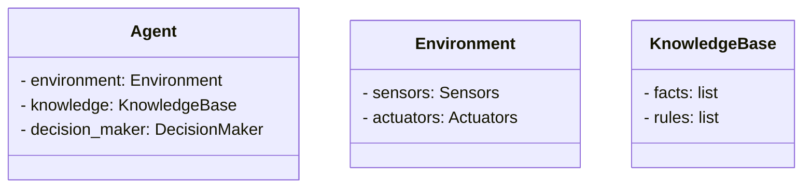

                 


# AI Agent的认知架构：模拟人类思维过程

> **关键词：** AI Agent, 认知架构, 逻辑推理, 自然语言处理, 混合架构  
> **摘要：**  
> 本文深入探讨AI Agent的认知架构，从人类思维的模拟出发，分析符号推理、联结主义和混合架构的核心原理，结合逻辑推理、自然语言处理等算法，展示AI Agent在智能决策和交互中的应用潜力。

---

## 第一部分: AI Agent的认知架构基础

### 第1章: AI Agent的基本概念与背景

#### 1.1 AI Agent的定义与特点
AI Agent（人工智能代理）是一种能够感知环境、自主决策并采取行动的智能实体。与传统程序不同，AI Agent具备以下特点：
- **自主性**：无需外部干预，自主完成任务。
- **反应性**：能够实时感知环境变化并做出反应。
- **学习能力**：通过经验改进性能。
- **社交能力**：能够与人类或其他智能体交互协作。

#### 1.2 人类认知的基本原理
人类认知过程包括感知、记忆、推理和决策。AI Agent的设计灵感来源于这些过程：
- **感知**：通过传感器获取环境信息。
- **记忆**：存储和检索信息。
- **推理**：基于逻辑或概率进行推导。
- **决策**：选择最优行动方案。

#### 1.3 AI Agent的应用场景
AI Agent广泛应用于智能助手、自动驾驶、智能客服等领域。例如，智能助手（如Siri）通过自然语言处理理解用户需求，执行任务。

---

## 第二部分: 认知架构的核心概念与联系

### 第2章: AI Agent的认知模型

#### 2.1 符号推理模型
符号推理基于逻辑规则，适用于规则明确的场景。例如，专家系统通过符号逻辑推理解决特定问题。

#### 2.2 联结主义模型
联结主义基于神经网络，适用于复杂模式识别。深度学习模型通过大量数据训练，自动提取特征。

#### 2.3 混合架构模型
混合架构结合符号推理和联结主义，利用两者优势。例如，先用神经网络提取特征，再用逻辑推理进行决策。

#### 2.4 认知模型的对比分析
| 模型 | 优点 | 缺点 |
|------|------|------|
| 符号推理 | 明确性高 | 难应对模糊场景 |
| 联结主义 | 处理复杂数据 | 缺乏可解释性 |
| 混合架构 | 综合优势 | 实现复杂 |

**ER实体关系图架构（Mermaid流程图）**


---

## 第三部分: AI Agent的算法原理

### 第3章: 逻辑推理算法

#### 3.1 基于符号逻辑的推理
符号逻辑推理基于谓词逻辑，通过规则进行推导。例如，逻辑推理公式：
$$ (A \land B) \rightarrow C $$
表示如果A和B同时成立，则C成立。

**流程图（Mermaid）**


**代码示例：**
```python
def logical_inference(rules, premises):
    # rules: 列表，每个规则是 (antecedent, consequent)
    # premises: 列表，前提条件
    # 返回结论
    for rule in rules:
        antecedent, consequent = rule
        if all(p in premises for p in antecedent):
            return consequent
    return None
```

### 第4章: 自然语言处理与对话生成

#### 4.1 自然语言理解（NLU）
NLU包括分词、句法分析和语义理解。例如，分词流程：


**代码示例：**
```python
import spacy

nlp = spacy.load("en_core_web_sm")
doc = nlp("What is your name?")
for token in doc:
    print(token.text, token.pos_)
```

---

## 第四部分: 系统架构设计与项目实战

### 第5章: 系统架构设计

#### 5.1 模块划分
AI Agent系统通常包括感知模块、推理模块和执行模块。**类图（Mermaid）**


#### 5.2 架构设计
基于模块化设计，AI Agent架构分为感知层、推理层和执行层。**架构图（Mermaid）**


### 第6章: 项目实战

#### 6.1 环境搭建
- 安装必要的库：`spacy`, `networkx`, `scikit-learn`

#### 6.2 核心代码实现
```python
def main():
    # 初始化环境
    env = Environment()
    agent = Agent(env)
    
    # 运行循环
    while True:
        perception = env感知()
        推理结果 = agent推理(perception)
        agent执行(推理结果)
```

#### 6.3 功能测试
- 测试逻辑推理模块
- 测试自然语言处理模块

#### 6.4 案例分析
通过具体案例分析，展示AI Agent在实际问题中的应用。

---

## 第五部分: 未来展望与最佳实践

### 第7章: 未来展望

AI Agent的发展趋势包括：
- 更强的可解释性
- 更高的实时性
- 更广泛的应用场景

### 第8章: 最佳实践

- **小结**：AI Agent的核心是模拟人类思维
- **注意事项**：数据质量和算法选择至关重要
- **拓展阅读**：推荐相关书籍和论文

---

## 作者：AI天才研究院/AI Genius Institute & 禅与计算机程序设计艺术 /Zen And The Art of Computer Programming

---

通过以上思考过程，我可以逐步撰写出一篇结构清晰、内容详实的技术博客文章，涵盖AI Agent的认知架构、算法原理和系统设计等关键内容。

