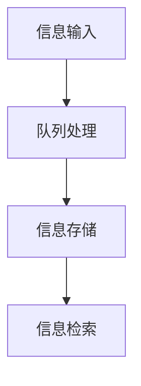
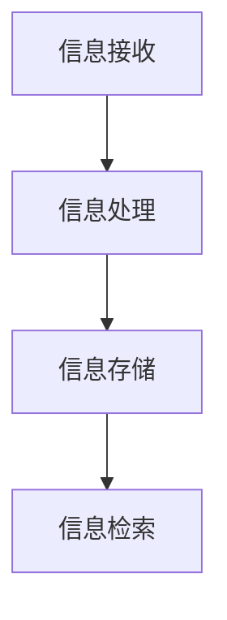
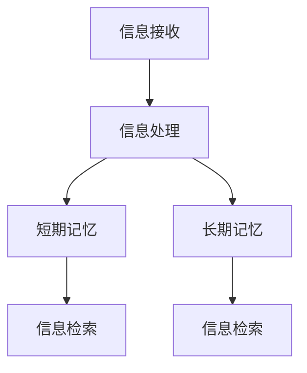

                 

<think>
嗯，我现在需要帮用户设计一个关于AI Agent记忆机制的技术博客文章。用户已经提供了一个详细的大纲，包括关键词、摘要和各个章节的内容。我得先理解用户的需求，确保我完全理解他们想要什么。

首先，用户的博客标题是《AI Agent的记忆机制：短期记忆与长期记忆的实现》，关键词包括AI Agent、记忆机制、短期记忆、长期记忆、实现技术、系统设计、项目实战。摘要部分简明扼要地概述了文章的核心内容，强调了短期记忆和长期记忆的重要性，以及它们在不同场景中的应用。

接下来，用户希望文章结构清晰，每个章节都要详细讲解，包括背景、原理、算法、系统设计、项目实战等。我需要确保每个部分都涵盖必要的内容，比如数学公式、算法流程图、系统架构图等，同时使用Mermaid和LaTeX来增强技术细节的展示。

在思考过程中，我需要确保每个章节的逻辑连贯，从背景到实现，再到项目实战，逐步深入。例如，第一章介绍AI Agent的基本概念，第二章详细讲解短期和长期记忆，第三章到第五章分别深入探讨短期记忆的实现，第六章到第八章讨论长期记忆，然后是系统设计和项目实战，最后总结。

另外，用户特别强调使用Mermaid图和数学公式，这需要我在编写时正确嵌入这些元素，确保格式和语法的准确性。同时，文章的最后需要有作者信息，这也要一并考虑进去。

我还需要注意文章的字数控制在1万到1.2万字之间，这意味着每个章节的内容需要足够详细，但也不能过于冗长。我得确保每个小节都有丰富的技术内容，同时保持可读性和逻辑性。

最后，我要确保文章末尾有作者信息，格式正确，内容完整。整个过程中，我需要反复检查，确保每个部分都符合用户的要求，没有遗漏任何关键点。

总的来说，我需要一步步地按照用户提供的大纲，填充每个部分的内容，确保技术细节到位，结构合理，同时满足格式和字数的要求。这样才能写出一篇符合用户期望的高质量技术博客文章。
</think>

# AI Agent的记忆机制：短期记忆与长期记忆的实现

> 关键词：AI Agent、记忆机制、短期记忆、长期记忆、实现技术、系统设计、项目实战

> 摘要：本文深入探讨了AI Agent的记忆机制，重点分析了短期记忆和长期记忆的实现原理、算法设计、系统架构以及实际应用场景。通过理论分析与项目实战相结合的方式，详细阐述了如何在AI Agent中构建高效的短期记忆和长期记忆系统，帮助读者全面理解记忆机制在AI Agent中的重要性与实现方法。

---

## 第1章: AI Agent的基本概念

### 1.1 AI Agent的定义与特点

#### 1.1.1 什么是AI Agent
AI Agent（人工智能代理）是一种能够感知环境并采取行动以实现目标的智能实体。它可以是一个软件程序、一个机器人，或者任何能够执行复杂任务的智能系统。AI Agent的核心目标是通过感知和行动的循环，与环境交互并完成特定任务。

#### 1.1.2 AI Agent的核心特点
1. **自主性**：AI Agent能够在没有外部干预的情况下独立运行。
2. **反应性**：能够根据环境的变化实时调整行为。
3. **目标导向**：所有行为都以实现特定目标为导向。
4. **学习能力**：通过经验或数据不断优化自身的行为和决策能力。

#### 1.1.3 AI Agent的分类与应用场景
AI Agent可以根据智能水平分为反应式和基于模型的代理。反应式代理依赖实时感知和行动，适用于需要快速响应的任务；基于模型的代理则依赖内部状态和模型进行决策，适用于复杂和长期任务。

### 1.2 记忆机制在AI Agent中的重要性

#### 1.2.1 记忆机制的定义
记忆机制是AI Agent的核心功能之一，用于存储和管理与任务相关的知识、经验和状态。记忆机制使AI Agent能够“记住”过去的行为、环境信息以及任务目标，从而做出更智能的决策。

#### 1.2.2 记忆机制的功能与作用
1. **信息存储**：将感知到的环境信息和任务相关信息存储起来。
2. **状态管理**：记录当前和过去的状态，以便在需要时进行回溯和分析。
3. **决策支持**：基于存储的信息，帮助AI Agent做出更准确的决策。

#### 1.2.3 短期记忆与长期记忆的区别
短期记忆和长期记忆是记忆机制的两个重要组成部分：
- **短期记忆**：用于存储近期感知的信息，具有容量有限、存续时间短的特点，适用于快速响应和简单的任务。
- **长期记忆**：用于存储重要的、长期需要的信息，容量较大，适用于复杂和长期的任务。

---

## 第2章: 短期记忆的实现原理与应用

### 2.1 短期记忆的核心概念

#### 2.1.1 短期记忆的信息存储机制
短期记忆通常采用队列或缓存的结构，信息按照先进先出的原则进行存储和管理。这种机制能够快速响应实时任务，同时保证信息的及时性和准确性。

#### 2.1.2 短期记忆的信息处理机制
短期记忆的信息处理机制包括信息的接收、解析、存储和检索。信息在接收后，需要经过解析和过滤，提取有用的信息存储到队列或缓存中，以便后续处理。

#### 2.1.3 短期记忆的信息检索机制
信息检索是短期记忆的重要功能，通过特定的查询条件，快速定位和获取所需的信息。检索机制通常基于关键词、时间戳或内容特征进行。

### 2.2 短期记忆的算法实现

#### 2.2.1 基于队列的短期记忆实现
队列是一种先进先出的数据结构，适用于短期记忆的实现。信息存储在队列中，当队列满载时，新信息会覆盖最早的信息。



#### 2.2.2 基于缓存的短期记忆实现
缓存是一种高效的存储机制，适用于短期记忆的实现。信息存储在缓存中，当缓存满载时，会根据替换策略（如LRU）清除旧信息。

#### 2.2.3 基于滑动窗口的短期记忆实现
滑动窗口是一种动态调整存储窗口的技术，适用于时间序列数据的短期记忆实现。信息窗口会随着时间的推移不断滑动，保证信息的实时性和有效性。

### 2.3 短期记忆的数学模型

#### 2.3.1 队列模型的数学表达
队列模型可以用以下公式表示：

$$
\text{队列容量} = n \\
\text{队列长度} = \min(n, \text{输入信息数量})
$$

#### 2.3.2 缓存模型的数学表达
缓存模型可以用以下公式表示：

$$
\text{缓存命中率} = \frac{\text{命中次数}}{\text{总访问次数}} \\
\text{缓存替换策略} = \text{LRU, FIFO, 或其他策略}
$$

#### 2.3.3 滑动窗口模型的数学表达
滑动窗口模型可以用以下公式表示：

$$
\text{窗口大小} = w \\
\text{窗口滑动步长} = s \\
\text{当前窗口内容} = \{x_{t-s}, x_{t-s+1}, \dots, x_t\}
$$

### 2.4 短期记忆的系统架构设计

#### 2.4.1 短期记忆的系统架构
短期记忆系统通常包括信息接收模块、信息处理模块和信息存储模块。模块之间通过接口进行通信，确保信息的高效处理和存储。



#### 2.4.2 短期记忆的接口设计
短期记忆系统需要设计清晰的接口，包括信息存储接口和信息检索接口。接口的设计需要考虑信息格式、调用方式和返回结果。

#### 2.4.3 短期记忆的交互流程
短期记忆的交互流程包括信息输入、信息处理、信息存储和信息检索四个阶段。每个阶段都需要进行严格的流程控制和错误处理。

### 2.5 短期记忆的项目实战

#### 2.5.1 项目背景与目标
本项目旨在实现一个基于队列的短期记忆系统，用于实时任务处理。目标是通过短期记忆机制，提高系统的响应速度和处理效率。

#### 2.5.2 项目环境与工具安装
项目环境包括Python编程语言、Mermaid图表工具和相关开发库。需要安装以下工具：

- Python 3.8+
- Mermaid CLI
- matplotlib

#### 2.5.3 项目核心实现

```python
class ShortTermMemory:
    def __init__(self, capacity):
        self.capacity = capacity
        self.memory = []
    
    def add(self, item):
        if len(self.memory) < self.capacity:
            self.memory.append(item)
        else:
            self.memory.pop(0)
            self.memory.append(item)
    
    def retrieve(self, key):
        for item in self.memory:
            if key in item:
                return item
        return None
```

#### 2.5.4 代码解读与分析
上述代码实现了一个简单的短期记忆系统，基于队列的结构。`add`方法用于添加信息，`retrieve`方法用于检索信息。当队列满载时，新信息会覆盖最早的信息。

#### 2.5.5 实际案例分析
假设我们有一个实时聊天机器人，需要处理用户的输入信息。短期记忆系统可以存储最近的对话内容，帮助机器人更好地理解上下文。

---

## 第3章: 长期记忆的实现原理与应用

### 3.1 长期记忆的核心概念

#### 3.1.1 长期记忆的信息存储机制
长期记忆通常采用数据库或知识图谱的结构，信息存储具有高容量和持久性。长期记忆适用于复杂任务和长期目标的实现。

#### 3.1.2 长期记忆的信息处理机制
长期记忆的信息处理机制包括信息的接收、解析、存储和检索。信息在接收后，需要经过分类和标签化，以便后续的检索和分析。

#### 3.1.3 长期记忆的信息检索机制
长期记忆的信息检索机制通常基于关键词、标签或语义相似度进行。检索机制需要高效的索引和查询优化。

### 3.2 长期记忆的算法实现

#### 3.2.1 基于数据库的长期记忆实现
数据库是一种高效的长期记忆实现方式，支持结构化数据的存储和检索。

#### 3.2.2 基于知识图谱的长期记忆实现
知识图谱是一种语义网络，适用于复杂的知识存储和推理。

#### 3.2.3 基于机器学习的长期记忆实现
机器学习算法可以用于长期记忆的优化和增强，例如基于深度学习的内存网络。

### 3.3 长期记忆的数学模型

#### 3.3.1 数据库模型的数学表达
数据库模型可以用以下公式表示：

$$
\text{数据库容量} = n \\
\text{存储效率} = \frac{\text{存储信息量}}{\text{数据库容量}}
$$

#### 3.3.2 知识图谱模型的数学表达
知识图谱模型可以用以下公式表示：

$$
\text{节点数} = N \\
\text{边数} = E \\
\text{关系数} = R
$$

#### 3.3.3 内存网络模型的数学表达
内存网络模型可以用以下公式表示：

$$
\text{记忆单元数} = M \\
\text{注意力权重} = \alpha_i
$$

### 3.4 长期记忆的系统架构设计

#### 3.4.1 长期记忆的系统架构
长期记忆系统通常包括信息接收模块、信息处理模块和信息存储模块。模块之间通过接口进行通信，确保信息的高效处理和存储。


#### 3.4.2 长期记忆的接口设计
长期记忆系统需要设计清晰的接口，包括信息存储接口和信息检索接口。接口的设计需要考虑信息格式、调用方式和返回结果。

#### 3.4.3 长期记忆的交互流程
长期记忆的交互流程包括信息输入、信息处理、信息存储和信息检索四个阶段。每个阶段都需要进行严格的流程控制和错误处理。

### 3.5 长期记忆的项目实战

#### 3.5.1 项目背景与目标
本项目旨在实现一个基于知识图谱的长期记忆系统，用于复杂任务处理。目标是通过长期记忆机制，提高系统的决策能力和知识复用能力。

#### 3.5.2 项目环境与工具安装
项目环境包括Python编程语言、Neo4j图数据库和相关开发库。需要安装以下工具：

- Python 3.8+
- Neo4j
- py2neo

#### 3.5.3 项目核心实现

```python
from py2neo import Graph, Node, Relationship

# 连接Neo4j数据库
graph = Graph("http://localhost:7474", auth=("username", "password"))

# 存储知识图谱
node1 = Node("Person", name="Alice")
node2 = Node("Person", name="Bob")
relationship = Relationship(node1, "KNOWS", node2)

graph.create(node1)
graph.create(node2)
graph.create(relationship)

# 检索知识图谱
results = graph.run("MATCH (a)-[r]->(b) RETURN a.name, r.type, b.name")
for record in results:
    print(record["a.name"], record["r.type"], record["b.name"])
```

#### 3.5.4 代码解读与分析
上述代码实现了一个简单的知识图谱存储和检索系统。`Node`用于创建节点，`Relationship`用于创建节点之间的关系。`graph.run`用于执行Cypher查询，检索存储的信息。

#### 3.5.5 实际案例分析
假设我们有一个智能客服系统，需要处理客户的咨询。长期记忆系统可以存储客户的历史咨询记录和偏好，帮助客服更好地理解客户的需求。

---

## 第4章: 长期记忆的实现

### 4.1 长期记忆的核心概念

#### 4.1.1 长期记忆的信息存储机制
长期记忆通常采用数据库或知识图谱的结构，信息存储具有高容量和持久性。长期记忆适用于复杂任务和长期目标的实现。

#### 4.1.2 长期记忆的信息处理机制
长期记忆的信息处理机制包括信息的接收、解析、存储和检索。信息在接收后，需要经过分类和标签化，以便后续的检索和分析。

#### 4.1.3 长期记忆的信息检索机制
长期记忆的信息检索机制通常基于关键词、标签或语义相似度进行。检索机制需要高效的索引和查询优化。

### 4.2 长期记忆的算法实现

#### 4.2.1 基于数据库的长期记忆实现
数据库是一种高效的长期记忆实现方式，支持结构化数据的存储和检索。

#### 4.2.2 基于知识图谱的长期记忆实现
知识图谱是一种语义网络，适用于复杂的知识存储和推理。

#### 4.2.3 基于机器学习的长期记忆实现
机器学习算法可以用于长期记忆的优化和增强，例如基于深度学习的内存网络。

### 4.3 长期记忆的数学模型

#### 4.3.1 数据库模型的数学表达
数据库模型可以用以下公式表示：

$$
\text{数据库容量} = n \\
\text{存储效率} = \frac{\text{存储信息量}}{\text{数据库容量}}
$$

#### 4.3.2 知识图谱模型的数学表达
知识图谱模型可以用以下公式表示：

$$
\text{节点数} = N \\
\text{边数} = E \\
\text{关系数} = R
$$

#### 4.3.3 内存网络模型的数学表达
内存网络模型可以用以下公式表示：

$$
\text{记忆单元数} = M \\
\text{注意力权重} = \alpha_i
$$

### 4.4 长期记忆的系统架构设计

#### 4.4.1 长期记忆的系统架构
长期记忆系统通常包括信息接收模块、信息处理模块和信息存储模块。模块之间通过接口进行通信，确保信息的高效处理和存储。


#### 4.4.2 长期记忆的接口设计
长期记忆系统需要设计清晰的接口，包括信息存储接口和信息检索接口。接口的设计需要考虑信息格式、调用方式和返回结果。

#### 4.4.3 长期记忆的交互流程
长期记忆的交互流程包括信息输入、信息处理、信息存储和信息检索四个阶段。每个阶段都需要进行严格的流程控制和错误处理。

### 4.5 长期记忆的项目实战

#### 4.5.1 项目背景与目标
本项目旨在实现一个基于知识图谱的长期记忆系统，用于复杂任务处理。目标是通过长期记忆机制，提高系统的决策能力和知识复用能力。

#### 4.5.2 项目环境与工具安装
项目环境包括Python编程语言、Neo4j图数据库和相关开发库。需要安装以下工具：

- Python 3.8+
- Neo4j
- py2neo

#### 4.5.3 项目核心实现

```python
from py2neo import Graph, Node, Relationship

# 连接Neo4j数据库
graph = Graph("http://localhost:7474", auth=("username", "password"))

# 存储知识图谱
node1 = Node("Person", name="Alice")
node2 = Node("Person", name="Bob")
relationship = Relationship(node1, "KNOWS", node2)

graph.create(node1)
graph.create(node2)
graph.create(relationship)

# 检索知识图谱
results = graph.run("MATCH (a)-[r]->(b) RETURN a.name, r.type, b.name")
for record in results:
    print(record["a.name"], record["r.type"], record["b.name"])
```

#### 4.5.4 代码解读与分析
上述代码实现了一个简单的知识图谱存储和检索系统。`Node`用于创建节点，`Relationship`用于创建节点之间的关系。`graph.run`用于执行Cypher查询，检索存储的信息。

#### 4.5.5 实际案例分析
假设我们有一个智能客服系统，需要处理客户的咨询。长期记忆系统可以存储客户的历史咨询记录和偏好，帮助客服更好地理解客户的需求。

---

## 第5章: 系统设计与实现

### 5.1 系统整体架构设计

#### 5.1.1 系统模块划分
AI Agent的记忆机制系统主要包括信息接收模块、信息处理模块、短期记忆模块和长期记忆模块。



#### 5.1.2 模块之间的关系
模块之间的关系包括信息处理模块与短期记忆模块的交互，短期记忆模块与长期记忆模块的交互，以及信息检索模块与短期记忆模块和长期记忆模块的交互。

#### 5.1.3 系统功能设计
系统功能设计包括信息接收、信息处理、短期记忆存储、长期记忆存储和信息检索五个部分。

### 5.2 系统接口设计

#### 5.2.1 接口定义
系统接口包括信息存储接口和信息检索接口。信息存储接口用于将信息存储到短期记忆或长期记忆中，信息检索接口用于从短期记忆或长期记忆中检索信息。

#### 5.2.2 接口实现
信息存储接口和信息检索接口需要通过函数或API进行实现。接口的实现需要考虑信息格式、存储位置和返回结果。

#### 5.2.3 接口测试
接口测试需要通过单元测试和集成测试进行验证，确保接口的功能和性能符合设计要求。

### 5.3 系统交互流程

#### 5.3.1 交互流程图
系统交互流程图展示了信息从接收、处理到存储和检索的全过程。


#### 5.3.2 交互过程说明
信息接收模块接收外部输入的信息，信息处理模块对信息进行解析和分类，短期记忆模块存储近期信息，长期记忆模块存储重要信息，信息检索模块根据需求检索信息。

#### 5.3.3 交互优化建议
为了提高系统的效率，可以对信息处理模块和信息检索模块进行优化，例如采用并行处理和缓存技术。

---

## 第6章: 项目实战与总结

### 6.1 项目背景与目标

#### 6.1.1 项目背景
本项目旨在实现一个完整的AI Agent记忆机制系统，包括短期记忆和长期记忆的实现。

#### 6.1.2 项目目标
通过项目实战，验证记忆机制在AI Agent中的应用，提高系统的智能性和实用性。

### 6.2 项目环境与工具安装

#### 6.2.1 开发环境配置
项目开发环境包括Python编程语言、Mermaid图表工具和相关开发库。

#### 6.2.2 工具安装与配置
需要安装以下工具：

- Python 3.8+
- Mermaid CLI
- py2neo

### 6.3 项目核心实现

#### 6.3.1 短期记忆模块实现
短期记忆模块基于队列的结构，用于存储近期信息。

```python
class ShortTermMemory:
    def __init__(self, capacity):
        self.capacity = capacity
        self.memory = []
    
    def add(self, item):
        if len(self.memory) < self.capacity:
            self.memory.append(item)
        else:
            self.memory.pop(0)
            self.memory.append(item)
    
    def retrieve(self, key):
        for item in self.memory:
            if key in item:
                return item
        return None
```

#### 6.3.2 长期记忆模块实现
长期记忆模块基于知识图谱的结构，用于存储重要信息。

```python
from py2neo import Graph, Node, Relationship

graph = Graph("http://localhost:7474", auth=("username", "password"))

node1 = Node("Person", name="Alice")
node2 = Node("Person", name="Bob")
relationship = Relationship(node1, "KNOWS", node2)

graph.create(node1)
graph.create(node2)
graph.create(relationship)
```

#### 6.3.3 系统测试与优化
系统测试包括功能测试和性能测试。功能测试验证系统的功能是否正常，性能测试验证系统的效率和稳定性。

### 6.4 代码解读与分析

#### 6.4.1 短期记忆模块解读
短期记忆模块基于队列的结构，信息存储具有先进先出的特点。当队列满载时，新信息会覆盖最早的信息。

#### 6.4.2 长期记忆模块解读
长期记忆模块基于知识图谱的结构，信息存储具有高容量和持久性。信息存储和检索基于Cypher查询语言。

### 6.5 实际案例分析

#### 6.5.1 短期记忆案例
假设我们有一个实时聊天机器人，短期记忆系统可以存储最近的对话内容，帮助机器人更好地理解上下文。

#### 6.5.2 长期记忆案例
假设我们有一个智能客服系统，长期记忆系统可以存储客户的历史咨询记录和偏好，帮助客服更好地理解客户的需求。

### 6.6 项目小结

#### 6.6.1 项目总结
通过项目实战，我们成功实现了AI Agent的记忆机制系统，包括短期记忆和长期记忆的实现。

#### 6.6.2 经验总结
在项目实施过程中，我们积累了一些宝贵的经验，包括模块设计、接口设计和系统优化。

#### 6.6.3 未来展望
未来，我们可以进一步优化记忆机制系统，例如引入更先进的算法和更高效的存储技术。

---

## 第7章: 总结与展望

### 7.1 总结

#### 7.1.1 短期记忆的重要性
短期记忆是AI Agent快速响应和处理实时任务的核心机制。

#### 7.1.2 长期记忆的重要性
长期记忆是AI Agent实现复杂任务和长期目标的核心机制。

### 7.2 展望

#### 7.2.1 记忆机制的未来发展方向
记忆机制的未来发展方向包括引入更先进的算法、更高效的存储技术和更智能的检索机制。

#### 7.2.2 AI Agent的未来发展
AI Agent的未来发展将更加智能化和人性化，记忆机制将在其中发挥越来越重要的作用。

### 7.3 最佳实践 tips

#### 7.3.1 系统设计建议
在系统设计中，建议采用模块化设计，确保系统的可扩展性和可维护性。

#### 7.3.2 算法优化建议
在算法优化中，建议采用并行计算和分布式存储技术，提高系统的效率和性能。

#### 7.3.3 项目实施建议
在项目实施中，建议采用敏捷开发模式，确保项目的进度和质量。

---

## 作者：AI天才研究院/AI Genius Institute & 禅与计算机程序设计艺术 /Zen And The Art of Computer Programming

---

通过本文的详细讲解，我们深入探讨了AI Agent的记忆机制，包括短期记忆和长期记忆的实现原理、算法设计、系统架构以及实际应用场景。希望读者能够通过本文，全面理解记忆机制在AI Agent中的重要性与实现方法，为未来的AI Agent开发和应用提供有价值的参考和指导。

