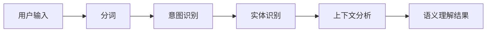
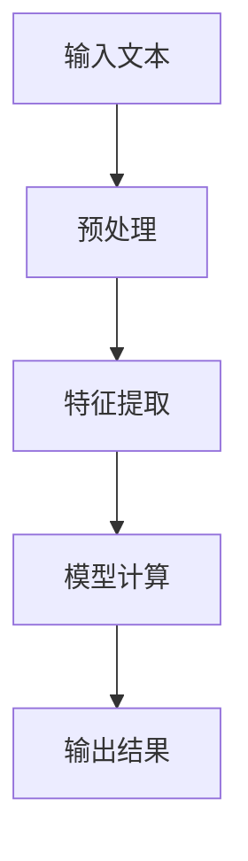

                 


# AI Agent的语义理解：超越关键词匹配

## 关键词：
AI Agent，语义理解，关键词匹配，自然语言处理，意图识别，实体识别，上下文理解

## 摘要：
AI Agent的语义理解是实现智能化人机交互的核心技术，超越传统的关键词匹配，通过深度学习和自然语言处理技术，理解用户的意图和上下文，提供更精准的服务。本文详细探讨了AI Agent语义理解的背景、核心概念、算法原理、系统架构及项目实战，旨在帮助读者全面掌握这一技术。

---

## 第一部分: AI Agent语义理解的背景与核心概念

### 第1章: AI Agent与语义理解概述

#### 1.1 AI Agent的基本概念
- 1.1.1 AI Agent的定义
  - AI Agent是一种能够感知环境、执行任务并做出决策的智能实体。
  - 它可以是软件程序，也可以是硬件设备，具备自主性、反应性和社会性。

- 1.1.2 AI Agent的核心特征
  - 自主性：能够独立执行任务。
  - 反应性：能够感知环境并做出实时反馈。
  - 社会性：能够与其他Agent或人类进行交互。

- 1.1.3 AI Agent的分类与应用场景
  - 分类：基于智能水平可分为简单反应式Agent、基于模型的反射式Agent、目标驱动的Agent等。
  - 应用场景：智能助手、推荐系统、智能客服、自动驾驶等。

#### 1.2 语义理解的背景与挑战
- 1.2.1 传统信息检索的局限性
  - 传统关键词匹配仅依赖文本表面的关键词，无法理解上下文和意图。
  - 例如：用户搜索“apple”时，可能是指苹果公司、苹果手机或苹果水果。

- 1.2.2 语义理解的需求与目标
  - 需求：理解用户的真实意图和需求，提供更精准的服务。
  - 目标：通过自然语言处理技术，将文本转化为可理解的语义表示。

- 1.2.3 当前语义理解的技术瓶颈
  - 精度问题：如何准确识别意图和实体。
  - 上下文理解：如何处理复杂对话中的上下文依赖。
  - 多语言支持：如何在多语言环境中实现一致的语义理解。

#### 1.3 超越关键词匹配的意义
- 1.3.1 关键词匹配的局限性
  - 无法处理同义词、近义词和语义变体。
  - 无法理解用户的隐含需求。

- 1.3.2 语义理解的优势与价值
  - 提供更精准的搜索结果和推荐。
  - 支持更自然的人机交互，提升用户体验。

- 1.3.3 超越关键词匹配的实现路径
  - 基于深度学习的语义理解模型。
  - 结合上下文和意图的多模态理解。

---

### 第2章: 语义理解的核心概念与联系

#### 2.1 语义理解的核心原理
- 2.1.1 意图识别的基本原理
  - 通过分析用户的输入，识别其背后的意图。
  - 例如：用户输入“今天北京天气怎么样？”的意图是查询天气信息。

- 2.1.2 实体识别与上下文理解
  - 实体识别：识别文本中的关键实体，如人名、地名、时间等。
  - 上下文理解：理解文本的上下文关系，处理指代消解和语义依存。

- 2.1.3 语义理解的数学模型概述
  - 基于统计的模型：如TF-IDF、LSA。
  - 基于深度学习的模型：如Word2Vec、BERT。

#### 2.2 核心概念对比分析
- 2.2.1 关键词匹配与语义理解的对比
| 特性         | 关键词匹配                   | 语义理解                   |
|--------------|-----------------------------|---------------------------|
| 理解深度     | 表面匹配                   | 深度理解                   |
| 精度         | 低                         | 高                         |
| 应用场景     | 简单搜索                   | 复杂交互                   |

- 2.2.2 不同语义理解方法的特征对比
| 方法         | 基于统计的模型               | 基于深度学习的模型           |
|--------------|-----------------------------|---------------------------|
| 优势         | 计算简单                   | 表达能力强                 |
| 动态适应性   | 差                         | 好                         |

- 2.2.3 语义理解与自然语言处理的关系
  - 自然语言处理是语义理解的基础，而语义理解是自然语言处理的高级应用。

#### 2.3 实体关系图与流程图
- 2.3.1 语义理解的实体关系图


- 2.3.2 核心算法流程图


---

## 第二部分: 语义理解的算法原理与数学模型

### 第3章: 语义理解的算法原理与数学模型

#### 3.1 基于统计的语义理解算法
- 3.1.1 余弦相似度计算
  - 公式：$$\text{相似度} = \frac{\vec{A} \cdot \vec{B}}{|\vec{A}| \cdot |\vec{B}|}$$
  - 应用：用于文本相似度计算，判断两个文本的语义相似性。

- 3.1.2 基于TF-IDF的改进
  - 公式：$$\text{TF-IDF} = \text{TF} \times \text{IDF}$$
  - 应用：用于关键词提取和文本摘要。

#### 3.2 深度学习模型的语义理解
- 3.2.1 基于词嵌入的模型
  - 公式：$$\text{词向量} = \text{输入文本} \times \text{词嵌入矩阵}$$
  - 应用：将词语转换为低维向量表示，捕捉词语语义信息。

- 3.2.2 Transformer模型的注意力机制
  - 公式：$$\text{注意力权值} = \frac{\exp(\text{查询} \cdot \text{键})}{\sum \exp(\text{查询} \cdot \text{键})}$$
  - 应用：用于捕捉文本中的长距离依赖关系，提升语义理解能力。

---

### 第4章: 系统分析与架构设计方案

#### 4.1 问题场景介绍
- 一个智能客服系统的语义理解模块设计。

#### 4.2 系统功能设计
- 领域模型：```mermaid
graph LR
A[用户输入] --> B[意图识别]
B --> C[实体识别]
C --> D[上下文理解]
D --> E[语义表示]
```

- 系统架构设计：```mermaid
graph TD
A[用户输入] --> B[预处理]
B --> C[特征提取]
C --> D[模型计算]
D --> E[输出结果]
```

- 系统接口设计：RESTful API接口，如POST /api/semantic-understand。

- 系统交互流程图：```mermaid
graph LR
A[用户] --> B[智能客服]
B --> C[意图识别]
C --> D[实体识别]
D --> E[上下文分析]
E --> F[回复生成]
```

---

## 第三部分: 项目实战与最佳实践

### 第5章: 项目实战

#### 5.1 环境安装
- 安装Python、TensorFlow、Keras、NLTK等工具。

#### 5.2 核心代码实现
```python
import numpy as np
from sklearn.feature_extraction.text import TfidfVectorizer

# 示例文本
texts = ["apple is a tech company", "I like apple pies"]

# 计算TF-IDF
vectorizer = TfidfVectorizer()
tfidf = vectorizer.fit_transform(texts)

# 计算余弦相似度
def cosine_similarity(matrix):
    return matrix.T.dot(matrix) / (matrix.norm(axis=1).reshape(-1,1))

similarity = cosine_similarity(tfidf)
print(similarity)
```

#### 5.3 代码解读与分析
- TF-IDF计算：提取文本的特征向量。
- 余弦相似度计算：度量两个文本之间的语义相似性。

#### 5.4 实际案例分析
- 输入文本：“预订明天纽约到洛杉矶的航班。”
- 输出结果：意图识别为“航班预订”，实体识别包括“明天”、“纽约”、“洛杉矶”。

#### 5.5 项目小结
- 通过项目实战，掌握了语义理解的基本实现方法。

### 第6章: 最佳实践

#### 6.1 小结
- 语义理解是AI Agent的核心技术，需要结合上下文和意图进行深度分析。

#### 6.2 注意事项
- 数据质量：语义理解依赖高质量的训练数据。
- 模型调优：需要不断优化模型参数和结构。

#### 6.3 拓展阅读
- 推荐书籍：《自然语言处理入门》、《深度学习》。
- 推荐论文：BERT论文、GPT系列论文。

---

## 作者：AI天才研究院/AI Genius Institute & 禅与计算机程序设计艺术 /Zen And The Art of Computer Programming

---

通过以上目录和内容的详细设计，您可以根据实际需求进一步扩展每个章节的内容，添加更多具体的代码示例、数学公式和图表，以满足文章的字数和深度要求。

