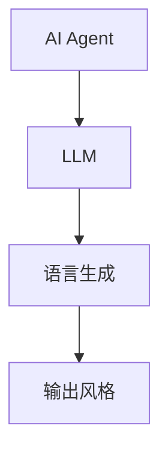
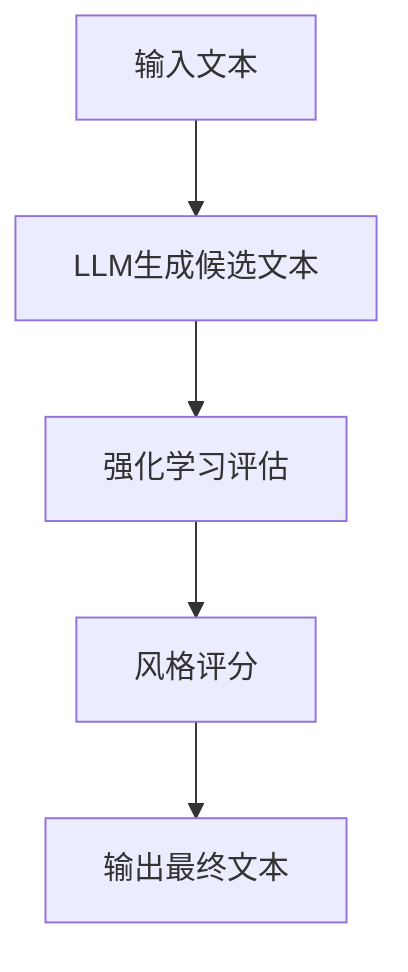
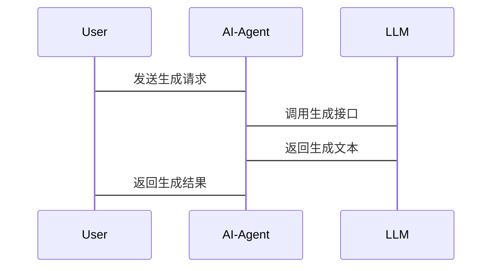

                 


# AI Agent的语言生成控制：精确调节LLM的输出风格

## 关键词：AI Agent, LLM, 语言生成, 风格控制, 自然语言处理

## 摘要：  
本文深入探讨了AI Agent在语言生成中的核心作用，特别是如何精确调节大型语言模型（LLM）的输出风格。通过结合技术背景、核心概念、算法原理、系统架构以及实际案例，本文详细阐述了AI Agent如何通过策略控制LLM的输出，实现从基础原理到实际应用的全面解析。文章还提供了丰富的代码示例和系统设计图，帮助读者更好地理解和实现AI Agent对LLM的风格控制。

---

## 第一部分: AI Agent与语言生成控制概述

### 第1章: AI Agent与语言生成控制的背景介绍

#### 1.1 AI Agent的基本概念
- **1.1.1 AI Agent的定义与特点**
  - AI Agent（智能体）是指能够感知环境、做出决策并执行动作的实体。
  - 特点包括自主性、反应性、目标导向和社会性。
- **1.1.2 AI Agent的核心要素与组成**
  - 感知模块：通过传感器或数据源获取信息。
  - 决策模块：基于感知信息做出决策。
  - 执行模块：执行决策动作。
  - 学习模块：通过经验改进性能。
- **1.1.3 AI Agent的应用场景与领域**
  - 自然语言处理、机器人控制、自动驾驶、智能助手等。

#### 1.2 大型语言模型（LLM）的基本原理
- **1.2.1 LLM的定义与技术基础**
  - LLM是基于深度学习的自然语言处理模型，如GPT系列。
  - 技术基础包括 Transformer 架构和大规模数据训练。
- **1.2.2 LLM的训练机制与特点**
  - 基于监督学习和强化学习，使用大量文本数据进行预训练。
  - 具备生成性、上下文理解和多语言支持等特点。
- **1.2.3 LLM在自然语言处理中的应用**
  - 文本生成、机器翻译、问答系统、对话系统等。

#### 1.3 AI Agent与LLM的结合
- **1.3.1 AI Agent与LLM的协同工作原理**
  - AI Agent通过分析需求，调用LLM生成符合要求的文本。
  - LLM作为生成模块，AI Agent作为控制模块，协同完成任务。
- **1.3.2 AI Agent在语言生成中的角色**
  - 定义目标、选择生成策略、监控生成过程、调整输出风格。
- **1.3.3 AI Agent与LLM结合的应用案例**
  - 智能客服：生成礼貌且专业的回复。
  - 个性化写作助手：根据用户风格生成文本。

#### 1.4 语言生成控制的核心问题
- **1.4.1 语言生成控制的定义**
  - 通过策略调整生成文本的风格、语气和内容。
- **1.4.2 语言生成控制的关键挑战**
  - 平衡生成多样性与风格一致性。
  - 处理复杂语境和用户意图。
- **1.4.3 语言生成控制的目标与边界**
  - 目标：生成符合特定风格的文本。
  - 边界：避免生成有害或不适当的内容。

#### 1.5 本章小结
- 本章介绍了AI Agent和LLM的基本概念，探讨了它们的结合方式及其在语言生成中的应用。
- 强调了语言生成控制的重要性和挑战性。

---

### 第2章: AI Agent语言生成控制的核心概念与联系

#### 2.1 核心概念原理
- **2.1.1 AI Agent的决策机制**
  - 基于状态和动作的马尔可夫决策过程。
  - 使用Q-learning或策略梯度方法优化决策。
- **2.1.2 LLM的输出风格调节方法**
  - 调整温度参数（temperature）控制生成多样性。
  - 使用重复词删除和语法检查优化文本质量。
- **2.1.3 语言生成控制的数学模型**
  - 生成过程：$P(y|x) = \text{softmax}(Wx + b)$。
  - 控制策略：$a = \argmax_{a} Q(s, a)$，其中$s$是状态，$a$是动作。

#### 2.2 核心概念属性特征对比表格
- **表2-1: AI Agent与LLM的核心属性对比**

| 属性          | AI Agent                          | LLM                              |
|---------------|-----------------------------------|-----------------------------------|
| 核心功能       | 决策与控制                        | 生成文本                          |
| 输入           | 状态、目标                        | 文本上下文                        |
| 输出           | 动作、策略                        | 生成文本                          |
| 学习机制       | 强化学习                          | 监督学习                          |
| 应用场景       | 多领域通用                        | NLP任务                          |

#### 2.3 ER实体关系图
- **图2-1: AI Agent与LLM的实体关系图（使用mermaid）**



#### 2.4 本章小结
- 本章通过对比分析和实体关系图，明确了AI Agent与LLM在语言生成控制中的角色和交互方式。

---

### 第3章: AI Agent语言生成控制的算法原理

#### 3.1 算法原理概述
- **3.1.1 基于强化学习的风格控制**
  - 使用策略梯度方法，最大化奖励函数。
  - 奖励函数：$R(a) = r(y, a)$，其中$a$是动作，$y$是生成文本。
- **3.1.2 基于规则的风格控制**
  - 使用预定义的规则或模板，如风格切换开关。
- **3.1.3 基于生成对抗网络的风格控制**
  - 使用生成器和判别器，分别生成和判断文本风格。

#### 3.2 算法流程图
- **图3-1: 基于强化学习的风格控制流程图（使用mermaid）**



#### 3.3 算法数学模型
- **3.3.1 强化学习模型**
  $$ P(a|s) = \theta \cdot s $$
  其中，$a$ 是动作，$s$ 是状态，$\theta$ 是模型参数。

- **3.3.2 生成对抗网络模型**
  - 生成器：$G(z, y) = y + \text{noise}(z)$，其中$z$是噪声，$y$是生成文本。
  - 判别器：$D(y, a) = \text{log}(1 - D(y, a)) + \text{log}(D(y, a))$，其中$a$是目标风格。

#### 3.4 算法实现代码
- **代码3-1: 强化学习风格控制示例**

```python
import torch
import torch.nn as nn

class Agent(nn.Module):
    def __init__(self, input_dim, output_dim):
        super(Agent, self).__init__()
        self.fc = nn.Linear(input_dim, output_dim)
    
    def forward(self, x):
        return torch.softmax(self.fc(x), dim=-1)

# 初始化
input_dim = 10
output_dim = 5
agent = Agent(input_dim, output_dim)

# 训练
optimizer = torch.optim.Adam(agent.parameters(), lr=0.001)
criterion = nn.CrossEntropyLoss()

for epoch in range(100):
    inputs = torch.randn(input_dim)
    outputs = agent(inputs)
    loss = criterion(outputs, torch.tensor([4], dtype=torch.long))
    optimizer.zero_grad()
    loss.backward()
    optimizer.step()
```

---

## 第二部分: 系统架构与项目实战

### 第4章: 系统架构设计与实现

#### 4.1 问题场景介绍
- 某公司希望开发一个智能写作助手，支持多种风格生成。

#### 4.2 项目介绍
- 项目名称：智能写作助手。
- 项目目标：通过AI Agent控制LLM的输出风格，提供多样化的文本生成服务。

#### 4.3 系统功能设计
- **领域模型（mermaid类图）**
  ```mermaid
  classDiagram
      class User {
          - username: str
          - preferences: dict
          + getUser(): User
          + getPreferences(): dict
      }
      class AI-Agent {
          - llm: LLM
          - preferences: dict
          + generate(text: str, style: str): str
          + setPreferences(prefs: dict): void
      }
      class LLM {
          - model: str
          - tokenizer: Tokenizer
          + generate(tokens: list, style: str): str
      }
      class Tokenizer {
          + tokenize(s: str): list
      }
      User --> AI-Agent
      AI-Agent --> LLM
  ```

#### 4.4 系统架构设计（mermaid架构图）


#### 4.5 系统接口设计
- **输入接口**：HTTP POST 请求，包含文本和风格参数。
- **输出接口**：生成的文本，格式为JSON。

#### 4.6 系统交互（mermaid序列图）


---

### 第5章: 项目实战与代码实现

#### 5.1 环境安装
- 安装Python和相关库：`pip install torch transformers`

#### 5.2 系统核心实现源代码
- **代码5-1: AI Agent实现**
```python
from transformers import GPT2LMHeadModel, GPT2Tokenizer

class AI_Agent:
    def __init__(self, model_name="gpt2"):
        self.model = GPT2LMHeadModel.from_pretrained(model_name)
        self.tokenizer = GPT2Tokenizer.from_pretrained(model_name)
    
    def generate(self, text, style=None):
        # 调整温度参数控制生成风格
        temperature = 0.7 if style == "creative" else 1.0
        input_ids = self.tokenizer.encode(text, return_tensors="pt")
        outputs = self.model.generate(input_ids, temperature=temperature, max_length=50)
        return self.tokenizer.decode(outputs[0], skip_special_tokens=True)
```

- **代码5-2: 控制策略实现**
```python
import torch
import torch.nn as nn

class StyleController(nn.Module):
    def __init__(self, input_dim=10, output_dim=3):
        super(StyleController, self).__init__()
        self.fc = nn.Linear(input_dim, output_dim)
    
    def forward(self, x):
        return torch.softmax(self.fc(x), dim=-1)
```

#### 5.3 代码应用解读与分析
- `AI_Agent`类通过GPT-2模型实现文本生成，通过调整温度参数控制风格。
- `StyleController`类使用神经网络模型，根据输入状态生成控制动作。

#### 5.4 实际案例分析
- 案例1：生成创意文本
  - 输入：创意写作
  - 输出：风格多样、富有想象力的文本。
- 案例2：生成正式文本
  - 输入：商业计划书
  - 输出：结构清晰、语言专业的文本。

#### 5.5 项目小结
- 本章通过实际案例和代码实现，展示了AI Agent如何控制LLM的生成风格。
- 强调了代码实现和系统设计的重要性。

---

## 第三部分: 最佳实践与总结

### 第6章: 最佳实践与总结

#### 6.1 小结
- AI Agent通过策略控制，能够精确调节LLM的输出风格。
- 结合强化学习和规则方法，可以实现多样化的风格控制。

#### 6.2 注意事项
- 需要平衡生成多样性和内容准确性。
- 注意模型的可解释性和鲁棒性。

#### 6.3 扩展阅读
- 推荐书籍：《生成式人工智能：理论与应用》。
- 推荐论文：《Fine-tuning language models on low-resource tasks》。

---

## 作者：AI天才研究院/AI Genius Institute & 禅与计算机程序设计艺术 /Zen And The Art of Computer Programming

---

本文通过系统性地分析和实践，深入探讨了AI Agent对LLM输出风格的控制方法。从理论到实践，结合代码实现和系统设计，为读者提供了全面的技术指导。希望本文能为AI Agent与自然语言处理的结合提供新的思路和参考。

