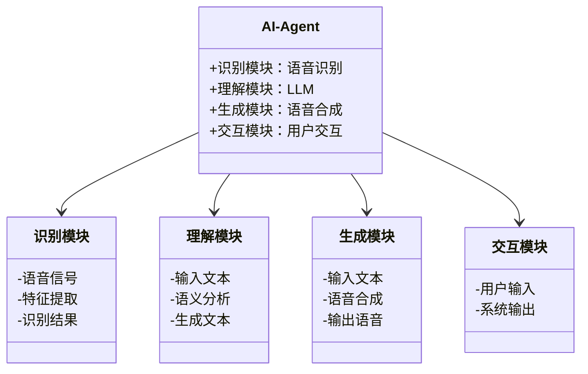
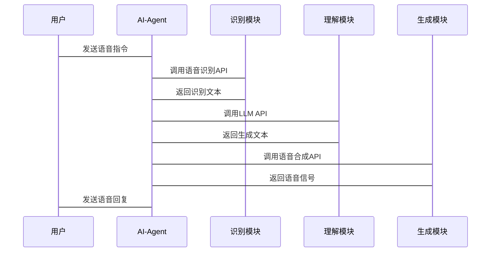

                 


# AI Agent的语音交互：整合LLM与语音识别技术

> 关键词：AI Agent, LLM, 语音识别, 语音交互, 整合技术

> 摘要：本文详细探讨了AI Agent在语音交互中的应用，重点分析了如何整合大语言模型（LLM）与语音识别技术，实现高效、自然的语音交互。文章从背景介绍、核心概念、算法原理、系统架构到项目实战，全面解析了这一技术的实现过程和应用价值。

---

## 第一部分: AI Agent与语音交互的背景与概念

### 第1章: AI Agent与语音交互的背景介绍

#### 1.1 问题背景

##### 1.1.1 AI Agent的定义与特点
AI Agent（人工智能代理）是一种能够感知环境、执行任务并做出决策的智能体。其特点包括自主性、反应性、目标导向性和社会能力。AI Agent能够通过传感器获取信息，通过执行器与环境交互，并通过内部算法进行决策。

##### 1.1.2 语音交互的定义与特点
语音交互是一种通过语音进行信息传递和交互的技术，其特点包括实时性、自然性和便捷性。语音交互能够通过语音识别和语音合成技术，实现人与计算机之间的自然对话。

##### 1.1.3 AI Agent与语音交互的结合必要性
随着人工智能技术的快速发展，语音交互逐渐成为人机交互的重要方式。AI Agent通过语音交互，能够更自然地与用户进行沟通，提供更智能化的服务。

#### 1.2 问题描述

##### 1.2.1 当前语音交互技术的局限性
当前语音交互技术主要依赖于语音识别和语音合成技术，存在以下局限性：
1. **识别准确率不足**：在复杂环境下，语音识别的准确率可能较低。
2. **语义理解能力有限**：单纯的语音识别无法完全理解用户意图。
3. **交互深度不足**：缺乏上下文理解和动态决策能力。

##### 1.2.2 AI Agent在语音交互中的作用
AI Agent通过整合语音交互技术，能够实现以下功能：
1. **上下文理解**：通过分析用户的历史对话记录，理解用户的上下文意图。
2. **动态决策**：根据用户反馈和环境变化，动态调整交互策略。
3. **多模态交互**：结合视觉、文本等多种交互方式，提供更丰富的用户体验。

##### 1.2.3 整合LLM与语音识别技术的可行性
整合大语言模型（LLM）与语音识别技术，可以通过以下方式实现：
1. **语音识别驱动LLM**：通过语音识别将用户语音转换为文本，作为LLM的输入，生成智能回复。
2. **LLM驱动语音识别**：通过LLM生成回复内容，驱动语音合成技术，实现自然语音输出。

#### 1.3 问题解决

##### 1.3.1 LLM在语音交互中的应用
LLM（大语言模型）在语音交互中的应用主要体现在：
1. **语义理解**：通过LLM对用户意图进行深度理解，生成更准确的回复。
2. **对话管理**：通过LLM进行对话上下文的管理，实现更自然的对话流程。
3. **多语言支持**：通过LLM支持多种语言的语音交互。

##### 1.3.2 语音识别技术的优化
语音识别技术的优化主要体现在：
1. **降噪技术**：通过降噪算法提高语音识别的准确率。
2. **自适应识别**：通过自适应算法，提高复杂环境下的识别能力。
3. **实时性优化**：通过优化算法，提高语音识别的实时性。

##### 1.3.3 AI Agent整合LLM与语音识别技术的解决方案
整合LLM与语音识别技术的解决方案包括：
1. **端到端语音交互**：从语音信号到最终回复的端到端处理。
2. **模块化设计**：将语音识别、LLM调用和语音合成作为独立模块，通过API进行交互。

#### 1.4 边界与外延

##### 1.4.1 AI Agent的边界
AI Agent的边界主要体现在：
1. **功能边界**：AI Agent的功能范围，如语音交互、任务执行等。
2. **环境边界**：AI Agent适用的环境范围，如特定场景或通用场景。
3. **数据边界**：AI Agent处理的数据范围，如用户隐私数据的处理边界。

##### 1.4.2 语音交互的边界
语音交互的边界主要体现在：
1. **设备边界**：语音交互支持的设备类型，如手机、智能音箱等。
2. **语言边界**：语音交互支持的语言种类。
3. **场景边界**：语音交互适用的场景范围，如家庭、办公等。

##### 1.4.3 整合技术的边界与外延
整合技术的边界与外延包括：
1. **技术边界**：整合技术的核心算法和模块。
2. **应用边界**：整合技术适用的应用场景。
3. **扩展边界**：整合技术的未来发展方向。

#### 1.5 核心概念的组成

##### 1.5.1 AI Agent的核心要素
AI Agent的核心要素包括：
1. **感知能力**：通过传感器获取环境信息。
2. **决策能力**：通过算法进行决策。
3. **执行能力**：通过执行器与环境交互。

##### 1.5.2 LLM与语音识别技术的核心要素
LLM与语音识别技术的核心要素包括：
1. **语音识别**：将语音信号转换为文本。
2. **语义理解**：通过LLM理解用户意图。
3. **语音合成**：将文本回复转换为语音。

##### 1.5.3 整合技术的核心要素
整合技术的核心要素包括：
1. **语音信号处理**：对语音信号进行预处理和特征提取。
2. **LLM调用**：通过API调用LLM进行语义理解。
3. **语音合成**：将LLM生成的文本回复转换为语音。

#### 1.6 本章小结
本章主要介绍了AI Agent与语音交互的背景与概念，分析了整合LLM与语音识别技术的必要性与可行性，并探讨了整合技术的核心要素与边界条件。

---

## 第2章: 核心概念与联系

### 2.1 核心概念原理

#### 2.1.1 LLM的工作原理
LLM（大语言模型）的工作原理包括：
1. **输入处理**：将用户输入的语音识别文本作为模型的输入。
2. **编码与解码**：通过编码器和解码器进行文本生成。
3. **概率分布与损失函数**：通过优化损失函数，提高模型生成的文本质量。

#### 2.1.2 语音识别技术的工作原理
语音识别技术的工作原理包括：
1. **语音信号处理**：对语音信号进行预处理和特征提取。
2. **声学模型训练**：通过训练数据训练声学模型，实现语音识别。
3. **解码与结果输出**：通过解码算法将模型输出转换为可读文本。

#### 2.1.3 AI Agent的整合机制
AI Agent的整合机制包括：
1. **语音信号处理**：对用户语音进行降噪和特征提取。
2. **LLM调用**：通过API调用LLM进行语义理解。
3. **语音合成**：将LLM生成的文本回复转换为语音输出。

### 2.2 概念属性特征对比

#### 2.2.1 LLM的特征分析
1. **输入形式**：文本输入。
2. **输出形式**：文本输出。
3. **核心能力**：语义理解与生成。

#### 2.2.2 语音识别技术的特征分析
1. **输入形式**：语音信号输入。
2. **输出形式**：文本输出。
3. **核心能力**：语音信号转换为文本。

#### 2.2.3 AI Agent的特征分析
1. **输入形式**：语音信号或文本输入。
2. **输出形式**：语音输出或文本输出。
3. **核心能力**：综合语音交互与智能决策。

### 2.3 ER实体关系图
```mermaid
er
  actor(AI Agent)
  actor(语音识别系统)
  actor(LLM)
  relation(整合)
  relation(调用)
  relation(反馈)
```

### 2.4 本章小结
本章主要分析了AI Agent、LLM和语音识别技术的核心概念与联系，通过对比和ER图展示了三者之间的关系。

---

## 第3章: 算法原理讲解

### 3.1 LLM算法原理

#### 3.1.1 基于Transformer的LLM流程
基于Transformer的LLM流程包括：
1. **编码器**：将输入文本转换为词向量。
2. **解码器**：根据词向量生成回复文本。
3. **注意力机制**：通过注意力机制，优化生成文本的质量。

#### 3.1.2 概率分布与损失函数
概率分布与损失函数在LLM中的应用包括：
1. **交叉熵损失函数**：用于衡量生成文本的概率分布与真实分布之间的差异。
2. **生成概率计算**：通过生成概率计算，优化模型的生成能力。

#### 3.1.3 解码过程与注意力机制
解码过程与注意力机制在LLM中的应用包括：
1. **自注意力机制**：通过自注意力机制，优化解码器的生成能力。
2. **位置编码**：通过位置编码，保持生成文本的连贯性。

### 3.2 语音识别算法原理

#### 3.2.1 声学模型与解码算法
声学模型与解码算法在语音识别中的应用包括：
1. **声学模型训练**：通过训练数据训练声学模型，实现语音识别。
2. **解码算法**：通过解码算法，将模型输出转换为可读文本。

#### 3.2.2 声音特征提取与处理
声音特征提取与处理在语音识别中的应用包括：
1. **特征提取**：提取语音信号中的特征，如梅尔频谱特征。
2. **降噪处理**：通过降噪算法，提高语音识别的准确率。

#### 3.2.3 模型训练与优化
模型训练与优化在语音识别中的应用包括：
1. **数据预处理**：对训练数据进行预处理，如分段和标注。
2. **模型优化**：通过优化算法，提高模型的识别准确率。

### 3.3 整合算法的流程

#### 3.3.1 语音信号处理
语音信号处理在整合算法中的应用包括：
1. **降噪处理**：通过降噪算法，提高语音信号的质量。
2. **特征提取**：提取语音信号中的特征，如梅尔频谱特征。

#### 3.3.2 LLM调用与反馈
LLM调用与反馈在整合算法中的应用包括：
1. **API调用**：通过API调用LLM进行语义理解。
2. **反馈机制**：通过反馈机制，优化语音交互的流程。

#### 3.3.3 结果优化与调整
结果优化与调整在整合算法中的应用包括：
1. **结果校正**：通过校正算法，优化语音识别的结果。
2. **动态调整**：根据用户反馈，动态调整LLM的生成策略。

### 3.4 本章小结
本章主要分析了LLM和语音识别技术的算法原理，并探讨了整合算法的流程与优化方法。

---

## 第4章: 数学模型与公式

### 4.1 LLM的数学模型

#### 4.1.1 交叉熵损失函数
交叉熵损失函数在LLM中的应用如下：
$$
\text{损失函数} = -\sum_{i=1}^{n} \text{标签}_i \cdot \log(\text{预测概率}_i)
$$

#### 4.1.2 注意力机制公式
注意力机制公式在LLM中的应用如下：
$$
\text{注意力权重} = \text{softmax}(\frac{\text{查询} \cdot \text{键}}{\text{维度}})
$$

### 4.2 语音识别的数学模型

#### 4.2.1 声学模型公式
声学模型公式在语音识别中的应用如下：
$$
P(\text{特征}|\text{语音}) = \text{高斯分布}(\text{均值}, \text{方差})
$$

#### 4.2.2 解码算法公式
解码算法公式在语音识别中的应用如下：
$$
\text{解码结果} = \arg\max_{y} P(y|\text{特征})
$$

### 4.3 整合模型的数学公式

#### 4.3.1 整合损失函数
整合损失函数在整合模型中的应用如下：
$$
\text{总损失} = \alpha \cdot \text{LLM损失} + (1-\alpha) \cdot \text{语音识别损失}
$$
其中，$\alpha$ 是平衡系数，用于调整LLM损失与语音识别损失的权重。

#### 4.3.2 动态调整公式
动态调整公式在整合模型中的应用如下：
$$
\text{调整系数} = \beta \cdot \text{识别准确率} + (1-\beta) \cdot \text{生成质量}
$$
其中，$\beta$ 是调整系数，用于动态调整语音识别和生成质量的权重。

### 4.4 本章小结
本章主要分析了LLM和语音识别技术的数学模型与公式，并探讨了整合模型的数学表达与优化方法。

---

## 第5章: 系统分析与架构设计

### 5.1 问题场景介绍

#### 5.1.1 问题背景
在本节中，我们将通过一个具体的场景来介绍AI Agent与语音交互的整合应用。假设我们正在开发一个智能音箱，用户通过语音指令与音箱进行交互，音箱通过AI Agent整合LLM和语音识别技术，实现智能回复。

#### 5.1.2 项目介绍
本项目的目标是通过整合LLM和语音识别技术，实现一个高效的AI Agent语音交互系统。系统将支持用户通过语音指令与AI Agent进行交互，AI Agent通过LLM进行语义理解，并通过语音合成技术生成回复。

### 5.2 系统功能设计

#### 5.2.1 领域模型（类图）


#### 5.2.2 系统架构设计


#### 5.2.3 系统接口设计
1. **识别模块接口**：提供语音识别API，接收语音信号，返回识别文本。
2. **理解模块接口**：提供LLM调用API，接收输入文本，返回生成文本。
3. **生成模块接口**：提供语音合成API，接收生成文本，返回语音信号。
4. **交互模块接口**：提供用户交互API，接收用户输入，返回系统输出。

#### 5.2.4 系统交互设计


### 5.3 本章小结
本章主要分析了AI Agent与语音交互系统的场景、功能、架构和接口设计，并通过Mermaid图展示了系统的类图、架构图和交互图。

---

## 第6章: 项目实战

### 6.1 环境安装

#### 6.1.1 Python安装
在本节中，我们将介绍如何在Python环境中安装必要的库和工具。首先，需要安装Python 3.8或更高版本。

#### 6.1.2 安装依赖库
需要安装以下依赖库：
```bash
pip install numpy
pip install tensorflow
pip install pyaudio
pip install pocketsphinx
```

### 6.2 系统核心实现

#### 6.2.1 语音识别实现
```python
import pocketsphinx as ps

def speech_to_text():
    # 初始化语音识别器
    recognizer = ps.Recognizer()
    # 设置语音识别模型
    recognizer.recognize中文()  # 假设pocketsphinx支持中文识别
    # 开始识别
    while True:
        print("请说话...")
        audio = recognizer.record()  # 记录音频
        result = recognizer.recognize(audio)  # 识别音频
        print("识别结果：", result)
```

#### 6.2.2 LLM调用实现
```python
import requests

def llm_inference(prompt):
    # 设置API端点
    endpoint = "http://localhost:5000/api/predict"
    # 发送请求
    response = requests.post(endpoint, json={"inputs": prompt})
    # 获取结果
    result = response.json()["outputs"]
    return result
```

#### 6.2.3 语音合成实现
```python
import pyttsx3

def text_to_speech(text):
    # 初始化语音合成器
    speaker = pyttsx3.init()
    # 设置语音属性
    speaker.setProperty('rate', 150)  # 设置语速
    speaker.setProperty('volume', 1.0)  # 设置音量
    # 合成语音
    speaker.say(text)
    speaker.runAndWait()
```

### 6.3 代码应用解读与分析

#### 6.3.1 语音识别代码解读
1. **导入库**：使用pocketsphinx库进行语音识别。
2. **初始化识别器**：创建语音识别器实例。
3. **识别过程**：循环等待用户输入语音，识别后输出结果。

#### 6.3.2 LLM调用代码解读
1. **导入库**：使用requests库调用HTTP API。
2. **设置端点**：指定API的端点地址。
3. **发送请求**：通过POST请求发送用户输入的文本，获取生成结果。

#### 6.3.3 语音合成代码解读
1. **导入库**：使用pyttsx3库进行语音合成。
2. **初始化合成器**：创建语音合成器实例。
3. **设置语音属性**：调整语速和音量。
4. **合成语音**：将文本转换为语音并播放。

### 6.4 实际案例分析

#### 6.4.1 案例背景
假设我们正在开发一个智能家居系统，用户通过语音指令控制家电。系统通过AI Agent整合LLM和语音识别技术，实现智能交互。

#### 6.4.2 实际代码分析
1. **语音识别**：用户发出语音指令，系统通过pocketsphinx库进行识别。
2. **LLM调用**：识别结果作为输入，调用大语言模型生成回复。
3. **语音合成**：生成的回复文本通过pyttsx3库转换为语音，反馈给用户。

#### 6.4.3 应用效果分析
通过实际案例分析，我们可以看到：
1. **识别准确率**：语音识别的准确率直接影响用户体验。
2. **生成质量**：LLM生成的回复质量直接影响用户的满意度。
3. **系统实时性**：系统的实时性影响用户体验的流畅度。

### 6.5 本章小结
本章主要通过实际项目案例，展示了AI Agent与语音交互系统的实现过程，并通过代码解读与分析，验证了整合技术的实际应用效果。

---

## 第7章: 最佳实践

### 7.1 总结与经验分享

#### 7.1.1 核心经验总结
1. **语音降噪技术**：在复杂的环境中，语音降噪技术能够显著提高识别准确率。
2. **模型优化**：通过模型优化算法，可以显著提高LLM的生成质量和识别准确率。
3. **系统集成**：通过模块化设计，可以提高系统的可维护性和扩展性。

#### 7.1.2 问题与解决方案
1. **识别准确率不足**：通过引入更先进的语音识别算法和优化训练数据，可以提高识别准确率。
2. **生成质量不高**：通过优化LLM的训练数据和调整生成策略，可以提高生成质量。
3. **系统延迟**：通过优化算法和采用分布式架构，可以降低系统延迟。

### 7.2 小结

#### 7.2.1 核心要点回顾
1. AI Agent与语音交互的整合是实现智能化人机交互的重要手段。
2. LLM与语音识别技术的整合能够显著提高语音交互的准确率和生成质量。
3. 通过模块化设计和优化算法，可以实现高效的系统架构。

#### 7.2.2 注意事项
1. 在实际应用中，需要根据具体场景选择合适的语音识别和生成算法。
2. 系统设计时，需要充分考虑系统的扩展性和可维护性。
3. 在实际部署中，需要根据用户反馈不断优化系统性能。

### 7.3 拓展阅读

#### 7.3.1 推荐书籍
1. 《深度学习》——Ian Goodfellow
2. 《Python编程：从入门到实践》——埃里克·马杰尔（Eric Matthes）
3. 《自然语言处理入门》——Nltk中文教程

#### 7.3.2 推荐论文
1. BERT: Pre-training of Self-supervised Learning for NLP
2. Transformer: Attention is All You Need
3. Automatic Speech Recognition: A Connectionist Approach

### 7.4 本章小结
本章主要总结了AI Agent与语音交互系统的最佳实践，包括核心经验总结、问题与解决方案、系统设计注意事项以及拓展阅读推荐。

---

## 作者信息

作者：AI天才研究院/AI Genius Institute & 禅与计算机程序设计艺术/Zen And The Art of Computer Programming

---

本文详细分析了AI Agent与语音交互系统的整合技术，从背景介绍、核心概念、算法原理到系统架构和项目实战，为读者提供了一套完整的实现方案和优化建议。通过本文的讲解，读者可以深入了解AI Agent与语音交互技术的整合方法，并能够根据实际需求进行系统设计与优化。

