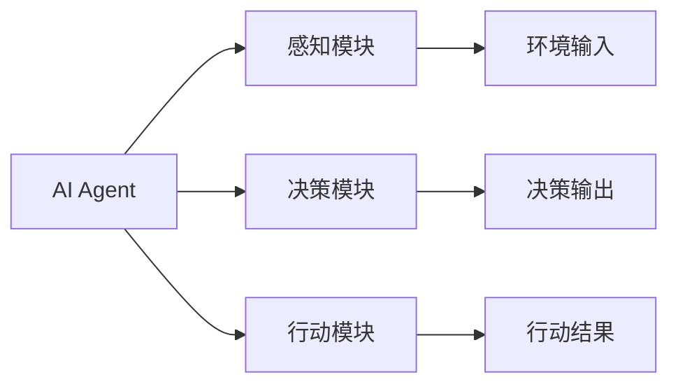
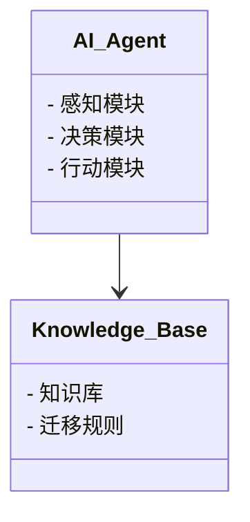
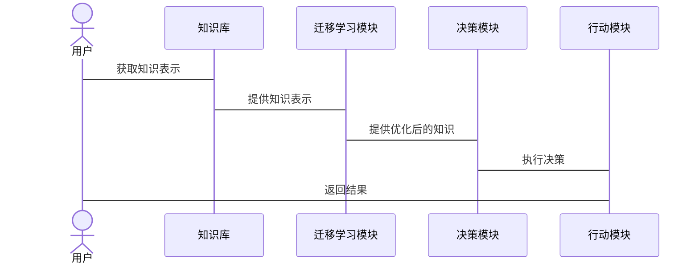

                 


# AI Agent的跨域知识迁移与整合

> 关键词：AI Agent，跨域知识迁移，知识整合，机器学习，智能体

> 摘要：AI Agent作为人工智能领域的核心概念，其跨域知识迁移与整合能力是实现复杂任务的关键。本文从AI Agent的基本概念出发，详细探讨了跨域知识迁移的核心原理、算法实现、系统架构设计以及实际应用案例。通过理论分析与实践结合，为读者提供了一套系统化的方法论，帮助更好地理解和应用AI Agent的跨域知识迁移技术。

---

## 第一部分: AI Agent的跨域知识迁移与整合基础

### 第1章: AI Agent的核心概念与背景

#### 1.1 AI Agent的基本概念
##### 1.1.1 AI Agent的定义与特点
AI Agent（人工智能代理）是指能够感知环境、自主决策并执行任务的智能实体。与传统程序不同，AI Agent具有以下特点：
- **自主性**：能够在没有外部干预的情况下独立运行。
- **反应性**：能够实时感知环境并做出响应。
- **目标导向性**：通过目标驱动行为，优化决策以实现目标。
- **学习能力**：能够通过经验改进自身的性能。

##### 1.1.2 AI Agent的分类与应用场景
AI Agent可以根据不同的标准进行分类，常见的分类方式包括：
1. **按智能级别**：
   - **反应式AI Agent**：基于当前感知做出反应，适用于实时任务。
   - **认知式AI Agent**：具备复杂推理和规划能力，适用于复杂场景。
2. **按应用场景**：
   - **服务机器人**：用于家庭服务、医疗辅助等领域。
   - **自动驾驶系统**：用于智能交通管理。
   - **智能推荐系统**：用于个性化推荐服务。

##### 1.1.3 跨域知识迁移的背景与意义
随着AI Agent应用场景的不断扩大，其面临的任务场景也日益复杂。跨域知识迁移的核心在于将一个领域中的知识和经验迁移到另一个领域，从而提升AI Agent的适应性和通用性。例如，在医疗领域学习到的诊断知识可以迁移到健康管理领域，实现跨领域的知识复用。

#### 1.2 跨域知识迁移的核心问题
##### 1.2.1 知识迁移的基本概念
知识迁移是指在不同领域或任务之间共享知识的过程。跨域知识迁移的核心挑战在于不同领域之间的语义差异和知识结构差异。

##### 1.2.2 跨域知识迁移的挑战与难点
- **语义鸿沟**：不同领域之间的语义差异可能导致知识无法直接迁移。
- **数据稀疏性**：某些领域可能缺乏足够的数据支持迁移。
- **模型泛化能力**：模型需要具备在不同领域之间灵活切换的能力。

##### 1.2.3 整合与迁移的边界与外延
跨域知识迁移的边界在于如何平衡领域特异性和通用性。外延则体现在通过知识图谱、迁移学习等技术实现跨领域知识的高效整合。

#### 1.3 跨域知识整合的重要性
##### 1.3.1 整合知识的必要性
AI Agent需要在不同领域之间协同工作，整合知识是实现这一目标的基础。

##### 1.3.2 整合知识的优势与价值
- **提升效率**：通过跨域知识整合，AI Agent可以在多个领域之间快速切换，提升任务效率。
- **增强适应性**：整合后的知识能够更好地适应复杂多变的环境。

##### 1.3.3 跨域整合的实现路径
- **知识表示**：通过知识图谱等技术实现知识的统一表示。
- **迁移学习**：利用迁移学习算法实现跨域知识的迁移。

#### 1.4 本章小结
本章从AI Agent的基本概念出发，探讨了跨域知识迁移的核心问题和整合的重要性，为后续章节的深入分析奠定了基础。

---

## 第二部分: AI Agent的核心概念与联系

### 第2章: AI Agent的核心原理

#### 2.1 AI Agent的感知与决策机制
##### 2.1.1 感知模块的原理与实现
感知模块是AI Agent与环境交互的关键部分，其主要功能是采集环境数据并进行初步处理。例如，通过摄像头、传感器等设备获取环境信息，并通过特征提取、数据清洗等技术进行处理。

##### 2.1.2 决策模块的算法与优化
决策模块负责根据感知到的信息做出决策。常见的决策算法包括基于规则的决策、基于逻辑推理的决策以及基于机器学习的决策。例如，使用强化学习算法（如Q-learning）优化决策策略。

##### 2.1.3 行动模块的执行策略
行动模块负责根据决策结果执行具体操作。例如，机器人根据决策指令调整手臂动作，完成抓取任务。

#### 2.2 跨域知识迁移的原理
##### 2.2.1 知识表示的多样性
知识表示是跨域迁移的核心问题之一。常用的表示方法包括符号表示（如知识图谱）和嵌入表示（如向量空间模型）。例如，使用Word2Vec将词语映射到向量空间。

##### 2.2.2 跨域迁移的策略与方法
跨域迁移的核心策略包括：
- **领域适应**：通过调整模型参数或优化特征表示，使模型适应目标领域。
- **共享表示**：通过共享特征空间实现跨域知识的迁移。

##### 2.2.3 知识整合的框架与模型
知识整合的框架通常包括以下几个步骤：
1. **知识表示**：将不同领域的知识表示为统一的形式。
2. **迁移学习**：通过迁移学习算法实现跨域知识的迁移。
3. **模型优化**：对模型进行调优，提升跨域迁移的性能。

#### 2.3 AI Agent的实体关系图


#### 2.4 跨域知识迁移的领域模型


#### 2.5 本章小结
本章详细探讨了AI Agent的核心原理，包括感知、决策和行动模块的实现，以及跨域知识迁移的策略与模型。

---

## 第三部分: 跨域知识迁移的算法原理

### 第3章: 跨域知识迁移的算法实现

#### 3.1 跨域知识迁移的数学模型
跨域知识迁移的数学模型通常可以表示为：
$$ P(y|x) = f_{\theta}(x) $$
其中，$y$ 是目标变量，$x$ 是输入特征，$f_{\theta}$ 是参数化的模型函数。

#### 3.2 跨域迁移学习算法
常用的跨域迁移学习算法包括：
1. **领域适配（Domain Adaptation）**：通过优化源域和目标域的特征分布，实现跨域迁移。
2. **多任务学习（Multi-Task Learning）**：通过同时学习多个任务，共享任务之间的知识。

#### 3.3 跨域知识整合的代码实现
以下是一个简单的跨域迁移学习代码示例：
```python
import torch
import torch.nn as nn

class DomainAdapter(nn.Module):
    def __init__(self, input_dim, hidden_dim):
        super(DomainAdapter, self).__init__()
        self.fc = nn.Linear(input_dim, hidden_dim)
        self.relu = nn.ReLU()
    
    def forward(self, x):
        return self.relu(self.fc(x))

# 初始化模型
adapter = DomainAdapter(input_dim=10, hidden_dim=5)

# 定义损失函数
criterion = nn.MSELoss()

# 定义优化器
optimizer = torch.optim.Adam(adapter.parameters(), lr=0.001)

# 假设输入数据
x = torch.randn(10, 10)
y = torch.randn(10, 5)

# 前向传播
outputs = adapter(x)
loss = criterion(outputs, y)

# 反向传播与优化
optimizer.zero_grad()
loss.backward()
optimizer.step()
```

#### 3.4 本章小结
本章通过数学模型和代码示例，详细讲解了跨域知识迁移的算法实现，为后续章节的系统设计奠定了基础。

---

## 第四部分: 系统分析与架构设计

### 第4章: 系统架构设计

#### 4.1 问题场景介绍
跨域知识迁移的系统通常需要处理以下问题：
- 多领域数据的融合与分析。
- 不同领域的知识表示与整合。

#### 4.2 系统功能设计
系统功能设计包括：
1. **知识表示与存储**：将不同领域的知识表示为统一的形式，并存储在知识库中。
2. **跨域迁移学习**：通过算法实现跨域知识的迁移与整合。
3. **动态适应**：根据环境变化动态调整知识表示和迁移策略。

#### 4.3 系统架构设计


#### 4.4 系统接口设计
系统接口设计包括：
- **知识库接口**：提供知识的读取和写入功能。
- **迁移学习接口**：提供跨域迁移学习的API。
- **决策接口**：提供决策模块的调用接口。

#### 4.5 系统交互流程


#### 4.6 本章小结
本章通过系统架构设计和交互流程图，详细描述了跨域知识迁移系统的实现方案。

---

## 第五部分: 项目实战

### 第5章: 项目实战

#### 5.1 环境安装
需要安装以下依赖：
```bash
pip install torch
pip install numpy
pip install matplotlib
```

#### 5.2 核心功能实现
以下是一个简单的跨域知识迁移项目实现：
```python
import torch
import torch.nn as nn

class MultiDomainModel(nn.Module):
    def __init__(self, input_dim, hidden_dim, output_dim):
        super(MultiDomainModel, self).__init__()
        self.fc = nn.Linear(input_dim, hidden_dim)
        self.relu = nn.ReLU()
        self.output = nn.Linear(hidden_dim, output_dim)
    
    def forward(self, x):
        x = self.relu(self.fc(x))
        return self.output(x)

# 初始化模型
model = MultiDomainModel(input_dim=20, hidden_dim=10, output_dim=5)

# 定义损失函数
criterion = nn.MSELoss()

# 定义优化器
optimizer = torch.optim.Adam(model.parameters(), lr=0.001)

# 假设输入数据
x = torch.randn(100, 20)
y = torch.randn(100, 5)

# 前向传播
outputs = model(x)
loss = criterion(outputs, y)

# 反向传播与优化
optimizer.zero_grad()
loss.backward()
optimizer.step()
```

#### 5.3 代码解读与分析
- **模型定义**：MultiDomainModel是一个多领域模型，通过共享参数实现跨域知识的迁移。
- **损失函数**：使用均方误差作为损失函数。
- **优化器**：使用Adam优化器进行参数优化。

#### 5.4 案例分析与详细解读
以图像分类任务为例，假设需要在不同数据集之间进行知识迁移。通过迁移学习算法，可以将源数据集的知识迁移到目标数据集，提升模型的泛化能力。

#### 5.5 本章小结
本章通过实际项目案例，详细讲解了跨域知识迁移的实现过程，帮助读者更好地理解和应用相关技术。

---

## 第六部分: 总结与展望

### 第6章: 总结与展望

#### 6.1 最佳实践
- **选择合适的知识表示方法**：根据具体任务选择适合的知识表示方法。
- **优化迁移学习算法**：通过调整模型参数和优化算法提升迁移效果。
- **动态适应环境变化**：根据环境变化动态调整知识表示和迁移策略。

#### 6.2 本章小结
本章总结了全文的主要内容，并展望了跨域知识迁移技术的未来发展。

#### 6.3 注意事项
- **数据质量**：确保数据的准确性和完整性。
- **模型泛化能力**：注重模型的泛化能力，避免过拟合。

#### 6.4 拓展阅读
- **《迁移学习》**：深入探讨迁移学习的理论与方法。
- **《知识图谱》**：学习知识图谱的构建与应用。

---

## 作者

作者：AI天才研究院/AI Genius Institute & 禅与计算机程序设计艺术 /Zen And The Art of Computer Programming

---

通过以上目录结构，文章内容将按照逻辑清晰、结构紧凑的方式展开，结合理论与实践，深入剖析AI Agent的跨域知识迁移与整合的核心原理、算法实现和实际应用，帮助读者全面理解和掌握这一技术。

