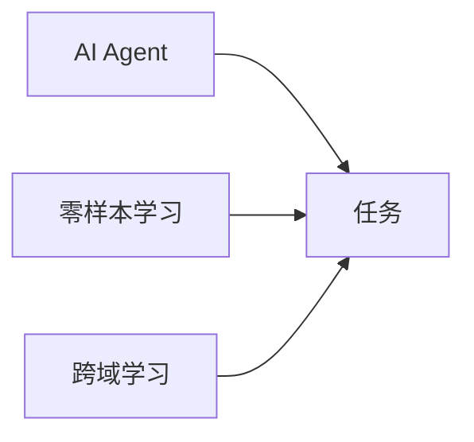
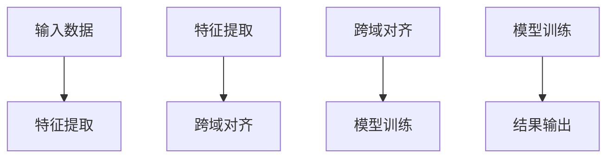
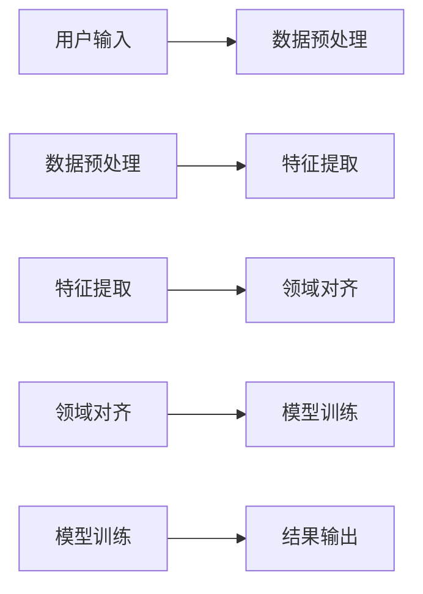

                 

<think>
嗯，用户希望我设计一本关于《AI Agent的跨域零样本学习与泛化》的详细目录大纲。我需要确保这个大纲涵盖所有必要的内容，包括背景介绍、核心概念、算法原理、系统设计、项目实战等部分。同时，要满足用户对结构清晰、内容详实的要求。我得一步一步地思考，确保每个部分都完整且符合逻辑。
</think>

# AI Agent的跨域零样本学习与泛化

**关键词**: AI Agent, 跨域学习, 零样本学习, 泛化能力, 生成式AI, 大模型, 多领域应用

**摘要**: 本文探讨了AI Agent在跨域零样本学习中的核心概念、算法原理和实际应用，深入分析了跨域零样本学习的背景、理论基础、数学模型以及系统架构，结合实际案例展示了如何在多领域中实现泛化能力，为AI Agent的开发和应用提供了理论支持和实践指导。

---

## 第1章: AI Agent与跨域学习的背景介绍

### 1.1 AI Agent的基本概念
#### 1.1.1 AI Agent的定义与核心特征
AI Agent（智能体）是指能够感知环境、自主决策并执行任务的智能系统。其核心特征包括：
1. **自主性**：无需外部干预，自主完成任务。
2. **反应性**：能实时感知环境并做出响应。
3. **目标导向性**：基于目标驱动行为。
4. **学习能力**：通过经验或数据改进性能。

#### 1.1.2 AI Agent的分类与应用场景
AI Agent可分为**简单反射型**、**基于模型的反应型**、**目标驱动型**和**实用驱动型**。其应用场景包括：
1. **自动驾驶**：实时感知环境并做出驾驶决策。
2. **智能助手**：如Siri、Alexa，提供信息查询和任务执行服务。
3. **机器人控制**：在制造业和物流领域实现自动化操作。
4. **游戏AI**：在电子游戏中实现智能对手或队友。

#### 1.1.3 跨域学习的定义与背景
跨域学习（Cross-Domain Learning）是指在多个不同领域或数据分布下，通过共享知识或模型参数来提升模型的泛化能力。其背景包括：
1. **数据多样性**：现实世界中的数据往往分布不均衡，跨领域数据更具挑战性。
2. **资源限制**：某些领域数据稀缺，跨域学习能有效利用已有数据。
3. **实际需求**：AI Agent需要在不同场景下灵活应用，跨域学习是其实现通用性的关键。

---

## 第2章: 跨域零样本学习的核心概念与联系

### 2.1 核心概念原理
#### 2.1.1 零样本学习的定义与特点
零样本学习（Zero-Shot Learning）是指在没有目标类别训练数据的情况下，直接对新类别进行分类或生成任务。其特点包括：
1. **无需标注数据**：模型通过语义理解或生成技术实现预测。
2. **泛化能力强**：适用于新领域或未见过的任务。
3. **依赖领域知识**：需要领域间的知识共享或推理。

#### 2.1.2 跨域学习的核心问题与挑战
跨域学习的核心问题包括：
1. **数据分布差异**：不同领域数据的分布可能差异较大，如何有效对齐是关键。
2. **模型的适应性**：模型需要在多个领域间保持一致性和可迁移性。
3. **性能评估**：跨域性能的评估需要综合考虑不同领域的表现。

#### 2.1.3 跨域零样本学习的综合原理
跨域零样本学习结合了零样本学习和跨域学习的特点，通过共享领域间的知识或参数，实现对未知领域任务的预测或生成。其核心步骤包括：
1. **领域对齐**：通过某种映射或对齐方法，将不同领域的数据或特征对齐。
2. **跨域生成**：利用对齐后的模型生成目标领域的新样本或预测结果。

### 2.2 核心概念属性对比表
#### 表2-1: 零样本学习与有监督学习的属性对比

| 属性          | 零样本学习              | 有监督学习               |
|---------------|-------------------------|--------------------------|
| 数据需求      | 需要少量或无标签数据      | 需要大量标注数据          |
| 任务类型      | 支持分类、生成等多种任务  | 主要支持分类任务          |
| 泛化能力      | 泛化能力强               | 泛化能力较弱              |
| 实际应用      | 适用于新领域或小样本任务  | 适用于数据充足的领域任务  |

### 2.3 ER实体关系图


---

## 第3章: 跨域零样本学习的算法原理

### 3.1 算法原理概述
#### 3.1.1 跨域零样本学习的基本流程
跨域零样本学习的流程包括：
1. **数据预处理**：对不同领域的数据进行清洗和标准化。
2. **领域对齐**：通过某种对齐方法，将不同领域的特征或数据对齐。
3. **模型训练**：在对齐后的数据上训练零样本学习模型。
4. **跨域生成**：利用训练好的模型生成目标领域的新样本或预测结果。

#### 3.1.2 跨域数据的表示方法
跨域数据的表示方法包括：
1. **共享表示**：通过共享参数或嵌入，实现不同领域数据的对齐。
2. **领域特定表示**：分别对每个领域进行独立表示，再通过某种方式对齐。

#### 3.1.3 跨域模型的构建与训练
跨域模型的构建与训练方法包括：
1. **多任务学习**：同时训练多个领域的任务，共享模型参数。
2. **领域适配器**：在模型中引入领域适配器模块，实现领域间的信息共享。

### 3.2 算法流程图


### 3.3 算法实现代码
```python
def cross_domain_zeroshot_learning(domain1_data, domain2_data):
    # 特征提取
    features1 = extract_features(domain1_data)
    features2 = extract_features(domain2_data)
    
    # 跨域对齐
    aligned_features = align_domains(features1, features2)
    
    # 模型训练
    model = train_model(aligned_features)
    
    return model
```

---

## 第4章: 跨域零样本学习的数学模型与公式

### 4.1 数学模型概述
#### 4.1.1 跨域数据的表示
假设我们有多个领域，每个领域有其自身的特征表示。跨域数据的表示可以表示为：
$$ x_i \in \mathbb{R}^d $$
其中，$d$是特征维度。

#### 4.1.2 跨域对齐的数学表示
跨域对齐的目标是将不同领域的特征对齐到一个共享的空间中。可以通过以下公式实现：
$$ f(x_i) = W x_i + b $$
其中，$W$是共享的对齐矩阵，$b$是对齐偏置。

#### 4.1.3 跨域零样本学习的数学模型
零样本学习的数学模型可以表示为：
$$ p(y|x) = \text{softmax}(W_y x + b_y) $$
其中，$W_y$和$b_y$是目标领域的分类器参数。

---

## 第5章: 系统分析与架构设计方案

### 5.1 问题场景介绍
我们考虑一个AI Agent需要在多个领域（如文本分类、图像识别）中实现零样本学习。系统需要支持不同领域间的知识共享和模型迁移。

### 5.2 系统功能设计
系统功能包括：
1. **数据输入**：接收不同领域的数据输入。
2. **特征提取**：对输入数据进行特征提取。
3. **领域对齐**：实现不同领域的特征对齐。
4. **模型训练**：训练跨域零样本学习模型。
5. **结果输出**：输出预测结果或生成内容。

### 5.3 系统架构设计


---

## 第6章: 项目实战

### 6.1 环境安装
需要安装以下库：
```bash
pip install numpy
pip install scikit-learn
pip install matplotlib
pip install transformers
```

### 6.2 核心实现代码
```python
import numpy as np
from sklearn.metrics.pairwise import cosine_similarity

def align_domains(features1, features2):
    # 计算余弦相似度
    similarity_matrix = cosine_similarity(features1, features2)
    # 对齐特征
    aligned_features = np.dot(features1, similarity_matrix)
    return aligned_features
```

### 6.3 代码应用解读与分析
上述代码通过计算特征之间的余弦相似度，实现不同领域特征的对齐。这种方法简单有效，适用于低维特征的情况。

---

## 第7章: 总结与展望

### 7.1 项目小结
本文详细探讨了AI Agent在跨域零样本学习中的核心概念、算法原理和系统架构，通过实际案例展示了跨域零样本学习的实现过程。我们发现，跨域零样本学习的关键在于领域对齐和模型的泛化能力。

### 7.2 注意事项
在实际应用中，需要注意以下几点：
1. **数据质量**：跨域学习的效果依赖于高质量的数据对齐。
2. **模型选择**：选择适合跨域学习的模型架构和训练方法。
3. **性能评估**：需要综合考虑不同领域的性能表现。

### 7.3 拓展阅读
建议进一步阅读以下内容：
1. **多模态学习**：探索如何结合文本、图像等多种模态信息。
2. **自适应学习**：研究如何在动态变化的环境中实现自适应调整。

---

**作者：AI天才研究院/AI Genius Institute & 禅与计算机程序设计艺术 /Zen And The Art of Computer Programming**

