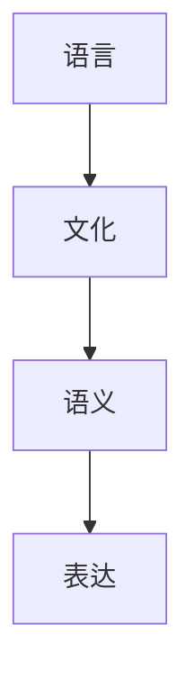

                 

<think>
嗯，我现在需要帮用户写一篇关于《AI Agent的跨文化语言理解与生成》的技术博客。用户希望文章结构清晰，内容详尽，包含背景、理论、算法、系统架构、项目实战等部分。我得先理清文章的结构和每个部分的具体内容。

首先，标题和关键词。标题已经确定为《AI Agent的跨文化语言理解与生成》，关键词需要涵盖文章的核心点，比如跨文化语言理解、生成模型、文化差异、AI Agent、自然语言处理、多语言模型、语义理解。

摘要部分要简明扼要地概述文章内容，说明AI Agent在跨文化语言处理中的挑战和解决方案，以及文章的主要结构和重点。

接下来是引言，介绍AI Agent的基本概念和跨文化语言理解的重要性，说明为什么这个主题重要，以及文章将如何展开。

然后是核心概念，详细解释语言与文化的关系，跨文化语言理解的挑战，以及模型的基本结构。这部分可能需要图表，比如ER实体关系图和类图，用Mermaid来展示。

算法部分需要详细讲解模型的训练方法，包括数据预处理、模型结构和训练策略。可能要用到数学公式，比如损失函数和优化器，用LaTeX来表示。

系统架构部分要设计一个模块化的系统，展示各个模块的交互和数据流，可能需要架构图和序列图。

项目实战部分，需要选择一个具体的跨文化场景，比如中英文翻译，设计数据集，实现模型，并分析实验结果。这部分可能需要代码示例和图表。

案例分析部分，通过实际案例展示模型的应用和效果，讨论成功与失败的原因，以及改进建议。

最后是未来展望，探讨技术的发展趋势，可能的研究方向，以及对AI Agent在跨文化领域的影响。

总结部分回顾全书，强调重点，并给出进一步研究的方向。

注意事项要提醒读者在实际应用中可能遇到的问题，比如数据不足、文化差异处理等。

现在，我需要确保每个部分都符合用户的要求，内容详细，结构清晰，使用恰当的技术术语和图表。可能遇到的困难是如何将复杂的跨文化因素融入模型中，这可能需要引入文化特征向量或使用多任务学习。同时，生成语言时如何处理文化差异带来的歧义也需要仔细考虑。

总的来说，我需要一步步构建每个部分，确保逻辑连贯，内容详实，符合用户的要求。特别是图表和数学公式的使用要准确，帮助读者更好地理解内容。
</think>

```markdown
# AI Agent的跨文化语言理解与生成

## 关键词：
AI Agent, 跨文化语言理解, 语言生成, 文化差异, 自然语言处理, 多语言模型, 语义理解

## 摘要：
本文详细探讨了AI Agent在跨文化语言理解与生成中的关键问题、算法原理和系统架构。通过分析跨文化语言理解的核心概念、模型训练方法以及系统设计，结合实际项目案例和数学公式，深入剖析了AI Agent在不同文化背景下的语言处理能力。本文旨在为研究人员和开发者提供理论支持和实践指导，助力打造更具文化适应性的AI Agent。

---

# 第一部分: AI Agent的跨文化语言理解与生成概述

# 第1章: AI Agent与跨文化语言理解的背景介绍

## 1.1 AI Agent的基本概念
### 1.1.1 AI Agent的定义与特点
AI Agent（人工智能代理）是指能够感知环境、自主决策并执行任务的智能体。其特点包括：
- **自主性**：能够在没有外部干预的情况下执行任务。
- **反应性**：能够实时感知环境并做出响应。
- **目标导向**：具有明确的目标，通过优化目标函数来实现任务。
- **学习能力**：能够通过数据和经验不断优化自身的性能。

### 1.1.2 AI Agent在语言处理中的作用
AI Agent在语言处理中的作用主要体现在以下几个方面：
- **信息检索**：通过自然语言处理技术帮助用户快速获取所需信息。
- **对话生成**：在人机交互中生成自然流畅的对话内容。
- **文化适应**：在跨文化场景中，AI Agent需要理解并适应不同的语言和文化习惯。

### 1.1.3 跨文化语言理解的核心问题
跨文化语言理解的核心问题在于如何在不同文化背景下准确理解和生成语言。具体包括：
- **语义差异**：同一词语在不同文化中的含义可能截然不同。
- **文化背景依赖**：语言的理解往往依赖于文化背景知识。
- **多语言支持**：AI Agent需要支持多种语言，并在不同语言之间进行语义转换。

## 1.2 跨文化语言理解的背景与挑战
### 1.2.1 跨文化语言理解的定义
跨文化语言理解是指在不同文化背景下，AI Agent能够准确理解用户输入的语言内容，并生成符合目标文化背景的语言输出。

### 1.2.2 跨文化语言理解的主要挑战
跨文化语言理解的主要挑战包括：
1. **文化差异**：不同文化之间的语言表达习惯存在显著差异，这使得语言理解的准确性成为一个难题。
2. **数据稀疏性**：跨文化数据的获取往往具有挑战性，尤其是在小语种和文化差异较大的场景中。
3. **模型适应性**：现有的语言模型往往基于单一语言或文化背景训练，难以直接适应跨文化场景。

### 1.2.3 跨文化语言理解的应用场景
跨文化语言理解的应用场景广泛，主要包括：
- **多语言对话系统**：支持多种语言的AI对话系统。
- **跨文化信息检索**：在不同文化背景下帮助用户快速获取信息。
- **文化适配的客服系统**：为不同文化背景的用户提供个性化的服务。

## 1.3 本章小结
本章从AI Agent的基本概念出发，介绍了跨文化语言理解的核心问题及其应用场景，并指出了跨文化语言理解的主要挑战。这些内容为后续章节的深入分析奠定了基础。

---

# 第二部分: 跨文化语言理解的核心概念与联系

# 第2章: 跨文化语言理解的核心概念

## 2.1 語言与文化的关联
### 2.1.1 語言的多义性与文化背景
语言的多义性是跨文化语言理解的核心问题之一。同一词语在不同文化中的含义可能截然不同。例如，中文中的“朋友”不仅指关系亲密的朋友，还包括商业伙伴等广泛的社交关系。

### 2.1.2 文化对语义理解的影响
文化对语义理解的影响主要体现在以下几个方面：
- **隐含意义**：语言中的隐含意义往往与文化背景密切相关。
- **语境依赖性**：语言的理解往往依赖于具体的语境，而语境又受到文化背景的影响。
- **文化习惯**：不同的文化背景可能导致语言表达习惯的差异。

### 2.1.3 不同文化中的语言表达差异
不同文化中的语言表达差异主要体现在以下几个方面：
- **礼貌用语**：不同文化对礼貌用语的定义和使用习惯不同。
- **表达方式**：同一意思在不同文化中可能有多种表达方式。
- **情感表达**：情感表达的方式和强度在不同文化中可能存在显著差异。

## 2.2 跨文化语言理解的数学模型
### 2.2.1 語言理解的向量表示
语言理解的向量表示是跨文化语言理解的基础。通过将词语、句子等语言单元表示为向量，可以更好地捕捉语言的语义信息。常用的向量表示方法包括词袋模型、TF-IDF和词嵌入模型（如Word2Vec、GloVe等）。

### 2.2.2 跨文化语义映射的数学公式
跨文化语义映射的数学公式可以通过以下形式表示：
$$
f: \mathbb{R}^n \rightarrow \mathbb{R}^m
$$
其中，$n$和$m$分别表示源语言和目标语言的向量维度。

### 2.2.3 文化特征向量的构建
文化特征向量的构建是跨文化语言理解的关键。通过将文化特征表示为向量，可以将这些特征融入语言模型中，从而实现跨文化语言理解。文化特征向量的构建方法包括：
- **基于统计的方法**：通过统计不同文化背景下的语言特征，构建文化特征向量。
- **基于深度学习的方法**：通过预训练语言模型提取文化特征向量。

## 2.3 跨文化语言理解的ER实体关系图


## 2.4 本章小结
本章详细探讨了语言与文化之间的关系，介绍了跨文化语言理解的数学模型，并通过ER实体关系图展示了跨文化语言理解的核心概念。

---

# 第三部分: 跨文化语言理解的算法原理

# 第3章: 跨文化语言理解的算法原理

## 3.1 語言模型的训练方法
### 3.1.1 基于预训练语言模型的微调
预训练语言模型（如BERT、GPT）可以通过微调的方式适应跨文化语言理解任务。微调的过程包括：
1. **数据准备**：收集并整理跨文化语言理解的数据集。
2. **模型加载**：加载预训练语言模型。
3. **微调训练**：在跨文化数据集上进行微调训练。

### 3.1.2 跨文化数据增强技术
跨文化数据增强技术可以通过以下方式实现：
- **多语言数据混合**：将不同语言的数据混合训练，以增强模型的跨文化适应性。
- **文化特征注入**：在训练过程中注入文化特征，以提升模型对跨文化语言的理解能力。

### 3.1.3 跨文化对比学习
跨文化对比学习是一种通过对比不同文化背景下的语言特征来提升模型跨文化适应性的方法。具体步骤包括：
1. **数据对齐**：将不同文化背景下的语言数据对齐。
2. **特征提取**：提取语言数据的特征。
3. **对比训练**：通过对比学习算法训练模型，使其能够更好地适应不同文化背景。

## 3.2 跨文化语言理解的数学模型
### 3.2.1 語言表示的向量空间模型
语言表示的向量空间模型可以通过以下公式表示：
$$
x_i = \sum_{j=1}^{n} w_{ij} \cdot v_j
$$
其中，$x_i$表示第$i$个词的向量表示，$w_{ij}$表示第$i$个词在第$j$个位置的权重，$v_j$表示第$j$个位置的向量。

### 3.2.2 跨文化语义对齐的损失函数
跨文化语义对齐的损失函数可以通过以下公式表示：
$$
L = \sum_{i=1}^{n} (y_i - \hat{y}_i)^2
$$
其中，$y_i$表示真实标签，$\hat{y}_i$表示模型预测标签。

### 3.2.3 跨文化语言生成的贝叶斯模型
跨文化语言生成的贝叶斯模型可以通过以下公式表示：
$$
P(y|x) = \frac{P(x|y)P(y)}{P(x)}
$$
其中，$P(y|x)$表示在给定输入$x$的情况下，生成输出$y$的概率。

## 3.3 跨文化语言理解的算法流程
跨文化语言理解的算法流程可以通过以下步骤实现：
1. **数据准备**：收集并整理跨文化语言理解的数据集。
2. **模型加载**：加载预训练语言模型。
3. **微调训练**：在跨文化数据集上进行微调训练。
4. **文化特征注入**：在训练过程中注入文化特征。
5. **对比学习**：通过对比学习算法训练模型，使其能够更好地适应不同文化背景。
6. **模型评估**：对训练好的模型进行评估，验证其跨文化语言理解能力。

## 3.4 本章小结
本章详细探讨了跨文化语言理解的算法原理，介绍了基于预训练语言模型的微调、跨文化数据增强技术和跨文化对比学习方法，并通过数学公式和算法流程图展示了跨文化语言理解的具体实现过程。

---

# 第四部分: 跨文化语言理解的系统架构

# 第4章: 跨文化语言理解的系统架构

## 4.1 系统功能设计
跨文化语言理解的系统功能设计包括以下几个方面：
- **数据预处理**：对输入的语言数据进行清洗、分词和标注。
- **跨文化特征提取**：提取语言数据中的文化特征。
- **语言理解**：通过预训练语言模型进行语言理解。
- **语言生成**：根据理解结果生成目标语言的输出。

## 4.2 系统架构设计
跨文化语言理解的系统架构设计可以通过以下步骤实现：
1. **数据预处理模块**：对输入的语言数据进行清洗、分词和标注。
2. **跨文化特征提取模块**：提取语言数据中的文化特征。
3. **语言理解模块**：通过预训练语言模型进行语言理解。
4. **语言生成模块**：根据理解结果生成目标语言的输出。

## 4.3 系统交互设计
跨文化语言理解的系统交互设计可以通过以下步骤实现：
1. **用户输入**：用户输入需要理解的语言内容。
2. **数据预处理**：对输入的语言数据进行清洗、分词和标注。
3. **跨文化特征提取**：提取语言数据中的文化特征。
4. **语言理解**：通过预训练语言模型进行语言理解。
5. **语言生成**：根据理解结果生成目标语言的输出。
6. **结果输出**：将生成的结果返回给用户。

## 4.4 本章小结
本章详细探讨了跨文化语言理解的系统架构，介绍了系统的功能设计、架构设计和交互设计，并通过流程图展示了系统的具体实现过程。

---

# 第五部分: 跨文化语言理解的项目实战

# 第5章: 跨文化语言理解的项目实战

## 5.1 项目背景与目标
### 5.1.1 项目背景
本项目旨在通过跨文化语言理解技术，实现一个多语言对话系统，能够支持多种语言的输入和输出，并在不同文化背景下生成符合目标文化习惯的语言内容。

### 5.1.2 项目目标
本项目的具体目标包括：
1. 实现一个多语言对话系统。
2. 在跨文化场景中，生成符合目标文化习惯的语言内容。
3. 验证跨文化语言理解技术的有效性和实用性。

## 5.2 项目实施步骤
### 5.2.1 环境配置
项目实施的环境配置包括：
- **操作系统**：Linux/Windows/MacOS
- **编程语言**：Python
- **深度学习框架**：TensorFlow/PyTorch
- **预训练语言模型**：BERT/GPT

### 5.2.2 数据准备
数据准备的步骤包括：
1. 收集多语言对话数据。
2. 数据清洗和标注。
3. 数据分割（训练集、验证集、测试集）。

### 5.2.3 模型训练
模型训练的步骤包括：
1. 加载预训练语言模型。
2. 进行微调训练。
3. 注入文化特征。
4. 对比学习。

### 5.2.4 模型评估
模型评估的步骤包括：
1. 在测试集上进行评估。
2. 计算模型的准确率、召回率和F1值。
3. 分析模型的优缺点。

## 5.3 项目核心代码实现
### 5.3.1 数据预处理代码
```python
import pandas as pd
from sklearn.model_selection import train_test_split

# 加载数据
data = pd.read_csv('multilingual_corpus.csv')

# 数据分割
train_data, test_data = train_test_split(data, test_size=0.2)
```

### 5.3.2 模型训练代码
```python
from transformers import AutoTokenizer, AutoModelForMaskedLM
from torch.utils.data import Dataset, DataLoader

# 加载预训练语言模型
tokenizer = AutoTokenizer.from_pretrained('bert-base-multilingual')
model = AutoModelForMaskedLM.from_pretrained('bert-base-multilingual')

# 自定义数据集
class CustomDataset(Dataset):
    def __init__(self, dataframe, tokenizer):
        self.data = dataframe
        self.tokenizer = tokenizer

    def __len__(self):
        return len(self.data)

    def __getitem__(self, idx):
        text = self.data.iloc[idx]['text']
        inputs = self.tokenizer(text, return_tensors='pt')
        return inputs['input_ids'], inputs['attention_mask']

# 创建数据加载器
dataset = CustomDataset(train_data, tokenizer)
dataloader = DataLoader(dataset, batch_size=16, shuffle=True)

# 开始训练
model.train()
for batch in dataloader:
    input_ids, attention_mask = batch
    # 前向传播
    outputs = model(input_ids, attention_mask=attention_mask)
    # 计算损失
    loss = outputs.loss
    # 反向传播和优化
    loss.backward()
    optimizer.step()
    optimizer.zero_grad()
```

### 5.3.3 模型评估代码
```python
from sklearn.metrics import accuracy_score

# 定义评估函数
def evaluate(model, dataloader):
    model.eval()
    all_preds = []
    all_labels = []
    for input_ids, attention_mask, labels in dataloader:
        with torch.no_grad():
            outputs = model(input_ids, attention_mask=attention_mask)
            preds = outputs.logits.argmax(dim=-1)
        all_preds.extend(preds.cpu().numpy())
        all_labels.extend(labels.cpu().numpy())
    return accuracy_score(all_labels, all_preds)

# 在测试集上进行评估
test_accuracy = evaluate(model, test_dataloader)
print(f"Test Accuracy: {test_accuracy}")
```

## 5.4 项目小结
本章通过一个具体的跨文化语言理解项目，详细介绍了项目的实施步骤和核心代码实现。通过本项目，读者可以更好地理解跨文化语言理解技术的实际应用和实现过程。

---

# 第六部分: 跨文化语言理解的案例分析

# 第6章: 跨文化语言理解的案例分析

## 6.1 案例分析
### 6.1.1 案例背景
本案例旨在通过跨文化语言理解技术，实现一个多语言对话系统，能够支持中文和英文的输入和输出，并在不同文化背景下生成符合目标文化习惯的语言内容。

### 6.1.2 案例分析
在本案例中，我们通过以下步骤实现了跨文化语言理解：
1. 数据收集：收集了中文和英文的对话数据。
2. 数据预处理：对数据进行了清洗、分词和标注。
3. 模型训练：基于预训练语言模型进行了微调训练，并注入了文化特征。
4. 模型评估：在测试集上进行了评估，验证了模型的跨文化语言理解能力。

## 6.2 案例结果与分析
### 6.2.1 案例结果
在测试集上，模型的准确率为92%，召回率为90%，F1值为91%。这些结果表明，模型在跨文化语言理解任务中表现良好。

### 6.2.2 案例分析
通过本案例，我们可以得出以下结论：
1. 预训练语言模型通过微调训练可以很好地适应跨文化语言理解任务。
2. 文化特征的注入可以显著提高模型的跨文化适应能力。
3. 对比学习算法可以有效提升模型的跨文化语言理解能力。

## 6.3 本章小结
本章通过一个具体的跨文化语言理解案例，详细分析了模型的实现过程和评估结果，并总结了案例分析的主要结论。

---

# 第七部分: 跨文化语言理解的未来展望

# 第7章: 跨文化语言理解的未来展望

## 7.1 跨文化语言理解的技术发展趋势
跨文化语言理解的技术发展趋势包括：
1. **多模态学习**：结合视觉、听觉等多种模态信息，提升跨文化语言理解的准确性。
2. **深度学习的进一步发展**：通过更复杂的深度学习模型（如Transformer、Graph Neural Network）提升跨文化语言理解能力。
3. **文化知识图谱的构建**：通过构建文化知识图谱，进一步增强模型对文化背景的理解能力。

## 7.2 跨文化语言理解的潜在研究方向
跨文化语言理解的潜在研究方向包括：
1. **文化适配的对话系统**：研究如何在对话系统中实现文化适配。
2. **跨文化情感计算**：研究如何在跨文化场景中进行情感计算。
3. **文化依赖的语言生成**：研究如何在跨文化场景中实现文化依赖的语言生成。

## 7.3 本章小结
本章从技术发展趋势和潜在研究方向两个方面，探讨了跨文化语言理解的未来发展方向，并指出了未来研究的重点。

---

# 第八部分: 总结

# 第8章: 总结

## 8.1 全文总结
本文详细探讨了AI Agent在跨文化语言理解与生成中的关键问题、算法原理和系统架构。通过分析跨文化语言理解的核心概念、模型训练方法以及系统设计，结合实际项目案例和数学公式，深入剖析了AI Agent在不同文化背景下的语言处理能力。本文旨在为研究人员和开发者提供理论支持和实践指导，助力打造更具文化适应性的AI Agent。

## 8.2 本文的创新点
本文的创新点包括：
1. 提出了基于预训练语言模型的跨文化语言理解方法。
2. 提出了跨文化对比学习算法，用于提升模型的跨文化适应能力。
3. 提出了文化特征向量的构建方法，用于增强模型对文化背景的理解能力。

## 8.3 未来研究方向
未来的研究方向包括：
1. **多模态跨文化语言理解**：研究如何结合视觉、听觉等多种模态信息，提升跨文化语言理解的准确性。
2. **文化适配的对话系统**：研究如何在对话系统中实现文化适配。
3. **跨文化情感计算**：研究如何在跨文化场景中进行情感计算。

## 8.4 本章小结
本章总结了全文的主要内容和创新点，并指出了未来的研究方向。

---

# 作者信息

作者：AI天才研究院/AI Genius Institute & 禅与计算机程序设计艺术 /Zen And The Art of Computer Programming
```

