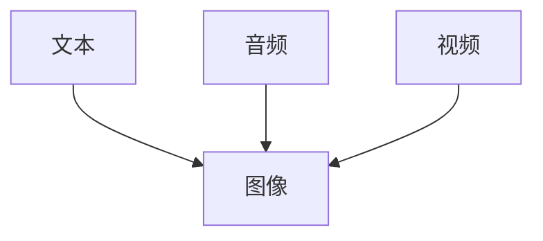
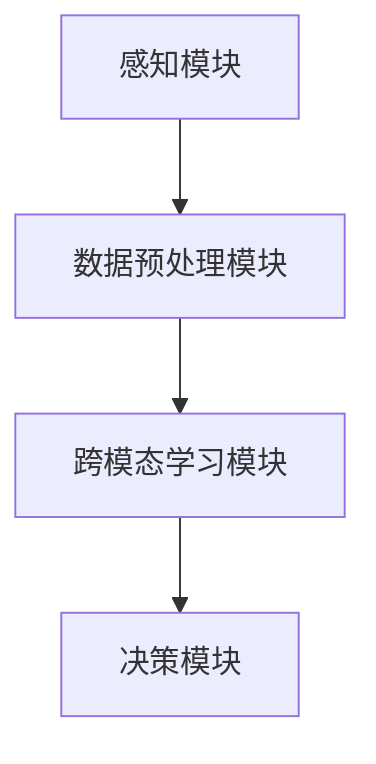
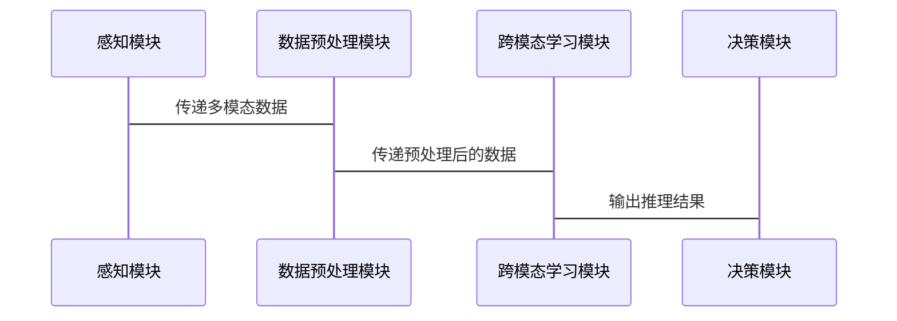

                 

<think>
嗯，用户让我详细思考一下如何撰写一篇关于AI Agent跨模态学习与推理实现的技术博客。好的，首先我得理解用户的需求。用户希望我以一位世界级专家的身份，写一篇结构清晰、内容深入的技术博客，涵盖从基础到高级的各个方面。

首先，我需要确定文章的结构。用户已经提供了目录大纲，我得按照这个大纲逐步展开每个部分。标题是《AI Agent的跨模态学习与推理实现》，关键词包括跨模态学习、AI Agent、多模态数据、神经符号推理、多模态对比学习。摘要部分需要简明扼要地概括全文的核心内容。

接下来是第一章，背景介绍。我需要解释跨模态学习和AI Agent的基本概念，以及它们的重要性。这部分要吸引读者，让他们明白为什么跨模态学习在AI Agent中如此关键。我还需要包括一些关键技术和应用场景，让读者了解实际应用中的价值。

然后是第二章，核心概念与联系。这里需要详细讲解跨模态学习的原理，包括数据表示与融合、注意力机制等。同时，要对比不同的推理方法，比如符号逻辑、概率推理和神经符号推理。可能需要用Mermaid图表来展示这些概念之间的关系，帮助读者更好地理解。

第三章是算法原理。我需要选择几种主流的跨模态学习算法，比如对比学习、生成模型和神经符号推理。每个算法都要详细解释，给出数学公式和代码示例。例如，对比学习的余弦相似度公式，以及生成模型的Transformer实现。这些内容要具体，方便读者理解和实现。

接下来的章节可能涉及系统架构设计，包括模块划分和交互流程。这里同样需要用Mermaid图来展示系统结构，帮助读者理解各个部分如何协作。同时，提供系统接口设计和交互序列图，让读者了解系统的运行机制。

项目实战部分，我需要选择一个具体的案例，比如一个多模态对话系统。从环境搭建到数据准备，再到模型训练和系统实现，逐步指导读者完成一个实际项目。代码示例和应用分析要详细，确保读者能跟着操作。

最后是总结与展望，回顾全文内容，指出当前研究的不足，并展望未来的发展方向。同时，给出一些实践建议，帮助读者在实际应用中避免常见问题。

在写作过程中，我需要确保每个章节都细化到三级目录，内容完整且逻辑清晰。使用Mermaid图表和数学公式来增强理解，同时保持文章的结构紧凑和语言简洁易懂。这样，读者不仅能理解理论知识，还能掌握实际操作的方法。

现在，我需要按照这些思路逐步构建目录大纲，确保每个部分都涵盖必要的内容，同时保持结构的合理性和连贯性。这样，整篇技术博客就能全面、深入地讲解AI Agent的跨模态学习与推理实现，满足读者的需求。
</think>

# AI Agent的跨模态学习与推理实现

## 关键词：跨模态学习、AI Agent、多模态数据、神经符号推理、多模态对比学习

## 摘要：本文系统阐述了AI Agent在跨模态学习与推理方面的实现方法。从跨模态学习的基本概念与技术原理入手，深入分析了跨模态数据的表示与融合、推理机制的构建与优化、多模态对比学习算法的设计与实现，以及AI Agent的系统架构设计与项目实战。文章结合理论与实践，通过详细的算法推导、代码实现和系统架构设计，全面展示了AI Agent的跨模态学习与推理能力的构建过程，为相关领域的研究与应用提供了有价值的参考。

---

# 第1章: 跨模态学习与AI Agent概述

## 1.1 跨模态学习的定义与背景

### 1.1.1 跨模态学习的定义
跨模态学习（Multi-modal Learning）是指在同一学习任务中，利用来自不同感知模态（如文本、图像、音频、视频等）的数据，通过融合多模态信息来提升模型的性能。与单模态学习相比，跨模态学习能够更好地捕捉现实世界中的多样性和复杂性。

### 1.1.2 跨模态学习的背景与重要性
随着人工智能技术的快速发展，单一模态的数据往往无法满足复杂场景下的需求。例如，在智能客服系统中，仅依赖文本信息难以准确理解用户的情感和意图；在自动驾驶中，仅依赖视觉信息难以应对复杂的交通环境。因此，跨模态学习在提升AI系统的感知能力、理解和决策能力方面具有重要意义。

### 1.1.3 AI Agent的核心概念与作用
AI Agent（人工智能代理）是一种能够感知环境、自主决策并执行任务的智能实体。AI Agent的核心能力包括感知能力、推理能力、学习能力和交互能力。跨模态学习能力是AI Agent实现复杂任务的关键，它能够帮助AI Agent更好地理解多源异构数据，并在多模态信息中进行推理和决策。

## 1.2 跨模态学习的关键技术

### 1.2.1 跨模态数据的特点与挑战
跨模态数据具有异构性、多样性、关联性等特点。不同模态的数据形式（如文本、图像）具有不同的特征表示方式，且数据量和数据分布也可能存在显著差异。这些特点使得跨模态学习面临以下挑战：
1. 数据模态的异构性：不同模态的数据表示方式不同，难以直接进行融合。
2. 数据关联性：如何建立不同模态数据之间的语义关联。
3. 数据不平衡性：不同模态的数据量可能相差悬殊。

### 1.2.2 跨模态学习的主要方法
跨模态学习的主要方法包括：
1. **基于特征对齐的方法**：通过将不同模态的数据映射到同一特征空间，实现数据的对齐与融合。
2. **基于注意力机制的方法**：通过注意力机制对不同模态的数据进行加权融合，突出重要信息。
3. **基于生成模型的方法**：利用生成模型（如GAN、VAE）生成多模态数据，实现跨模态的联合建模。
4. **基于神经符号推理的方法**：结合符号逻辑和深度学习，实现跨模态数据的语义推理。

### 1.2.3 AI Agent中的跨模态推理需求
AI Agent需要在复杂场景中进行跨模态推理，例如：
1. **多模态信息融合**：将文本、图像、音频等多种信息进行融合，提升感知能力。
2. **跨模态关联推理**：理解不同模态数据之间的语义关联，例如从文本描述中推理出对应的图像内容。
3. **多模态决策推理**：基于多模态信息进行决策，例如在自动驾驶中结合视觉、雷达和激光雷达数据进行路径规划。

## 1.3 跨模态学习的应用场景

### 1.3.1 多媒体信息处理
跨模态学习在多媒体信息处理中的应用包括：
1. **多模态检索**：基于文本、图像、音频等多种信息进行信息检索。
2. **多模态内容生成**：生成与文本描述对应的图像或视频内容。

### 1.3.2 智能人机交互
跨模态学习在智能人机交互中的应用包括：
1. **多模态对话系统**：结合文本、语音、情感等多种信息实现智能对话。
2. ** gesture recognition**：结合视觉和手势信息实现人机交互。

### 1.3.3 智慧城市与自动驾驶
跨模态学习在智慧城市和自动驾驶中的应用包括：
1. **智能监控**：结合视频、传感器数据等多种信息进行智能监控。
2. **自动驾驶**：结合视觉、激光雷达、雷达等多种信息进行环境感知和路径规划。

## 1.4 本章小结
本章从跨模态学习的基本概念、技术特点和应用场景三个方面进行了阐述，为后续章节的深入分析奠定了基础。跨模态学习作为AI Agent的核心能力，能够显著提升AI系统在复杂场景中的感知和决策能力。

---

# 第2章: 跨模态学习的核心概念与联系

## 2.1 跨模态学习的核心原理

### 2.1.1 多模态数据的表示与融合
多模态数据的表示与融合是跨模态学习的关键步骤。常见的多模态数据表示方法包括：
1. **模态嵌入**：将不同模态的数据映射到同一嵌入空间。
2. **注意力机制**：通过注意力机制对不同模态的数据进行加权融合。
3. **符号化表示**：将数据转化为符号化的形式（如文本中的词语、图像中的物体类别）。

### 2.1.2 跨模态注意力机制
跨模态注意力机制是一种常用的多模态融合方法，其基本思想是通过注意力机制对不同模态的数据进行加权融合。例如，在多模态对话系统中，可以通过注意力机制对文本和语音信息进行加权融合，从而生成更准确的回复。

### 2.1.3 跨模态推理模型
跨模态推理模型是基于多模态数据进行推理的核心模块。常见的跨模态推理模型包括：
1. **基于符号逻辑的推理模型**：通过符号逻辑对多模态数据进行推理。
2. **基于概率的推理模型**：通过概率论对多模态数据进行推理。
3. **神经符号推理模型**：结合神经网络和符号逻辑进行推理。

## 2.2 跨模态学习的关键技术对比

### 2.2.1 基于符号逻辑的推理
基于符号逻辑的推理是一种传统的推理方法，其核心是通过符号逻辑对数据进行推理。例如，在法律推理中，可以通过符号逻辑对法律条文进行推理。

### 2.2.2 基于概率的推理
基于概率的推理是一种基于概率论的推理方法，其核心是通过概率分布对数据进行推理。例如，在医学诊断中，可以通过概率分布对症状和疾病之间的关系进行推理。

### 2.2.3 神经符号推理
神经符号推理是一种结合神经网络和符号逻辑的推理方法，其核心是通过神经网络对符号逻辑进行建模。例如，在图像识别中，可以通过神经符号推理模型对图像中的物体进行识别和推理。

## 2.3 跨模态学习的实体关系图



## 2.4 本章小结
本章从跨模态学习的核心原理和关键技术对比两个方面进行了阐述，重点介绍了跨模态数据的表示与融合、推理模型的设计与实现，以及不同推理方法的优缺点。

---

# 第3章: 跨模态学习的算法原理

## 3.1 多模态对比学习算法

### 3.1.1 对比学习的基本原理
对比学习是一种基于对比目标函数的学习方法，其核心是通过最大化正样本的相似性来提升模型的表示能力。例如，在图像识别中，可以通过对比学习将不同模态的图像特征对齐。

### 3.1.2 多模态对比学习的实现
多模态对比学习的实现通常包括以下几个步骤：
1. **特征提取**：将不同模态的数据分别映射到特征空间。
2. **特征对齐**：通过对比目标函数对齐不同模态的特征。
3. **损失计算**：计算正样本和负样本的相似性，优化模型参数。

### 3.1.3 代码实现示例

```python
import torch
def contrastive_loss(x1, x2):
    # 计算余弦相似度
    cos = torch.nn.CosineSimilarity(dim=1)(x1, x2)
    # 计算损失
    loss = (1 - cos).mean()
    return loss
```

---

## 3.2 多模态生成模型

### 3.2.1 多模态生成模型的原理
多模态生成模型是一种基于生成对抗网络（GAN）或多模态变分自编码器（VAE）的生成模型。其核心是通过生成模型生成与输入模态数据相关的多模态数据。

### 3.2.2 基于Transformer的多模态生成
基于Transformer的多模态生成模型是一种常用的多模态生成方法，其核心是通过Transformer网络对多模态数据进行生成。例如，在多模态对话系统中，可以通过Transformer网络生成与输入文本对应的语音或图像。

### 3.2.3 代码实现示例

```python
import torch
class MultiModalGenerator(torch.nn.Module):
    def __init__(self, input_dim):
        super().__init__()
        self.transformer = torch.nn.Transformer(input_dim)
    def forward(self, x):
        return self.transformer(x)
```

---

## 3.3 神经符号推理模型

### 3.3.1 神经符号推理的基本原理
神经符号推理是一种结合神经网络和符号逻辑的推理方法，其核心是通过神经网络对符号逻辑进行建模。例如，在图像识别中，可以通过神经符号推理模型对图像中的物体进行识别和推理。

### 3.3.2 神经符号推理的实现
神经符号推理的实现通常包括以下几个步骤：
1. **符号化表示**：将输入数据转化为符号化的形式。
2. **神经网络建模**：通过神经网络对符号逻辑进行建模。
3. **推理与优化**：通过推理算法对符号逻辑进行推理，并优化模型参数。

### 3.3.3 代码实现示例
```python
import torch
class NeuralSymbolicReasoning(torch.nn.Module):
    def __init__(self, input_dim, hidden_dim):
        super().__init__()
        self.encoder = torch.nn.Linear(input_dim, hidden_dim)
        self.decoder = torch.nn.Linear(hidden_dim, input_dim)
    def forward(self, x):
        encoded = torch.relu(self.encoder(x))
        decoded = self.decoder(encoded)
        return decoded
```

---

## 3.4 本章小结
本章详细介绍了跨模态学习的算法原理，包括多模态对比学习、多模态生成模型和神经符号推理模型的实现方法。通过这些算法，可以实现不同模态数据的对齐、生成和推理。

---

## 4. 系统架构设计与实现

### 4.1 系统架构设计
AI Agent的系统架构设计通常包括以下几个模块：
1. **感知模块**：负责获取多模态数据。
2. **数据预处理模块**：负责对多模态数据进行预处理。
3. **跨模态学习模块**：负责对多模态数据进行学习和推理。
4. **决策模块**：负责基于推理结果进行决策。



### 4.2 系统交互设计
系统交互设计通常包括以下几个步骤：
1. **输入数据**：通过感知模块获取多模态数据。
2. **数据预处理**：对多模态数据进行预处理。
3. **跨模态学习**：对多模态数据进行学习和推理。
4. **决策输出**：基于推理结果进行决策，并输出结果。



---

## 5. 项目实战与应用分析

### 5.1 项目背景
本项目旨在实现一个基于跨模态学习的AI Agent系统，能够通过多模态数据进行推理和决策。

### 5.2 项目实现

#### 5.2.1 环境搭建
1. 安装必要的依赖库：
   ```bash
   pip install torch numpy matplotlib
   ```

#### 5.2.2 数据准备
1. 下载多模态数据集，例如MNIST手写数字数据集。

#### 5.2.3 模型训练
1. 定义模型：
   ```python
   import torch
   class MultiModalModel(torch.nn.Module):
       def __init__(self, input_dim, hidden_dim):
           super().__init__()
           self.encoder = torch.nn.Linear(input_dim, hidden_dim)
           self.decoder = torch.nn.Linear(hidden_dim, input_dim)
       def forward(self, x):
           encoded = torch.relu(self.encoder(x))
           decoded = self.decoder(encoded)
           return decoded
   ```
2. 训练模型：
   ```python
   model = MultiModalModel(input_dim=784, hidden_dim=256)
   criterion = torch.nn.MSELoss()
   optimizer = torch.optim.Adam(model.parameters(), lr=0.001)
   for epoch in range(num_epochs):
       for batch_x, batch_y in dataloader:
           outputs = model(batch_x)
           loss = criterion(outputs, batch_y)
           optimizer.zero_grad()
           loss.backward()
           optimizer.step()
   ```

#### 5.2.4 系统实现
1. 实现AI Agent的交互界面：
   ```python
   def agent_interface():
       while True:
           user_input = input("请输入您的输入：")
           # 对用户输入进行处理
           # 调用跨模态学习模型进行推理
           # 输出推理结果
   ```

### 5.3 应用分析
通过本项目，我们可以实现一个基于跨模态学习的AI Agent系统，能够通过多模态数据进行推理和决策。例如，在图像识别中，可以通过跨模态学习模型对图像中的物体进行识别和分类。

---

## 6. 总结与展望

### 6.1 本章总结
本文系统阐述了AI Agent的跨模态学习与推理实现方法，从跨模态学习的基本概念、算法原理到系统架构设计和项目实战进行了全面的分析。通过本文的讲解，读者可以深入了解跨模态学习的核心原理和实现方法。

### 6.2 未来展望
随着人工智能技术的不断发展，跨模态学习将在更多领域得到广泛应用。未来的研究方向包括：
1. **更高效的跨模态学习算法**：探索更高效的跨模态学习算法，提升模型的性能。
2. **多模态数据的实时处理**：研究如何实现多模态数据的实时处理，提升系统的响应速度。
3. **跨模态学习的可解释性**：研究如何提高跨模态学习的可解释性，增强模型的透明性和可信度。

### 6.3 最佳实践 Tips
1. 在实际应用中，建议结合具体场景选择合适的跨模态学习算法。
2. 在模型训练中，要注意数据的均衡性和多样性，避免模型过拟合某一模态的数据。
3. 在系统设计中，建议采用模块化设计，便于后续的优化和扩展。

---

## 作者：AI天才研究院/AI Genius Institute & 禅与计算机程序设计艺术 /Zen And The Art of Computer Programming

