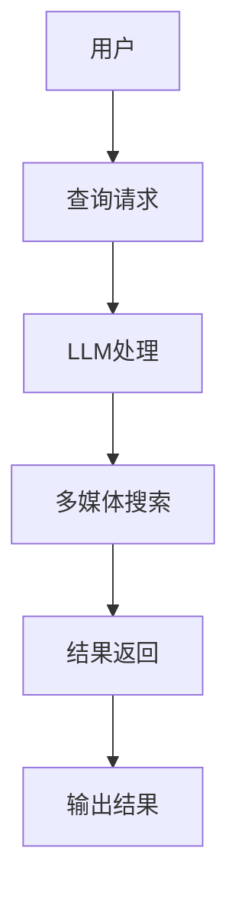
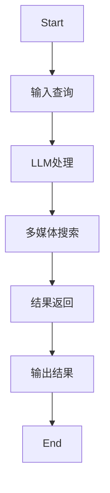
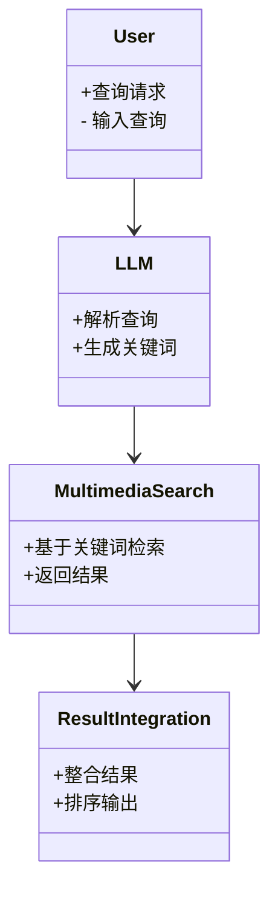
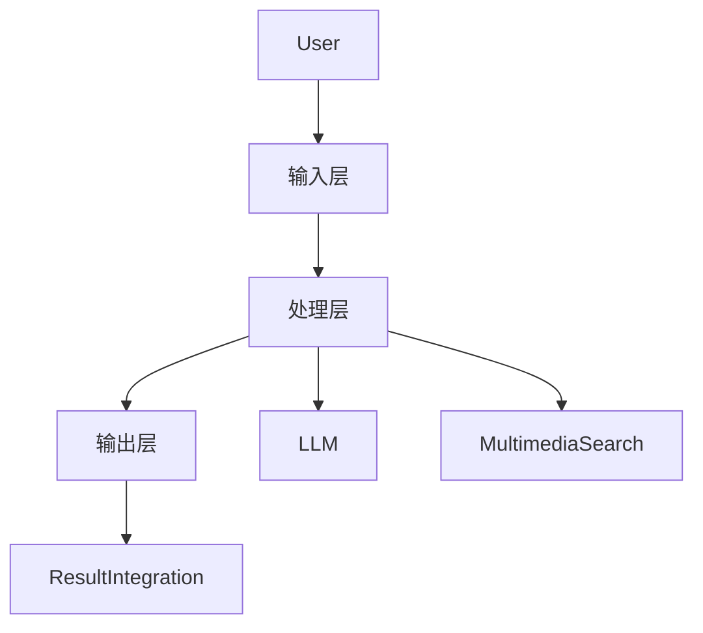
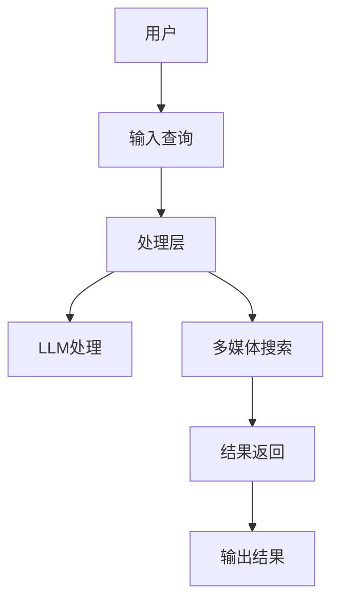

                 


# AI Agent的跨模态检索：整合LLM与多媒体搜索

> 关键词：AI Agent, 跨模态检索, 大语言模型, 多媒体搜索, 机器学习, 检索算法

> 摘要：本文深入探讨AI Agent在跨模态检索中的应用，详细分析了如何整合大型语言模型（LLM）与多媒体搜索技术，通过理论分析、算法设计和项目实战，展示了实现跨模态检索的完整流程，为读者提供清晰的技术指导和实践参考。

---

# 第一部分：AI Agent与跨模态检索的背景与概念

## 第1章：AI Agent与跨模态检索的背景介绍

### 1.1 问题背景

#### 1.1.1 当前AI Agent的发展现状
AI Agent（人工智能代理）正逐渐成为人机交互的核心技术，通过LLM（Large Language Model）实现自然语言处理，结合多媒体数据（如图像、音频、视频）进行多模态信息检索，为用户提供更智能的服务。

#### 1.1.2 多模态数据检索的需求
随着多媒体数据的快速增长，用户需要一种能够同时处理文本、图像等多种数据类型的信息检索方式，以满足复杂场景下的信息需求。

#### 1.1.3 LLM与多媒体搜索的结合必要性
LLM擅长处理文本信息，而多媒体搜索则擅长处理非文本数据。两者的结合能够实现跨模态检索，提升信息检索的准确性和全面性。

### 1.2 问题描述

#### 1.2.1 跨模态检索的核心问题
如何实现不同数据类型之间的有效检索，解决模态间信息割裂的问题。

#### 1.2.2 LLM在跨模态检索中的角色
LLM作为文本处理的核心，负责将用户查询转换为多模态检索的指令。

#### 1.2.3 多媒体搜索的技术挑战
如何将非结构化的多媒体数据转化为可检索的结构化信息，同时保持检索的高效性和准确性。

### 1.3 问题解决

#### 1.3.1 跨模态检索的解决方案
通过将LLM与多媒体搜索引擎结合，利用AI Agent协调两者的检索过程，实现跨模态的信息整合。

#### 1.3.2 LLM与多媒体搜索的整合方法
采用统一检索接口，通过LLM生成检索关键词，驱动多媒体搜索引擎进行数据检索。

#### 1.3.3 AI Agent的协调作用
AI Agent负责协调LLM和多媒体搜索引擎，确保两者协同工作，提升检索效率和准确性。

### 1.4 边界与外延

#### 1.4.1 跨模态检索的边界
仅限于特定数据类型和场景，例如文本、图像和视频的组合检索。

#### 1.4.2 LLM与多媒体搜索的协同边界
LLM负责文本处理，多媒体搜索引擎负责非文本数据检索，两者协同但不互相替代。

#### 1.4.3 AI Agent的应用范围
适用于需要跨模态检索的场景，如智能客服、信息管理系统等。

### 1.5 概念结构与核心要素

#### 1.5.1 跨模态检索的核心要素
- **输入查询**：用户提供的多模态查询请求。
- **LLM处理**：将查询转换为可执行的检索指令。
- **多媒体搜索**：基于指令检索相关数据。
- **结果整合**：将多模态结果整合并返回给用户。

#### 1.5.2 LLM与多媒体搜索的结合要素
- **统一接口**：协调LLM和多媒体搜索引擎的接口。
- **检索策略**：优化检索流程的策略。
- **结果融合**：整合不同模态的检索结果。

#### 1.5.3 AI Agent的协调机制
- **任务分配**：协调LLM和多媒体搜索引擎的任务。
- **结果整合**：整合多模态检索结果。
- **反馈优化**：根据用户反馈优化检索策略。

### 1.6 本章小结
本章介绍了AI Agent在跨模态检索中的背景、核心问题和解决方案，为后续章节的详细分析奠定了基础。

---

## 第2章：跨模态检索的核心概念与联系

### 2.1 核心概念原理

#### 2.1.1 跨模态检索的基本原理
跨模态检索通过将不同数据类型的信息映射到统一的语义空间，实现多种数据类型的协同检索。

#### 2.1.2 LLM在检索中的作用
LLM用于理解用户的查询意图，生成检索关键词，并解释检索结果。

#### 2.1.3 多媒体搜索的技术原理
多媒体搜索通过特征提取和索引技术，实现高效的数据检索。

### 2.2 概念属性特征对比

| 概念       | 属性               | 特征                               |
|------------|--------------------|------------------------------------|
| 跨模态检索  | 输入类型           | 文本、图像、音频、视频             |
| LLM        | 模型类型           | 大型语言模型                       |
| 多媒体搜索 | 搜索方式           | 基于特征匹配和相似度计算           |

### 2.3 ER实体关系图


### 2.4 本章小结
本章通过对比分析，明确了跨模态检索、LLM和多媒体搜索的核心概念及其相互关系。

---

## 第3章：跨模态检索的算法原理

### 3.1 算法原理概述

#### 3.1.1 跨模态检索的基本流程
1. 用户输入查询请求。
2. LLM解析查询并生成检索关键词。
3. 多媒体搜索引擎基于关键词进行检索。
4. 结果整合并返回给用户。

#### 3.1.2 LLM与多媒体搜索的协同机制
- LLM生成检索关键词。
- 多媒体搜索引擎基于关键词检索。
- 结果整合并优化。

#### 3.1.3 AI Agent的协调算法
AI Agent负责协调LLM和多媒体搜索引擎的任务分配和结果整合。

### 3.2 算法流程图


### 3.3 核心算法实现

#### 3.3.1 LLM的文本处理算法
使用LLM对用户查询进行语义解析，生成检索关键词。

#### 3.3.2 多媒体搜索的特征提取算法
采用深度学习模型提取图像、音频等多媒体数据的特征向量。

#### 3.3.3 结果整合算法
通过相似度计算，将多模态结果整合并排序。

### 3.4 数学模型与公式

#### 3.4.1 特征相似度计算公式
$$ \text{相似度} = \frac{\sum_{i=1}^{n} w_i \cdot s_i}{\sum_{i=1}^{n} w_i} $$
其中，$w_i$是第$i$个特征的权重，$s_i$是相似度得分。

#### 3.4.2 检索结果排序公式
$$ \text{排序} = \lambda \cdot \text{LLM评分} + (1-\lambda) \cdot \text{多媒体评分} $$
其中，$\lambda$是LLM评分的权重，取值范围为$[0,1]$。

### 3.5 本章小结
本章详细介绍了跨模态检索的算法流程和数学模型，为后续实现提供了理论基础。

---

# 第二部分：系统分析与架构设计

## 第4章：系统分析与架构设计方案

### 4.1 问题场景介绍
用户需要一个能够同时处理文本和多媒体数据的信息检索系统，通过AI Agent协调LLM和多媒体搜索引擎，实现跨模态检索。

### 4.2 系统功能设计

#### 4.2.1 功能模块划分
- 用户查询模块：接收用户输入。
- LLM处理模块：解析查询并生成检索关键词。
- 多媒体搜索模块：基于关键词进行检索。
- 结果整合模块：整合多模态结果并排序。
- 输出模块：返回最终结果。

#### 4.2.2 领域模型设计


### 4.3 系统架构设计

#### 4.3.1 分层架构设计


#### 4.3.2 模块交互流程图


### 4.4 系统接口设计

#### 4.4.1 接口定义
- 输入接口：接收用户查询请求。
- 输出接口：返回检索结果。
- 协调接口：协调LLM和多媒体搜索引擎的任务。

#### 4.4.2 接口交互流程
用户输入查询请求 -> 输入接口 -> 处理层 -> 分发任务给LLM和多媒体搜索引擎 -> 返回结果 -> 输出接口。

### 4.5 本章小结
本章通过系统架构设计，明确了各模块的功能和交互流程，为后续实现提供了指导。

---

# 第三部分：项目实战

## 第5章：项目实战

### 5.1 环境安装

#### 5.1.1 安装Python
```bash
python --version
pip install --upgrade pip
```

#### 5.1.2 安装依赖库
```bash
pip install numpy matplotlib scikit-learn transformers
```

### 5.2 系统核心实现

#### 5.2.1 LLM处理模块实现
```python
def process_query(query):
    # 使用LLM解析查询并生成关键词
    pass
```

#### 5.2.2 多媒体搜索模块实现
```python
def search Multimedia(keywords):
    # 基于关键词进行多媒体检索
    pass
```

#### 5.2.3 结果整合模块实现
```python
def integrate_results(llm_results, multimedia_results):
    # 整合LLM和多媒体搜索结果
    pass
```

### 5.3 代码应用解读与分析

#### 5.3.1 LLM处理代码
```python
from transformers import GPT2Tokenizer, GPT2Model

tokenizer = GPT2Tokenizer.from_pretrained('gpt2')
model = GPT2Model.from_pretrained('gpt2')

def process_query(query):
    inputs = tokenizer(query, return_tensors='np')
    outputs = model.generate(**inputs)
    return outputs
```

#### 5.3.2 多媒体搜索代码
```python
from sklearn.metrics.pairwise import cosine_similarity

def search Multimedia(keywords):
    features = extract_features(keywords)
    similarities = cosine_similarity(features)
    return similarities
```

### 5.4 案例分析与详细讲解

#### 5.4.1 案例分析
假设用户查询“找一张红色的猫的图片”，LLM生成关键词“红色 猫”，多媒体搜索引擎基于关键词检索红色猫的图片。

#### 5.4.2 详细讲解
通过LLM解析查询，生成检索关键词，驱动多媒体搜索引擎进行图像检索，最终返回相关图片结果。

### 5.5 项目小结
本章通过实际案例，详细讲解了跨模态检索系统的实现过程，展示了LLM与多媒体搜索的协同工作。

---

# 第四部分：最佳实践与注意事项

## 第6章：最佳实践

### 6.1 小结
跨模态检索通过整合LLM与多媒体搜索技术，实现了多模态信息的高效检索，为用户提供了更智能的服务。

### 6.2 注意事项
- 确保LLM和多媒体搜索引擎的高效性。
- 优化检索算法，提升检索准确率。
- 定期更新模型和数据，保持系统性能。

### 6.3 拓展阅读
建议读者进一步阅读相关领域的最新研究成果，如多模态学习、大规模检索系统等。

---

# 作者信息

作者：AI天才研究院/AI Genius Institute & 禅与计算机程序设计艺术 /Zen And The Art of Computer Programming

---

**总结**：本文通过理论分析、算法设计和项目实战，详细探讨了AI Agent在跨模态检索中的应用，展示了如何整合LLM与多媒体搜索技术，实现高效的多模态信息检索。

