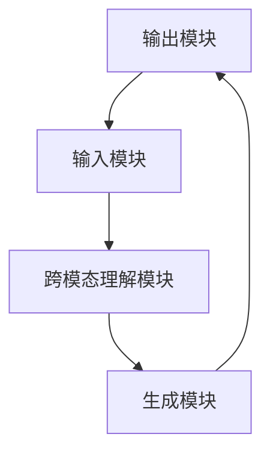
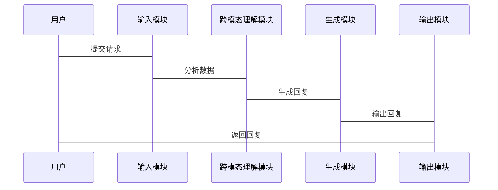
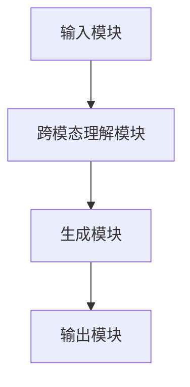

                 

<think>
嗯，用户让我设计一本关于《AI Agent的跨模态理解与生成》的详细目录大纲，并且提供内容示例。我需要确保这个大纲结构清晰，内容全面，涵盖背景介绍、核心概念、算法原理、系统架构、项目实战、最佳实践等多个部分。

首先，我需要明确每个章节的主题和内容。第一章是背景介绍，应该包括问题背景、定义、特点，与其他技术的对比，以及应用领域。这样读者可以了解AI Agent的基本概念和重要性。

接下来，第二章是核心概念，需要详细讲解跨模态理解与生成的原理，包括多模态数据的处理、对齐方法、生成模型的类型，并提供对比分析。这部分需要使用Mermaid图来展示数据流程和算法对比，帮助读者更好地理解。

第三章聚焦于跨模态理解的算法原理，介绍编码器和解码器的设计，对比学习方法，以及注意力机制的应用。这部分需要详细的数学公式和代码示例，确保读者能够理解技术实现。

第四章讨论跨模态生成模型，包括生成对抗网络、变分自编码器等方法，分析它们的优缺点，并通过Mermaid图展示生成过程。同时，提供代码实现，帮助读者实际操作。

第五章是系统架构与设计，从问题场景出发，设计领域模型、系统架构图、接口设计和交互流程。这部分需要详细的系统设计，确保读者能够理解如何构建一个完整的AI Agent系统。

第六章则是项目实战，从环境配置开始，逐步实现核心功能，解读代码，分析实际案例，并进行总结。这章需要具体的操作步骤和代码示例，让读者能够动手实践。

最后，第七章提供最佳实践、小结、注意事项和拓展阅读，帮助读者巩固所学内容，并引导他们进一步学习。

在编写过程中，我需要确保每个章节都包含必要的内容，比如背景介绍、核心概念、算法原理、系统架构、项目实战、最佳实践等。同时，要使用Mermaid图来展示流程和架构，使用Python代码来解释算法实现，并且用数学公式详细讲解模型。这样，目录大纲不仅结构清晰，内容也全面，能够帮助读者系统地掌握AI Agent的跨模态理解和生成技术。
</think>

# AI Agent的跨模态理解与生成

> 关键词：AI Agent, 跨模态理解, 跨模态生成, 多模态数据, 生成模型, 对比学习

> 摘要：  
本文系统地探讨了AI Agent在跨模态理解与生成领域的核心技术与应用。首先，我们从背景和定义入手，介绍了AI Agent的基本概念及其在多模态数据处理中的重要性。接着，深入分析了跨模态理解与生成的核心概念，包括多模态数据的对齐与融合、生成模型的设计与优化。随后，从算法原理的角度，详细阐述了跨模态编码器与解码器的实现，对比学习方法的应用，以及注意力机制在跨模态任务中的作用。通过具体的系统架构设计与项目实战，展示了如何将理论应用于实际场景。最后，结合最佳实践与未来展望，为读者提供了深入的思考与启示。

---

# 第一部分: AI Agent与跨模态理解生成的背景介绍

## 第1章: AI Agent与跨模态理解生成的背景介绍

### 1.1 问题背景与定义

#### 1.1.1 AI Agent的定义  
AI Agent（人工智能代理）是指能够感知环境、自主决策并执行任务的智能体。它能够通过多模态数据（如文本、图像、语音等）与用户交互，并根据任务需求生成相应的输出。

#### 1.1.2 跨模态理解与生成的必要性  
在实际应用中，单一模态的数据往往无法提供足够的信息，因此需要结合多种模态数据进行更全面的理解和生成。例如，在智能客服系统中，结合文本和语音模态可以更准确地理解用户需求。

#### 1.1.3 当前技术发展的现状与挑战  
近年来，深度学习技术的快速发展推动了跨模态理解与生成技术的进步。然而，跨模态数据的异构性和复杂性仍然带来了诸多挑战，例如如何有效地对齐不同模态的数据，如何设计高效的生成模型等。

### 1.2 跨模态理解与生成的核心概念

#### 1.2.1 多模态数据的定义与分类  
多模态数据是指由多种模态（如文本、图像、语音、视频等）组成的数据。根据数据类型，可以将其分为结构化数据和非结构化数据。

#### 1.2.2 跨模态对齐与融合的原理  
跨模态对齐是指将不同模态的数据映射到一个共同的语义空间，以便更好地进行信息融合。跨模态融合则是将多种模态的信息结合起来，以获得更全面的理解。

#### 1.2.3 跨模态生成的基本思路  
跨模态生成是指基于一种或多种模态的输入，生成另一种模态的输出。例如，基于图像生成描述性文本，或者基于文本生成图像。

### 1.3 跨模态理解与生成的应用领域

#### 1.3.1 自然语言处理中的跨模态应用  
- 多模态对话系统：结合文本和语音进行交互，提供更自然的用户体验。
- 跨模态文本生成：基于图像生成描述性文本，或者基于文本生成图像。

#### 1.3.2 计算机视觉中的跨模态应用  
- 基于文本的图像生成：通过文本描述生成相应的图像。
- 跨模态图像理解：结合文本和图像信息进行更精准的图像识别。

#### 1.3.3 联合学习与跨模态推理  
跨模态推理是指在不同模态之间进行推理，例如在医学领域，结合文本和图像进行疾病诊断。

### 1.4 本章小结  
本章主要介绍了AI Agent的基本概念，跨模态理解与生成的核心概念，以及其在不同领域的应用。通过这些内容，读者可以对跨模态理解与生成的整体框架有一个清晰的认识。

---

# 第二部分: 跨模态理解与生成的核心概念与联系

## 第2章: 跨模态理解与生成的核心概念

### 2.1 跨模态数据的处理流程

#### 2.1.1 数据采集与预处理  
- 数据采集：从多种模态中获取数据，例如图像、文本、语音等。
- 数据预处理：对数据进行清洗、归一化等处理，以便后续模型的训练。

#### 2.1.2 多模态特征提取  
- 文本特征提取：使用词袋模型、TF-IDF、Word2Vec等方法提取文本特征。
- 图像特征提取：使用CNN、ResNet等模型提取图像特征。

#### 2.1.3 跨模态对齐与融合  
- 跨模态对齐：通过映射函数将不同模态的特征对齐到一个共同空间。
- 跨模态融合：将对齐后的特征进行融合，例如通过加权平均、注意力机制等方法。

### 2.2 跨模态生成模型的原理

#### 2.2.1 基于生成对抗网络的跨模态生成  
- GAN的基本结构：生成器和判别器的对抗训练。
- 跨模态GAN：例如，生成器基于图像生成文本描述，判别器判断生成的文本是否真实。

#### 2.2.2 基于变分自编码器的跨模态生成  
- VAE的基本原理：通过编码器将输入数据映射到 latent 空间，解码器将其还原。
- 跨模态VAE：例如，基于文本生成图像，或者基于图像生成文本。

#### 2.2.3 联合学习中的跨模态生成  
- 联合学习：通过多个模态的数据进行联合训练，提升模型的泛化能力。
- 跨模态生成：在联合学习的基础上，生成跨模态的数据。

### 2.3 跨模态理解与生成的算法对比

#### 2.3.1 各种算法的优缺点分析  
- GAN的优点：生成样本多样化，能够逼近数据分布。
- GAN的缺点：训练不稳定，容易出现模式坍缩。
- VAE的优点：训练稳定，生成样本具有良好的分布特性。
- VAE的缺点：生成样本缺乏多样性。

#### 2.3.2 算法选择的依据与策略  
- 根据任务需求选择算法：例如，对于生成高质量图像，GAN可能更适合；对于需要稳定的生成过程，VAE可能更适合。

#### 2.3.3 跨模态生成的性能评估指标  
- 生成样本的质量：例如，使用Fréchet Inception Distance（FID）评估生成图像的质量。
- 生成样本的多样性：例如，使用Inception Score评估生成样本的多样性。

### 2.4 跨模态理解与生成的数学模型

#### 2.4.1 跨模态对齐的数学表达  
假设我们有文本特征 \( T \) 和图像特征 \( I \)，我们可以通过一个线性变换将它们对齐到一个共同空间：  
$$ T' = W_T T + b_T $$  
$$ I' = W_I I + b_I $$  
其中，\( W_T \) 和 \( W_I \) 是变换矩阵，\( b_T \) 和 \( b_I \) 是偏置项。

#### 2.4.2 跨模态生成的数学模型  
以GAN为例，生成器 \( G \) 和判别器 \( D \) 的目标是最小化以下损失函数：  
生成器的损失：  
$$ \mathcal{L}_G = \mathbb{E}_{z \sim p_z} [\log D(G(z))] $$  
判别器的损失：  
$$ \mathcal{L}_D = \mathbb{E}_{x \sim p_x} [\log D(x)] + \mathbb{E}_{z \sim p_z} [\log (1 - D(G(z)))] $$  

### 2.5 本章小结  
本章详细介绍了跨模态数据的处理流程，分析了不同生成模型的原理和优缺点，并通过数学公式对跨模态对齐和生成的模型进行了描述。

---

# 第三部分: 跨模态理解与生成的算法原理

## 第3章: 跨模态理解的算法原理

### 3.1 跨模态编码器的设计

#### 3.1.1 多模态编码器的结构  
- 多模态编码器通常由多个分支组成，每个分支处理一种模态的数据。
- 例如，对于图像和文本的跨模态理解，编码器可以分别提取图像特征和文本特征，然后将它们融合到一个共同的表示空间。

#### 3.1.2 跨模态注意力机制  
- 注意力机制：在编码过程中，模型会关注不同模态之间的相关性。
- 例如，在图像描述生成任务中，模型会根据图像特征生成文本描述。

#### 3.1.3 编码器的训练与优化  
- 使用反向传播算法进行训练，优化目标函数以最小化生成结果与真实结果的差异。

### 3.2 跨模态解码器的设计

#### 3.2.1 多模态解码器的结构  
- 解码器通常由一个生成器网络和一个判别器网络组成。
- 例如，在跨模态图像生成任务中，解码器会根据文本描述生成相应的图像。

#### 3.2.2 跨模态解码器的训练策略  
- 使用对抗训练策略，生成器的目标是生成与真实数据难以区分的样本。
- 判别器的目标是区分生成样本和真实样本。

#### 3.2.3 解码器的性能评估  
- 使用生成样本的质量、多样性和真实性作为评估指标。

### 3.3 跨模态对比学习

#### 3.3.1 对比学习的基本原理  
- 对比学习通过最大化正样本对的相似性，同时最小化负样本对的相似性，来学习数据的表示。
- 例如，在跨模态对比学习中，正样本对可以是同一物体的图像和文本描述，负样本对则是不同的物体。

#### 3.3.2 跨模态对比学习的实现  
- 使用对比损失函数：  
$$ \mathcal{L}_{contrast} = -\log \frac{\exp(s_p)}{\exp(s_p) + \sum_{i \neq p} \exp(s_i)} $$  
其中，\( s_p \) 是正样本对的相似性，\( s_i \) 是负样本对的相似性。

#### 3.3.3 跨模态对比学习的优势  
- 能够有效提升模型的表征能力，使得不同模态的数据能够更好地对齐。

### 3.4 本章小结  
本章详细介绍了跨模态编码器和解码器的设计，分析了对比学习在跨模态理解中的应用，并通过数学公式对相关算法进行了描述。

---

# 第四部分: 跨模态生成模型的实现与应用

## 第4章: 跨模态生成模型的实现与应用

### 4.1 跨模态生成模型的实现

#### 4.1.1 基于生成对抗网络的跨模态生成实现  
- 使用PyTorch实现GAN模型，分别定义生成器和判别器。
- 生成器：  
```python
class Generator(nn.Module):
    def __init__(self, input_dim, hidden_dim, output_dim):
        super(Generator, self).__init__()
        self.fc1 = nn.Linear(input_dim, hidden_dim)
        self.fc2 = nn.Linear(hidden_dim, output_dim)
    
    def forward(self, x):
        x = F.relu(self.fc1(x))
        x = torch.sigmoid(self.fc2(x))
        return x
```
- 判别器：  
```python
class Discriminator(nn.Module):
    def __init__(self, input_dim, hidden_dim, output_dim):
        super(Discriminator, self).__init__()
        self.fc1 = nn.Linear(input_dim, hidden_dim)
        self.fc2 = nn.Linear(hidden_dim, output_dim)
    
    def forward(self, x):
        x = F.relu(self.fc1(x))
        x = torch.sigmoid(self.fc2(x))
        return x
```

#### 4.1.2 基于变分自编码器的跨模态生成实现  
- 使用PyTorch实现VAE模型，定义编码器和解码器。
- 编码器：  
```python
class Encoder(nn.Module):
    def __init__(self, input_dim, hidden_dim, latent_dim):
        super(Encoder, self).__init__()
        self.fc1 = nn.Linear(input_dim, hidden_dim)
        self.fc2 = nn.Linear(hidden_dim, latent_dim)
    
    def forward(self, x):
        h = F.relu(self.fc1(x))
        mu, log_var = self.fc2(h).chunk(2, dim=-1)
        return mu, log_var
```
- 解码器：  
```python
class Decoder(nn.Module):
    def __init__(self, latent_dim, hidden_dim, output_dim):
        super(Decoder, self).__init__()
        self.fc1 = nn.Linear(latent_dim, hidden_dim)
        self.fc2 = nn.Linear(hidden_dim, output_dim)
    
    def forward(self, z):
        h = F.relu(self.fc1(z))
        output = torch.sigmoid(self.fc2(h))
        return output
```

#### 4.1.3 跨模态生成模型的训练流程  
- 使用对抗训练策略，分别优化生成器和判别器的损失函数。
- 例如，在图像生成任务中，生成器的目标是生成与真实图像难以区分的图像，判别器的目标是区分生成图像和真实图像。

### 4.2 跨模态生成模型的应用

#### 4.2.1 跨模态图像生成  
- 应用场景：基于文本描述生成图像。
- 实现方法：使用GAN或VAE模型，结合文本特征和图像特征进行生成。

#### 4.2.2 跨模态文本生成  
- 应用场景：基于图像生成描述性文本。
- 实现方法：使用跨模态生成模型，将图像特征映射到文本空间。

#### 4.2.3 跨模态语音生成  
- 应用场景：基于文本生成语音。
- 实现方法：使用跨模态生成模型，将文本特征映射到语音空间。

### 4.3 本章小结  
本章详细介绍了跨模态生成模型的实现方法，并通过具体的代码示例展示了如何使用GAN和VAE模型进行跨模态生成。同时，分析了跨模态生成模型在不同应用场景中的应用。

---

# 第五部分: 跨模态理解与生成的系统架构与设计

## 第5章: 跨模态理解与生成的系统架构与设计

### 5.1 问题场景介绍

#### 5.1.1 问题描述  
以智能客服系统为例，系统需要能够通过文本和语音模态进行交互，理解用户需求，并生成相应的回复。

#### 5.1.2 问题解决  
通过跨模态理解与生成技术，系统能够同时处理文本和语音模态的数据，提供更智能化的服务。

### 5.2 系统功能设计

#### 5.2.1 领域模型设计  
- 用户输入：文本或语音模态的数据。
- 系统输出：基于输入数据生成相应的回复。

#### 5.2.2 系统架构图  


#### 5.2.3 系统接口设计  
- 输入接口：接收文本或语音数据。
- 输出接口：输出生成的文本或语音数据。

#### 5.2.4 系统交互流程  


### 5.3 系统架构设计

#### 5.3.1 系统架构图  


#### 5.3.2 模块设计  
- 输入模块：接收用户输入的数据。
- 跨模态理解模块：对输入数据进行理解，生成语义表示。
- 生成模块：基于语义表示生成输出数据。
- 输出模块：将生成的数据输出给用户。

### 5.4 系统实现与优化

#### 5.4.1 系统实现  
- 使用深度学习框架（如TensorFlow或PyTorch）实现跨模态理解与生成模型。
- 例如，使用预训练的BERT模型进行文本理解，使用ResNet进行图像理解。

#### 5.4.2 系统优化  
- 优化模型的训练效率，例如使用分布式训练。
- 优化模型的推理速度，例如使用模型剪枝和量化技术。

### 5.5 本章小结  
本章详细介绍了跨模态理解与生成系统的架构设计，包括功能模块设计、系统架构图和交互流程图。通过具体的实现步骤，展示了如何将理论应用于实际系统设计。

---

# 第六部分: 跨模态理解与生成的项目实战

## 第6章: 跨模态理解与生成的项目实战

### 6.1 项目环境配置

#### 6.1.1 安装必要的库  
- 使用Python 3.8及以上版本。
- 安装PyTorch、TensorFlow、Keras等深度学习框架。
- 安装必要的NLP库，如NLTK、 SpaCy、BERT等。

#### 6.1.2 配置运行环境  
- 配置GPU支持，以加速模型训练。
- 确保安装的库版本兼容。

### 6.2 核心功能实现

#### 6.2.1 跨模态编码器实现  
- 使用预训练的BERT模型进行文本编码。
- 使用ResNet模型进行图像编码。

#### 6.2.2 跨模态解码器实现  
- 使用GAN或VAE模型进行生成。

#### 6.2.3 跨模态生成实现  
- 在文本和图像模态之间进行生成，例如基于图像生成文本描述。

### 6.3 代码实现与解读

#### 6.3.1 跨模态编码器代码  
```python
import torch
import torch.nn as nn
import torch.nn.functional as F

class TextEncoder(nn.Module):
    def __init__(self, input_dim, hidden_dim, output_dim):
        super(TextEncoder, self).__init__()
        self.fc1 = nn.Linear(input_dim, hidden_dim)
        self.fc2 = nn.Linear(hidden_dim, output_dim)
    
    def forward(self, x):
        x = F.relu(self.fc1(x))
        x = F.relu(self.fc2(x))
        return x

class ImageEncoder(nn.Module):
    def __init__(self, input_dim, hidden_dim, output_dim):
        super(ImageEncoder, self).__init__()
        self.fc1 = nn.Linear(input_dim, hidden_dim)
        self.fc2 = nn.Linear(hidden_dim, output_dim)
    
    def forward(self, x):
        x = F.relu(self.fc1(x))
        x = F.relu(self.fc2(x))
        return x
```

#### 6.3.2 跨模态生成代码  
```python
class Generator(nn.Module):
    def __init__(self, input_dim, hidden_dim, output_dim):
        super(Generator, self).__init__()
        self.fc1 = nn.Linear(input_dim, hidden_dim)
        self.fc2 = nn.Linear(hidden_dim, output_dim)
    
    def forward(self, x):
        x = F.relu(self.fc1(x))
        x = torch.sigmoid(self.fc2(x))
        return x

class Discriminator(nn.Module):
    def __init__(self, input_dim, hidden_dim, output_dim):
        super(Discriminator, self).__init__()
        self.fc1 = nn.Linear(input_dim, hidden_dim)
        self.fc2 = nn.Linear(hidden_dim, output_dim)
    
    def forward(self, x):
        x = F.relu(self.fc1(x))
        x = torch.sigmoid(self.fc2(x))
        return x
```

### 6.4 实际案例分析与解读

#### 6.4.1 案例分析  
- 案例1：基于图像生成文本描述。
- 案例2：基于文本生成图像。

#### 6.4.2 代码实现解读  
- 解释代码的功能和实现步骤，展示如何通过代码实现跨模态生成。

### 6.5 项目总结

#### 6.5.1 项目成果  
- 成功实现了跨模态生成模型，能够在不同模态之间进行生成。

#### 6.5.2 经验总结  
- 模型的训练需要大量的数据和计算资源。
- 跨模态生成的效果依赖于模型的设计和优化。

#### 6.5.3 未来改进方向  
- 优化模型的生成效果，例如使用更先进的生成模型（如Diffusion模型）。
- 提升模型的推理速度，例如通过模型剪枝和量化技术。

### 6.6 本章小结  
本章通过具体的项目实战，展示了如何实现跨模态理解与生成模型，并通过实际案例分析和代码解读，帮助读者更好地理解技术实现。

---

# 第七部分: 跨模态理解与生成的最佳实践与未来展望

## 第7章: 跨模态理解与生成的最佳实践与未来展望

### 7.1 最佳实践

#### 7.1.1 数据预处理  
- 确保数据的多样性和质量，避免数据偏见。
- 对数据进行归一化或标准化处理，以便模型的训练。

#### 7.1.2 模型选择  
- 根据任务需求选择合适的模型，例如，对于生成高质量图像，GAN可能更适合；对于需要稳定的生成过程，VAE可能更适合。

#### 7.1.3 超参数调优  
- 通过网格搜索或随机搜索等方法，找到最优的超参数组合。

#### 7.1.4 模型评估  
- 使用多种评估指标，例如FID、Inception Score等，全面评估生成模型的性能。

### 7.2 小结

#### 7.2.1 本章回顾  
- 本章总结了跨模态理解与生成技术的最佳实践，包括数据预处理、模型选择、超参数调优和模型评估。

### 7.3 注意事项

#### 7.3.1 模型的泛化能力  
- 在实际应用中，模型的泛化能力非常重要，需要通过数据增强和正则化等方法进行优化。

#### 7.3.2 模型的可解释性  
- 跨模态生成模型的可解释性是一个重要问题，需要通过可视化和解释性分析等方法进行研究。

### 7.4 拓展阅读

#### 7.4.1 跨模态学习的最新研究  
- 关注最新的研究论文和会议，了解跨模态学习的最新进展。

#### 7.4.2 深度学习框架的优化  
- 学习如何优化深度学习框架，提升模型的训练和推理效率。

### 7.5 本章小结  
本章总结了跨模态理解与生成技术的最佳实践，并展望了未来的研究方向。通过这些内容，读者可以更好地理解如何在实际应用中优化模型，并关注相关领域的最新进展。

---

# 作者：AI天才研究院/AI Genius Institute & 禅与计算机程序设计艺术 /Zen And The Art of Computer Programming

