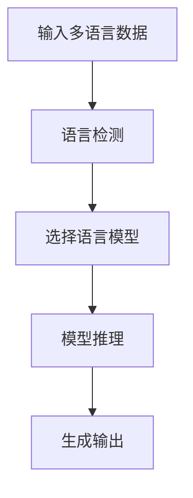
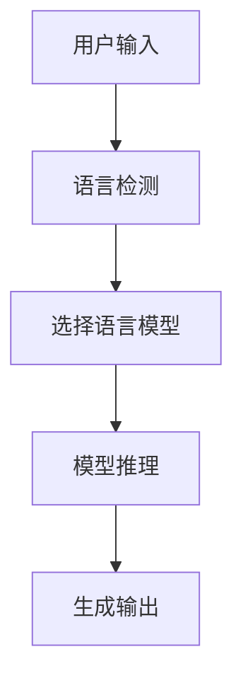
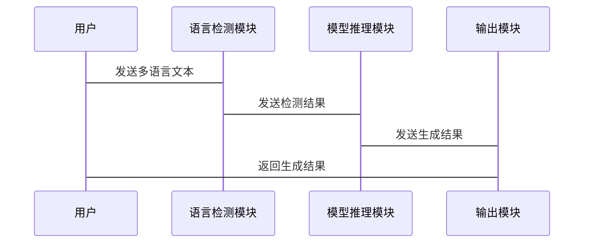

                 


# AI Agent的跨语言学习：增强LLM的多语言能力

> 关键词：AI Agent, 大语言模型, 跨语言学习, 多语言处理, 模型迁移, 系统架构

> 摘要：本文深入探讨了AI Agent在跨语言学习中的应用，重点分析了如何通过跨语言学习技术增强大语言模型（LLM）的多语言能力。文章首先介绍了跨语言学习的基本概念和背景，随后详细阐述了AI Agent与大语言模型的结合方式。接着，从算法原理、系统架构设计、项目实战等多个维度，全面分析了跨语言学习的核心技术与实现方法。最后，本文还提供了具体的项目案例，展示了如何将跨语言学习技术应用于实际场景中，为读者提供了一套完整的解决方案。

---

## 第1章 跨语言学习与AI Agent概述

### 1.1 跨语言学习的背景与意义

#### 1.1.1 多语言处理的挑战与机遇
在人工智能领域，多语言处理是一项具有重要价值的任务。随着全球化的深入，跨语言交流的需求日益增长。然而，传统的单一语言模型难以满足实际应用中的多样化需求。通过跨语言学习，AI Agent能够理解并处理多种语言，从而在多语言场景中提供更高效、更智能的服务。

#### 1.1.2 AI Agent在跨语言任务中的作用
AI Agent作为智能化系统的代表，能够通过跨语言学习技术实现对多种语言的理解和生成。这种能力不仅提升了系统的实用性，还为跨语言交互提供了技术保障。例如，在客服系统中，AI Agent可以通过跨语言学习为用户提供多语言支持，显著提高用户体验。

#### 1.1.3 跨语言学习的核心目标与边界
跨语言学习的核心目标是通过技术手段，使AI Agent能够理解、生成和处理多种语言内容。其边界包括但不限于跨语言翻译、跨语言问答、跨语言文本生成等应用场景。同时，跨语言学习还需解决数据稀疏性、语言间的语义差异等问题。

### 1.2 AI Agent的基本概念

#### 1.2.1 AI Agent的定义与分类
AI Agent（人工智能代理）是一种能够感知环境并采取行动以实现目标的智能实体。根据应用场景的不同，AI Agent可以分为任务型AI Agent和通用型AI Agent。任务型AI Agent专注于特定任务（如客服助手），而通用型AI Agent则具备更广泛的功能（如智能音箱）。

#### 1.2.2 大语言模型（LLM）的基本原理
大语言模型（LLM）通过大量的语言数据进行预训练，掌握了多种语言的语义理解和生成能力。LLM的核心在于其深度神经网络结构和海量的训练数据，使其能够处理复杂的语言任务。

#### 1.2.3 跨语言学习的必要性与应用场景
在多语言场景中，单一语言模型难以满足需求，因此需要通过跨语言学习来增强模型的多语言能力。应用场景包括跨语言对话、多语言内容生成、跨语言信息检索等。

### 1.3 跨语言学习的核心问题

#### 1.3.1 多语言数据的处理挑战
跨语言学习需要处理多种语言的数据，包括数据的清洗、标注和预处理。由于不同语言的语法规则和语义差异，跨语言数据处理具有较高的复杂性。

#### 1.3.2 跨语言模型的适应性问题
跨语言模型需要具备在不同语言间的良好适应性。这要求模型在训练过程中能够捕获语言间的共性和差异，从而实现高效的跨语言推理。

#### 1.3.3 跨语言学习的评价指标与方法
跨语言学习的评价指标包括准确率、BLEU分数、ROUGE分数等。同时，还需要通过对比实验来验证模型的跨语言适应性。

---

## 第2章 大语言模型（LLM）的多语言能力

### 2.1 大语言模型的多语言处理机制

#### 2.1.1 多语言模型的训练策略
多语言模型的训练策略包括多任务学习和多语言预训练。多任务学习通过同时训练多种语言任务来提升模型的多语言能力，而多语言预训练则通过在多种语言数据上进行无监督预训练来初始化模型参数。

#### 2.1.2 多语言模型的推理机制
多语言模型在推理时需要选择合适的语言模型参数，并根据输入语言生成相应的输出。这一过程通常需要结合语言检测技术来确定输入语言。

#### 2.1.3 多语言模型的性能评估
多语言模型的性能评估需要考虑准确率、生成质量、推理速度等多个指标。同时，还需要通过对比实验来验证模型的多语言适应性。

### 2.2 跨语言学习的关键技术

#### 2.2.1 多语言预训练策略
多语言预训练策略通过在多种语言数据上进行无监督预训练，初始化模型的参数。这种方法能够捕获语言间的共性特征，为后续的跨语言任务提供良好的基础。

#### 2.2.2 跨语言迁移学习
跨语言迁移学习通过将源语言模型的知识迁移到目标语言，提升目标语言模型的性能。这种方法特别适用于数据稀缺的目标语言。

#### 2.2.3 多语言提示设计
多语言提示设计通过在模型输入中添加语言提示信息，指导模型在推理时选择合适语言的参数。这种方法能够有效提升模型的跨语言推理能力。

### 2.3 跨语言学习的数学模型

#### 2.3.1 多语言模型的训练目标函数
多语言模型的训练目标函数通常包括交叉熵损失和语言权重损失。交叉熵损失用于衡量模型预测的准确性，而语言权重损失则用于平衡不同语言的训练数据。

$$ L = -\frac{1}{N}\sum_{i=1}^{N}\sum_{j=1}^{M} y_{ij}\log p(y_{ij}|x_i) $$

其中，$y_{ij}$表示第$i$个样本第$j$个语言的标签，$p(y_{ij}|x_i)$表示模型对第$j$个语言的预测概率。

#### 2.3.2 跨语言迁移的数学表达
跨语言迁移学习的数学表达通常包括源语言模型的参数和目标语言模型的参数。通过参数迁移，目标语言模型能够继承源语言模型的知识。

$$ \theta_{target} = \alpha \theta_{source} + (1-\alpha)\theta_{target} $$

其中，$\theta_{source}$表示源语言模型的参数，$\theta_{target}$表示目标语言模型的初始参数，$\alpha$表示迁移权重。

#### 2.3.3 多语言提示的优化目标
多语言提示的优化目标通常包括语言提示的准确率和模型生成结果的质量。优化目标函数可以表示为：

$$ \arg\max_{\theta} \sum_{i=1}^{N} L(y_i, \hat{y}_i) $$

其中，$y_i$表示第$i$个样本的真实标签，$\hat{y}_i$表示模型生成的预测标签。

---

## 第3章 AI Agent的跨语言学习框架

### 3.1 跨语言学习的系统架构

#### 3.1.1 数据预处理模块
数据预处理模块负责对多语言数据进行清洗、标注和格式转换。这一步骤是跨语言学习的基础，直接影响模型的训练效果。

#### 3.1.2 模型训练模块
模型训练模块负责对多语言模型进行训练，包括多语言预训练和跨语言迁移学习。训练过程中需要优化模型参数，以提升模型的多语言能力。

#### 3.1.3 推理与交互模块
推理与交互模块负责接收用户的输入，进行跨语言推理，并生成相应的输出。这一模块通常需要结合语言检测和语言切换技术。

### 3.2 跨语言学习的系统设计

#### 3.2.1 数据流设计
数据流设计包括数据输入、数据处理和数据输出三个环节。数据输入包括多语言文本和语言提示信息，数据处理包括语言检测和模型推理，数据输出包括生成结果和反馈信息。

#### 3.2.2 模块间接口设计
模块间接口设计需要定义各个模块之间的交互接口。例如，数据预处理模块与模型训练模块之间的接口需要定义数据格式和参数传递方式。

#### 3.2.3 系统交互流程
系统交互流程包括用户输入、语言检测、模型推理和结果输出四个步骤。用户输入可以是多语言文本，语言检测模块识别输入语言，模型推理模块生成相应语言的输出，最后将结果返回给用户。

### 3.3 跨语言学习的系统实现

#### 3.3.1 环境安装与配置
环境安装与配置需要安装必要的依赖库，如Python、TensorFlow、PyTorch等。同时需要配置多语言数据集和训练参数。

#### 3.3.2 核心代码实现
核心代码实现包括数据预处理、模型训练和推理实现。数据预处理代码负责对多语言数据进行清洗和标注，模型训练代码负责训练多语言模型，推理代码负责生成跨语言输出。

#### 3.3.3 代码解读与分析
代码解读与分析需要对关键代码段进行详细解读，分析代码的功能和实现逻辑。例如，语言检测代码的实现逻辑、模型训练代码的优化策略等。

---

## 第4章 跨语言学习的算法实现

### 4.1 跨语言学习的算法原理

#### 4.1.1 多语言预训练算法
多语言预训练算法通过在多种语言数据上进行无监督预训练，初始化模型的参数。这种方法能够捕获语言间的共性特征，为后续的跨语言任务提供良好的基础。

#### 4.1.2 跨语言迁移算法
跨语言迁移学习通过将源语言模型的知识迁移到目标语言，提升目标语言模型的性能。这种方法特别适用于数据稀缺的目标语言。

#### 4.1.3 多语言提示生成算法
多语言提示生成算法通过在模型输入中添加语言提示信息，指导模型在推理时选择合适语言的参数。这种方法能够有效提升模型的跨语言推理能力。

### 4.2 跨语言学习的数学模型

#### 4.2.1 多语言模型的训练目标函数
多语言模型的训练目标函数通常包括交叉熵损失和语言权重损失。交叉熵损失用于衡量模型预测的准确性，而语言权重损失则用于平衡不同语言的训练数据。

$$ L = -\frac{1}{N}\sum_{i=1}^{N}\sum_{j=1}^{M} y_{ij}\log p(y_{ij}|x_i) $$

其中，$y_{ij}$表示第$i$个样本第$j$个语言的标签，$p(y_{ij}|x_i)$表示模型对第$j$个语言的预测概率。

#### 4.2.2 跨语言迁移的数学表达
跨语言迁移学习的数学表达通常包括源语言模型的参数和目标语言模型的参数。通过参数迁移，目标语言模型能够继承源语言模型的知识。

$$ \theta_{target} = \alpha \theta_{source} + (1-\alpha)\theta_{target} $$

其中，$\theta_{source}$表示源语言模型的参数，$\theta_{target}$表示目标语言模型的初始参数，$\alpha$表示迁移权重。

#### 4.2.3 多语言提示的优化目标
多语言提示的优化目标通常包括语言提示的准确率和模型生成结果的质量。优化目标函数可以表示为：

$$ \arg\max_{\theta} \sum_{i=1}^{N} L(y_i, \hat{y}_i) $$

其中，$y_i$表示第$i$个样本的真实标签，$\hat{y}_i$表示模型生成的预测标签。

### 4.3 跨语言学习的算法流程图



---

## 第5章 跨语言学习的系统架构设计

### 5.1 系统架构概述

#### 5.1.1 数据流设计
数据流设计包括数据输入、数据处理和数据输出三个环节。数据输入包括多语言文本和语言提示信息，数据处理包括语言检测和模型推理，数据输出包括生成结果和反馈信息。

#### 5.1.2 模块间接口设计
模块间接口设计需要定义各个模块之间的交互接口。例如，数据预处理模块与模型训练模块之间的接口需要定义数据格式和参数传递方式。

#### 5.1.3 系统交互流程
系统交互流程包括用户输入、语言检测、模型推理和结果输出四个步骤。用户输入可以是多语言文本，语言检测模块识别输入语言，模型推理模块生成相应语言的输出，最后将结果返回给用户。

### 5.2 系统架构设计

#### 5.2.1 系统功能设计
系统功能设计包括语言检测、多语言推理、跨语言生成和结果输出四个功能模块。语言检测模块负责识别输入语言，多语言推理模块负责生成相应语言的输出，跨语言生成模块负责生成多语言内容，结果输出模块负责将结果返回给用户。

#### 5.2.2 系统架构图


#### 5.2.3 系统接口设计
系统接口设计需要定义各个模块之间的接口。例如，语言检测模块与模型推理模块之间的接口需要定义输入语言和模型参数。

#### 5.2.4 系统交互序列图


---

## 第6章 跨语言学习的项目实战

### 6.1 项目概述

#### 6.1.1 项目背景
本项目旨在实现一个多语言对话系统，用户可以输入多种语言的文本，系统能够理解和生成相应语言的文本。

#### 6.1.2 项目目标
项目目标包括实现语言检测、多语言推理和跨语言生成功能，能够支持多种语言的对话交互。

### 6.2 核心代码实现

#### 6.2.1 环境安装与配置
```python
pip install numpy
pip install tensorflow
pip install pytorch
```

#### 6.2.2 数据预处理代码
```python
import numpy as np

def preprocess_data(data):
    # 数据清洗
    cleaned_data = []
    for sample in data:
        text = sample['text']
        label = sample['label']
        cleaned_data.append({'text': text.strip(), 'label': label})
    return cleaned_data
```

#### 6.2.3 模型训练代码
```python
import tensorflow as tf

def train_model(train_data, val_data):
    model = build_model()  # 定义模型
    optimizer = tf.keras.optimizers.Adam()
    model.compile(optimizer=optimizer, loss='sparse_categorical_crossentropy', metrics=['accuracy'])
    model.fit(train_data, val_data, epochs=10, batch_size=32)
    return model
```

#### 6.2.4 推理与交互代码
```python
def infer(model, input_text):
    # 语言检测
    detected_lang = detect_language(input_text)
    # 选择语言模型
    lang_model = select_model(detected_lang)
    # 模型推理
    output = lang_model.generate(input_text)
    return output
```

### 6.3 项目总结

#### 6.3.1 项目实现的关键点
项目实现的关键点包括语言检测、多语言推理和跨语言生成。语言检测模块能够准确识别输入语言，多语言推理模块能够生成相应语言的输出，跨语言生成模块能够支持多种语言的对话交互。

#### 6.3.2 项目成果与意义
项目成果包括一个多语言对话系统，能够支持多种语言的对话交互。项目意义在于展示了跨语言学习技术在实际场景中的应用，为后续研究提供了参考。

---

## 第7章 跨语言学习的最佳实践与小结

### 7.1 最佳实践

#### 7.1.1 数据处理建议
在数据处理过程中，需要注意数据的多样性和平衡性。多语言数据需要覆盖多种语言，同时保证数据分布的均衡。

#### 7.1.2 模型选择建议
模型选择建议根据具体任务需求选择合适的模型架构。例如，对于跨语言翻译任务，可以选用Transformer架构；对于跨语言问答任务，可以选用BERT架构。

#### 7.1.3 训练策略建议
训练策略建议包括数据增强、参数调整和模型优化。数据增强可以提升模型的鲁棒性，参数调整可以优化模型性能，模型优化可以提升训练效率。

### 7.2 小结

跨语言学习是一项具有重要价值的技术，能够显著提升AI Agent的多语言能力。本文从背景、核心概念、算法原理、系统架构等多个维度，全面分析了跨语言学习的核心技术与实现方法。通过具体的项目案例，展示了跨语言学习技术在实际场景中的应用。未来，随着技术的不断发展，跨语言学习将为AI Agent带来更多的可能性。

---

## 作者信息

作者：AI天才研究院/AI Genius Institute & 禅与计算机程序设计艺术 /Zen And The Art of Computer Programming

