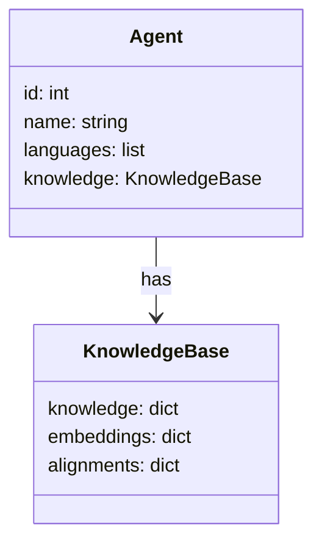
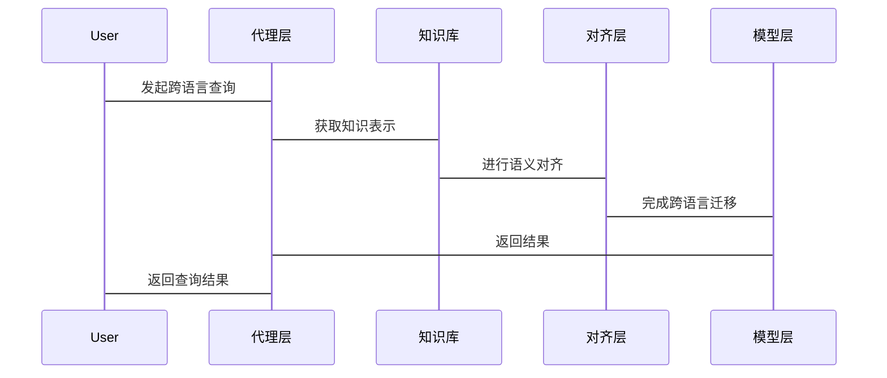

                 


# AI Agent的跨语言知识迁移：突破语言障碍

---

## 关键词：AI Agent, 跨语言知识迁移, 多语言模型, 语言障碍, 机器学习, 知识图谱

---

## 摘要：  
AI Agent的跨语言知识迁移是当前人工智能领域的重要研究方向之一。随着全球化进程的加速，AI Agent需要具备在多语言环境中进行知识理解和推理的能力，以突破语言障碍并实现跨语言任务的高效处理。本文将从背景、核心概念、算法原理、系统架构、项目实战等多个方面深入探讨AI Agent的跨语言知识迁移技术，结合具体案例和数学模型，为读者提供全面的技术解析。

---

# 正文

---

## 第一章: 背景介绍

### 1.1 问题背景

#### 1.1.1 语言障碍的现状  
在当前的多语言环境中，AI Agent需要处理来自不同语言的数据和任务。然而，语言之间的差异导致知识表示和推理的复杂性增加。例如，中文和英文在语法结构、词汇含义和语义表达上有显著差异，这使得AI Agent难以直接跨语言理解和应用知识。

#### 1.1.2 AI Agent在多语言环境中的挑战  
AI Agent的核心能力依赖于对知识的准确理解和表示。在跨语言场景中，不同语言之间的语义差异可能导致知识表示的不一致，进而影响推理和决策的准确性。此外，多语言数据的异构性也为AI Agent的知识迁移带来了技术挑战。

#### 1.1.3 跨语言知识迁移的必要性  
为了使AI Agent能够在多语言环境中高效工作，跨语言知识迁移技术变得至关重要。通过将一种语言的知识迁移到另一种语言，AI Agent可以更好地适应不同的语言环境，提升其跨语言任务的执行能力。

### 1.2 问题描述

#### 1.2.1 知识迁移的核心问题  
跨语言知识迁移的核心问题在于如何在不同语言之间建立语义对齐，使得AI Agent能够理解并应用跨语言的知识。这涉及到知识表示、语义分析和迁移学习等多个方面。

#### 1.2.2 跨语言数据的异构性  
不同语言之间的数据在语法、词汇和语义上存在显著差异，这种异构性使得跨语言知识迁移变得复杂。例如，中文的语境依赖性较强，而英文则更注重语法结构。

#### 1.2.3 AI Agent在跨语言场景中的目标  
AI Agent的目标是在多语言环境中实现知识的高效迁移和应用，从而支持跨语言任务的执行，如跨语言问答、多语言对话系统等。

### 1.3 问题解决

#### 1.3.1 跨语言知识迁移的解决方案  
通过构建跨语言知识图谱和使用迁移学习技术，可以实现知识的跨语言迁移。具体方法包括跨语言词嵌入对齐、跨语言句法分析和多语言模型训练等。

#### 1.3.2 AI Agent的多语言适应性  
AI Agent需要具备多语言适应性，即能够通过跨语言知识迁移技术，快速适应不同的语言环境，并在多种语言中执行任务。

#### 1.3.3 跨语言模型的设计与实现  
跨语言模型的设计需要考虑多语言数据的特征和语义差异，通过深度学习技术实现跨语言知识的对齐和迁移。

### 1.4 边界与外延

#### 1.4.1 跨语言知识迁移的边界  
跨语言知识迁移的边界在于不同语言之间的语义相似性和数据的可迁移性。例如，中文和日语在语法和词汇上有一定的相似性，而中文和法语则差异较大。

#### 1.4.2 AI Agent能力的局限性  
AI Agent的跨语言知识迁移能力受到语言之间的语义差异和数据量的限制。在处理语义差异较大的语言时，迁移效果可能不佳。

#### 1.4.3 相关领域的联系与区别  
跨语言知识迁移与多语言自然语言处理、跨文化适应性计算等领域密切相关，但其核心目标在于实现知识的跨语言应用。

### 1.5 核心要素组成

#### 1.5.1 跨语言数据的特征  
跨语言数据的特征包括语言的语法结构、词汇含义、语义表达和文化背景等。这些特征是跨语言知识迁移的基础。

#### 1.5.2 AI Agent的知识表示  
AI Agent的知识表示需要支持多语言环境下的语义对齐和知识共享。通常采用知识图谱的形式，将知识表示为实体和关系的结构。

#### 1.5.3 跨语言迁移的评价指标  
跨语言迁移的评价指标包括迁移准确性、语义对齐度和任务执行效果等。这些指标用于评估跨语言知识迁移的效果。

---

## 第二章: 核心概念与联系

### 2.1 跨语言知识迁移的原理

#### 2.1.1 知识表示的跨语言一致性  
跨语言知识迁移的核心在于建立不同语言之间的语义一致性。通过将不同语言的知识表示对齐，实现跨语言知识的共享和应用。

#### 2.1.2 跨语言特征提取方法  
跨语言特征提取方法包括跨语言词嵌入、句法分析和语义解析等。这些方法用于提取不同语言之间的共同特征，为知识迁移提供基础。

#### 2.1.3 跨语言模型的训练策略  
跨语言模型的训练策略包括预训练、微调和对齐学习等。通过这些策略，模型能够从多语言数据中学习到跨语言的知识表示。

### 2.2 AI Agent的知识表示与推理

#### 2.2.1 知识图谱的构建与跨语言扩展  
知识图谱的构建需要支持多语言环境下的语义对齐和知识扩展。通过将不同语言的知识整合到统一的知识图谱中，AI Agent能够实现跨语言推理。

#### 2.2.2 跨语言推理的实现方法  
跨语言推理的实现方法包括基于规则的推理、基于相似度的推理和基于学习的推理。这些方法结合了不同语言的知识表示，实现跨语言推理。

#### 2.2.3 知识迁移中的语义对齐  
语义对齐是跨语言知识迁移的关键步骤。通过将不同语言之间的语义进行对齐，实现知识的跨语言共享和应用。

### 2.3 跨语言模型与AI Agent的结合

#### 2.3.1 多语言模型的核心特点  
多语言模型的核心特点在于其能够同时处理多种语言的数据，并在不同语言之间实现知识的共享和迁移。

#### 2.3.2 AI Agent的多语言能力设计  
AI Agent的多语言能力设计需要结合跨语言知识迁移技术，使其能够在不同语言环境中执行任务。

#### 2.3.3 跨语言迁移的优化策略  
跨语言迁移的优化策略包括数据增强、模型对齐和语义强化等。这些策略用于提升跨语言知识迁移的效果和效率。

### 2.4 核心概念对比与ER实体关系图

#### 2.4.1 跨语言知识迁移与单语言迁移的对比  
跨语言知识迁移与单语言迁移的主要区别在于其涉及多语言环境和语义对齐的复杂性。

#### 2.4.2 AI Agent与传统单语言模型的对比  
AI Agent的优势在于其具备多语言适应性，能够通过跨语言知识迁移技术实现跨语言任务的执行。

#### 2.4.3 跨语言知识迁移的ER实体关系图  
以下是一个简单的跨语言知识迁移的ER实体关系图：

```mermaid
er
actor(AgentID, Name, Language) {
  AgentID (PK)
  Name
  Language
}
```

---

## 第三章: 算法原理

### 3.1 跨语言知识迁移的算法原理

#### 3.1.1 跨语言词嵌入对齐  
跨语言词嵌入对齐是通过将不同语言的词嵌入对齐到同一个空间，实现跨语言词汇的语义对齐。常用的方法包括双语词对齐和多语词对齐。

#### 3.1.2 跨语言句法分析  
跨语言句法分析通过分析不同语言的句法结构，提取语言的共同特征，为跨语言知识迁移提供支持。

#### 3.1.3 跨语言语义解析  
跨语言语义解析通过解析不同语言的语义信息，实现跨语言知识的语义对齐和共享。

### 3.2 算法实现

#### 3.2.1 跨语言词嵌入对齐算法实现  
以下是一个跨语言词嵌入对齐的Python代码示例：

```python
import numpy as np

# 假设我们有两个语言的词嵌入矩阵，分别是source_embeddings和target_embeddings
source_embeddings = np.random.randn(100, 100)
target_embeddings = np.random.randn(100, 100)

# 使用矩阵对齐方法对齐词嵌入
W = np.random.randn(100, 100)
aligned_source = np.dot(source_embeddings, W)
aligned_target = target_embeddings

# 计算对齐后的相似度
similarity = np.mean(np.dot(aligned_source, aligned_target.T))
print("相似度:", similarity)
```

#### 3.2.2 跨语言句法分析算法实现  
以下是一个跨语言句法分析的Python代码示例：

```python
import spacy

# 加载中文和英文的句法分析模型
nlp_zh = spacy.load("zh_core_web_sm")
nlp_en = spacy.load("en_core_web_sm")

# 定义一个简单的句法分析函数
def syntactic_analysis(text, language):
    if language == "zh":
        doc = nlp_zh(text)
    elif language == "en":
        doc = nlp_en(text)
    else:
        return None
    return [(token.text, token.pos_) for token in doc]

# 示例
text_zh = "这是一个测试句子。"
text_en = "This is a test sentence."

result_zh = syntactic_analysis(text_zh, "zh")
result_en = syntactic_analysis(text_en, "en")

print("中文句法分析结果:", result_zh)
print("英文句法分析结果:", result_en)
```

#### 3.2.3 跨语言语义解析算法实现  
以下是一个跨语言语义解析的Python代码示例：

```python
from sentence_transformers import SentenceTransformer

# 加载跨语言语义解析模型
model = SentenceTransformer("multi-qa-mpnet-base-dot-v1")

# 示例
text_zh = "这是一个测试句子。"
text_en = "This is a test sentence."

# 转换为向量
vector_zh = model.encode(text_zh)
vector_en = model.encode(text_en)

# 计算相似度
similarity = np.dot(vector_zh, vector_en) / (np.linalg.norm(vector_zh) * np.linalg.norm(vector_en))
print("相似度:", similarity)
```

### 3.3 数学模型

#### 3.3.1 跨语言词嵌入对齐的数学模型  
跨语言词嵌入对齐可以通过以下公式实现：

$$
\text{aligned}_s = s \cdot W \cdot e_s \\
\text{aligned}_t = t \cdot e_t
$$

其中，$e_s$和$e_t$分别是源语言和目标语言的词嵌入，$W$是对齐矩阵，$s$和$t$是对齐参数。

#### 3.3.2 跨语言语义解析的数学模型  
跨语言语义解析可以通过以下公式实现：

$$
\text{similarity}(x, y) = \frac{x \cdot y}{\|x\| \cdot \|y\|}
$$

其中，$x$和$y$分别是源语言和目标语言的语义向量。

---

## 第四章: 系统分析与架构设计

### 4.1 系统架构

#### 4.1.1 问题场景介绍  
本系统旨在实现AI Agent的跨语言知识迁移，支持多语言环境下的知识共享和任务执行。

#### 4.1.2 系统功能设计  
系统的功能包括跨语言知识表示、语义对齐、知识迁移和任务执行等。

#### 4.1.3 领域模型类图  
以下是系统的领域模型类图：



#### 4.1.4 系统架构图  
以下是系统的架构图：


#### 4.1.5 系统接口设计  
系统接口包括知识查询接口、语义对齐接口和跨语言迁移接口。

#### 4.1.6 系统交互序列图  
以下是系统的交互序列图：



---

## 第五章: 项目实战

### 5.1 环境安装

#### 5.1.1 安装依赖  
需要安装的依赖包括Python、TensorFlow、Keras和Transformers库。

#### 5.1.2 环境配置  
建议使用虚拟环境进行依赖管理。

### 5.2 核心代码实现

#### 5.2.1 跨语言知识表示  
以下是一个跨语言知识表示的Python代码示例：

```python
from transformers import AutoTokenizer, AutoModel

# 加载中文和英文的预训练模型
tokenizer_zh = AutoTokenizer.from_pretrained("bert-base-chinese")
model_zh = AutoModel.from_pretrained("bert-base-chinese")

tokenizer_en = AutoTokenizer.from_pretrained("bert-base-uncased")
model_en = AutoModel.from_pretrained("bert-base-uncased")

# 定义知识表示函数
def get_embeddings(text, tokenizer, model):
    inputs = tokenizer(text, return_tensors="np")
    embeddings = model(**inputs)
    return embeddings.last_hidden_state.numpy()

# 示例
text_zh = "这是一个测试句子。"
text_en = "This is a test sentence."

embeddings_zh = get_embeddings(text_zh, tokenizer_zh, model_zh)
embeddings_en = get_embeddings(text_en, tokenizer_en, model_en)

print("中文嵌入维度:", embeddings_zh.shape)
print("英文嵌入维度:", embeddings_en.shape)
```

#### 5.2.2 跨语言迁移实现  
以下是一个跨语言迁移实现的Python代码示例：

```python
import numpy as np

# 定义对齐函数
def align_embeddings(embeddings_source, embeddings_target):
    W = np.random.randn(embeddings_source.shape[1], embeddings_target.shape[1])
    aligned_source = np.dot(embeddings_source, W)
    return aligned_source

# 示例
text_zh = "这是一个测试句子。"
text_en = "This is a test sentence."

embeddings_zh = np.random.randn(10, 100)
embeddings_en = np.random.randn(10, 100)

aligned_embeddings = align_embeddings(embeddings_zh, embeddings_en)
print("对齐后的嵌入:", aligned_embeddings.shape)
```

### 5.3 案例分析

#### 5.3.1 跨语言问答系统  
以下是一个跨语言问答系统的实现示例：

```python
from transformers import AutoTokenizer, AutoModelForQuestionAnswering

# 加载中文和英文的问答模型
tokenizer_zh = AutoTokenizer.from_pretrained("deepset/bert-large-wwm-ext")
model_zh = AutoModelForQuestionAnswering.from_pretrained("deepset/bert-large-wwm-ext")

tokenizer_en = AutoTokenizer.from_pretrained("deepset/bert-large-wwm-ext")
model_en = AutoModelForQuestionAnswering.from_pretrained("deepset/bert-large-wwm-ext")

# 定义问答函数
def answer_question(question, tokenizer, model):
    inputs = tokenizer(question, return_tensors="np")
    outputs = model(**inputs)
    return outputs

# 示例
question_zh = "这个测试句子的含义是什么？"
question_en = "What is the meaning of this test sentence?"

answer_zh = answer_question(question_zh, tokenizer_zh, model_zh)
answer_en = answer_question(question_en, tokenizer_en, model_en)

print("中文回答:", answer_zh)
print("英文回答:", answer_en)
```

---

## 第六章: 最佳实践

### 6.1 小结  
跨语言知识迁移是实现AI Agent多语言能力的关键技术。通过本文的探讨，我们了解了跨语言知识迁移的核心概念、算法原理和系统架构，并通过具体案例展示了其实现过程。

### 6.2 注意事项  
在实现跨语言知识迁移时，需要注意不同语言之间的语义差异和数据异构性，选择合适的对齐方法和模型训练策略。

### 6.3 拓展阅读  
建议读者进一步阅读以下资料：
- 《Neural Machine Translation》
- 《Cross-Language Text Analysis》
- 《Knowledge Graph Construction》

---

## 作者：AI天才研究院/AI Genius Institute & 禅与计算机程序设计艺术 /Zen And The Art of Computer Programming

