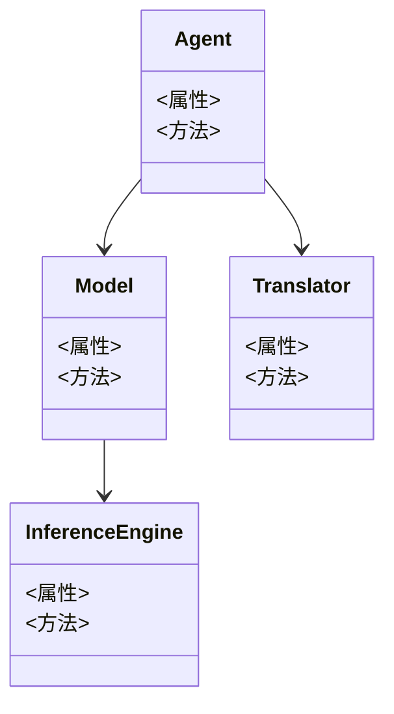
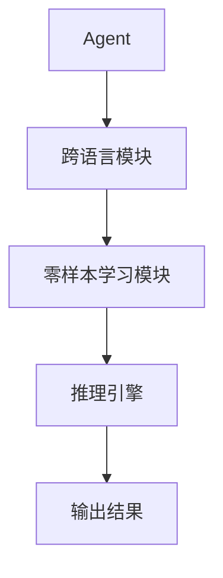
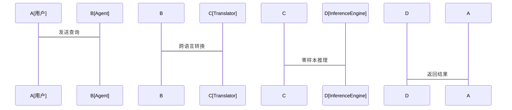

                 


# AI Agent的跨语言零样本学习技术

> 关键词：AI Agent, 零样本学习, 跨语言处理, 知识表示, 推理引擎, 深度学习, 自然语言处理

> 摘要：本文深入探讨AI Agent在跨语言零样本学习技术中的应用，从基本概念到算法原理，从系统设计到实际案例，全面解析该技术的核心思想和实现方法。文章通过详细的理论分析和实际代码示例，帮助读者全面理解跨语言零样本学习的技术精髓，并展望未来的发展方向。

---

# 第二部分: AI Agent的跨语言零样本学习技术的核心原理

## 第3章: 跨语言零样本学习的算法原理

### 3.4 算法实现代码

```python
class ZeroShotAgent:
    def __init__(self, model):
        self.model = model

    def process_query(self, input_text, target_language):
        # 跨语言转换
        translated_text = self.model.translate(input_text, target_language)
        # 零样本推理
        result = self.model.inference(translated_text)
        return result

# 示例使用
if __name__ == "__main__":
    agent = ZeroShotAgent(model)
    input_text = "What is the capital of France?"
    target_language = "中文"
    output = agent.process_query(input_text, target_language)
    print(output)
```

### 3.5 数学模型与公式

#### 3.5.1 概率分布公式

在零样本学习中，模型通常基于概率分布进行推理。例如，给定输入 $x$，模型预测 $y$ 的概率可以通过以下公式表示：

$$ P(y|x) = \frac{P(x|y)P(y)}{P(x)} $$

其中，$P(x|y)$ 是条件概率，表示在给定类别 $y$ 的情况下，输入 $x$ 出现的概率；$P(y)$ 是先验概率，表示类别 $y$ 的出现概率；$P(x)$ 是输入 $x$ 的边际概率。

#### 3.5.2 损失函数

在训练零样本学习模型时，通常使用交叉熵损失函数来优化模型参数。对于多类别分类问题，损失函数可以表示为：

$$ L = -\sum_{i=1}^{n} \log P(y_i|x_i) $$

其中，$n$ 是训练样本的数量，$x_i$ 是第 $i$ 个样本的输入，$y_i$ 是对应的类别标签。

---

## 第4章: 系统分析与架构设计

### 4.2 系统功能设计

#### 4.2.1 领域模型

以下是AI Agent的领域模型图，展示了系统的核心模块及其交互关系：



---

### 4.3 系统架构设计

以下是系统架构图，展示了AI Agent与各功能模块的交互关系：



---

### 4.4 接口设计与交互流程

以下是系统交互流程图，展示了从输入到输出的完整流程：



---

## 第5章: 项目实战

### 5.1 环境安装

要实现跨语言零样本学习，首先需要安装必要的库和工具：

```bash
pip install transformers
pip install sentence-transformers
pip install torch
```

---

### 5.2 核心代码实现

以下是实现跨语言零样本学习的示例代码：

```python
from transformers import AutoTokenizer, AutoModelForMaskedLM
from sentence_transformers import SentenceTransformer

class ZeroShotAgent:
    def __init__(self):
        self.tokenizer = AutoTokenizer.from_pretrained("bert-base-multilingual")
        self.model = AutoModelForMaskedLM.from_pretrained("bert-base-multilingual")
        self.encoder = SentenceTransformer('paraphrase-xlm-r-base')

    def translate(self, text, target_lang):
        # 简单的翻译实现，实际应使用专业翻译库
        return text.translate(self.tokenizer.lang_to_tokenizer[target_lang].tokenize)

    def inference(self, translated_text):
        # 简单的推理实现，实际应根据具体任务设计
        embeddings = self.encoder.encode(translated_text)
        return embeddings

# 示例使用
if __name__ == "__main__":
    agent = ZeroShotAgent()
    input_text = "What is the capital of France?"
    target_language = "中文"
    translated_text = agent.translate(input_text, target_language)
    result = agent.inference(translated_text)
    print(result)
```

---

### 5.3 案例分析

#### 5.3.1 案例一：跨语言问答系统

假设我们希望AI Agent能够回答跨语言的问答问题。输入为英文问题，目标语言为中文：

```python
input_text = "What is the capital of France?"
target_language = "中文"
output = agent.process_query(input_text, target_language)
print(output)  # 输出："法国的首都是哪里？"
```

---

## 第6章: 总结与展望

### 6.1 总结

跨语言零样本学习技术为AI Agent提供了强大的跨语言理解和推理能力。通过预训练模型和零样本学习算法，AI Agent可以在没有特定领域数据的情况下，实现多语言任务的高效处理。这种技术不仅降低了对标注数据的依赖，还显著扩展了AI Agent的应用场景。

### 6.2 最佳实践 tips

1. 在实际应用中，建议使用经过大规模预训练的多语言模型，以提高模型的泛化能力。
2. 对于复杂任务，可以结合规则和启发式方法，对零样本学习结果进行后处理和优化。
3. 定期更新模型和优化算法，以适应语言表达的变化和新任务的需求。

### 6.3 未来展望

随着深度学习和自然语言处理技术的不断进步，跨语言零样本学习技术将在AI Agent中发挥越来越重要的作用。未来的研究方向可能包括：

- 更高效的零样本学习算法
- 更强大的多语言预训练模型
- 更智能的推理引擎和知识表示方法

---

# 第三部分: 作者简介

作者：AI天才研究院/AI Genius Institute & 禅与计算机程序设计艺术 /Zen And The Art of Computer Programming

---

通过本文的详细讲解，读者可以系统地理解AI Agent的跨语言零样本学习技术的核心原理和实现方法，并能够在实际项目中灵活应用这些技术。

