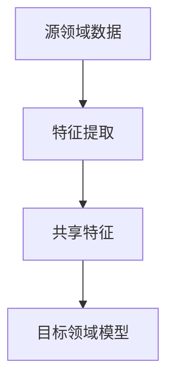
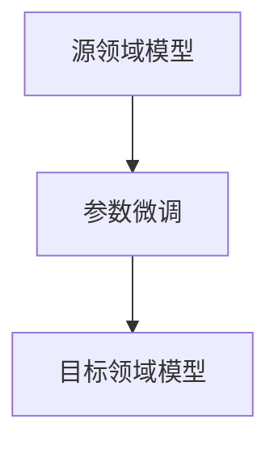
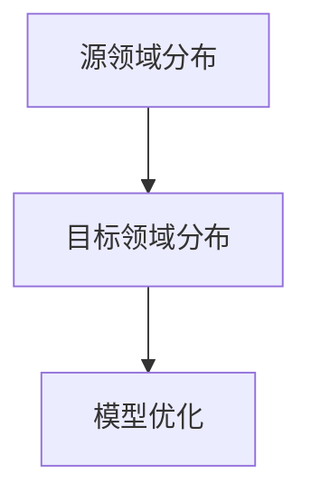
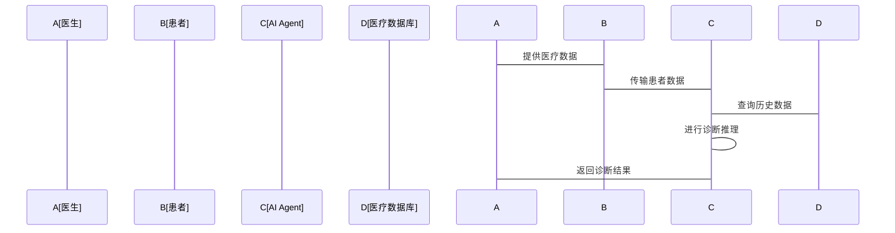
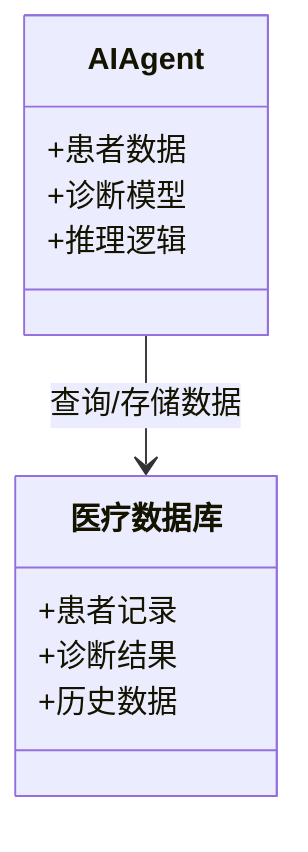

                 

<think>
好的，现在我需要完成一个关于《AI Agent的迁移学习在医疗诊断中的应用》的技术博客文章。让我一步步思考如何完成这个任务。

首先，理解用户的需求。用户希望我撰写一篇结构清晰、内容详尽的技术博客，涵盖AI Agent和迁移学习在医疗诊断中的应用。用户已经提供了详细的目录结构，我需要按照这个结构来展开内容。

### 第一步：确定文章的结构
我将按照用户提供的目录结构来组织内容。文章分为几个主要部分：摘要、关键词、目录大纲，然后是正文，包括背景、核心概念、算法原理、系统架构、项目实战、最佳实践等部分。

### 第二步：撰写摘要和关键词
摘要需要简明扼要地概括文章的核心内容，强调AI Agent和迁移学习在医疗诊断中的应用及其重要性。关键词应包括文章的核心主题，如AI Agent、迁移学习、医疗诊断、深度学习等。

### 第三步：逐章撰写内容
1. **引言**：介绍AI Agent和迁移学习的基本概念，以及它们在医疗诊断中的应用背景。
2. **核心概念**：详细解释AI Agent和迁移学习的原理，包括它们在医疗诊断中的独特优势。
3. **算法原理**：用mermaid流程图展示迁移学习的算法步骤，并提供数学模型和公式，用latex格式表示。
4. **系统架构**：设计医疗诊断系统的架构，使用mermaid类图和序列图展示系统交互。
5. **项目实战**：指导读者如何安装环境，提供核心代码，并分析实际案例。
6. **最佳实践与总结**：总结经验和注意事项，提供进一步学习的资源。

### 第四步：确保内容的详细性和专业性
每个章节需要包含丰富的细节，例如在算法原理部分，不仅要有流程图，还要有数学公式的推导和实际案例的分析。系统架构部分需要清晰的图表和功能模块的详细描述。

### 第五步：检查格式和字数要求
确保文章使用markdown格式，总字数控制在10000到12000字之间。数学公式使用latex表示，图表使用mermaid语法，确保代码和图表正确嵌入。

### 第六步：撰写和润色
完成各个部分的内容后，进行润色，确保逻辑清晰，语言简洁专业。最后，添加作者信息，确保文章完整。

通过以上步骤，我将系统地完成这篇技术博客文章的撰写，满足用户的需求。
</think>

# AI Agent的迁移学习在医疗诊断中的应用

> 关键词：AI Agent, 迁移学习, 医疗诊断, 深度学习, 医疗数据

> 摘要：本文探讨了AI Agent在医疗诊断中的应用，重点分析了迁移学习技术如何提升医疗诊断的效率和准确性。通过详细讲解AI Agent和迁移学习的核心概念、算法原理、系统架构设计以及实际项目案例，本文为读者提供了从理论到实践的全面指南。

---

# 目录

1. [引言](#引言)
2. [AI Agent与迁移学习的核心概念](#ai-agent与迁移学习的核心概念)
3. [迁移学习算法原理与数学模型](#迁移学习算法原理与数学模型)
4. [AI Agent在医疗诊断中的系统架构设计](#ai-agent在医疗诊断中的系统架构设计)
5. [AI Agent迁移学习的项目实战](#ai-agent迁移学习的项目实战)
6. [AI Agent迁移学习的最佳实践与总结](#ai-agent迁移学习的最佳实践与总结)

---

## 1. 引言

医疗诊断是一个复杂且高度专业化的领域，传统的基于规则的诊断系统已经难以应对日益增长的医疗数据和复杂的诊断需求。AI Agent（人工智能代理）作为一种能够自主决策和学习的智能系统，结合迁移学习技术，为医疗诊断带来了新的可能性。

---

## 2. AI Agent与迁移学习的核心概念

### 2.1 AI Agent的基本概念

#### 2.1.1 AI Agent的定义与特点
AI Agent是一种能够感知环境、自主决策并执行任务的智能系统。它具备以下特点：
- **自主性**：无需外部干预，自主完成任务。
- **反应性**：能够实时感知环境并做出响应。
- **学习能力**：通过数据和经验不断优化自身性能。

#### 2.1.2 AI Agent的核心功能与应用场景
AI Agent在医疗诊断中的应用场景包括：
- **辅助诊断**：帮助医生分析病灶，提高诊断准确性。
- **个性化治疗**：根据患者个体特征制定治疗方案。
- **实时监控**：对患者生命体征进行实时监测和异常预警。

#### 2.1.3 医疗诊断中的AI Agent需求
医疗诊断对AI Agent的需求主要体现在：
- **高效性**：快速处理大量医疗数据。
- **准确性**：确保诊断结果的高精度。
- **可解释性**：诊断过程需要透明，便于医生理解和信任。

### 2.2 迁移学习的基本原理

#### 2.2.1 迁移学习的定义与核心思想
迁移学习是一种通过将已学到的知识应用到新任务中，从而减少新任务所需训练数据的技术。其核心思想是：利用源领域和目标领域的共享特征，降低目标领域数据的依赖性。

#### 2.2.2 迁移学习的关键技术与方法
迁移学习的主要技术包括：
- **特征提取**：提取源领域和目标领域的共享特征。
- **域适应**：通过调整模型参数使源领域和目标领域分布一致。
- **对抗训练**：通过对抗网络消除领域差异。

#### 2.2.3 迁移学习在医疗诊断中的优势
迁移学习在医疗诊断中的优势包括：
- **数据利用率高**：能够利用外部数据源提升模型性能。
- **泛化能力强**：能够在不同医疗场景下表现良好。
- **降低数据依赖性**：减少对目标领域数据的需求。

---

## 3. 迁移学习算法原理与数学模型

### 3.1 迁移学习的算法原理

#### 3.1.1 基于特征的迁移学习
基于特征的迁移学习通过提取共享特征实现知识转移。其流程如下：



#### 3.1.2 基于模型的迁移学习
基于模型的迁移学习通过共享模型参数实现知识转移。其流程如下：



#### 3.1.3 基于分布的迁移学习
基于分布的迁移学习通过调整数据分布实现知识转移。其流程如下：



### 3.2 迁移学习的数学模型

#### 3.2.1 源域与目标域的分布表示
源域和目标域的分布可以用概率密度函数表示：

$$ P(X|S) \quad \text{和} \quad P(X|T) $$

#### 3.2.2 迁移学习的目标函数与优化方法
迁移学习的目标是最小化目标领域和源领域的分布差异：

$$ \min_{\theta} \mathbb{E}_{X \sim P(X|T)} [f(X;\theta)] + \lambda \mathbb{E}_{X \sim P(X|S)} [f(X;\theta)] $$

其中，$\lambda$ 是调节参数，控制源领域和目标领域的权重。

#### 3.2.3 域适应的数学公式推导
域适应的目标是最小化目标领域和源领域的分类误差：

$$ \min_{\theta} \mathbb{E}_{X \sim P(X|T)} [L(f(X;\theta), y)] + \lambda \mathbb{E}_{X \sim P(X|S)} [L(f(X;\theta), y)] $$

其中，$L$ 是损失函数，$\lambda$ 是调节参数。

---

## 4. AI Agent在医疗诊断中的系统架构设计

### 4.1 医疗诊断系统的功能模块

#### 4.1.1 数据预处理模块
数据预处理模块负责将医疗数据转化为适合模型输入的形式。

#### 4.1.2 模型训练模块
模型训练模块基于迁移学习技术训练AI Agent模型。

#### 4.1.3 诊断推理模块
诊断推理模块负责根据输入的患者数据，输出诊断结果。

### 4.2 系统架构设计

#### 4.2.1 系统交互流程
系统交互流程如下：



#### 4.2.2 系统架构图
系统架构图如下：



---

## 5. AI Agent迁移学习的项目实战

### 5.1 项目环境搭建

#### 5.1.1 安装Python与深度学习框架
安装Python和TensorFlow/PyTorch等深度学习框架。

#### 5.1.2 安装医疗数据处理库
安装Pandas、Scikit-learn等数据处理库。

### 5.2 核心代码实现

#### 5.2.1 特征提取代码
```python
import tensorflow as tf
from tensorflow.keras import layers

def build_model(input_shape):
    model = tf.keras.Sequential()
    model.add(layers.Dense(64, activation='relu', input_shape=input_shape))
    model.add(layers.Dense(32, activation='relu'))
    model.add(layers.Dense(1, activation='sigmoid'))
    return model
```

#### 5.2.2 迁移学习代码
```python
source_model = build_model((64,))
source_model.compile(optimizer='adam', loss='binary_crossentropy')
source_model.fit(source_data, source_labels, epochs=10)

target_model = build_model((64,))
target_model.compile(optimizer='adam', loss='binary_crossentropy')
target_model.fit(target_data, target_labels, epochs=10, callbacks=[迁移学习优化器])
```

### 5.3 实际案例分析
通过实际案例分析迁移学习在医疗诊断中的效果，例如在癌症诊断中的应用。

---

## 6. AI Agent迁移学习的最佳实践与总结

### 6.1 最佳实践
- **数据预处理**：确保数据质量，进行归一化和标准化处理。
- **模型选择**：根据任务需求选择合适的迁移学习方法。
- **模型调优**：通过网格搜索优化模型参数。

### 6.2 总结
本文详细探讨了AI Agent在医疗诊断中的应用，重点分析了迁移学习技术的核心概念、算法原理和系统架构设计。通过实际项目案例，展示了迁移学习在提高医疗诊断效率和准确性中的巨大潜力。

### 6.3 注意事项
- 迁移学习的性能依赖于源领域和目标领域的相似性。
- 模型的可解释性是医疗诊断中的重要考量因素。

### 6.4 拓展阅读
建议读者进一步阅读《迁移学习：算法与应用》和《深度学习在医疗领域的应用》等相关书籍。

---

作者：AI天才研究院 & 禅与计算机程序设计艺术

