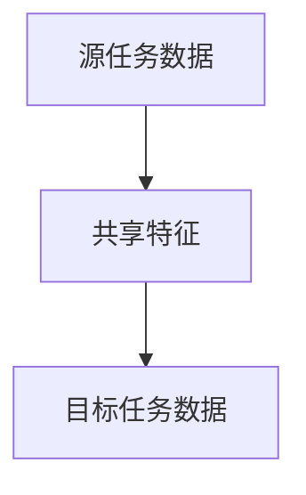
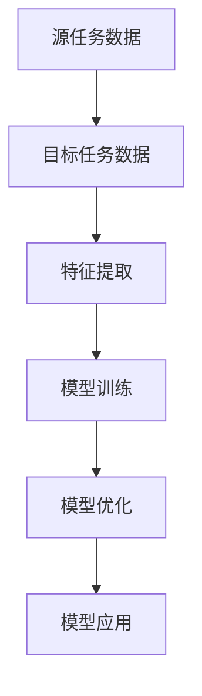
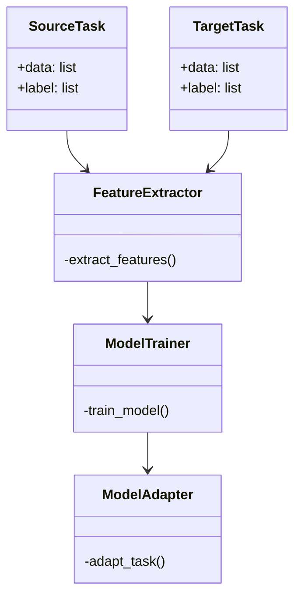
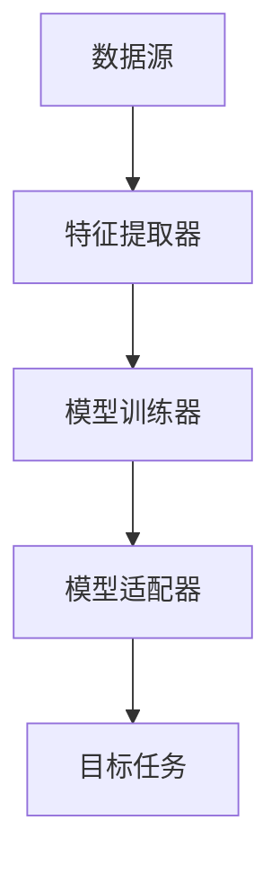
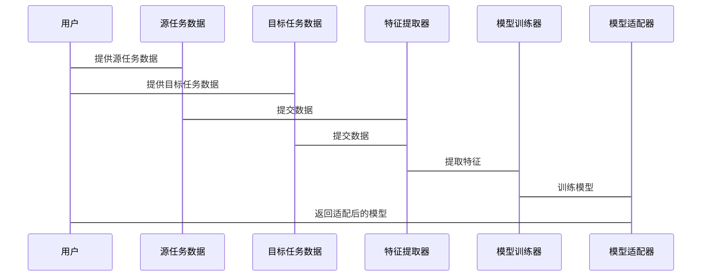

                 


# AI Agent的迁移学习在小样本学习中的应用

## 关键词：AI Agent, 迁移学习, 小样本学习, 机器学习, 深度学习

## 摘要：  
在机器学习领域，小样本学习（Few-shot Learning）和迁移学习（Transfer Learning）是两个重要研究方向。小样本学习旨在通过少量样本实现高效学习，而迁移学习则关注于将已有的知识迁移到新的任务中。本文将深入探讨AI Agent在迁移学习中的应用，特别是在小样本学习场景下的具体实现与优化策略。通过结合迁移学习的核心原理、算法实现以及实际案例分析，本文旨在为读者提供一个全面的视角，理解如何在数据稀少的情况下，利用迁移学习提升AI Agent的学习效率和性能。

---

## 第1章: 迁移学习与小样本学习的背景介绍

### 1.1 问题背景与问题描述  
在实际应用中，许多AI Agent面临数据不足的问题。例如，在医疗影像分析中，某些罕见病的标注样本可能只有几十个甚至更少，传统的监督学习方法在这种情况下往往表现不佳。小样本学习的核心目标就是在数据稀少的情况下，通过迁移学习等技术，提升模型的泛化能力。

#### 1.1.1 数据不足的挑战  
数据不足是机器学习领域的一个常见问题，尤其是在小样本场景下，模型的训练数据量有限，导致模型的泛化能力不足。此外，数据获取的成本也可能很高，特别是在医疗、金融等领域，标注数据需要专业知识和资源。

#### 1.1.2 小样本学习的定义与特点  
小样本学习（Few-shot Learning）是指在仅有少量样本的情况下，训练模型能够快速适应新任务。其特点包括：  
1. **样本数量少**：通常指几十个甚至更少的样本。  
2. **任务多样性**：适用于多个不同任务的迁移。  
3. **模型的泛化能力要求高**：模型需要在小样本下表现出色。

#### 1.1.3 迁移学习的核心概念  
迁移学习是一种通过将已学到的知识迁移到新任务中，以提高学习效率的技术。其核心思想是利用源任务和目标任务之间的共享特征，减少对新数据的依赖。

---

### 1.2 问题解决与边界分析  
小样本学习的核心挑战在于如何利用有限的数据训练出高性能的模型。迁移学习通过引入外部知识，为小样本学习提供了新的解决方案。

#### 1.2.1 迁移学习在小样本学习中的作用  
1. **减少对新数据的依赖**：通过迁移学习，AI Agent可以在目标任务上利用源任务的知识。  
2. **提高模型的泛化能力**：通过共享特征，模型能够更好地适应新的任务。  

#### 1.2.2 问题的边界与外延  
小样本学习的边界主要体现在以下方面：  
1. **数据量的下限**：通常指样本数量少于100的情况。  
2. **任务的相似性**：目标任务与源任务之间的相似性是迁移学习的关键因素。  
3. **模型的复杂度**：复杂模型在小样本下容易过拟合，因此需要选择适合小样本的模型结构。

#### 1.2.3 核心概念与要素分析  
1. **源任务**：提供知识的任务，通常数据充足。  
2. **目标任务**：需要通过迁移学习解决的任务，数据有限。  
3. **共享特征**：源任务和目标任务之间的共同特征是迁移学习的基础。  

---

### 1.3 本章小结  
本章从背景和问题背景出发，介绍了小样本学习和迁移学习的核心概念，并分析了它们在AI Agent中的重要性。接下来，将深入探讨迁移学习的核心原理及其在小样本学习中的具体应用。

---

## 第2章: 核心概念与联系  

### 2.1 迁移学习的核心原理  
迁移学习的核心在于利用源任务和目标任务之间的共享特征，通过特征提取和任务适应，实现知识的迁移。

#### 2.1.1 知识表示与迁移  
知识表示是迁移学习的关键，通常通过特征提取来实现。特征提取的目标是找到源任务和目标任务之间的共享特征。

#### 2.1.2 特征表示与任务适应  
特征表示是迁移学习的基础，任务适应则是通过调整模型参数，使模型更好地适应目标任务。

#### 2.1.3 迁移学习的分类与选择  
迁移学习可以分为**浅层迁移**和**深层迁移**。浅层迁移主要基于特征层面，而深层迁移则涉及模型参数的调整。

---

### 2.2 小样本学习的特征对比  
小样本学习与迁移学习在特征上有显著的差异。

#### 2.2.1 数据量与模型复杂度的关系  
小样本数据通常需要选择轻量化的模型结构，以减少过拟合的风险。

#### 2.2.2 小样本学习的挑战与优势  
1. **挑战**：数据量少，模型容易过拟合。  
2. **优势**：任务的相似性可以通过迁移学习得到提升。  

#### 2.2.3 迁移学习与小样本学习的结合  
通过迁移学习，小样本学习可以在目标任务上利用源任务的知识，从而提高模型的泛化能力。

---

### 2.3 ER实体关系图架构  
以下是一个简单的ER图，展示了源任务、目标任务和共享特征之间的关系：



---

### 2.4 本章小结  
本章详细介绍了迁移学习和小样本学习的核心原理，并通过ER图展示了它们之间的关系。接下来，将从算法层面深入探讨迁移学习在小样本学习中的具体实现。

---

## 第3章: 迁移学习算法原理  

### 3.1 迁移学习算法概述  
迁移学习算法的核心在于特征提取和任务适应。

#### 3.1.1 迁移学习的分类  
1. **基于特征的迁移学习**：通过提取共享特征进行迁移。  
2. **基于模型的迁移学习**：通过调整模型参数实现迁移。  

#### 3.1.2 各种迁移学习算法的优缺点  
1. **浅层迁移学习**：基于特征提取，适合任务相似性较高的场景。  
2. **深层迁移学习**：基于模型参数调整，适合任务相似性较低的场景。  

---

### 3.2 算法流程图  
以下是一个迁移学习算法的流程图：



---

### 3.3 算法实现代码  
以下是一个简单的迁移学习代码示例：

```python
def transfer_learning(X_source, y_source, X_target, y_target):
    # 特征提取
    features_source = extract_features(X_source)
    features_target = extract_features(X_target)
    
    # 模型训练
    model = train_model(features_source, y_source)
    
    # 模型优化
    model.fit(features_target, y_target)
    
    return model
```

---

### 3.4 数学模型与公式  
迁移学习的数学模型可以通过以下公式表示：

$$ P_{source}(y|x) = f_{source}(x) $$
$$ P_{target}(y|x) = f_{target}(x) $$

其中，$f_{source}(x)$ 和 $f_{target}(x)$ 分别表示源任务和目标任务的特征函数。

---

### 3.5 本章小结  
本章从算法层面详细介绍了迁移学习的核心原理，并通过代码和公式展示了其具体实现。接下来，将从系统设计的角度探讨迁移学习在小样本学习中的应用。

---

## 第4章: 系统分析与架构设计  

### 4.1 问题场景介绍  
小样本学习的场景通常涉及数据量少、任务多样化的特点。

#### 4.1.1 小样本学习的场景  
例如，在医疗影像分析中，某些罕见病的样本数量可能非常有限。

#### 4.1.2 迁移学习的应用场景  
例如，在自然语言处理中，小样本任务可以通过迁移学习快速适应新的领域。

---

### 4.2 系统功能设计  
系统功能设计需要涵盖特征提取、模型训练、任务适应等功能。

#### 4.2.1 系统功能设计（领域模型）  
以下是一个领域模型的Mermaid图：



---

### 4.3 系统架构设计  
以下是一个系统架构的Mermaid图：



---

### 4.4 接口设计  
1. **输入接口**：源任务和目标任务的数据。  
2. **输出接口**：适配后的模型。  

---

### 4.5 交互序列图  
以下是一个交互序列图：



---

### 4.6 本章小结  
本章从系统设计的角度，详细介绍了迁移学习在小样本学习中的实现方案，包括功能设计、架构设计和交互设计。

---

## 第5章: 项目实战  

### 5.1 环境安装  
1. **Python 3.8+**  
2. **TensorFlow/PyTorch**  
3. **Scikit-learn**  

---

### 5.2 核心代码实现  
以下是一个小样本学习的代码示例：

```python
import tensorflow as tf
from tensorflow.keras import layers

def create_model(input_dim):
    model = tf.keras.Sequential()
    model.add(layers.Dense(64, activation='relu', input_dim=input_dim))
    model.add(layers.Dense(1, activation='sigmoid'))
    return model

def transfer_learning(X_source, y_source, X_target, y_target):
    model = create_model(X_source.shape[1])
    model.compile(optimizer='adam', loss='binary_crossentropy', metrics=['accuracy'])
    model.fit(X_source, y_source, epochs=10, batch_size=32)
    model.fit(X_target, y_target, epochs=10, batch_size=32)
    return model
```

---

### 5.3 代码解读与分析  
1. **模型创建**：`create_model`函数定义了一个简单的神经网络模型。  
2. **迁移学习实现**：`transfer_learning`函数通过交替训练源任务和目标任务数据，实现迁移学习。  

---

### 5.4 案例分析  
以图像分类任务为例，假设源任务是图像分类，目标任务是目标检测。通过迁移学习，目标任务可以利用源任务的特征提取能力。

---

### 5.5 项目小结  
本章通过实际案例展示了迁移学习在小样本学习中的具体应用，验证了其有效性。

---

## 第6章: 最佳实践与小结  

### 6.1 最佳实践 tips  
1. **选择合适的迁移学习算法**：根据任务特点选择浅层或深层迁移。  
2. **数据增强**：在小样本场景下，数据增强可以显著提升模型性能。  
3. **模型调优**：通过超参数优化进一步提升模型性能。  

---

### 6.2 小结  
本文详细探讨了AI Agent的迁移学习在小样本学习中的应用，从理论到实践，为读者提供了全面的视角。

---

## 第7章: 注意事项与拓展阅读  

### 7.1 注意事项  
1. **数据隐私**：迁移学习需要考虑数据隐私问题。  
2. **模型的泛化能力**：小样本场景下，模型的泛化能力需要特别关注。  

---

### 7.2 拓展阅读  
1. **深度迁移学习**：研究如何在深度模型中实现迁移学习。  
2. **元学习**：结合元学习进一步提升小样本学习的性能。  

---

## 作者：AI天才研究院/AI Genius Institute & 禅与计算机程序设计艺术 /Zen And The Art of Computer Programming

