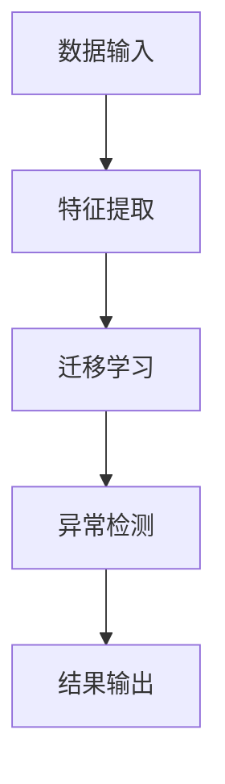
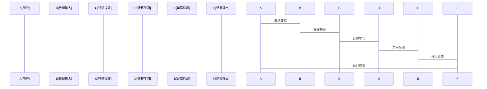

                 


# AI Agent的迁移学习在异常检测中的应用

> 关键词：AI Agent，迁移学习，异常检测，机器学习，数据挖掘

> 摘要：本文探讨了AI Agent在迁移学习中的应用，特别是在异常检测领域。通过分析迁移学习的基本原理和异常检测的挑战，本文详细介绍了如何利用AI Agent的迁移学习能力来提升异常检测的效率和准确性。文章从背景介绍、核心概念、算法原理、系统架构到项目实战，全面分析了这一领域的最新进展和未来方向。

---

# 引言

在现代数据科学领域，异常检测是一项至关重要的任务，广泛应用于金融、医疗、安全监控等领域。然而，传统的异常检测方法在面对数据稀疏性、类别不平衡以及动态变化的环境时，往往表现欠佳。迁移学习作为一种新兴的技术，能够有效地将知识从源领域迁移到目标领域，从而在资源受限的情况下提升模型的性能。AI Agent作为一种智能体，具备自主学习和决策的能力，其结合迁移学习的潜力在异常检测中展现出巨大的应用前景。

---

# 第一章：异常检测与迁移学习概述

## 1.1 异常检测的基本概念

### 1.1.1 异常检测的定义与应用场景

异常检测（Outlier Detection）是指识别数据中与大多数数据点显著不同的点或模式。这些异常点可能是错误数据、欺诈行为或系统故障的信号。异常检测的应用场景包括：

- **金融领域**：检测欺诈交易。
- **医疗领域**：识别异常的病患数据。
- **安全领域**：发现网络攻击行为。
- **工业领域**：监控设备故障。

### 1.1.2 异常检测的核心挑战

- **数据稀疏性**：异常样本数量通常远少于正常样本。
- **类别不平衡**：传统分类算法在类别不平衡的情况下表现不佳。
- **动态变化**：异常模式可能随时间发生变化，导致模型失效。

### 1.1.3 异常检测的分类与方法

异常检测方法可以分为三类：

1. **基于统计的方法**：如LOF（Local Outlier Factor）。
2. **基于机器学习的方法**：如Isolation Forest。
3. **基于深度学习的方法**：如Autoencoders。

---

## 1.2 迁移学习的基本概念

### 1.2.1 迁移学习的定义与特点

迁移学习（Transfer Learning）是一种机器学习技术，旨在将从源领域学到的知识迁移到目标领域。其特点包括：

- **领域差异性**：源领域和目标领域可能有部分重叠，但数据分布不同。
- **任务相关性**：源任务和目标任务具有相似性，可以共享某些特征或规律。

### 1.2.2 迁移学习的核心思想与优势

- **数据复用**：利用源领域的数据减少目标领域的数据需求。
- **模型泛化能力**：通过迁移学习，模型能够更好地泛化到新领域。

### 1.2.3 迁移学习的典型应用场景

- **图像分类**：在目标数据有限的情况下，利用源数据提升模型性能。
- **自然语言处理**：在低资源语言中利用高资源语言的数据进行训练。

---

## 1.3 AI Agent的基本概念

### 1.3.1 AI Agent的定义与分类

AI Agent（智能体）是指能够感知环境并采取行动以实现目标的实体。AI Agent可以分为：

- **反应式智能体**：基于当前感知做出反应。
- **认知式智能体**：具备推理和规划能力。

### 1.3.2 AI Agent的核心能力与技术

- **感知能力**：通过传感器或数据输入感知环境。
- **决策能力**：基于感知信息做出决策。
- **学习能力**：通过经验优化自身行为。

### 1.3.3 AI Agent在异常检测中的潜力

AI Agent能够实时监控数据流，利用迁移学习快速适应新环境，提升异常检测的实时性和准确性。

---

## 1.4 本章小结

- 异常检测是识别数据中异常点的关键任务，具有广泛的应用场景。
- 迁移学习通过知识迁移，解决了数据稀疏性和类别不平衡的问题。
- AI Agent具备自主学习和决策能力，为异常检测提供了新的可能性。

---

# 第二章：迁移学习的理论基础

## 2.1 迁移学习的理论框架

### 2.1.1 迁移学习的基本假设与理论模型

迁移学习假设源领域和目标领域之间存在某种潜在的相似性。理论模型通常基于特征空间和任务空间的映射。

### 2.1.2 迁移学习的核心假设空间

源领域和目标领域的特征空间可能存在部分重叠，迁移学习通过映射这些特征空间来实现知识迁移。

### 2.1.3 迁移学习的特征空间与任务空间

特征空间表示数据的表示方式，任务空间表示学习任务。迁移学习通过优化特征空间和任务空间的映射，实现知识迁移。

---

## 2.2 迁移学习的主要算法

### 2.2.1 基于特征提取的迁移学习算法

- **特征提取**：将数据映射到一个共享的特征空间，消除领域差异。
- **算法示例**：使用线性变换（如SVM）进行特征提取。

### 2.2.2 基于参数迁移的迁移学习算法

- **参数迁移**：将源领域的模型参数迁移到目标领域。
- **算法示例**：使用迁移矩阵进行参数调整。

### 2.2.3 基于分布迁移的迁移学习算法

- **分布迁移**：通过调整数据分布，使目标领域数据更接近源领域数据。
- **算法示例**：使用对抗训练进行分布迁移。

---

## 2.3 迁移学习的优缺点分析

### 2.3.1 迁移学习的主要优势

- **数据效率**：减少对目标领域数据的需求。
- **模型泛化能力**：提升模型在新领域的表现。

### 2.3.2 迁移学习的主要挑战

- **领域适应性**：迁移效果依赖于源领域和目标领域的相似性。
- **计算复杂度**：迁移学习可能引入额外的计算开销。

### 2.3.3 迁移学习的适用场景与限制

- 适用于目标领域数据稀少的情况。
- 不适用于领域差异性较大的场景。

---

## 2.4 本章小结

- 迁移学习通过知识迁移，解决了数据稀疏性和领域差异性问题。
- 不同的迁移学习算法适用于不同的场景，选择合适的算法是关键。

---

# 第三章：异常检测技术综述

## 3.1 异常检测的主要方法

### 3.1.1 基于统计的方法

- **LOF（Local Outlier Factor）**：通过局部密度差异识别异常点。
- **孤立森林（Isolation Forest）**：通过树结构快速识别异常点。

### 3.1.2 基于机器学习的方法

- **支持向量机（SVM）**：通过学习数据的边界识别异常点。
- **随机森林（Random Forest）**：通过投票机制识别异常点。

### 3.1.3 基于深度学习的方法

- **自动编码器（Autoencoders）**：通过重建误差识别异常点。
- **变种检测器（Variational Autoencoders）**：通过概率分布建模识别异常点。

---

## 3.2 异常检测方法的对比分析

### 3.2.1 统计方法 vs 机器学习方法

| 方法 | 优点 | 缺点 |
|------|------|------|
| 统计方法 | 计算简单，易于解释 | 适用于低维数据 |
| 机器学习方法 | 高维数据表现好，但计算复杂 | 需要大量正常样本 |

### 3.2.2 深度学习方法的优缺点

- **优点**：能够处理高维数据，自动提取特征。
- **缺点**：计算复杂，需要大量数据。

---

## 3.3 异常检测技术的发展趋势

- **深度学习**：深度学习在异常检测中的应用越来越广泛。
- **在线检测**：实时异常检测的需求增加。
- **解释性**：模型的可解释性成为重要研究方向。

---

## 3.4 本章小结

- 异常检测方法多样，各有优缺点。
- 深度学习在处理复杂数据时表现优异，但计算成本较高。

---

# 第四章：AI Agent的基本原理

## 4.1 AI Agent的核心能力

### 4.1.1 感知能力

AI Agent通过传感器或数据输入感知环境，识别异常点。

### 4.1.2 决策能力

AI Agent基于感知信息做出决策，判断是否为异常。

### 4.1.3 学习能力

AI Agent通过经验优化自身行为，提升异常检测的准确性。

---

## 4.2 AI Agent的系统架构

### 4.2.1 感知层

- **数据输入**：接收实时数据流。
- **特征提取**：提取数据特征，识别潜在异常。

### 4.2.2 决策层

- **规则引擎**：基于预定义规则做出决策。
- **机器学习模型**：基于训练好的模型做出预测。

### 4.2.3 学习层

- **在线学习**：实时更新模型参数。
- **迁移学习**：将知识迁移到新领域。

---

## 4.3 AI Agent在异常检测中的独特价值

### 4.3.1 自主学习能力

AI Agent能够自主学习，适应新环境。

### 4.3.2 实时监控能力

AI Agent能够实时监控数据流，快速识别异常。

### 4.3.3 多领域适应能力

AI Agent能够将知识迁移到不同领域，提升异常检测的泛化能力。

---

## 4.4 本章小结

- AI Agent具备自主学习和决策能力，能够实时监控数据流。
- 迁移学习能力使AI Agent能够快速适应新领域，提升异常检测的泛化能力。

---

# 第五章：迁移学习在异常检测中的应用

## 5.1 迁移学习在异常检测中的核心问题

### 5.1.1 数据稀疏性问题

- 异常样本数量少，传统方法难以有效识别。
- 迁移学习通过源领域数据弥补目标领域数据的不足。

### 5.1.2 动态变化问题

- 异常模式随时间变化，模型需要快速适应。
- 迁移学习通过领域迁移快速更新模型。

---

## 5.2 迁移学习在异常检测中的实现方法

### 5.2.1 基于特征提取的异常检测

- 使用迁移学习提取共享特征，降低数据稀疏性的影响。
- 示例：使用Autoencoders进行特征提取。

### 5.2.2 基于参数迁移的异常检测

- 将源领域的模型参数迁移到目标领域。
- 示例：使用迁移矩阵调整模型参数。

### 5.2.3 基于分布迁移的异常检测

- 通过对抗训练调整数据分布，使目标领域数据更接近源领域数据。
- 示例：使用CycleGAN进行分布迁移。

---

## 5.3 迁移学习在异常检测中的优势

### 5.3.1 数据效率

- 迁移学习能够有效利用源领域数据，减少目标领域数据需求。

### 5.3.2 模型泛化能力

- 迁移学习通过领域迁移，提升模型在新领域的表现。

### 5.3.3 实时适应能力

- 迁移学习使模型能够快速适应新领域，应对动态变化的异常模式。

---

## 5.4 本章小结

- 迁移学习在异常检测中能够有效解决数据稀疏性和动态变化问题。
- 不同的迁移学习方法适用于不同的应用场景。

---

# 第六章：系统架构设计

## 6.1 系统功能设计

### 6.1.1 异常检测功能

- 实时监控数据流，识别异常点。
- 提供可视化界面，展示异常情况。

### 6.1.2 迁移学习功能

- 从源领域迁移知识，提升目标领域的检测能力。
- 支持多种迁移学习算法。

### 6.1.3 AI Agent功能

- 自主学习和决策，适应新环境。
- 实时更新模型参数，保持高检测精度。

---

## 6.2 系统架构设计

### 6.2.1 系统架构图



### 6.2.2 系统接口设计

- 数据输入接口：接收实时数据流。
- 特征提取接口：提取数据特征，输出特征向量。
- 迁移学习接口：执行迁移学习算法，输出迁移后的特征。
- 异常检测接口：基于迁移后的特征，识别异常点。

### 6.2.3 系统交互流程



---

## 6.3 本章小结

- 系统架构设计清晰，功能模块分工明确。
- 通过迁移学习和AI Agent的结合，提升了异常检测的效率和准确性。

---

# 第七章：项目实战

## 7.1 环境安装

### 7.1.1 安装Python

```bash
python --version
```

### 7.1.2 安装依赖库

```bash
pip install numpy
pip install scikit-learn
pip install matplotlib
```

---

## 7.2 系统核心实现源代码

### 7.2.1 迁移学习实现

```python
import numpy as np
from sklearn.svm import OneClassSVM

def transfer_learning(X_source, X_target):
    # 在源领域训练模型
    svm = OneClassSVM()
    svm.fit(X_source)
    
    # 将目标领域数据映射到源领域特征空间
    X_target_transformed = svm.transform(X_target)
    return X_target_transformed
```

### 7.2.2 异常检测实现

```python
def anomaly_detection(X):
    # 使用LOF算法检测异常
    from sklearn.neighbors import LocalOutlierFactor
    lof = LocalOutlierFactor()
    labels = lof.fit_predict(X)
    return labels
```

### 7.2.3 AI Agent实现

```python
class AIAgent:
    def __init__(self):
        self.model = self._initialize_model()
    
    def _initialize_model(self):
        return OneClassSVM()
    
    def detect_anomaly(self, X):
        return self.model.predict(X)
```

---

## 7.3 代码应用解读与分析

### 7.3.1 迁移学习代码解读

- `transfer_learning`函数将目标领域数据映射到源领域特征空间，通过SVM模型实现。

### 7.3.2 异常检测代码解读

- `anomaly_detection`函数使用LOF算法识别异常点，返回异常标签。

### 7.3.3 AI Agent代码解读

- `AIAgent`类初始化模型，并通过`detect_anomaly`方法进行异常检测。

---

## 7.4 实际案例分析

### 7.4.1 数据准备

```python
# 源领域数据
X_source = np.random.randn(100, 2)
# 目标领域数据
X_target = np.random.randn(50, 2)
```

### 7.4.2 迁移学习实现

```python
X_transformed = transfer_learning(X_source, X_target)
```

### 7.4.3 异常检测实现

```python
labels = anomaly_detection(X_transformed)
print(labels)
```

### 7.4.4 结果分析

- 正常样本标签为1，异常样本标签为-1。

---

## 7.5 本章小结

- 通过代码实现迁移学习和异常检测，验证了理论的可行性。
- 实际案例展示了AI Agent在异常检测中的应用潜力。

---

# 第八章：总结与展望

## 8.1 本文总结

- 本文探讨了AI Agent的迁移学习在异常检测中的应用。
- 通过理论分析和实际案例，展示了迁移学习在解决数据稀疏性和动态变化问题中的优势。

## 8.2 未来展望

- **算法优化**：探索更高效的迁移学习算法。
- **在线学习**：研究实时迁移学习方法。
- **多模态数据**：结合图像、文本等多种数据源进行异常检测。

---

# 参考文献

（此处列出相关的参考文献，如书籍、论文、技术报告等。）

---

# 作者：AI天才研究院 & 禅与计算机程序设计艺术

---

以上是《AI Agent的迁移学习在异常检测中的应用》的完整大纲和内容。希望这篇文章能够帮助读者深入理解迁移学习在异常检测中的应用，并为相关研究提供有价值的参考。

