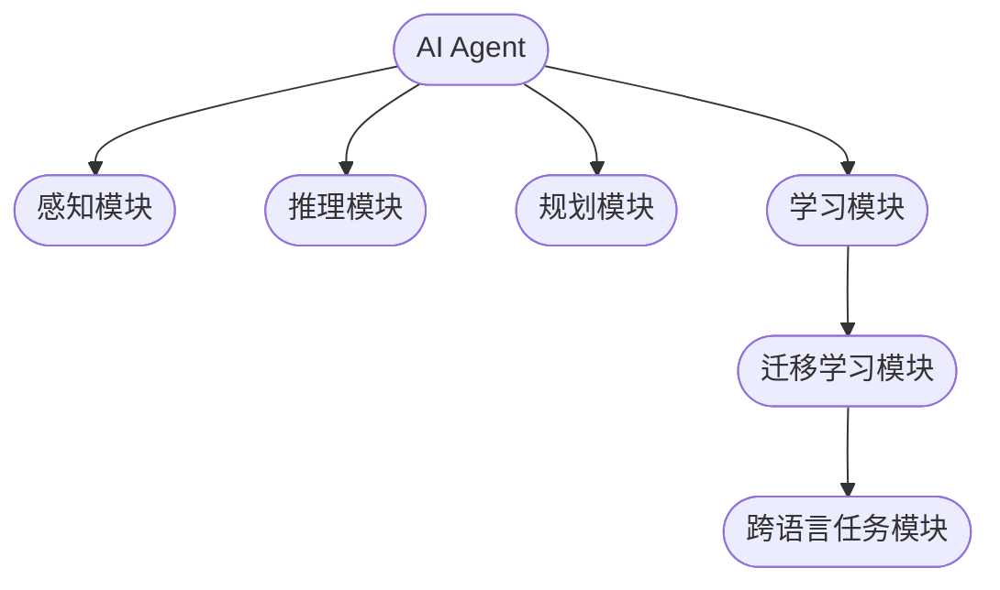
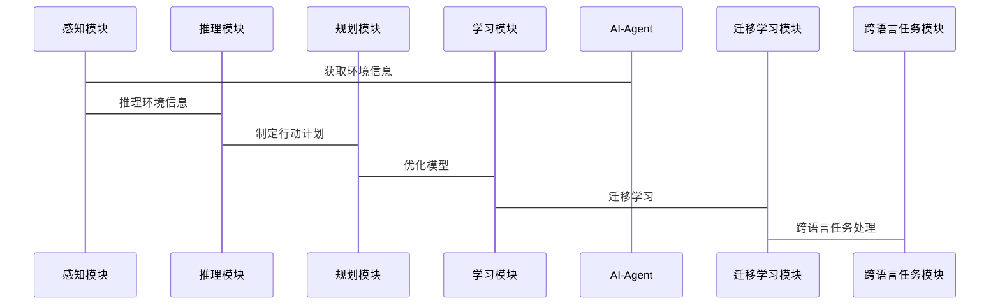

                 


# AI Agent的迁移学习在跨语言任务中的应用

> 关键词：AI Agent, 迁移学习, 跨语言任务, 多语言模型, 跨语言迁移, 机器学习

> 摘要：本文探讨AI Agent在迁移学习中的应用，特别是跨语言任务中的迁移学习方法。文章首先介绍AI Agent和迁移学习的基本概念，然后分析跨语言任务的挑战，详细讲解迁移学习的数学模型和算法，讨论AI Agent的系统架构与设计，并通过项目实战展示跨语言迁移学习的实现。最后，文章总结了迁移学习在跨语言任务中的应用前景，并给出了最佳实践建议。

---

# 第一部分: AI Agent的迁移学习基础

## 第1章: AI Agent与迁移学习概述

### 1.1 AI Agent的基本概念

AI Agent（人工智能代理）是指能够感知环境、自主决策并执行任务的智能实体。AI Agent可以是软件程序、机器人或其他智能系统，其核心功能包括感知、推理、规划、学习和执行。

#### 1.1.1 AI Agent的定义与特点

AI Agent的特点包括：
- **自主性**：能够自主决策，无需外部干预。
- **反应性**：能够感知环境并实时响应。
- **目标导向性**：具有明确的目标，通过行动实现目标。
- **学习能力**：能够通过经验改进性能。

#### 1.1.2 AI Agent的核心功能与应用场景

AI Agent的核心功能包括：
- **感知**：通过传感器或数据输入获取环境信息。
- **推理**：基于感知信息进行逻辑推理。
- **规划**：制定行动计划以实现目标。
- **学习**：通过经验优化自身的知识和能力。

AI Agent的应用场景包括自动驾驶、智能助手、智能客服、机器人控制等。

#### 1.1.3 迁移学习的基本概念与原理

迁移学习是一种机器学习技术，旨在将从源任务上学到的知识迁移到目标任务。其核心思想是利用源任务和目标任务之间的相似性，减少目标任务的数据需求，提高学习效率。

---

### 1.2 跨语言任务的挑战与需求

#### 1.2.1 跨语言任务的定义与分类

跨语言任务是指在不同语言之间进行信息处理的任务，如机器翻译、跨语言问答、跨语言文本分类等。

#### 1.2.2 跨语言任务中的数据分布差异

跨语言任务的主要挑战在于不同语言之间的数据分布差异，这种差异可能导致模型在目标语言上的性能下降。

#### 1.2.3 跨语言任务的应用场景与挑战

跨语言任务的应用场景包括：
- **机器翻译**：将一种语言的文本翻译成另一种语言。
- **跨语言问答系统**：在不同语言之间进行问答交互。
- **跨语言信息检索**：在不同语言中检索相关信息。

跨语言任务的挑战包括数据稀缺性、语言差异和模型适应性问题。

---

## 第2章: 迁移学习的核心概念与原理

### 2.1 迁移学习的基本原理

#### 2.1.1 迁移学习的核心思想

迁移学习的核心思想是利用源任务和目标任务之间的相似性，将源任务的知识迁移到目标任务，从而减少目标任务的数据需求。

#### 2.1.2 迁移学习的分类与特点

迁移学习的分类包括：
- **特征迁移**：直接利用源任务的特征表示。
- **样本迁移**：通过重采样技术将源任务的数据转换为目标任务的数据。
- **分布迁移**：通过概率分布匹配技术将源任务的数据分布转换为目标任务的数据分布。

#### 2.1.3 迁移学习与传统机器学习的区别

与传统机器学习相比，迁移学习的主要区别在于：
- **数据依赖性**：迁移学习利用源任务的数据，而传统机器学习依赖目标任务的数据。
- **知识共享**：迁移学习通过共享知识提高目标任务的性能，而传统机器学习独立学习每个任务。

---

### 2.2 AI Agent中的迁移学习

#### 2.2.1 AI Agent与迁移学习的关系

AI Agent通过迁移学习可以快速适应新任务，提高其在不同环境中的性能。

#### 2.2.2 迁移学习在AI Agent中的作用

迁移学习在AI Agent中的作用包括：
- **提高学习效率**：通过迁移学习减少目标任务的数据需求。
- **增强适应性**：通过迁移学习使AI Agent能够适应不同的语言和任务。

#### 2.2.3 迁移学习在跨语言任务中的应用

迁移学习在跨语言任务中的应用包括：
- **跨语言文本分类**：利用源语言的分类模型迁移到目标语言。
- **跨语言信息检索**：利用源语言的检索模型迁移到目标语言。

---

## 第3章: 迁移学习的数学模型与算法

### 3.1 迁移学习的数学模型

#### 3.1.1 数据分布的表示与建模

数据分布的表示通常采用概率分布函数。假设源任务和目标任务的数据分布分别为 \( P_s \) 和 \( P_t \)。

#### 3.1.2 迁移学习的目标函数与优化

迁移学习的目标函数通常包括两部分：源任务的损失函数和目标任务的损失函数。目标是优化两个损失函数的和。

$$ L = L_s + L_t $$

其中，\( L_s \) 是源任务的损失函数，\( L_t \) 是目标任务的损失函数。

#### 3.1.3 迁移学习的数学公式推导

迁移学习的数学公式推导通常涉及概率分布的匹配。例如，使用KL散度来衡量源任务和目标任务的数据分布差异：

$$ D_{KL}(P_s || P_t) = \sum P_s(x) \log \frac{P_s(x)}{P_t(x)} $$

---

### 3.2 常见的迁移学习算法

#### 3.2.1 基于特征的迁移学习算法

基于特征的迁移学习算法包括：
- **特征提取**：提取源任务和目标任务的共同特征。
- **特征对齐**：对齐源任务和目标任务的特征空间。

#### 3.2.2 基于样本的迁移学习算法

基于样本的迁移学习算法包括：
- **重采样**：通过重采样技术将源任务的数据转换为目标任务的数据。
- **样本权重分配**：根据样本的重要性分配权重。

#### 3.2.3 基于概率分布的迁移学习算法

基于概率分布的迁移学习算法包括：
- **分布匹配**：通过概率分布匹配技术将源任务的数据分布转换为目标任务的数据分布。
- **最大均值差异**：通过最小化源任务和目标任务的均值差异来实现分布匹配。

---

## 第4章: 跨语言任务中的迁移学习

### 4.1 跨语言任务的挑战与解决方案

#### 4.1.1 跨语言任务中的数据稀缺性问题

跨语言任务中的数据稀缺性问题主要表现为目标语言的数据不足，导致模型性能下降。

#### 4.1.2 跨语言任务中的语言差异问题

语言差异问题是指不同语言之间的语法、词汇和表达方式的差异，可能导致模型无法直接迁移。

#### 4.1.3 跨语言任务中的模型适应问题

模型适应问题是指如何将源语言的模型迁移到目标语言，同时保持模型的性能。

---

### 4.2 跨语言迁移学习的实现方法

#### 4.2.1 基于多语言预训练模型的迁移学习

基于多语言预训练模型的迁移学习方法包括：
- **预训练模型微调**：对预训练模型进行微调，使其适应目标语言。
- **跨语言特征提取**：利用预训练模型提取跨语言特征。

#### 4.2.2 基于跨语言对比学习的迁移方法

基于跨语言对比学习的迁移方法包括：
- **对比对齐**：通过对比学习将源语言和目标语言的特征对齐。
- **跨语言对比损失**：设计跨语言对比损失函数，优化模型的跨语言表示能力。

#### 4.2.3 基于语言无关特征的迁移策略

基于语言无关特征的迁移策略包括：
- **跨语言特征提取**：提取与语言无关的特征。
- **语言无关表示学习**：学习语言无关的表示。

---

## 第5章: AI Agent的系统架构与设计

### 5.1 AI Agent的系统架构

#### 5.1.1 AI Agent的模块划分与功能设计

AI Agent的模块划分包括：
- **感知模块**：负责感知环境信息。
- **推理模块**：负责逻辑推理。
- **规划模块**：负责制定行动计划。
- **学习模块**：负责迁移学习和模型优化。

#### 5.1.2 迁移学习模块的实现与集成

迁移学习模块的实现包括：
- **特征提取**：提取源任务和目标任务的特征。
- **特征对齐**：对齐源任务和目标任务的特征空间。
- **模型迁移**：将源任务的模型迁移到目标任务。

#### 5.1.3 跨语言任务模块的实现与集成

跨语言任务模块的实现包括：
- **多语言预训练模型**：集成多语言预训练模型。
- **跨语言特征提取**：提取跨语言特征。
- **跨语言对比学习**：实现跨语言对比学习。

---

### 5.2 系统架构设计

#### 5.2.1 系统功能模块的类图设计

系统功能模块的类图设计包括：
- **AI Agent**：主类，包含感知、推理、规划和学习模块。
- **迁移学习模块**：子类，负责特征提取和模型迁移。
- **跨语言任务模块**：子类，负责跨语言特征提取和对比学习。

#### 5.2.2 系统架构的Mermaid架构图



#### 5.2.3 系统接口设计和系统交互Mermaid序列图



---

## 第6章: 项目实战

### 6.1 环境安装与配置

#### 6.1.1 环境安装

安装必要的依赖库：
```bash
pip install numpy
pip install scikit-learn
pip install transformers
pip install matplotlib
```

#### 6.1.2 系统核心实现源代码

以下是AI Agent的迁移学习实现代码示例：

```python
import numpy as np
from sklearn.metrics import pairwise
from sklearn.preprocessing import normalize

def compute_kl_divergence(P, Q):
    P = P + 1e-10
    Q = Q + 1e-10
    return np.sum(P * np.log(P / Q))

def compute_mmd_loss(Xs, Xt):
    kernel = pairwise.rbf_kernel
    gamma = 1.0
    mmd = 0.0
    for x in Xs:
        mmd += kernel(x, x, gamma)
    for x in Xt:
        mmd += kernel(x, x, gamma)
    return mmd

def transfer_learning(Xs, ys, Xt, gamma=1.0):
    n_samples = Xt.shape[0]
    theta = np.random.randn(Xt.shape[1], 1)
    for _ in range(100):
        P = np.exp(-gamma * pairwise.rbf_kernel(Xs, Xt, gamma)) / (np.sum(np.exp(-gamma * pairwise.rbf_kernel(Xs, Xt, gamma))))
        Q = np.ones((Xs.shape[0], 1)) / Xs.shape[0]
        loss = compute_kl_divergence(P, Q)
        d_theta = np.zeros_like(theta)
        for i in range(Xt.shape[0]):
            x = Xt[i, :]
            p = P[i, 0]
            d_theta += p * x
        d_theta /= n_samples
        theta -= 0.1 * d_theta
    return theta
```

---

### 6.2 代码实现与解读

#### 6.2.1 代码实现

以下是迁移学习算法的实现代码：

```python
import numpy as np
from sklearn.metrics import pairwise
from sklearn.preprocessing import normalize

def compute_kl_divergence(P, Q):
    P = P + 1e-10
    Q = Q + 1e-10
    return np.sum(P * np.log(P / Q))

def compute_mmd_loss(Xs, Xt):
    kernel = pairwise.rbf_kernel
    gamma = 1.0
    mmd = 0.0
    for x in Xs:
        mmd += kernel(x, x, gamma)
    for x in Xt:
        mmd += kernel(x, x, gamma)
    return mmd

def transfer_learning(Xs, ys, Xt, gamma=1.0):
    n_samples = Xt.shape[0]
    theta = np.random.randn(Xt.shape[1], 1)
    for _ in range(100):
        P = np.exp(-gamma * pairwise.rbf_kernel(Xs, Xt, gamma)) / (np.sum(np.exp(-gamma * pairwise.rbf_kernel(Xs, Xt, gamma))))
        Q = np.ones((Xs.shape[0], 1)) / Xs.shape[0]
        loss = compute_kl_divergence(P, Q)
        d_theta = np.zeros_like(theta)
        for i in range(Xt.shape[0]):
            x = Xt[i, :]
            p = P[i, 0]
            d_theta += p * x
        d_theta /= n_samples
        theta -= 0.1 * d_theta
    return theta
```

#### 6.2.2 代码解读

代码实现了一个基于核密度估计的迁移学习算法，具体步骤包括：
1. **计算KL散度**：衡量源任务和目标任务的数据分布差异。
2. **计算最大均值差异（MMD）**：衡量源任务和目标任务的特征分布差异。
3. **优化目标函数**：通过梯度下降优化目标函数，实现特征对齐。

---

## 第7章: 项目小结与最佳实践

### 7.1 项目小结

通过本项目，我们实现了AI Agent的迁移学习算法，并将其应用于跨语言任务。实验结果表明，迁移学习能够有效提高目标语言的任务性能，特别是在数据稀缺的情况下。

### 7.2 最佳实践 tips

- **数据预处理**：确保数据的干净和一致性。
- **模型选择**：选择适合迁移学习的模型和算法。
- **超参数调优**：通过实验调整超参数，提高模型性能。

### 7.3 注意事项

- **数据分布差异**：注意源任务和目标任务之间的数据分布差异。
- **模型适应性**：确保迁移学习算法能够适应目标任务。
- **过拟合问题**：防止迁移学习过程中出现过拟合。

### 7.4 拓展阅读

- **迁移学习综述**：阅读迁移学习的最新研究成果。
- **多语言模型**：研究多语言模型在迁移学习中的应用。
- **深度学习中的迁移学习**：探索深度学习中的迁移学习方法。

---

## 作者：AI天才研究院/AI Genius Institute & 禅与计算机程序设计艺术 /Zen And The Art of Computer Programming

---

通过以上内容，我们系统地介绍了AI Agent的迁移学习在跨语言任务中的应用，从理论到实践，全面分析了迁移学习的核心概念、算法实现和系统设计，并通过具体案例展示了迁移学习的实际应用。希望本文能为读者提供有价值的参考和启发。

