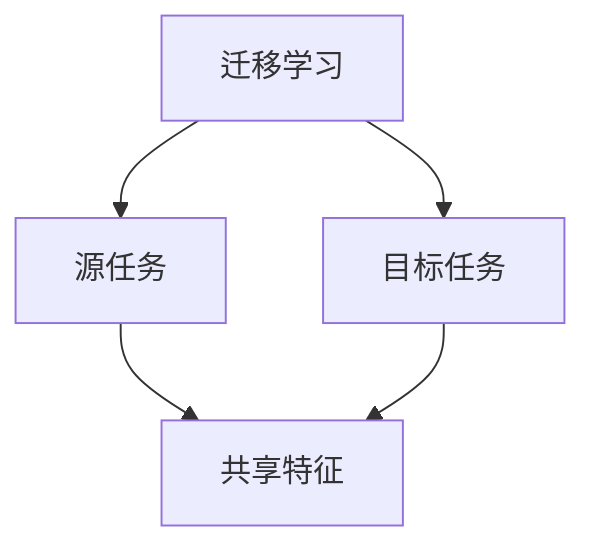
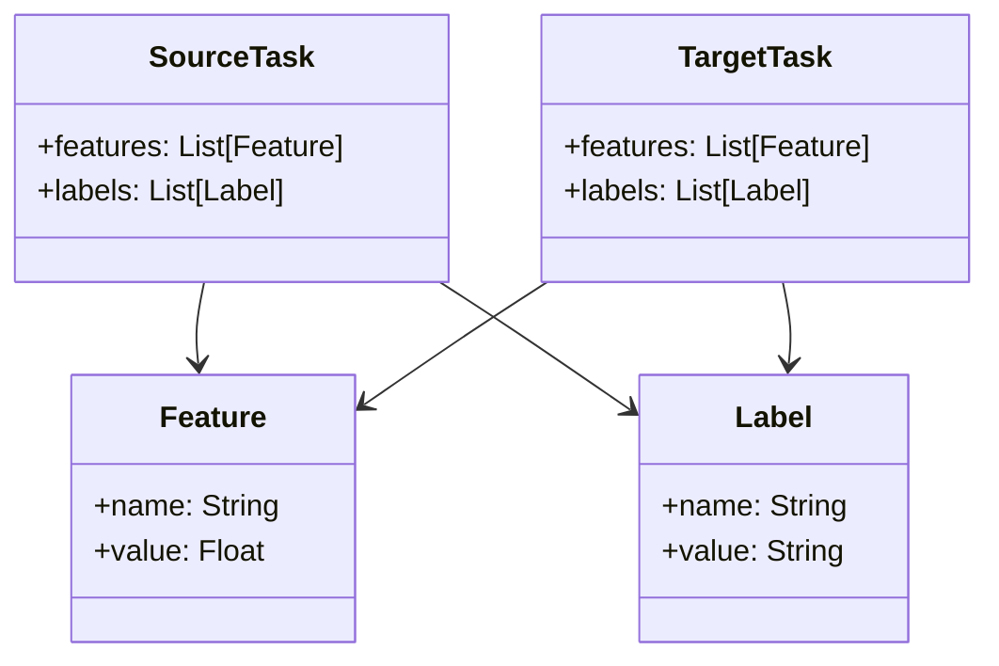
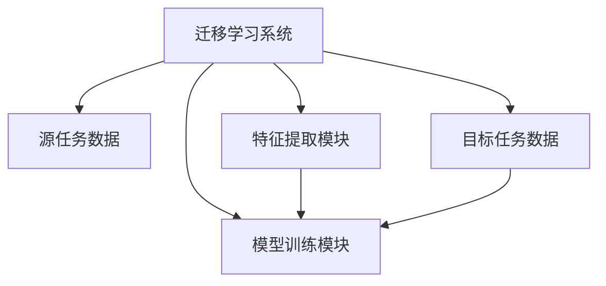
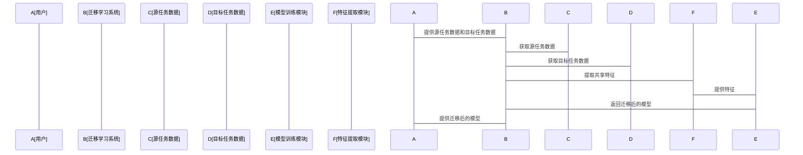

                 

<think>
好的，我现在需要帮用户撰写一篇关于《AI Agent的迁移学习能力开发》的技术博客文章。用户已经提供了一个详细的目录结构，我需要按照这个结构逐步完成每一部分的内容，确保逻辑清晰，内容详实。

首先，我会从标题开始，然后是关键词和摘要，接着是目录中的每一章内容。每一章都需要详细展开，包括背景介绍、核心概念、算法原理、系统分析、项目实战和最佳实践。我需要确保使用专业的技术语言，同时保持清晰易懂，用具体的例子和图表来辅助说明。

接下来，我需要确保每一章都包含必要的部分，比如数学公式、mermaid图表、代码示例等，并且在适当的位置插入这些内容。同时，注意使用正确的latex和markdown格式，保持文章结构的严谨性和美观性。

最后，我会检查文章的整体流畅性，确保每一部分之间有良好的衔接，帮助读者逐步理解和掌握AI Agent的迁移学习能力开发。同时，我会在文章末尾加上作者信息，以符合用户的格式要求。
</think>

# AI Agent的迁移学习能力开发

## 关键词
AI Agent, 迁移学习, 知识迁移, 模型对齐, 多任务学习

## 摘要
本文详细探讨了AI Agent的迁移学习能力开发，从基础概念到高级算法，结合实际应用场景，系统阐述了如何通过迁移学习提升AI Agent的泛化能力和适应性。文章首先介绍AI Agent和迁移学习的基本概念，随后深入分析迁移学习的核心原理、算法实现及其在AI Agent中的应用。通过案例分析和项目实战，展示迁移学习在AI Agent中的具体实现方法，最后总结迁移学习的开发要点和未来发展方向。

---

# 第1章: AI Agent与迁移学习概述

## 1.1 AI Agent的基本概念
### 1.1.1 AI Agent的定义与特点
AI Agent（人工智能代理）是一种能够感知环境、自主决策并执行任务的智能体。它具有以下特点：
- **自主性**：能够在没有外部干预的情况下自主运作。
- **反应性**：能够实时感知环境并做出响应。
- **目标导向性**：基于目标驱动行为，优化决策过程。
- **学习能力**：通过学习提升自身的任务执行能力。

### 1.1.2 AI Agent的核心功能与应用场景
AI Agent的核心功能包括：
- **感知与交互**：通过传感器或接口获取环境信息。
- **决策与规划**：基于获取的信息做出决策。
- **执行与反馈**：执行决策并根据反馈调整行为。

应用场景广泛，包括自动驾驶、智能助手、机器人控制、推荐系统等。

### 1.1.3 迁移学习在AI Agent中的重要性
在AI Agent开发中，迁移学习（Transfer Learning）是指将从一个任务或领域学到的知识应用到另一个任务或领域的过程。其重要性体现在：
- **减少数据需求**：通过迁移学习，AI Agent可以在数据不足的情况下依然保持较高的性能。
- **提升泛化能力**：迁移学习使AI Agent能够更好地适应不同环境和任务。
- **加快开发速度**：通过复用已有的知识，减少从头训练模型的时间和资源。

## 1.2 迁移学习的基本概念
### 1.2.1 迁移学习的定义与特点
迁移学习是一种机器学习技术，通过将一个任务（源任务）学到的知识应用到另一个任务（目标任务）中。其特点包括：
- **领域差异性**：源任务和目标任务可能属于不同的领域。
- **任务相关性**：目标任务与源任务具有一定的相似性或相关性。
- **知识复用性**：迁移学习的核心在于复用已有的知识。

### 1.2.2 迁移学习的核心原理与优势
迁移学习的核心原理是通过共享特征或参数，将源任务的知识迁移到目标任务。其优势包括：
- **减少数据需求**：在目标任务数据不足时，迁移学习可以利用源任务的数据进行训练。
- **提升模型性能**：通过共享特征或参数，迁移学习可以提升模型的泛化能力。
- **适应性更强**：迁移学习使模型能够更好地适应不同环境和任务。

### 1.2.3 迁移学习与相关概念的对比
迁移学习与传统机器学习、领域适应（Domain Adaptation）和多任务学习（Multi-Task Learning）等概念有显著区别，见下表：

| 概念 | 定义 | 目的 | 关键技术 |
|------|------|------|----------|
| 迁移学习 | 将一个任务的知识应用到另一个任务 | 减少数据需求，提升泛化能力 | 特征对齐、参数迁移 |
| 传统机器学习 | 从数据中学习模型，应用于同一任务 | 针对特定任务 | 数据驱动，无迁移 |
| 领域适应 | 将模型从源领域迁移到目标领域 | 解决领域差异问题 | 对齐特征分布 |
| 多任务学习 | 同时学习多个任务，共享参数 | 提升模型的泛化能力 | 参数共享、任务关联 |

---

# 第2章: 迁移学习的核心概念与原理

## 2.1 迁移学习的核心概念
### 2.1.1 迁移学习的三要素
迁移学习的三要素包括：
1. **源任务（Source Task）**：用于迁移的源任务。
2. **目标任务（Target Task）**：需要迁移的目标任务。
3. **共享特征（Shared Features）**：源任务和目标任务之间的共同特征。

### 2.1.2 迁移学习的分类与特点
迁移学习可以分为以下几类：
- **基于特征的迁移学习**：直接对特征空间进行操作，提取共享特征。
- **基于模型的迁移学习**：通过共享模型参数实现迁移。
- **基于度量的迁移学习**：通过度量学习对特征空间进行对齐。

### 2.1.3 迁移学习的数学模型概述
迁移学习的核心是通过数学模型将源任务和目标任务的特征或参数进行对齐。常见的数学模型包括：
- **源任务和目标任务的联合分布模型**：描述源任务和目标任务之间的关系。
- **参数共享模型**：通过共享参数实现迁移。

---

## 2.2 迁移学习与相关概念的对比
### 2.2.1 迁移学习与传统机器学习的对比
- **传统机器学习**：依赖大量目标任务数据，专注于单任务学习。
- **迁移学习**：利用源任务数据，减少对目标任务数据的依赖，适用于跨任务或跨领域场景。

### 2.2.2 迁移学习与领域适应的对比
- **领域适应（Domain Adaptation）**：专注于解决源领域和目标领域之间的差异。
- **迁移学习**：更广泛的概念，涵盖领域适应，还包括任务适应（Task Adaptation）。

### 2.2.3 迁移学习与多任务学习的对比
- **多任务学习**：同时学习多个任务，共享参数。
- **迁移学习**：专注于将一个任务的知识迁移到另一个任务。

---

## 2.3 迁移学习的ER实体关系图
以下是一个简单的迁移学习实体关系图：



---

# 第3章: 迁移学习算法原理

## 3.1 基于特征的迁移学习算法
### 3.1.1 特征提取与对齐
特征提取与对齐是基于特征的迁移学习的核心步骤。通过提取源任务和目标任务的共享特征，减少领域差异。

### 3.1.2 域适应（Domain Adaptation）
域适应是基于特征的迁移学习的一种形式，旨在通过对齐源域和目标域的特征分布，提升模型的泛化能力。

### 3.1.3 域泛化（Domain Generalization）
域泛化是在多个源域上训练模型，使其能够在未见的目标域上表现良好。

---

## 3.2 基于模型的迁移学习算法
### 3.2.1 参数迁移学习
参数迁移学习通过共享源任务和目标任务的模型参数，减少参数空间的差异。

### 3.2.2 知识蒸馏
知识蒸馏通过将大模型的知识迁移到小模型中，实现模型压缩和加速。

### 3.2.3 迁移网络
迁移网络是一种通过设计特定网络结构实现迁移学习的算法，例如双任务网络、多任务网络等。

---

## 3.3 基于度量的迁移学习算法
### 3.3.1 最近邻方法
最近邻方法通过计算样本之间的相似性，实现迁移学习。

### 3.3.2 测度学习
测度学习通过学习样本之间的测度，实现特征对齐。

### 3.3.3 测度对齐
测度对齐是通过优化源任务和目标任务的测度，实现特征对齐。

---

## 3.4 迁移学习的数学模型与公式
### 3.4.1 域适应的数学模型
域适应的数学模型可以通过以下公式表示：
$$
P(x,y) = P_s(x,y) \cdot \alpha + P_t(x,y) \cdot (1-\alpha)
$$

其中，$\alpha$ 是源任务和目标任务的分布权重。

### 3.4.2 参数迁移学习的数学模型
参数迁移学习的数学模型可以通过以下公式表示：
$$
\theta_{target} = \theta_{source} + \Delta\theta
$$

其中，$\Delta\theta$ 是参数调整量。

---

# 第4章: 迁移学习的系统分析与架构设计

## 4.1 问题场景介绍
迁移学习在AI Agent中的应用场景包括：
- **多领域任务处理**：AI Agent需要处理多个不同领域的任务。
- **数据稀缺场景**：目标任务数据不足时，利用源任务数据进行迁移。

---

## 4.2 系统功能设计
### 4.2.1 领域模型设计
以下是一个简单的领域模型类图：



### 4.2.2 系统架构设计
以下是一个迁移学习系统的架构图：



---

## 4.3 系统接口设计
### 4.3.1 接口定义
- **输入接口**：源任务数据、目标任务数据。
- **输出接口**：迁移后的模型、模型性能指标。

### 4.3.2 交互流程
以下是一个交互流程图：



---

## 4.4 项目实战

### 4.4.1 环境安装
以下是一个简单的Python环境安装示例：

```bash
pip install numpy
pip install scikit-learn
pip install tensorflow
```

### 4.4.2 核心代码实现
以下是一个迁移学习的Python实现示例：

```python
import numpy as np
from sklearn.linear_model import LogisticRegression

# 源任务数据
X_source = np.array([[1, 2], [3, 4], [5, 6]])
y_source = np.array([0, 1, 0])

# 目标任务数据
X_target = np.array([[2, 3], [4, 5], [6, 7]])
y_target = np.array([1, 0, 1])

# 特征提取模块
def extract_features(X):
    return X

# 模型训练模块
model = LogisticRegression()
model.fit(X_source, y_source)

# 迁移学习实现
X迁移 = extract_features(X_target)
y预测 = model.predict(X迁移)

print(y预测)
```

### 4.4.3 案例分析与代码解读
上述代码实现了一个简单的迁移学习案例，通过提取特征并训练模型，实现从源任务到目标任务的迁移。代码中，`extract_features`函数用于提取特征，`model`用于训练模型，`X迁移`用于目标任务的特征提取，`y预测`用于目标任务的预测。

---

## 4.4.4 项目总结
通过上述案例分析，我们可以看到迁移学习在AI Agent中的应用潜力。通过合理的特征提取和模型训练，可以显著提升AI Agent的性能和适应性。

---

# 第5章: 最佳实践与小结

## 5.1 最佳实践
- **选择合适的迁移学习算法**：根据具体场景选择适合的迁移学习算法。
- **数据预处理**：确保源任务和目标任务的数据预处理一致。
- **模型调优**：通过参数调整和模型优化提升迁移效果。

## 5.2 小结
本文详细探讨了AI Agent的迁移学习能力开发，从基础概念到高级算法，结合实际应用场景，系统阐述了如何通过迁移学习提升AI Agent的泛化能力和适应性。通过本文的讲解，读者可以深入了解迁移学习的核心原理和实现方法。

## 5.3 注意事项
- **数据差异性**：源任务和目标任务的数据差异性越大，迁移学习的效果越差。
- **模型选择**：选择适合的迁移学习算法和模型结构。
- **性能评估**：通过交叉验证等方法评估迁移学习的效果。

## 5.4 拓展阅读
- 《迁移学习实战》
- 《深度学习中的迁移学习》
- 《机器学习中的迁移学习》

---

# 作者：AI天才研究院/AI Genius Institute & 禅与计算机程序设计艺术 /Zen And The Art of Computer Programming

---

通过本文的系统讲解，读者可以全面了解AI Agent的迁移学习能力开发，从理论到实践，逐步掌握迁移学习的核心原理和实现方法。

