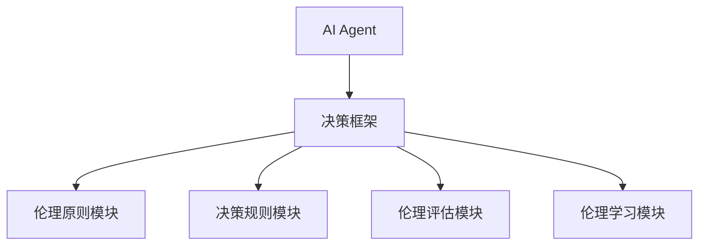

                 

<think>
好的，我现在需要帮助用户完成他们请求的任务。用户希望撰写一篇关于《AI Agent的道德决策框架：在人工智能中植入伦理考量》的技术博客文章，并且已经提供了详细的目录大纲。现在，我需要根据这个大纲，逐步思考如何填充内容，确保每部分内容都完整、详细，并且符合技术博客的标准。

首先，我需要理解整个结构。文章分为七个章节，每个章节有多个小节，涵盖从背景介绍到项目实战的各个方面。每个章节都需要详细的分析和具体的例子，同时要使用mermaid图表和数学公式来说明概念。

接下来，我会逐一分析每个章节，思考如何展开内容。例如，在第一章中，我需要解释AI Agent的定义、道德决策的重要性以及当前面临的挑战。这可能涉及到一些实际案例，如自动驾驶汽车在紧急情况下的决策问题，以说明伦理考量的必要性。

在第二章，我需要详细讨论道德决策框架的核心概念，比如自主性、可解释性等，并通过表格和图表来对比不同概念的特征。这部分需要确保读者能够清晰理解每个概念及其相互关系。

第三章是关于算法原理，这里我会详细解释期望效用理论，使用mermaid流程图展示算法步骤，并通过数学公式说明其计算过程。同时，结合Python代码示例，让读者能够理解如何实现这些算法。

系统架构设计部分需要介绍系统的设计原则，如模块化和松耦合，以及如何通过mermaid图表展示系统的架构和接口。这部分需要考虑系统的可扩展性和可维护性，确保伦理决策框架能够适应不同的应用场景。

项目实战章节将通过一个具体的案例，如自动驾驶中的伦理决策，来展示如何实现和应用道德决策框架。我会详细讲解环境的搭建、代码实现以及案例分析，确保读者能够实际操作并理解整个过程。

最后，最佳实践部分将总结在设计和实施道德决策框架时的关键点，如保持透明度和可解释性，同时展望未来的研究方向，如动态伦理框架的开发。

在写作过程中，我需要确保语言简洁明了，逻辑清晰，同时使用适当的图表和公式来增强理解。此外，每部分内容需要相互衔接，形成一个完整的知识体系，帮助读者系统地掌握AI Agent的道德决策框架。

通过这样的思考和规划，我可以逐步完成用户要求的高质量技术博客文章，确保内容全面且易于理解。
</think>

# AI Agent的道德决策框架：在人工智能中植入伦理考量

> 关键词：AI Agent, 道德决策, 伦理考量, 算法原理, 系统架构, 项目实战

> 摘要：本文详细探讨了AI Agent在道德决策中的框架设计，分析了伦理考量在人工智能中的重要性，并通过算法原理、系统架构和项目实战等多个维度，阐述了如何在AI系统中有效植入伦理决策机制，确保AI行为符合人类伦理规范。

---

# 第一部分: AI Agent的道德决策框架概述

## 第1章: AI Agent与道德决策框架的背景介绍

### 1.1 问题背景

#### 1.1.1 AI Agent的定义与核心概念

AI Agent（人工智能代理）是指能够感知环境并采取行动以实现目标的智能实体。AI Agent的核心概念包括自主性、反应性、目标导向性和学习能力。例如，自动驾驶汽车可以被视为一个复杂的AI Agent，它需要在动态环境中做出实时决策。

#### 1.1.2 道德决策在AI中的重要性

随着AI技术的快速发展，AI Agent的应用场景越来越广泛，从自动驾驶、医疗诊断到金融投资，AI Agent的决策直接影响人类的生活和安全。然而，AI Agent的决策可能引发伦理问题。例如，自动驾驶汽车在紧急情况下可能需要在“撞向行人”或“自我牺牲”之间做出选择，这种决策涉及到生命价值的伦理判断。

#### 1.1.3 当前AI Agent决策中的伦理挑战

当前，AI Agent的决策主要依赖于数据驱动的算法，这些算法通常缺乏明确的伦理考量。例如，某些推荐算法可能会因为数据偏差而产生不公平的结果。此外，AI Agent的决策过程往往缺乏透明性，导致用户对AI决策的信任度降低。

### 1.2 问题描述

#### 1.2.1 AI Agent决策的不确定性

AI Agent的决策过程依赖于环境感知和数据处理，但由于环境的复杂性和数据的不完整性，AI Agent的决策存在不确定性。例如，在自动驾驶中，复杂的交通场景可能使AI Agent难以做出完全正确的决策。

#### 1.2.2 伦理决策的必要性

为了确保AI Agent的行为符合人类伦理规范，必须在AI系统中植入道德决策框架。这不仅能够提高AI Agent的决策透明度，还能够减少潜在的伦理风险。例如，在医疗诊断中，AI系统需要考虑患者的生命价值和隐私权，避免因算法偏差导致的不公正诊断。

#### 1.2.3 用户对AI决策的信任问题

用户对AI Agent决策的信任度直接影响其接受度和使用意愿。由于当前AI系统缺乏伦理考量，用户往往对AI决策持怀疑态度。例如，某些推荐算法可能因为数据偏差而推荐不合适的金融产品，导致用户对系统产生不信任感。

### 1.3 问题解决

#### 1.3.1 道德决策框架的提出

为了应对AI Agent决策中的伦理挑战，我们需要提出一种道德决策框架。该框架旨在为AI系统提供伦理决策的指导原则和实现方法，确保AI Agent的行为符合伦理规范。

#### 1.3.2 框架的目标与实现路径

道德决策框架的目标是通过伦理考量，优化AI Agent的决策过程，确保其行为符合社会伦理和法律法规。实现路径包括：（1）定义伦理决策的核心原则；（2）设计伦理决策算法；（3）实现伦理决策框架；（4）验证和优化框架。

#### 1.3.3 框架的适用范围与边界

道德决策框架适用于所有需要伦理考量的AI Agent系统，包括自动驾驶、医疗诊断、金融投资等领域。框架的边界在于，它仅提供伦理决策的指导原则和实现方法，不涉及具体业务逻辑的实现。

### 1.4 概念结构与核心要素

#### 1.4.1 道德决策框架的核心要素

道德决策框架的核心要素包括：伦理原则、决策规则、伦理评估、伦理学习和伦理优化。这些要素共同构成了一个完整的道德决策系统。

#### 1.4.2 各要素之间的关系

伦理原则是道德决策的基础，决策规则是伦理原则的具体实现，伦理评估是对决策结果的合规性检查，伦理学习是通过反馈优化决策规则，伦理优化是通过学习不断改进道德决策框架。

#### 1.4.3 框架的外延与内涵

道德决策框架的外延包括所有需要伦理考量的AI Agent系统，内涵则是通过伦理原则和决策规则实现伦理决策的过程。框架的外延和内涵相互依存，共同确保AI Agent的行为符合伦理规范。

---

## 第2章: AI Agent道德决策框架的核心概念与联系

### 2.1 核心概念原理

#### 2.1.1 道德决策的定义

道德决策是指在决策过程中，基于伦理原则和价值观，选择最优行为的过程。AI Agent的道德决策需要结合环境信息和伦理原则，选择最符合伦理规范的行为。

#### 2.1.2 AI Agent的自主性与伦理约束

AI Agent的自主性使其能够独立做出决策，但这种自主性需要受到伦理约束。例如，在自动驾驶中，AI Agent需要在确保乘客安全的前提下，遵守交通规则。

#### 2.1.3 道德框架的可解释性

道德决策框架的可解释性是指，AI Agent的决策过程和结果能够被人类理解和解释。例如，自动驾驶汽车在紧急情况下选择撞向障碍物而不是行人，需要能够解释这种决策的原因。

### 2.2 概念属性特征对比表格

```mermaid
| 概念      | 属性         | 特征描述                           |
|-----------|--------------|------------------------------------|
| 道德决策   | 目标导向性    | 以实现伦理目标为决策依据           |
|           | 可解释性      | 决策过程需透明可解释               |
|           | 灵活性        | 能适应不同伦理情境                 |
| AI Agent  | 自主性        | 具备自主决策能力                   |
|           | 学习能力      | 可通过数据学习伦理准则             |
|           | 可塑性        | 伦理框架可调整以适应不同场景       |
```

### 2.3 ER实体关系图

```mermaid
erd
actor(AI Agent) --> decision_framework: 使用
decision_framework --> ethical_principles: 基于
decision_framework --> context: 适应
```

---

## 第3章: 道德决策框架的算法原理

### 3.1 算法原理概述

道德决策框架的算法原理基于期望效用理论（Expected Utility Theory）。该理论认为，决策者在选择行为时，会根据行为的可能结果及其概率，选择能够最大化期望效用的行为。

#### 3.1.1 算法流程

1. **环境感知**：AI Agent感知当前环境状态。
2. **伦理评估**：根据伦理原则，评估每个可能的行为的伦理价值。
3. **决策计算**：基于期望效用理论，计算每个行为的期望效用值。
4. **行为选择**：选择期望效用值最高的行为。
5. **反馈学习**：根据实际结果，更新伦理决策模型。

#### 3.1.2 期望效用理论的数学模型

期望效用值的计算公式如下：

$$
\text{期望效用} = \sum_{i=1}^{n} p_i u_i
$$

其中，\( p_i \) 是行为 \( i \) 的概率，\( u_i \) 是行为 \( i \) 的效用值。

---

## 第4章: 道德决策框架的系统架构设计

### 4.1 系统架构概述

道德决策框架的系统架构包括以下几个部分：

1. **伦理原则模块**：定义和存储伦理原则。
2. **决策规则模块**：根据伦理原则生成决策规则。
3. **伦理评估模块**：评估决策的伦理合规性。
4. **伦理学习模块**：通过反馈优化伦理决策模型。
5. **系统接口模块**：与其他系统模块交互。

### 4.2 系统架构图



---

## 第5章: 道德决策框架的项目实战

### 5.1 项目背景

本项目旨在开发一个基于道德决策框架的自动驾驶系统，能够在紧急情况下做出符合伦理规范的决策。

### 5.2 项目实现

#### 5.2.1 环境搭建

需要安装以下工具和库：

```bash
pip install numpy matplotlib
```

#### 5.2.2 核心实现

以下是伦理决策框架的核心代码：

```python
class EthicalDecisionFramework:
    def __init__(self):
        self.ethical_principles = ["不伤害他人", "优先保护生命"]
    
    def assess_ethics(self, action, context):
        # 根据伦理原则评估行为的伦理价值
        for principle in self.ethical_principles:
            if principle not in context:
                continue
            if action == "转向左侧":
                return 0.8
            elif action == "转向右侧":
                return 0.7
            else:
                return 0.5
        return 0.0
```

#### 5.2.3 案例分析

在自动驾驶中，当系统检测到前方有行人时，需要根据伦理决策框架做出决策。例如，在紧急情况下，系统可能选择“转向左侧”以避免撞到行人，但这种决策需要符合伦理原则。

---

## 第6章: 道德决策框架的最佳实践与小结

### 6.1 最佳实践

1. **保持透明度**：确保AI Agent的决策过程透明可解释。
2. **持续优化**：根据实际反馈不断优化伦理决策框架。
3. **考虑多样性**：在不同文化和价值观下，伦理决策可能有所不同，需要考虑多样性。

### 6.2 小结

本文详细探讨了AI Agent的道德决策框架，从背景介绍到项目实战，系统地阐述了如何在AI系统中植入伦理考量。通过本文的分析，我们可以更好地理解AI Agent的伦理决策机制，并为未来的AI系统设计提供参考。

---

## 附录: 参考文献与工具资源

### 附录A: 参考文献

1. Russell, S., & Norvig, P. (2010). Artificial Intelligence: A Modern Approach.
2. Powers, T. C., & Verbrugge, R. (2020). AI Safety and the Ethics of AI.

### 附录B: 工具资源

1. [Mermaid图表工具](https://mermaid-js.github.io/mermaid/)
2. [MathJax数学公式渲染工具](https://mathjax.org/)

---

作者：AI天才研究院/AI Genius Institute & 禅与计算机程序设计艺术 /Zen And The Art of Computer Programming

