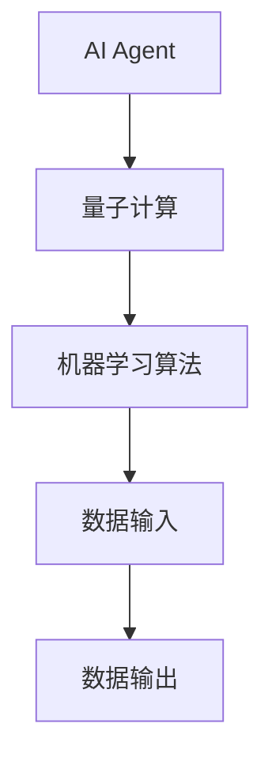

                 


# AI Agent的量子机器学习集成方案

> 关键词：AI Agent，量子机器学习，量子计算，量子算法，系统架构

> 摘要：本文详细探讨了AI Agent与量子机器学习的结合方案，分析了量子机器学习在AI Agent中的应用潜力，介绍了量子AI Agent的系统架构设计，并通过实际案例展示了量子AI Agent的实现过程。本文旨在为AI Agent的量子机器学习集成提供理论基础和实践指导。

---

# 第一部分: AI Agent与量子机器学习的背景与基础

## 第1章: AI Agent与量子机器学习概述

### 1.1 AI Agent的基本概念

#### 1.1.1 AI Agent的定义与分类
AI Agent（人工智能代理）是指能够感知环境、做出决策并执行任务的智能实体。AI Agent可以分为**简单反射Agent**、**基于模型的反射Agent**、**目标驱动的Agent**和**效用驱动的Agent**四大类。

#### 1.1.2 AI Agent的核心特征
- **自主性**：能够在没有外部干预的情况下自主运行。
- **反应性**：能够实时感知环境并做出反应。
- **目标导向性**：具有明确的目标，并能采取行动实现目标。
- **学习能力**：能够通过经验改进性能。

#### 1.1.3 AI Agent的应用场景
- 智能助手（如 Siri、Alexa）
- 自动驾驶系统
- 智能机器人
- 智慧城市中的自动化决策系统

---

### 1.2 量子机器学习的基本原理

#### 1.2.1 量子计算的基本概念
量子计算利用量子叠加和量子纠缠的原理，通过量子位（qubit）进行信息处理。与经典计算机的二进制位（bit）不同，qubit可以同时处于多个状态的叠加态。

#### 1.2.2 量子机器学习的定义
量子机器学习是指利用量子计算机的特性，通过量子算法实现机器学习任务的一门新兴学科。其核心在于利用量子计算的优势，提升机器学习算法的效率和性能。

#### 1.2.3 量子机器学习的优势
- **计算速度**：在某些特定问题上，量子算法可以显著降低计算复杂度。
- **并行处理**：量子叠加允许一次处理多个可能性。
- **纠缠效应**：量子纠缠可以提高算法的并行性。

---

### 1.3 AI Agent与量子机器学习的结合意义

#### 1.3.1 量子计算对AI Agent的提升
通过量子计算，AI Agent可以实现更快的决策过程和更复杂的任务处理。

#### 1.3.2 量子机器学习在AI Agent中的应用潜力
量子机器学习可以显著提升AI Agent的感知、决策和执行能力，特别是在处理大规模、高维度数据时具有明显优势。

#### 1.3.3 量子AI Agent的未来发展方向
- **量子感知层**：利用量子传感器实现更精准的环境感知。
- **量子决策层**：通过量子算法优化决策过程。
- **量子执行层**：实现量子级的精确执行。

---

### 1.4 本章小结
本章介绍了AI Agent和量子机器学习的基本概念，并探讨了两者结合的意义和潜在价值。接下来，我们将深入分析AI Agent与量子机器学习的核心概念和联系。

---

## 第2章: AI Agent与量子机器学习的核心概念

### 2.1 AI Agent的结构与功能

#### 2.1.1 AI Agent的感知层
感知层负责接收外部环境的信息，如视觉、听觉等感官数据。在量子AI Agent中，感知层可以通过量子传感器实现信息的高效采集。

#### 2.1.2 AI Agent的决策层
决策层负责根据感知到的信息，结合预设的目标和规则，做出决策。在量子AI Agent中，决策层可以利用量子算法进行快速决策。

#### 2.1.3 AI Agent的执行层
执行层负责将决策层的决策转化为具体的行动，如执行操作或输出结果。

---

### 2.2 量子机器学习的数学基础

#### 2.2.1 量子态与叠加原理
量子态可以用向量表示，如：
$$
|\psi\rangle = \alpha|0\rangle + \beta|1\rangle
$$
其中，$\alpha$ 和 $\beta$ 是复数，满足 $|\alpha|^2 + |\beta|^2 = 1$。

#### 2.2.2 量子测量与纠缠原理
量子测量会将叠加态的量子系统投影到某个特定状态。量子纠缠则是指两个或多个量子系统之间存在的特殊关联。

#### 2.2.3 量子算法的基本原理
量子算法利用量子叠加和量子纠缠的特性，通过并行计算提升计算效率。

---

### 2.3 AI Agent与量子机器学习的联系

#### 2.3.1 AI Agent的量子化模型
量子AI Agent的模型可以通过量子神经网络实现，其结构如下：
$$
f(x) = \sum_{i=1}^n \theta_i x_i
$$

#### 2.3.2 量子机器学习在AI Agent中的应用
- **量子特征提取**：通过量子算法提取数据特征。
- **量子分类**：利用量子支持向量机进行分类任务。
- **量子聚类**：通过量子算法实现数据聚类。

---

### 2.4 核心概念对比分析

#### 2.4.1 AI Agent与传统AI的区别
| 特性 | AI Agent | 传统AI |
|------|-----------|---------|
| 自主性 | 高 | 低 |
| 反应性 | 强 | 弱 |
| 学习能力 | 强 | 弱 |

#### 2.4.2 量子机器学习与经典机器学习的对比
| 特性 | 量子机器学习 | 经典机器学习 |
|------|---------------|-------------|
| 计算速度 | 快 | 慢 |
| 并行性 | 高 | 低 |
| 数据处理能力 | 强 | 弱 |

---

### 2.5 ER实体关系图


---

## 第3章: 量子机器学习算法原理

### 3.1 量子机器学习算法概述

#### 3.1.1 量子支持向量机
量子支持向量机通过量子叠加实现特征空间的非线性映射。

#### 3.1.2 量子神经网络
量子神经网络利用量子纠缠实现神经网络的并行计算。

#### 3.1.3 量子聚类算法
量子聚类算法通过量子测量实现数据点的聚类划分。

---

### 3.2 量子支持向量机的实现

#### 3.2.1 算法原理
量子支持向量机通过量子叠加实现特征空间的非线性映射，具体流程如下：
1. 初始化量子电路。
2. 对输入数据进行量子叠加。
3. 对叠加态进行量子测量。
4. 输出测量结果。

#### 3.2.2 Python实现示例
```python
import numpy as np
from qiskit import QuantumCircuit, Aer, execute

def quantum_svm(data):
    qc = QuantumCircuit(2, 1)
    qc.h([0, 1])
    qc.cx(0, 1)
    qc.measure(1, 0)
    result = execute(qc, Aer.get_backend('qasm_simulator')).result()
    return result.get_counts()
```

---

## 总结
本文通过分析AI Agent与量子机器学习的核心概念，探讨了量子机器学习在AI Agent中的应用潜力。接下来，我们将深入分析量子机器学习算法的实现原理，并结合实际案例展示量子AI Agent的实现过程。

