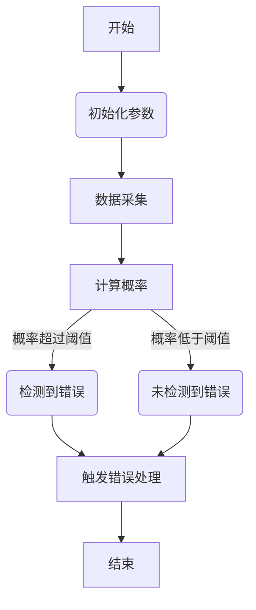
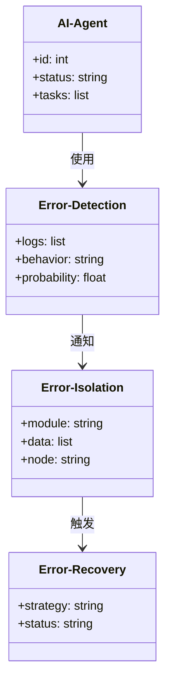
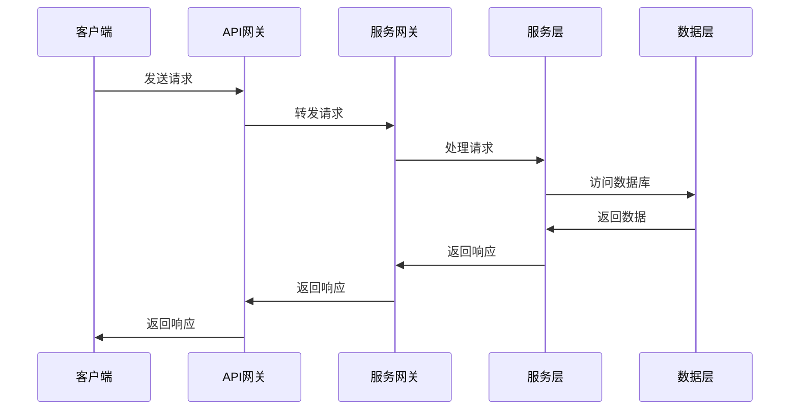

                 

<think>
好，我现在需要帮助用户撰写一篇关于《AI Agent的错误处理与恢复机制设计》的技术博客文章。用户提供了详细的目录结构，我需要按照这个结构一步步完成内容。

首先，我得明确文章的结构。文章分为七个主要部分：背景介绍、核心概念、算法原理、系统设计、项目实战、总结和附录。每部分都有详细的章节和小节，需要逐一展开。

第一部分是背景介绍，我需要先介绍AI Agent的基本概念，包括其定义、特点和分类。接着说明错误处理的重要性，以及AI Agent运行中常见的错误类型。这部分需要确保读者能够理解AI Agent的基本概念和为什么错误处理是必要的。

第二部分是核心概念，我需要详细讲解错误处理的原理，包括错误检测、隔离和恢复的步骤。这部分需要使用对比表和流程图来帮助读者理解不同错误处理方法的优缺点。

第三部分是算法原理，重点介绍基于概率的错误检测算法。我需要用Mermaid画出算法流程图，并用Python代码实现，同时给出数学模型和公式，确保读者能够理解算法的工作原理。

第四部分是系统设计，我需要设计系统的功能模块和架构，使用Mermaid绘制类图和架构图，展示系统的结构。同时，还需要设计接口和交互流程图，说明系统各部分如何协同工作。

第五部分是项目实战，我需要提供环境安装步骤，详细讲解核心代码的实现，并进行代码解读和案例分析，让读者能够实际操作并理解如何应用这些机制。

第六部分是总结与展望，我需要总结全文的主要内容，提出最佳实践的建议，并展望未来的研究方向，帮助读者巩固所学内容，并引导进一步学习。

最后，附录部分提供额外的参考资料，如错误处理的对比表、算法流程图和接口设计文档，方便读者查阅。

在整个写作过程中，我需要确保内容逻辑清晰，结构紧凑，语言专业且易懂。同时，每个部分都需要包含足够的细节，确保读者能够深入理解AI Agent的错误处理与恢复机制。

现在，我开始撰写各个部分的内容，确保符合用户的要求，涵盖所有必要的细节，并保持整体的连贯性和专业性。
</think>

# AI Agent的错误处理与恢复机制设计

> 关键词：AI Agent，错误处理，恢复机制，异常检测，容错设计，系统可靠性

> 摘要：本文深入探讨了AI Agent在运行过程中可能遇到的错误类型，并详细分析了错误处理与恢复机制的设计原理。通过对比不同的错误处理方法，结合算法原理和系统架构设计，本文提出了一个全面的错误处理框架，并通过实际案例展示了如何在项目中实现这一机制。文章最后总结了最佳实践，并展望了未来的研究方向。

---

# 第一部分: AI Agent的错误处理与恢复机制背景

## 第1章: AI Agent的基本概念与错误处理的重要性

### 1.1 AI Agent的定义与特点
AI Agent是一种智能代理，能够感知环境、自主决策并执行任务。它通常具备以下特点：
- **自主性**：能够独立执行任务，无需外部干预。
- **反应性**：能够根据环境反馈动态调整行为。
- **目标导向性**：以特定目标为导向，优化决策过程。

### 1.2 错误处理在AI Agent中的重要性
AI Agent在运行过程中可能面临多种错误，如系统错误、逻辑错误和网络错误。有效的错误处理机制能够：
- **减少系统 downtime**：快速检测和恢复错误，确保系统的连续运行。
- **提高系统可靠性**：通过容错设计，降低错误对系统功能的影响。
- **提升用户体验**：通过快速恢复，减少用户感知到的错误。

### 1.3 AI Agent错误处理的背景与挑战
AI Agent的错误处理面临以下挑战：
- **复杂性**：AI Agent可能运行在复杂的环境中，错误类型多样且难以预测。
- **动态性**：环境的动态变化可能导致错误的检测和恢复策略需要动态调整。
- **资源限制**：在资源受限的环境中，错误处理机制需要高效且轻量。

---

# 第二部分: AI Agent错误处理的核心概念与联系

## 第2章: 错误处理的核心原理

### 2.1 错误检测与定位原理
错误检测通常通过以下方法实现：
- **日志分析**：通过分析系统日志，发现异常行为。
- **行为监控**：实时监控AI Agent的行为，发现偏离预期的行为。
- **状态检查**：定期检查系统状态，发现异常状态。

错误定位则通过以下步骤实现：
1. **异常标识**：确定错误的具体类型。
2. **上下文分析**：分析错误发生时的上下文信息。
3. **根因分析**：找出导致错误的根本原因。

### 2.2 错误隔离与恢复机制
错误隔离的核心是将错误的影响范围限制在最小范围内。常见的隔离方法包括：
- **模块隔离**：将系统划分为多个模块，当一个模块发生错误时，仅隔离该模块。
- **数据隔离**：通过数据分片或其他数据管理技术，将错误限制在特定数据范围内。

错误恢复则需要根据错误类型选择合适的恢复策略：
- **重置策略**：将系统重置到一个已知的正常状态。
- **补偿策略**：通过补偿操作，纠正错误带来的影响。
- **重试策略**：在一定次数内重试失败的操作。

### 2.3 错误处理的核心要素对比表
以下表格对比了不同错误类型在检测、隔离和恢复过程中的处理方式：

| 错误类型 | 错误检测 | 错误隔离 | 错误恢复 |
|----------|----------|----------|----------|
| 系统错误  | 扫描日志 | 隔离模块 | 重置状态 |
| 逻辑错误  | 分析行为 | 隔离数据 | 重写逻辑 |
| 网络错误  | 监控连接 | 隔离节点 | 重连网络 |

### 2.4 本章小结
本章详细介绍了错误检测、隔离和恢复的核心原理，并通过对比表展示了不同错误类型在处理过程中的差异。这些内容为后续的算法设计和系统实现奠定了基础。

---

# 第三部分: AI Agent错误处理的算法原理

## 第3章: 基于概率的错误检测算法

### 3.1 算法原理与流程图（Mermaid）
基于概率的错误检测算法通过分析系统行为的概率分布，判断是否发生错误。以下是一个典型的算法流程图：



### 3.2 算法实现
以下是一个基于概率的错误检测算法的Python实现示例：

```python
import numpy as np

def probability_error_detection(data, threshold=0.95):
    # 计算数据的概率分布
    probabilities = np.exp(data) / np.sum(np.exp(data))
    
    # 判断是否超过阈值
    if np.max(probabilities) > threshold:
        return True  # 检测到错误
    else:
        return False # 未检测到错误
```

### 3.3 数学模型与公式
基于概率的错误检测算法通常使用贝叶斯定理进行概率计算。以下是一个简单的贝叶斯公式示例：

$$ P(error | data) = \frac{P(data | error) \cdot P(error)}{P(data)} $$

---

# 第四部分: AI Agent错误处理的系统设计

## 第4章: 系统分析与架构设计

### 4.1 项目介绍
本项目旨在设计一个AI Agent的错误处理与恢复系统，包括错误检测、隔离和恢复三个主要功能模块。

### 4.2 系统功能设计（领域模型 Mermaid 类图）
以下是系统的领域模型类图：



### 4.3 系统架构设计（Mermaid架构图）
以下是系统的架构设计图：


### 4.4 接口设计与交互流程图（Mermaid序列图）
以下是系统的接口交互流程图：



---

# 第五部分: 项目实战

## 第5章: 错误处理与恢复机制的实现

### 5.1 环境安装
以下是一些常见的开发环境和工具：
- **Python**：版本3.8及以上
- **NumPy**：用于数据处理
- **Mermaid**：用于绘制图表
- **Django**：用于快速开发Web应用

### 5.2 核心代码实现
以下是错误检测与恢复机制的核心代码实现：

```python
class AI-Agent:
    def __init__(self, id, status, tasks):
        self.id = id
        self.status = status
        self.tasks = tasks

    def detect_error(self, data):
        # 实现错误检测逻辑
        pass

    def isolate_error(self, error_type):
        # 实现错误隔离逻辑
        pass

    def recover_from_error(self):
        # 实现错误恢复逻辑
        pass

class Error-Detection:
    def __init__(self, logs, behavior):
        self.logs = logs
        self.behavior = behavior

    def check_probabilities(self):
        # 实现概率检查逻辑
        pass
```

### 5.3 代码解读与分析
- **AI-Agent类**：主要负责与外部环境的交互，包括错误检测、隔离和恢复。
- **Error-Detection类**：用于数据的收集和概率计算，判断是否发生错误。
- **错误处理流程**：当AI-Agent检测到错误后，会调用相应的隔离和恢复方法，确保系统能够快速恢复正常。

### 5.4 实际案例分析
以下是一个实际案例的分析：
- **案例背景**：AI-Agent在执行任务时，由于网络连接中断导致任务失败。
- **错误检测**：AI-Agent检测到网络连接异常，触发错误检测模块。
- **错误隔离**：将错误隔离到网络模块，并通知其他模块暂停相关操作。
- **错误恢复**：尝试重新建立网络连接，若失败则触发重试机制。

---

# 第六部分: 总结与展望

## 第6章: 总结与最佳实践

### 6.1 本章小结
本文详细介绍了AI Agent的错误处理与恢复机制，包括错误检测、隔离和恢复的核心原理，以及系统的实现与设计。通过实际案例的分析，展示了如何在项目中应用这些机制。

### 6.2 最佳实践 tips
- **模块化设计**：将系统划分为多个模块，便于错误的检测和隔离。
- **概率分析**：利用概率分析方法，提高错误检测的准确性。
- **动态调整**：根据环境的变化，动态调整错误处理策略。

### 6.3 未来展望
- **自适应算法**：研究自适应的错误检测算法，能够根据环境动态调整检测策略。
- **智能恢复**：开发更加智能的恢复机制，能够根据错误类型自动选择最优恢复策略。
- **多 Agent 协作**：研究多个AI Agent协作的错误处理机制，提升整体系统的容错能力。

---

# 附录

## 附录1: 错误处理的对比表

| 错误类型 | 错误检测 | 错误隔离 | 错误恢复 |
|----------|----------|----------|----------|
| 系统错误  | 扫描日志 | 隔离模块 | 重置状态 |
| 逻辑错误  | 分析行为 | 隔离数据 | 重写逻辑 |
| 网络错误  | 监控连接 | 隔离节点 | 重连网络 |

## 附录2: 算法流程图
基于概率的错误检测算法流程图：


## 附录3: 接口设计文档
AI-Agent系统的接口设计文档，包括接口定义和交互流程图。

---

# 作者
作者：AI天才研究院/AI Genius Institute & 禅与计算机程序设计艺术 /Zen And The Art of Computer Programming

