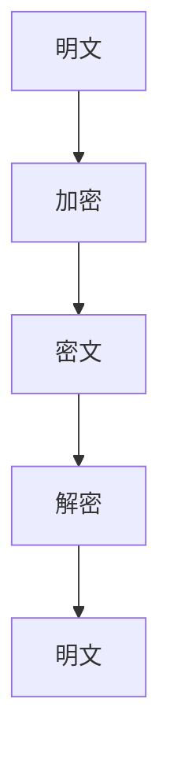
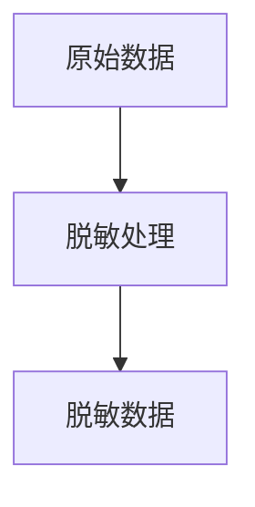
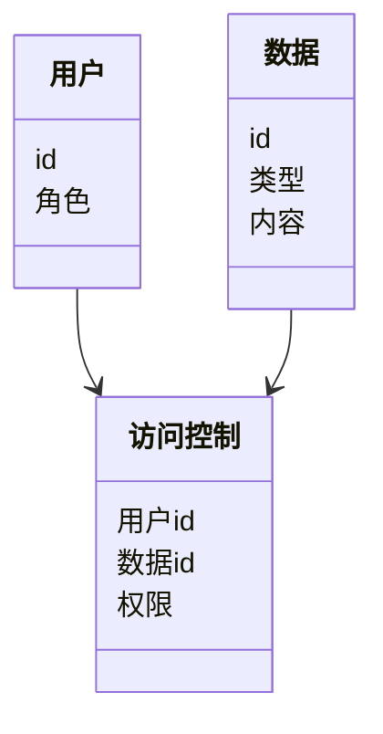
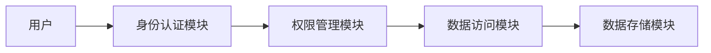
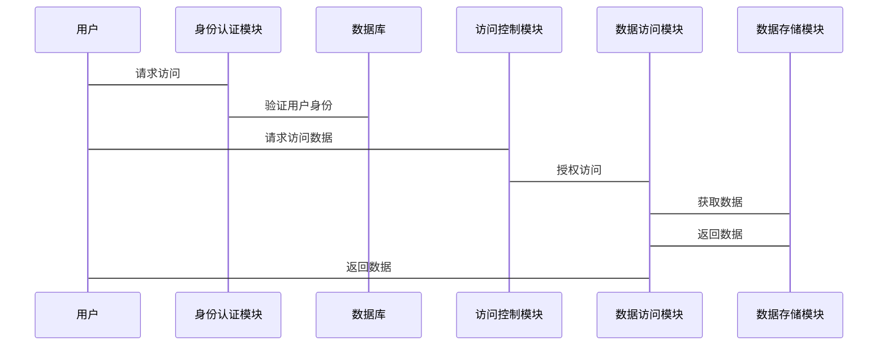

                 

<think>
嗯，好的，我现在要开始写关于AI Agent的隐私保护与安全机制的博客文章。首先，我得理解这个主题。AI Agent是什么呢？哦，对，AI Agent就是指人工智能代理，能够帮助用户完成各种任务，比如智能助手、推荐系统等等。但是，随着AI Agent的应用越来越广泛，隐私和安全问题也越来越重要了。

我应该先介绍什么是AI Agent，它的基本概念和应用场景。然后，讨论为什么隐私保护和安全机制对AI Agent这么重要。现在，数据泄露事件频发，用户数据被滥用的情况也很多，所以保护用户的隐私是必须的。

接下来，我需要详细讲解隐私保护和安全机制的核心概念。比如，数据加密、访问控制、身份认证这些技术都是怎么工作的。我可以举个例子，比如用户的个人信息被加密存储，这样即使数据库被入侵，黑客也无法看到真实的数据。

然后，我应该探讨一些具体的算法，比如对称加密和非对称加密，以及数据脱敏技术。通过数学公式来展示这些算法的原理，可能会让读者更容易理解。例如，加密函数和解密函数的公式，这样读者可以明白加密的基本过程。

接下来，我需要分析一个实际的系统架构，看看如何在AI Agent中实现这些安全机制。可能的话，画一些图表，比如类图、架构图和序列图，来展示系统的结构和数据流。这样，读者可以更直观地理解整个系统的运作。

然后，我可能需要写一些代码示例，展示如何在Python中实现这些安全机制。比如，用库来加密敏感数据，或者编写一个简单的访问控制模块。通过代码示例，读者可以实际操作，加深理解。

最后，总结一下整个内容，强调隐私保护的重要性，以及如何在实际应用中保护用户数据。同时，提供一些最佳实践的建议，比如定期更新安全策略，进行安全测试等等。

嗯，这样想下来，文章的结构应该是清晰的，内容也会很全面。我还需要确保每一部分都详细具体，让读者能够真正理解这些隐私保护和安全机制的实现和应用。
</think>

# AI Agent的隐私保护与安全机制

## 关键词：AI Agent，隐私保护，安全机制，数据加密，访问控制，身份认证

## 摘要：随着AI Agent技术的广泛应用，隐私保护和安全机制的重要性日益凸显。本文深入探讨了AI Agent的隐私保护与安全机制，分析了其核心概念、算法原理、系统架构设计，并通过具体案例展示了如何在实际项目中实现这些机制，提供了全面的解决方案和最佳实践。

---

# 第一部分：AI Agent的概述与隐私安全的重要性

## 第1章：AI Agent的基本概念

### 1.1 AI Agent的定义
AI Agent是一种智能代理，能够感知环境、自主决策并执行任务。它通过数据处理和算法优化，为用户提供高效的服务。

### 1.2 AI Agent的核心特征
- **自主性**：无需外部干预，自主决策。
- **反应性**：能够实时感知环境并做出反应。
- **目标导向**：基于目标执行任务。
- **学习能力**：通过数据和经验不断优化性能。

### 1.3 AI Agent的应用场景
- 智能助手（如Siri、Alexa）。
- 推荐系统（如电商推荐）。
- 自动驾驶系统。

## 第2章：隐私保护与安全机制的重要性

### 2.1 数字化时代的隐私威胁
- 数据泄露事件频发，用户隐私受到严重威胁。
- AI Agent处理大量敏感数据，成为攻击目标。

### 2.2 AI Agent中的数据安全风险
- 数据被未经授权的访问。
- 数据在传输过程中被截获。
- 恶意攻击导致数据损坏。

### 2.3 隐私保护与安全机制的必要性
- **保护用户隐私**：防止未经授权的数据访问。
- **保障数据完整性**：确保数据在传输过程中不被篡改。
- **提高系统安全性**：防止恶意攻击和数据泄露。

---

# 第二部分：AI Agent的隐私保护核心概念与技术基础

## 第2章：隐私保护的核心概念与技术

### 2.1 隐私保护的基本原理
隐私保护旨在防止未经授权的个人或实体访问、使用或披露敏感信息。其核心在于保护数据的机密性、完整性和可用性。

#### 2.1.1 数据加密技术
数据加密是通过将数据转换为不可读的形式，确保只有授权方能够解密。

- **对称加密**：使用相同的密钥进行加密和解密。
- **非对称加密**：使用公钥和私钥，公钥用于加密，私钥用于解密。

#### 2.1.2 数据脱敏技术
数据脱敏是对数据进行处理，使其在脱敏后无法还原出原始数据，同时保持数据的可用性。

### 2.2 安全机制的核心要素
- **数据加密**：保护数据在存储和传输过程中的安全性。
- **访问控制**：限制对敏感数据的访问权限。
- **身份认证与授权**：确保只有合法用户能够访问系统。

### 2.3 隐私保护与安全机制的对比分析

#### 表2.1：隐私保护与安全机制的对比
| 属性 | 隐私保护 | 安全机制 |
|------|----------|----------|
| 目标 | 防止数据泄露 | 防止未经授权的访问 |
| 技术 | 数据脱敏、加密 | 访问控制、身份认证 |

### 2.4 本章小结
本章介绍了AI Agent中隐私保护的核心概念和技术，重点讨论了数据加密和访问控制等技术，并通过对比分析明确了隐私保护与安全机制的区别和联系。

---

# 第三部分：AI Agent隐私保护的算法原理与数学模型

## 第3章：隐私保护算法的核心原理

### 3.1 数据加密算法

#### 3.1.1 对称加密算法
对称加密算法使用相同的密钥进行加密和解密。常见的算法包括AES（高级加密标准）。

- **加密函数**：$E(k, m) = c$
- **解密函数**：$D(k, c) = m$

#### 3.1.2 非对称加密算法
非对称加密算法使用公钥和私钥进行加密和解密。常见的算法包括RSA（ Rivest–Shamir–Adleman）。

- **加密函数**：$E pubkey(k, m) = c$
- **解密函数**：$D privkey(k, c) = m$

### 3.2 数据脱敏算法

#### 3.2.1 数据脱敏的定义与原理
数据脱敏是通过技术手段对数据进行处理，使其在脱敏后无法还原出原始数据。

- **脱敏函数**：$M(m) = m'$
- $m'$是脱敏后的数据，无法还原出原始数据$m$。

### 3.3 数学模型与公式

#### 图3.1：数据加密与解密流程图


#### 图3.2：数据脱敏流程图


### 3.4 本章小结
本章详细讲解了AI Agent中隐私保护的核心算法，包括对称加密、非对称加密和数据脱敏技术，并通过数学公式和流程图展示了其工作原理。

---

# 第四部分：AI Agent隐私保护的系统分析与架构设计

## 第4章：系统架构设计

### 4.1 问题场景介绍
在AI Agent系统中，用户数据需要在存储和传输过程中得到充分保护。我们设计了一个基于角色的访问控制模型，确保只有授权用户能够访问敏感数据。

### 4.2 系统功能设计

#### 图4.1：领域模型类图


### 4.3 系统架构设计

#### 图4.2：系统架构图


### 4.4 系统接口设计

#### 图4.3：系统交互序列图


### 4.5 本章小结
本章通过系统架构设计和交互序列图，展示了AI Agent中隐私保护与安全机制的具体实现方式，确保数据在系统中的安全性和隐私性。

---

# 第五部分：AI Agent隐私保护的项目实战

## 第5章：项目实战

### 5.1 环境安装
为了实现AI Agent的隐私保护与安全机制，需要安装以下工具和库：
- Python 3.8+
- 加密库（如cryptography）
- 数据库（如MySQL）

### 5.2 核心代码实现

#### 5.2.1 加密模块
```python
from cryptography.fernet import Fernet

# 生成密钥
key = Fernet.generate_key()
cipher = Fernet(key)

# 加密数据
encrypted_data = cipher.encrypt(b"用户敏感数据")
```

#### 5.2.2 访问控制模块
```python
from models import User, AccessControl

def check_access(user_id, data_id):
    # 查询用户角色
    user = User.query.get(user_id)
    role = user.role

    # 查询数据权限
    access = AccessControl.query.filter_by(user_id=user_id, data_id=data_id).first()
    if not access:
        return False

    # 根据角色判断权限
    if role == 'admin':
        return True
    elif role == 'user' and access.permission == 'read':
        return True
    return False
```

### 5.3 案例分析与详细解读
通过实际案例分析，展示了如何在AI Agent中实现数据加密和访问控制，确保用户隐私和数据安全。

### 5.4 本章小结
本章通过实际项目实战，详细讲解了如何在AI Agent中实现隐私保护与安全机制，包括环境搭建、核心代码实现和案例分析。

---

# 第六部分：总结与展望

## 第6章：总结与展望

### 6.1 最佳实践
- 定期更新安全策略。
- 进行安全测试和漏洞扫描。
- 培训员工提高安全意识。

### 6.2 小结
本文系统地探讨了AI Agent的隐私保护与安全机制，从核心概念到算法原理，再到系统架构设计和项目实战，提供了全面的解决方案。

### 6.3 注意事项
- 隐私保护和安全机制需要综合考虑，不能孤立使用。
- 在实现过程中，要注意算法的效率和系统的可扩展性。

### 6.4 拓展阅读
- 推荐阅读《网络安全：技术与实践》。
- 关注最新的隐私保护技术，如联邦学习（Federated Learning）。

---

# 作者：AI天才研究院/AI Genius Institute & 禅与计算机程序设计艺术/Zen And The Art of Computer Programming

---

通过以上结构，文章详细探讨了AI Agent的隐私保护与安全机制，从理论到实践，为读者提供了全面的知识和解决方案。

