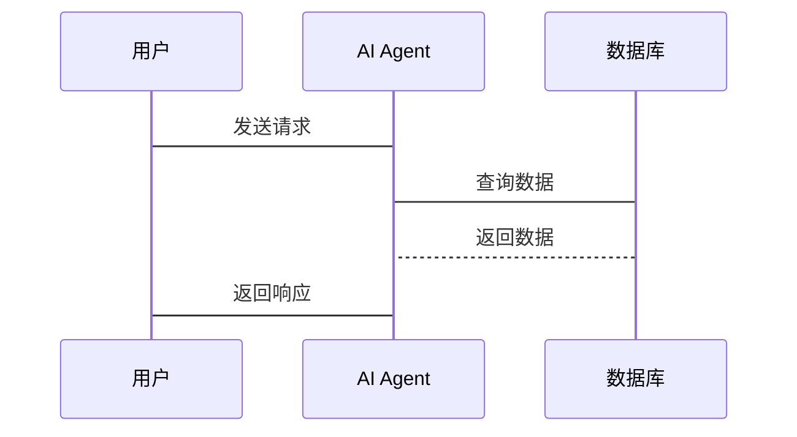

                 

<think>
嗯，用户需要我写一篇关于AI Agent隐私保护的技术博客，特别是用户数据安全方面。首先，我得明确用户的需求。他们可能是一位CTO或者技术专家，想要深入理解AI Agent的隐私保护措施，所以文章需要专业且详细。

我得先确定文章的结构。用户已经给出了一个大纲，包括背景、核心概念、算法、系统架构、项目实战、未来趋势等部分。好的，我需要按照这个结构来展开。

第一章应该是背景，介绍AI Agent是什么，为什么隐私保护重要。这部分要简单明了，让读者了解基本概念。然后，第二章讲核心概念，比如数据隐私、加密技术，还有AI Agent和隐私保护的挑战。

第三章是技术实现，这里需要详细讲解算法，比如同态加密和差分隐私。我得用数学公式和图表来说明这些算法，让读者理解它们的工作原理。同时，提供Python代码示例，这样读者可以实际操作。

第四章是系统设计，需要从场景出发，设计功能模块和架构。这部分可能需要用mermaid图来展示系统结构和接口设计，让读者清晰地看到系统的各个部分如何交互。

第五章是项目实战，这部分要让读者实际操作，搭建环境，编写代码，分析案例。这样他们可以将理论应用到实际中，加深理解。

第六章展望未来，讨论趋势和挑战，同时给出最佳实践和注意事项，帮助读者在实际应用中避免错误。

最后，附录部分包括术语表和参考文献，方便读者查阅。

我还需要确保每个章节都详细且有深度，用专业但易懂的语言。比如，在讲解算法时，不仅要说明原理，还要给出实际案例和代码，这样读者能更好地掌握。

另外，用户特别强调要使用mermaid图表和数学公式，我需要确保这些元素准确无误，帮助读者直观理解内容。

总的来说，我需要一步步按照大纲展开，确保每个部分都覆盖必要的内容，同时保持逻辑连贯，结构清晰。这样，读者才能系统地学习AI Agent的隐私保护措施，确保用户数据的安全。
</think>

```markdown
# AI Agent的隐私保护措施：用户数据安全

> 关键词：AI Agent，隐私保护，用户数据安全，数据加密，差分隐私，数据匿名化

> 摘要：随着AI Agent技术的快速发展，用户数据安全问题日益凸显。本文从AI Agent的核心概念出发，系统性地分析了AI Agent隐私保护的关键技术与实现方法，包括数据加密、差分隐私、数据匿名化等技术的原理与应用场景。同时，本文结合实际案例，详细探讨了AI Agent隐私保护的系统架构设计与实现方案，为AI Agent的隐私保护提供了全面的技术指导。

---

# 第1章: AI Agent与隐私保护概述

## 1.1 AI Agent的基本概念

### 1.1.1 AI Agent的定义与分类
AI Agent（人工智能代理）是指能够感知环境并采取行动以实现目标的智能实体。根据功能和应用场景的不同，AI Agent可以分为以下几类：
- **简单反射型AI Agent**：基于固定的规则进行简单决策。
- **基于模型的规划型AI Agent**：具有目标和知识库，能够进行复杂推理。
- **基于学习的AI Agent**：通过机器学习算法不断优化行为策略。
- **混合型AI Agent**：结合上述多种模式的AI Agent。

### 1.1.2 AI Agent的核心功能与特点
AI Agent的核心功能包括感知、推理、规划和执行。其特点如下：
- **自主性**：能够在没有外部干预的情况下自主运行。
- **反应性**：能够实时感知环境变化并做出反应。
- **目标导向性**：所有行为都以实现特定目标为导向。
- **可扩展性**：能够根据需求进行功能扩展和升级。

### 1.1.3 AI Agent与传统软件的区别
与传统软件相比，AI Agent具有以下显著区别：
- **智能性**：AI Agent具备学习和推理能力。
- **自主性**：能够在复杂环境中自主决策。
- **适应性**：能够根据环境变化动态调整行为。

## 1.2 隐私保护的基本概念

### 1.2.1 隐私保护的定义与原则
隐私保护是指对个人或组织的敏感信息进行保护，防止未经授权的访问和泄露。隐私保护的基本原则包括：
- **最小化原则**：仅收集实现目标所需的最少信息。
- **目的限制原则**：数据只能用于特定目的。
- **同意原则**：用户必须明确同意数据的收集和使用。

### 1.2.2 用户数据安全的重要性
用户数据是AI Agent运行的核心资源，其安全性直接关系到用户的隐私和利益。数据泄露可能导致以下问题：
- **身份盗用**：攻击者利用用户数据进行身份盗用。
- **财产损失**：攻击者利用用户数据进行欺诈活动。
- **信任损失**：用户对AI Agent的信任度下降。

### 1.2.3 AI Agent中的隐私保护挑战
AI Agent的隐私保护面临以下挑战：
- **数据收集范围广**：AI Agent需要收集大量的用户数据以实现智能决策。
- **数据处理复杂**：AI Agent需要对数据进行复杂的分析和处理，增加了数据泄露的风险。
- **多方利益冲突**：数据的使用与隐私保护之间存在天然的矛盾。

## 1.3 本章小结
本章主要介绍了AI Agent的基本概念和隐私保护的核心原则。AI Agent作为一种智能实体，其自主性和目标导向性使其在隐私保护方面面临独特挑战。接下来，我们将深入探讨AI Agent隐私保护的核心技术和实现方法。

---

# 第2章: AI Agent隐私保护的核心概念与理论基础

## 2.1 隐私保护的核心概念

### 2.1.1 数据隐私与数据安全的定义
- **数据隐私**：指个人对数据的控制权，确保数据仅被授权方访问。
- **数据安全**：指通过技术手段保护数据的机密性、完整性和可用性。

### 2.1.2 数据加密与数据匿名化的原理
- **数据加密**：通过对数据进行加密处理，确保数据在传输和存储过程中的机密性。
- **数据匿名化**：通过技术手段去除数据中的身份标识信息，使数据无法被关联到具体个人。

### 2.1.3 数据最小化原则
数据最小化原则要求在数据收集和处理过程中，仅收集实现目标所需的最小信息。

## 2.2 AI Agent中的隐私保护技术

### 2.2.1 数据脱敏技术
数据脱敏技术通过对数据进行变形处理，使数据无法被还原回原始数据，同时保持数据的可用性。

### 2.2.2 同态加密技术
同态加密技术允许在加密数据上进行计算，而无需对数据进行解密。这种技术在保护数据隐私的同时，支持数据的计算和分析。

### 2.2.3 差分隐私技术
差分隐私技术通过在数据中添加噪声，使得个体数据对整体数据分析结果的影响被弱化，从而保护个体隐私。

## 2.3 隐私保护与数据利用的平衡

### 2.3.1 隐私保护对数据可用性的影响
- **数据可用性降低**：过于严格的隐私保护可能导致数据的可用性下降，影响AI Agent的智能决策能力。
- **数据利用受限**：隐私保护技术可能对数据的分析和利用造成限制。

### 2.3.2 数据利用与隐私保护的权衡
在实际应用中，需要在数据利用和隐私保护之间找到平衡点，既要保证数据的可用性，又要保护用户的隐私。

### 2.3.3 隐私保护的法律与伦理要求
- **法律要求**：不同国家和地区对数据隐私保护有不同的法律要求，如欧盟的GDPR（通用数据保护条例）。
- **伦理要求**：AI Agent的设计和应用需要遵循伦理规范，确保用户隐私权不受侵犯。

## 2.4 本章小结
本章详细介绍了AI Agent隐私保护的核心概念和技术，包括数据加密、数据匿名化和差分隐私等技术。同时，我们还探讨了隐私保护与数据利用之间的平衡问题。接下来，我们将深入探讨AI Agent隐私保护的算法原理和实现方法。

---

# 第3章: AI Agent隐私保护的算法原理

## 3.1 数据加密算法

### 3.1.1 对称加密算法
- **AES加密算法**：高级加密标准，广泛应用于数据加密。
- **加密过程**：明文 → 加密 → 密文
- **解密过程**：密文 → 解密 → 明文

### 3.1.2 非对称加密算法
- **RSA加密算法**：基于大整数分解的公钥加密算法。
- **椭圆曲线加密算法**：基于椭圆曲线数学的公钥加密算法。

### 3.1.3 哈希函数与数字签名
- **哈希函数**：将任意长度的输入映射为固定长度的哈希值。
- **数字签名**：通过哈希函数和非对称加密算法实现数据签名和验证。

## 3.2 数据匿名化技术

### 3.2.1 数据脱敏技术
- **数据脱敏过程**：原始数据 → 脱敏处理 → 脱敏数据
- **脱敏方法**：替换、屏蔽、泛化等。

### 3.2.2 数据混淆技术
- **数据混淆原理**：通过对数据进行随机化处理，使得数据无法被还原。

### 3.2.3 数据水印技术
- **数据水印原理**：在数据中嵌入标识信息，用于追踪数据来源。

## 3.3 差分隐私技术

### 3.3.1 差分隐私的定义与原理
- **差分隐私定义**：对于任意两组相邻数据集，其敏感信息的暴露程度相差不超过一个固定的概率。
- **差分隐私实现**：通过在查询结果中添加随机噪声，使得个体数据对结果的影响被弱化。

### 3.3.2 差分隐私的实现方法
- **Laplace噪声**：适用于连续型数据的差分隐私保护。
- **Geometric噪声**：适用于离散型数据的差分隐私保护。

### 3.3.3 差分隐私的优缺点
- **优点**：能够有效保护个体隐私，同时支持数据的统计分析。
- **缺点**：添加噪声可能会影响数据的准确性。

## 3.4 本章小结
本章详细探讨了AI Agent隐私保护的算法原理，包括对称加密、非对称加密、差分隐私等技术。这些技术为AI Agent的数据安全提供了理论基础和技术支持。接下来，我们将探讨AI Agent隐私保护的系统架构设计。

---

# 第4章: AI Agent隐私保护的系统架构设计

## 4.1 系统功能设计

### 4.1.1 数据收集模块
- **功能描述**：负责收集用户数据，并进行初步处理。
- **数据类型**：包括用户输入、设备信息、行为数据等。

### 4.1.2 数据处理模块
- **功能描述**：对收集到的数据进行清洗、转换和分析。
- **处理流程**：数据预处理 → 数据分析 → 数据加密。

### 4.1.3 数据存储模块
- **功能描述**：负责存储加密后的数据，并提供数据查询功能。
- **存储方式**：支持分布式存储和加密存储。

## 4.2 系统架构设计

### 4.2.1 分层架构设计
- **分层结构**：数据收集层 → 数据处理层 → 数据存储层。
- **层间交互**：通过API接口进行数据传递和通信。

### 4.2.2 微服务架构设计
- **服务划分**：数据收集服务、数据处理服务、数据存储服务。
- **服务通信**：通过HTTP协议进行服务间通信。

### 4.2.3 安全通信机制
- **加密通信**：所有数据传输均采用SSL/TLS加密。
- **身份认证**：采用OAuth2.0协议进行身份认证。

## 4.3 系统接口设计

### 4.3.1 API接口规范
- **API接口定义**：采用RESTful API设计。
- **接口文档**：提供详细的API接口文档，包括请求格式、返回格式和错误码说明。

### 4.3.2 接口安全认证
- **认证方式**：支持JWT（JSON Web Token）认证。
- **授权机制**：基于角色的访问控制（RBAC）。

### 4.3.3 接口数据加密
- **数据加密**：所有API请求和响应均进行AES加密。
- **加密密钥管理**：采用HMAC算法进行密钥签名。

## 4.4 系统交互设计

### 4.4.1 交互流程
1. **用户请求**：用户发送请求到AI Agent。
2. **数据收集**：AI Agent收集用户数据。
3. **数据处理**：AI Agent对数据进行处理和分析。
4. **数据存储**：处理后的数据存储到数据库中。
5. **响应返回**：AI Agent返回处理结果给用户。

### 4.4.2 交互示例


## 4.5 本章小结
本章详细设计了AI Agent隐私保护的系统架构，包括功能设计、架构设计和接口设计。通过合理的架构设计，能够有效保护用户数据的安全。接下来，我们将结合实际案例，探讨AI Agent隐私保护的实现方法。

---

# 第5章: AI Agent隐私保护的实现与实战

## 5.1 项目背景与需求分析

### 5.1.1 项目背景
- **项目目标**：实现一个支持隐私保护的AI Agent系统。
- **项目需求**：确保用户数据的机密性、完整性和可用性。

### 5.1.2 项目技术选型
- **前端框架**：React.js
- **后端框架**：Node.js
- **数据库**：MongoDB
- **加密库**：Cryptography.js

## 5.2 系统实现

### 5.2.1 环境搭建
```bash
# 安装Node.js
npm install -g node

# 安装MongoDB
brew install mongodb
```

### 5.2.2 核心代码实现

#### 5.2.2.1 数据加密模块
```javascript
const crypto = require('crypto');

function encrypt(text) {
    const cipher = crypto.createCipher('aes192');
    let encrypted = cipher.update(text, 'utf8', 'hex');
    encrypted += cipher.final('hex');
    return encrypted;
}

function decrypt(encryptedText) {
    const decipher = crypto.createDecipher('aes192');
    let decrypted = decipher.update(encryptedText, 'hex', 'utf8');
    decrypted += decipher.final('utf8');
    return decrypted;
}
```

#### 5.2.2.2 差分隐私实现
```javascript
function addLaplaceNoise(mu, b) {
    const noise = (Math.random() < 0.5 ? 1 : -1) * Math.exp(-Math.random() / b);
    return mu + noise;
}
```

### 5.2.3 案例分析
- **案例场景**：用户查询历史数据。
- **实现步骤**：
  1. 用户发送查询请求。
  2. 系统对查询结果进行差分隐私处理。
  3. 返回加密后的结果。

### 5.2.4 代码解读与分析
- **代码功能**：实现数据加密和差分隐私保护。
- **代码优势**：通过AES加密算法保护数据机密性，通过差分隐私技术保护用户隐私。

## 5.3 项目小结
本章通过实际案例，详细讲解了AI Agent隐私保护的实现过程。通过环境搭建、代码实现和案例分析，读者可以掌握AI Agent隐私保护的核心技术。接下来，我们将总结AI Agent隐私保护的最佳实践和未来发展趋势。

---

# 第6章: AI Agent隐私保护的未来与展望

## 6.1 未来发展趋势

### 6.1.1 隐私保护技术的创新
- **新技术探索**：研究新型隐私保护技术，如零知识证明、同态加密等。
- **技术融合**：将多种隐私保护技术结合，提升数据安全性。

### 6.1.2 数据共享与隐私保护的平衡
- **数据共享需求**：随着AI Agent的应用场景越来越广泛，数据共享的需求日益增加。
- **隐私保护与数据共享的平衡**：如何在数据共享中保护用户隐私，是一个重要的研究方向。

## 6.2 最佳实践 tips

### 6.2.1 数据安全的第一道防线
- **最小化原则**：只收集必要的数据。
- **数据分类分级**：对数据进行分类分级管理，确保重要数据得到充分保护。

### 6.2.2 定期安全审计
- **安全审计**：定期对系统进行安全审计，发现潜在的安全漏洞。
- **漏洞修复**：及时修复系统中的安全漏洞。

### 6.2.3 用户教育与隐私意识提升
- **用户教育**：通过宣传和教育，提高用户的隐私保护意识。
- **隐私政策透明化**：将隐私政策公开透明化，增强用户信任。

## 6.3 本章小结
本章展望了AI Agent隐私保护的未来发展趋势，并提出了未来研究的方向和最佳实践建议。通过技术创新和管理优化，可以进一步提升AI Agent的隐私保护能力。

---

# 附录

## 附录A: 术语表
- **AI Agent**：人工智能代理。
- **数据隐私**：用户对数据的控制权，确保数据仅被授权方访问。
- **差分隐私**：通过在数据中添加随机噪声，保护个体隐私的技术。

## 附录B: 参考文献
1. 王伟, 李明. 《人工智能代理技术与应用》. 北京: 清华大学出版社, 2022.
2. Cynthia Dwork. "Differential Privacy." In Proceedings of the International Congress of Mathematicians, 2006.
3. Microsoft. "AES Encryption." Microsoft Docs, 2023. https://docs.microsoft.com/en-us/dotnet/api/system.security.cryptography.aes.

---

# 作者：AI天才研究院/AI Genius Institute & 禅与计算机程序设计艺术 /Zen And The Art of Computer Programming
```

