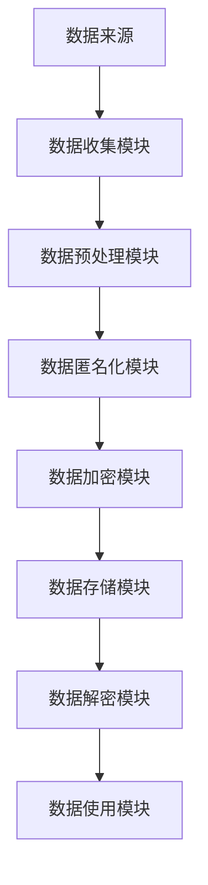
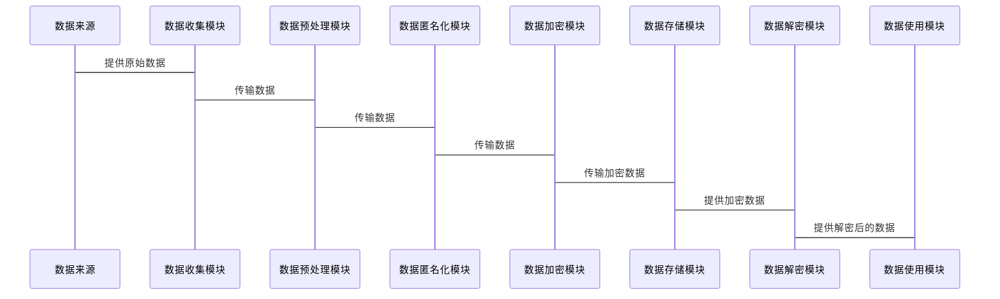

                 


---

# AI Agent的隐私保护：数据匿名化与加密

## 关键词：AI Agent、隐私保护、数据匿名化、加密技术、数据安全

## 摘要：  
随着人工智能技术的快速发展，AI Agent（智能体）在各个领域的应用越来越广泛。然而，AI Agent在处理和存储数据时，也面临着隐私泄露的巨大风险。本文将深入探讨AI Agent中的隐私保护问题，重点分析数据匿名化与加密技术的核心原理及其在AI Agent中的应用。通过理论与实践相结合的方式，本文将详细阐述如何利用数据匿名化与加密技术保护AI Agent中的数据隐私，同时分析相关技术的优缺点、实现流程及实际案例，为AI Agent的隐私保护提供系统的解决方案。

---

# 第1章: AI Agent与隐私保护概述

## 1.1 AI Agent的基本概念

### 1.1.1 AI Agent的定义与特点
AI Agent（智能体）是一种能够感知环境、自主决策并执行任务的智能系统。它可以基于传感器、数据库或其他输入源获取信息，通过内部算法处理信息，并通过执行器或输出模块完成任务。AI Agent的特点包括自主性、反应性、目标导向性和社会性。

### 1.1.2 AI Agent的核心功能与应用场景
AI Agent的核心功能包括感知、推理、规划和执行。其应用场景涵盖自动驾驶、智能客服、推荐系统、机器人控制等领域。

### 1.1.3 AI Agent与隐私保护的关系
AI Agent在执行任务时需要处理大量敏感数据，例如用户的地理位置、行为习惯、身份信息等。这些数据如果被未经授权的第三方获取，可能导致隐私泄露。因此，隐私保护是AI Agent设计中的重要组成部分。

## 1.2 隐私保护的重要性

### 1.2.1 数字化时代隐私保护的挑战
在数字化时代，数据的价值被广泛认可，但同时也带来了隐私泄露的风险。AI Agent作为数据处理的核心，必须在数据处理过程中保护用户的隐私。

### 1.2.2 AI Agent中的隐私风险
AI Agent可能面临以下隐私风险：数据被恶意攻击者窃取、数据在传输过程中被截获、数据在存储过程中被泄露等。

### 1.2.3 隐私保护的法律与伦理要求
隐私保护不仅是技术问题，更是法律和伦理问题。例如，GDPR（通用数据保护条例）要求企业必须保护用户的个人数据，确保数据处理的合法性、透明性和用户同意。

## 1.3 数据匿名化与加密技术的背景

### 1.3.1 数据匿名化的概念与目的
数据匿名化是指通过技术手段将数据中的敏感信息隐藏或脱敏，使得数据无法被用于识别特定的个人或实体。其目的是在保护隐私的前提下，仍然允许数据的使用和分析。

### 1.3.2 加密技术在隐私保护中的作用
加密技术通过将数据转化为不可读的格式，确保只有授权的用户才能访问原始数据。加密技术在数据传输和存储中起到了关键的保护作用。

### 1.3.3 AI Agent中数据匿名化与加密的必要性
在AI Agent中，数据匿名化与加密技术是保护用户隐私的核心手段。通过这些技术，可以有效防止数据泄露，确保AI Agent的安全性和合规性。

## 1.4 本章小结
本章介绍了AI Agent的基本概念、隐私保护的重要性以及数据匿名化与加密技术的背景。通过这些内容，读者可以理解为什么隐私保护是AI Agent设计中的关键问题，以及数据匿名化与加密技术在其中的重要作用。

---

# 第2章: 数据匿名化技术原理

## 2.1 数据匿名化的核心概念

### 2.1.1 数据匿名化的定义与目标
数据匿名化是指通过技术手段将数据中的敏感信息隐藏或脱敏，使得数据无法被用于识别特定的个人或实体。其目标是在保护隐私的前提下，仍然允许数据的使用和分析。

### 2.1.2 数据匿名化的实现方法
数据匿名化的主要实现方法包括数据脱敏、数据扰动、数据泛化和数据置换等。

### 2.1.3 数据匿名化的评价指标
数据匿名化的评价指标包括匿名性、可用性、计算复杂度和存储空间等。

## 2.2 常见数据匿名化技术

### 2.2.1 数据脱敏技术
数据脱敏是指通过替换、删除或加密敏感数据，使其无法被直接识别的过程。例如，将姓名替换为“用户1”、“用户2”等。

### 2.2.2 数据扰动技术
数据扰动技术是指通过添加噪声或小幅度的随机扰动，使得数据无法被精确识别。例如，在地理位置数据中添加随机的地理位置偏移。

### 2.2.3 数据加密技术
数据加密技术是指通过加密算法对数据进行加密，使得只有授权的用户才能解密并获取原始数据。例如，使用AES算法对敏感数据进行加密。

## 2.3 数据匿名化与AI Agent的结合

### 2.3.1 AI Agent中数据匿名化的应用场景
在AI Agent中，数据匿名化主要用于保护用户隐私。例如，在推荐系统中，用户的行为数据需要匿名化处理，以防止用户身份被泄露。

### 2.3.2 数据匿名化对AI Agent性能的影响
数据匿名化可能会对AI Agent的性能产生一定的影响，例如增加数据处理的时间复杂度或存储空间的消耗。

### 2.3.3 数据匿名化的实现流程
数据匿名化的实现流程包括数据收集、数据预处理、数据匿名化处理和数据验证等步骤。

## 2.4 本章小结
本章详细介绍了数据匿名化的核心概念、常见技术以及在AI Agent中的应用。通过这些内容，读者可以理解数据匿名化在保护用户隐私中的重要作用。

---

# 第3章: 数据加密技术原理

## 3.1 数据加密的核心概念

### 3.1.1 数据加密的定义与目标
数据加密是指通过加密算法对数据进行编码，使得只有授权的用户才能解密并获取原始数据。其目标是保护数据的机密性和完整性。

### 3.1.2 加密算法的分类与特点
加密算法主要分为对称加密算法、非对称加密算法和哈希函数等。对称加密算法（如AES）的特点是加密和解密使用相同的密钥；非对称加密算法（如RSA）的特点是加密和解密使用不同的密钥；哈希函数（如SHA-256）的特点是不可逆性。

### 3.1.3 加密强度与安全性评估
加密强度通常由密钥长度、算法复杂度和安全性评估决定。例如，AES-256的密钥长度为256位，安全性非常高。

## 3.2 常见加密算法

### 3.2.1 对称加密算法
对称加密算法是加密和解密使用相同密钥的算法。例如，AES算法是一种常用的对称加密算法，具有高效性和安全性。

### 3.2.2 非对称加密算法
非对称加密算法是加密和解密使用不同密钥的算法。例如，RSA算法是一种常用的非对称加密算法，常用于数字签名和公钥加密。

### 3.2.3 哈希函数与数字签名
哈希函数用于将任意长度的数据映射为固定长度的哈希值。数字签名通过哈希函数和非对称加密算法实现数据的完整性验证和身份验证。

## 3.3 数据加密在AI Agent中的应用

### 3.3.1 加密数据的存储与传输
在AI Agent中，敏感数据通常需要在存储和传输过程中进行加密。例如，用户密码、地理位置数据等需要加密存储。

### 3.3.2 加密对AI模型训练的影响
加密数据的使用可能会对AI模型的训练产生一定的影响。例如，加密后的数据可能需要额外的处理步骤才能用于模型训练。

### 3.3.3 加密数据的可检索性与可用性
加密数据的可检索性与可用性是加密技术的重要指标。例如， searchable encryption（可搜索加密）技术可以在不泄露密钥的情况下，对加密数据进行高效检索。

## 3.4 本章小结
本章详细介绍了数据加密的核心概念、常见算法以及在AI Agent中的应用。通过这些内容，读者可以理解加密技术在保护数据隐私中的重要作用。

---

# 第4章: 数据匿名化与加密的结合

## 4.1 数据匿名化与加密的协同作用

### 4.1.1 数据匿名化与加密的联合机制
数据匿名化与加密技术可以协同作用，例如先对数据进行匿名化处理，再对匿名化后的数据进行加密，从而进一步提高数据的安全性。

### 4.1.2 数据匿名化对加密技术的补充作用
数据匿名化可以补充加密技术的不足。例如，数据匿名化可以防止数据在加密后的状态下被重新识别。

### 4.1.3 加密对数据匿名化的保护作用
加密技术可以保护匿名化后的数据不被未经授权的用户解密，从而确保数据的安全性。

## 4.2 数据匿名化与加密的实现流程

### 4.2.1 数据匿名化处理步骤
数据匿名化处理步骤包括数据收集、数据预处理、数据匿名化处理和数据验证。

### 4.2.2 数据加密处理步骤
数据加密处理步骤包括数据加密、密钥管理、加密数据的存储和加密数据的解密。

### 4.2.3 两者的结合流程
数据匿名化与加密的结合流程包括数据匿名化处理、数据加密处理、加密数据的传输和解密验证。

## 4.3 数据匿名化与加密的优缺点

### 4.3.1 数据匿名化的优势与局限性
数据匿名化的优势在于能够有效保护用户隐私，但其局限性在于可能会影响数据的可用性和分析准确性。

### 4.3.2 数据加密的优势与局限性
数据加密的优势在于能够有效保护数据的安全性，但其局限性在于可能增加数据处理的复杂性和成本。

### 4.3.3 数据匿名化与加密的结合优势
数据匿名化与加密的结合优势在于能够同时保护数据的隐私和安全性，但其复杂性和成本也相应增加。

## 4.4 本章小结
本章详细介绍了数据匿名化与加密技术的协同作用、实现流程及优缺点。通过这些内容，读者可以理解如何通过结合数据匿名化与加密技术来有效保护AI Agent中的数据隐私。

---

# 第5章: 数据匿名化与加密的系统分析

## 5.1 系统功能设计

### 5.1.1 系统功能模块划分
数据匿名化与加密系统的功能模块包括数据收集模块、数据匿名化模块、数据加密模块和数据解密模块。

### 5.1.2 系统功能流程
数据匿名化与加密系统的功能流程包括数据收集、数据预处理、数据匿名化处理、数据加密处理、数据存储和数据解密处理。

## 5.2 系统架构设计

### 5.2.1 系统架构设计图
数据匿名化与加密系统的架构设计图如下：



### 5.2.2 系统组件之间的关系
数据收集模块负责收集原始数据，数据预处理模块负责对数据进行清洗和格式转换，数据匿名化模块负责对数据进行匿名化处理，数据加密模块负责对匿名化后的数据进行加密，数据存储模块负责存储加密数据，数据解密模块负责对加密数据进行解密，数据使用模块负责对解密后的数据进行分析和处理。

## 5.3 系统接口设计

### 5.3.1 数据匿名化接口
数据匿名化接口用于对数据进行匿名化处理。例如，API接口可以接受原始数据，并返回匿名化后的数据。

### 5.3.2 数据加密接口
数据加密接口用于对数据进行加密处理。例如，API接口可以接受匿名化后的数据和密钥，并返回加密后的数据。

### 5.3.3 数据解密接口
数据解密接口用于对加密数据进行解密处理。例如，API接口可以接受加密数据和密钥，并返回解密后的数据。

## 5.4 系统交互流程

### 5.4.1 系统交互序列图
数据匿名化与加密系统的交互序列图如下：



## 5.5 本章小结
本章详细介绍了数据匿名化与加密系统的功能设计、架构设计、接口设计和交互流程。通过这些内容，读者可以理解如何设计和实现一个高效的隐私保护系统。

---

# 第6章: 项目实战

## 6.1 环境安装与配置

### 6.1.1 开发环境要求
项目实战需要安装Python 3.8及以上版本，安装Jupyter Notebook，安装加密库（如cryptography）和匿名化库（如pandas）。

### 6.1.2 安装依赖项
在终端中执行以下命令安装依赖项：

```bash
pip install cryptography pandas scikit-learn
```

## 6.2 系统核心实现源代码

### 6.2.1 数据匿名化实现

```python
import pandas as pd
import random

def anonymize_data(df, sensitive_columns):
    """
    数据匿名化函数，对指定的敏感列进行匿名化处理。
    """
    anonymized_df = df.copy()
    for col in sensitive_columns:
        # 随机替换为虚拟值
        anonymized_df[col] = anonymized_df[col].apply(lambda x: f"user_{random.randint(1, 1000)}")
    return anonymized_df
```

### 6.2.2 数据加密实现

```python
from cryptography.fernet import Fernet

def encrypt_data(data, key):
    """
    数据加密函数，使用Fernet算法对数据进行加密。
    """
    cipher = Fernet(key)
    encrypted_data = cipher.encrypt(data.encode())
    return encrypted_data

def decrypt_data(encrypted_data, key):
    """
    数据解密函数，使用Fernet算法对数据进行解密。
    """
    cipher = Fernet(key)
    decrypted_data = cipher.decrypt(encrypted_data).decode()
    return decrypted_data
```

### 6.2.3 数据匿名化与加密的结合实现

```python
def process_data():
    # 创建示例数据集
    df = pd.DataFrame({
        'id': [1, 2, 3, 4, 5],
        'name': ['Alice', 'Bob', 'Charlie', 'David', 'Eva'],
        'age': [25, 30, 35, 40, 45],
        'location': ['New York', 'London', 'Paris', 'Tokyo', 'Beijing']
    })
    
    sensitive_columns = ['name', 'age', 'location']
    
    # 数据匿名化处理
    anonymized_df = anonymize_data(df, sensitive_columns)
    
    # 生成加密密钥
    key = Fernet.generate_key()
    
    # 数据加密处理
    encrypted_data = []
    for index, row in anonymized_df.iterrows():
        encrypted_row = {}
        for col in df.columns:
            if col in sensitive_columns:
                encrypted_row[col] = encrypt_data(str(row[col]), key)
            else:
                encrypted_row[col] = str(row[col])
        encrypted_data.append(encrypted_row)
    
    # 存储加密数据
    pd.DataFrame(encrypted_data).to_csv('encrypted_data.csv', index=False)
    
    return key

# 执行数据处理
key = process_data()
print("加密密钥:", key)
```

### 6.2.4 数据解密实现

```python
def decrypt_data_from_file(file_path, key):
    """
    从文件中解密数据。
    """
    df = pd.read_csv(file_path)
    decrypted_data = []
    for index, row in df.iterrows():
        decrypted_row = {}
        for col in row:
            if isinstance(col, str):
                decrypted_row[col] = decrypt_data(col.encode(), key)
            else:
                decrypted_row[col] = str(col)
        decrypted_data.append(decrypted_row)
    return pd.DataFrame(decrypted_data)

# 解密数据
key = process_data()
decrypted_df = decrypt_data_from_file('encrypted_data.csv', key)
print("解密后的数据:", decrypted_df)
```

## 6.3 代码实现与应用解读

### 6.3.1 数据匿名化代码实现
上述代码实现了一个简单但功能齐全的数据匿名化系统，通过对敏感列进行随机替换，实现数据的匿名化处理。

### 6.3.2 数据加密代码实现
上述代码实现了基于Fernet算法的数据加密与解密功能，确保数据在存储和传输过程中的安全性。

### 6.3.3 数据匿名化与加密的结合实现
上述代码展示了如何将数据匿名化与加密技术结合起来，先对数据进行匿名化处理，再对匿名化后的数据进行加密，从而进一步提高数据的安全性。

## 6.4 实际案例分析

### 6.4.1 案例背景
假设我们有一个用户行为分析系统，需要分析用户的点击行为数据，但需要保护用户的隐私。

### 6.4.2 数据匿名化处理
对用户的姓名、IP地址和地理位置进行匿名化处理，例如将姓名替换为“用户1”、“用户2”等。

### 6.4.3 数据加密处理
对匿名化后的数据进行加密处理，确保只有授权的用户才能解密并获取原始数据。

### 6.4.4 数据解密与分析
在需要分析数据时，对加密数据进行解密，并在解密后进行数据分析。

## 6.5 本章小结
本章通过实际案例分析，详细讲解了如何在AI Agent中实现数据匿名化与加密技术。通过代码实现和案例分析，读者可以理解如何将理论应用于实际项目中。

---

# 第7章: 数据匿名化与加密的进一步探讨

## 7.1 数据匿名化与加密技术的未来趋势

### 7.1.1 面向AI Agent的数据隐私保护技术
随着AI Agent技术的不断发展，数据隐私保护技术也将不断进步，例如基于联邦学习的隐私保护技术、基于同态加密的隐私保护技术等。

### 7.1.2 数据匿名化与加密技术的融合创新
数据匿名化与加密技术的融合创新将为AI Agent的隐私保护提供更强大的技术手段。

### 7.1.3 数据隐私保护的法律与伦理挑战
数据隐私保护的法律与伦理挑战将随着技术的发展而不断变化，例如如何在数据匿名化与数据可用性之间找到平衡。

## 7.2 数据匿名化与加密技术的最佳实践

### 7.2.1 数据匿名化与加密技术的选择原则
数据匿名化与加密技术的选择应基于具体的应用场景、数据敏感性、性能要求和安全性要求。

### 7.2.2 数据匿名化与加密技术的实施建议
在实施数据匿名化与加密技术时，应充分考虑数据的生命周期，从数据收集、处理、存储到传输的各个环节进行保护。

### 7.2.3 数据隐私保护的注意事项
数据隐私保护的注意事项包括合法合规性、用户同意、数据最小化原则等。

## 7.3 数据匿名化与加密技术的注意事项

### 7.3.1 数据匿名化与加密技术的局限性
数据匿名化与加密技术的局限性在于可能会影响数据的可用性和分析准确性，同时可能增加数据处理的复杂性和成本。

### 7.3.2 数据隐私保护的权衡与取舍
数据隐私保护的权衡与取舍包括数据隐私与数据可用性、数据隐私与数据处理效率之间的平衡。

### 7.3.3 数据隐私保护的持续优化
数据隐私保护的持续优化需要结合技术发展和实际需求，不断改进和创新。

## 7.4 拓展阅读

### 7.4.1 数据匿名化与加密技术的最新研究
数据匿名化与加密技术的最新研究包括基于区块链的隐私保护技术、基于人工智能的隐私保护技术等。

### 7.4.2 数据隐私保护的国际与国内标准
数据隐私保护的国际与国内标准包括GDPR、CCPA、《个人信息保护法》等。

## 7.5 本章小结
本章对数据匿名化与加密技术的未来趋势、最佳实践和注意事项进行了深入探讨，并提供了拓展阅读的方向。通过这些内容，读者可以更好地理解数据隐私保护技术的发展方向和实际应用。

---

# 第8章: 总结与展望

## 8.1 本研究的主要工作

### 8.1.1 数据匿名化与加密技术的核心原理
本研究详细介绍了数据匿名化与加密技术的核心原理，包括数据脱敏、数据扰动、对称加密和非对称加密等。

### 8.1.2 数据匿名化与加密技术的结合应用
本研究展示了如何将数据匿名化与加密技术结合起来，保护AI Agent中的数据隐私。

## 8.2 研究的创新点

### 8.2.1 数据匿名化与加密技术的协同作用
本研究提出了数据匿名化与加密技术的协同作用，通过结合两者的技术优势，进一步提高数据的安全性。

### 8.2.2 数据隐私保护的系统设计
本研究设计了一个完整的数据隐私保护系统，包括数据收集、数据预处理、数据匿名化、数据加密、数据存储和数据解密等模块。

## 8.3 研究的局限性

### 8.3.1 数据匿名化与加密技术的性能影响
数据匿名化与加密技术可能会对数据处理的性能产生一定的影响，例如增加数据处理的时间复杂度或存储空间的消耗。

### 8.3.2 数据隐私保护的法律与伦理挑战
数据隐私保护的法律与伦理挑战是一个复杂的问题，需要结合技术发展和法律环境进行动态调整。

## 8.4 未来的研究方向

### 8.4.1 数据隐私保护的新型技术研究
未来的研究方向包括基于人工智能的隐私保护技术、基于区块链的隐私保护技术等。

### 8.4.2 数据隐私保护的标准化研究
未来的研究方向包括数据隐私保护的标准化研究，例如制定统一的数据隐私保护标准和规范。

### 8.4.3 数据隐私保护的跨学科研究
未来的研究方向包括数据隐私保护的跨学科研究，例如结合法律、伦理、社会学等领域的研究成果。

## 8.5 本章小结
本章总结了本研究的主要工作、创新点、局限性和未来的研究方向。通过这些内容，读者可以更好地理解数据隐私保护技术的研究现状和发展方向。

---

# 作者：AI天才研究院/AI Genius Institute & 禅与计算机程序设计艺术 /Zen And The Art of Computer Programming

---

以上是《AI Agent的隐私保护：数据匿名化与加密》一书的完整目录大纲和部分正文内容。

