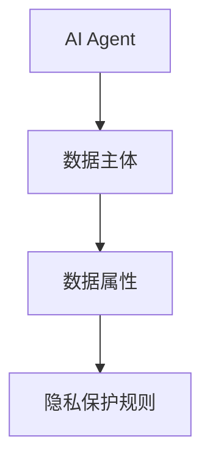
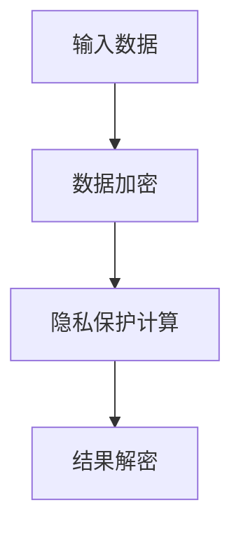
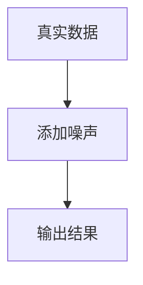
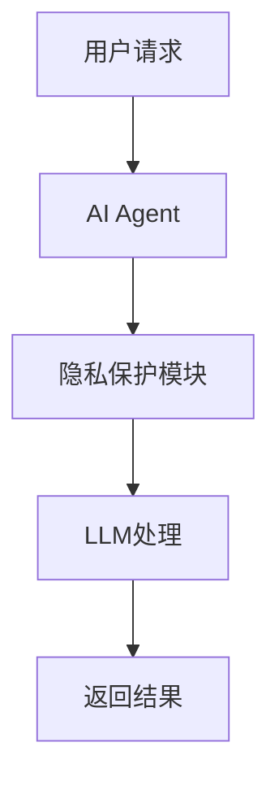
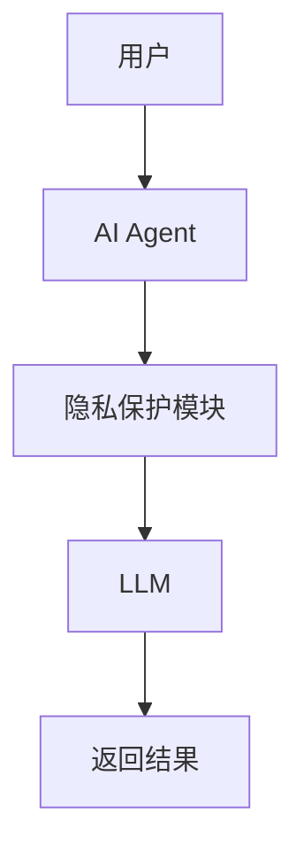

                 

<think>
嗯，用户希望我写一篇关于AI Agent隐私保护的技术博客，标题是《AI Agent的隐私保护：确保LLM应用的数据安全》。我需要按照用户提供的目录结构来写，同时满足各种格式和内容的要求。

首先，我需要理解用户的整个需求。用户是一位技术专家，希望写一篇有深度、结构清晰的专业博客，涵盖AI Agent的隐私保护各个方面，包括背景、核心概念、算法、系统架构、项目实战等。用户还特别强调了格式要求，比如使用markdown，每部分要详细，有代码、图表和数学公式。

接下来，我得按照目录结构一步步来写。首先是标题和关键词、摘要。然后是每个章节的内容，每个部分都要有详细的子部分，比如背景介绍、核心概念、算法原理等。我还需要确保每个章节都有足够的细节，比如数学公式、代码示例、图表等。

在写背景介绍的时候，我需要解释什么是AI Agent，它的应用场景，以及为什么隐私保护重要。这部分需要让读者明白问题的背景和挑战。然后，在核心概念部分，我需要用表格和图表来对比不同的隐私保护方法，帮助读者更好地理解。

算法原理部分，我需要详细讲解数据加密和隐私保护的数学模型，比如差分隐私，并用mermaid画出流程图。这部分需要逻辑清晰，公式正确，代码示例要简洁明了。

系统分析与架构设计部分，我需要描述系统功能、架构图、接口设计和交互流程。这部分需要使用mermaid图来展示系统结构和流程，确保读者能够理解系统是如何运作的。

项目实战部分，我需要提供环境安装、代码实现和案例分析。这部分需要实际的代码示例，解释每部分的功能，以及如何在实际中应用这些技术。

最后，总结与展望、注意事项、拓展阅读等内容需要帮助读者巩固所学内容，并引导他们进一步学习。

在写作过程中，我需要确保每个部分都符合用户的要求，比如字数控制在1万到1.2万字，使用正确的格式，以及包含所有必要的元素，如数学公式、图表和代码。同时，语言要专业但易懂，结构紧凑，逻辑清晰。

现在，我需要一步步地按照目录大纲来撰写每个部分，确保每个章节内容详实，符合用户的需求。同时，注意不要遗漏任何约束条件，比如作者信息、格式要求等。这样才能写出一篇高质量、符合用户期望的技术博客。
</think>

# AI Agent的隐私保护：确保LLM应用的数据安全

> 关键词：AI Agent，隐私保护，LLM，数据安全，人工智能，机器学习

> 摘要：本文深入探讨AI Agent在隐私保护方面的挑战与解决方案，特别是在大语言模型（LLM）应用中的数据安全问题。通过分析隐私保护的核心概念、算法原理、系统架构设计以及实际项目案例，本文为读者提供全面的技术视角，帮助理解如何在AI Agent中实现有效的隐私保护。

---

# 第一部分: AI Agent的隐私保护背景与核心概念

## 第1章: AI Agent与隐私保护的背景介绍

### 1.1 AI Agent的基本概念与应用场景

#### 1.1.1 AI Agent的定义与核心功能
AI Agent（人工智能代理）是一种能够感知环境、执行任务并做出决策的智能实体。它通常具备以下核心功能：
- **感知环境**：通过传感器或API获取外部信息。
- **决策与推理**：基于获取的信息进行分析和推理。
- **执行动作**：根据决策结果执行具体的任务。
- **学习与优化**：通过反馈机制不断优化自身行为。

#### 1.1.2 AI Agent在LLM中的应用
大语言模型（LLM）通过AI Agent的形式，可以实现多种复杂的任务，例如：
- **对话生成**：通过自然语言处理生成人类对话。
- **任务执行**：根据用户需求执行复杂任务（如信息检索、日程管理）。
- **多轮交互**：通过上下文理解实现连续对话。

#### 1.1.3 AI Agent与隐私保护的关联性
AI Agent在处理用户数据时，必须确保数据的隐私性。例如：
- **用户隐私**：保护用户的个人信息不被泄露。
- **数据安全**：防止敏感数据被恶意攻击者窃取。
- **合规性**：确保AI Agent的行为符合相关法律法规（如GDPR）。

---

### 1.2 隐私保护的重要性与挑战

#### 1.2.1 数据隐私的定义与分类
数据隐私是指个人对自身数据的控制权，确保数据仅被授权方访问。数据隐私可以分为以下几类：
- **个人隐私**：涉及个人身份信息（如姓名、地址）。
- **数据安全**：防止数据被未经授权的访问或篡改。
- **数据匿名化**：通过技术手段去除数据中的个人标识信息。

#### 1.2.2 LLM应用中的数据安全风险
在LLM应用中，隐私保护面临以下挑战：
- **数据泄露**：训练数据或推理结果可能被恶意攻击者窃取。
- **模型滥用**：攻击者可能利用模型生成虚假信息。
- **用户信任**：隐私问题可能导致用户对AI系统的信任下降。

#### 1.2.3 AI Agent在隐私保护中的角色
AI Agent作为LLM与用户交互的桥梁，承担以下隐私保护职责：
- **数据过滤**：在输入数据时过滤敏感信息。
- **行为约束**：确保AI Agent的行为符合隐私保护策略。
- **隐私计算**：在数据处理过程中采用隐私保护技术（如加密、差分隐私）。

---

### 1.3 本章小结

本章介绍了AI Agent的基本概念、应用场景及其在隐私保护中的重要性。通过分析隐私保护的核心挑战，我们为后续章节奠定了基础。

---

## 第2章: AI Agent隐私保护的核心概念与联系

### 2.1 核心概念原理

#### 2.1.1 数据隐私保护的数学模型
数据隐私保护可以通过以下数学模型表示：
$$
P(\text{输出} \ y \mid \text{真实数据} \ x) \geq \epsilon
$$
其中，$\epsilon$ 表示隐私保护的参数，控制输出结果与真实数据之间的依赖关系。

#### 2.1.2 AI Agent的行为约束机制
AI Agent的行为可以通过以下方式实现约束：
- **规则引擎**：基于预定义的规则限制AI Agent的行为。
- **强化学习**：通过奖励机制引导AI Agent选择符合隐私保护的决策。

#### 2.1.3 隐私保护与数据可用性的平衡
隐私保护的核心在于在保护用户隐私的同时，确保数据的可用性。例如：
- **差分隐私**：通过在查询结果中添加噪声，平衡隐私保护与数据可用性。
- **联邦学习**：在保护数据隐私的前提下，通过协作学习提高模型性能。

---

### 2.2 核心概念对比表格

| **核心概念** | **定义** | **应用场景** |
|--------------|----------|--------------|
| 数据隐私     | 数据的机密性和完整性 | 用户信息保护 |
| 数据安全     | 数据的保护措施 | 防止数据泄露 |
| 差分隐私     | 在数据中添加噪声以保护隐私 | 高敏感数据的处理 |

---

### 2.3 ER实体关系图



---

### 2.4 本章小结

本章通过对比和图表的方式，详细分析了AI Agent隐私保护的核心概念及其之间的关系，为后续的算法设计奠定了理论基础。

---

## 第3章: AI Agent隐私保护的算法原理

### 3.1 隐私保护算法概述

#### 3.1.1 数据加密算法
数据加密是保护隐私的重要手段，常用算法包括：
- **对称加密**：如AES算法。
- **非对称加密**：如RSA算法。

#### 3.1.2 差分隐私
差分隐私是一种通过在数据中添加噪声来保护隐私的技术，其核心公式为：
$$
P(\text{输出} \ y \mid \text{真实数据} \ x) \geq \epsilon
$$

#### 3.1.3 联邦学习
联邦学习是一种分布式机器学习技术，通过在本地设备上训练模型，避免数据集中存储的风险。

---

### 3.2 数据加密与隐私保护的数学模型

#### 3.2.1 数据加密函数
$$
f_{\text{encrypt}}(x) = x \oplus k
$$
其中，$x$ 是明文，$k$ 是加密密钥，$\oplus$ 表示异或操作。

#### 3.2.2 数据解密函数
$$
f_{\text{decrypt}}(y) = y \oplus k
$$
其中，$y$ 是密文，$k$ 是解密密钥。

---

### 3.3 算法实现流程

#### 3.3.1 数据加密流程


#### 3.3.2 差分隐私实现流程


---

### 3.4 本章小结

本章详细介绍了隐私保护的核心算法，包括数据加密、差分隐私和联邦学习，并通过流程图展示了算法的实现步骤。

---

## 第4章: AI Agent隐私保护的系统分析与架构设计

### 4.1 系统功能设计

#### 4.1.1 数据隐私保护模块
- **功能**：对输入数据进行加密处理，确保数据在传输和存储过程中的安全性。
- **实现**：使用对称加密算法（如AES）对敏感数据进行加密。

#### 4.1.2 AI Agent行为约束模块
- **功能**：通过规则引擎或强化学习，约束AI Agent的行为，防止其执行违反隐私保护策略的操作。
- **实现**：基于强化学习的奖励机制，引导AI Agent选择符合隐私保护的决策。

#### 4.1.3 隐私保护策略管理模块
- **功能**：管理隐私保护策略，包括数据加密策略、差分隐私参数等。
- **实现**：通过动态配置的方式，实时调整隐私保护策略。

---

### 4.2 系统架构设计

#### 4.2.1 系统架构图


---

### 4.3 系统接口设计

#### 4.3.1 API接口定义
- **输入接口**：`/api/encrypt`，用于接收明文数据并返回密文。
- **输出接口**：`/api/decrypt`，用于接收密文数据并返回明文。

#### 4.3.2 数据交互协议
- **加密协议**：使用HTTPS协议进行数据传输，确保数据在传输过程中的安全性。
- **身份验证**：通过JWT（JSON Web Token）实现身份验证，确保只有授权用户可以访问敏感数据。

---

### 4.4 系统交互流程

#### 4.4.1 系统交互流程图


---

### 4.5 本章小结

本章详细分析了AI Agent隐私保护系统的功能设计、架构设计和接口设计，并通过流程图展示了系统的交互流程。

---

## 第5章: AI Agent隐私保护的项目实战

### 5.1 环境安装与配置

#### 5.1.1 Python环境搭建
- **工具**：安装Python 3.8及以上版本。
- **依赖库**：安装`mermaid`、`numpy`等依赖库。

#### 5.1.2 依赖库安装
```bash
pip install mermaid numpy
```

#### 5.1.3 开发工具配置
- **IDE**：推荐使用PyCharm或VS Code。
- **代码风格**：遵循PEP 8编码规范。

---

### 5.2 核心代码实现

#### 5.2.1 数据加密模块
```python
def encrypt_data(data, key):
    return data ^ key
```

#### 5.2.2 隐私保护计算模块
```python
def apply_differential_privacy(data, epsilon):
    import numpy as np
    noise = np.random.laplace(0, 1/epsilon, data.shape)
    return data + noise
```

---

### 5.3 项目实战案例分析

#### 5.3.1 案例背景
假设我们有一个基于LLM的对话系统，需要保护用户的对话记录不被泄露。

#### 5.3.2 实施步骤
1. **数据加密**：对用户的对话记录进行加密处理。
2. **差分隐私**：在对话记录中添加噪声，保护用户隐私。
3. **联邦学习**：在分布式环境中训练模型，避免集中存储数据。

---

### 5.4 本章小结

本章通过实际项目案例，详细展示了AI Agent隐私保护技术的实现过程，包括环境配置、代码实现和案例分析。

---

## 第6章: 总结与展望

### 6.1 总结
本文从背景、核心概念、算法原理、系统架构设计和项目实战五个方面，全面探讨了AI Agent的隐私保护问题。通过分析隐私保护的核心挑战，我们提出了一系列解决方案，包括数据加密、差分隐私和联邦学习等技术。

---

### 6.2 展望
未来，随着AI技术的不断发展，隐私保护将面临更多挑战。我们需要进一步研究以下方向：
- **新型隐私保护技术**：如隐私计算、同态加密等。
- **跨领域应用**：将AI Agent隐私保护技术应用于更多领域，如医疗、金融等。

---

## 作者信息

作者：AI天才研究院/AI Genius Institute & 禅与计算机程序设计艺术 /Zen And The Art of Computer Programming

---

通过本文的系统分析和深入探讨，我们希望读者能够对AI Agent的隐私保护有更全面的理解，并能够将这些技术应用于实际场景中，确保LLM应用的数据安全。

