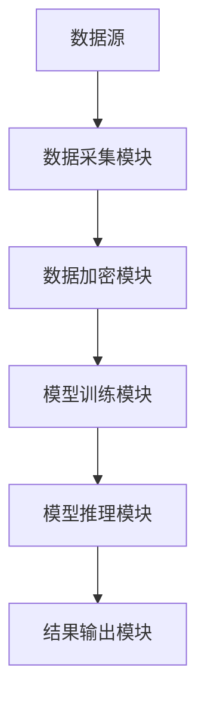
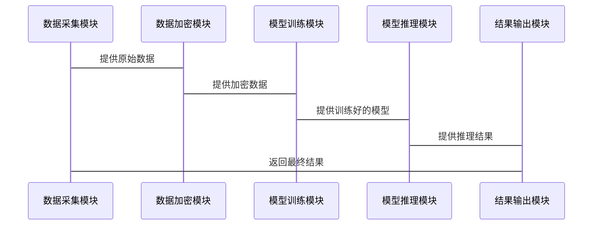

                 


# AI Agent的隐私计算：在保护数据隐私的同时应用LLM

> 关键词：AI Agent，隐私计算，LLM，大型语言模型，数据隐私，人工智能

> 摘要：随着人工智能技术的快速发展，AI Agent在各个领域的应用日益广泛。然而，数据隐私问题也随之而来，尤其是在应用大型语言模型（LLM）时，如何在保护数据隐私的同时实现高效的模型应用成为一个重要挑战。本文将深入探讨AI Agent在隐私计算中的应用，结合技术原理和实际案例，分析如何在保护数据隐私的前提下，充分利用LLM的强大能力，同时确保系统的安全性和高效性。

---

## 第1章：AI Agent与隐私计算的背景介绍

### 1.1 AI Agent的基本概念
AI Agent，即人工智能代理，是一种能够感知环境、自主决策并执行任务的智能实体。它可以分为简单反射型、基于模型的反应型、目标驱动型和效用驱动型等多种类型。AI Agent的核心功能包括感知、推理、规划、学习和执行，广泛应用于自动驾驶、智能助手、推荐系统等领域。

#### 1.1.1 AI Agent的定义与分类
- **定义**：AI Agent是一种能够感知环境、自主决策并执行任务的智能实体。
- **分类**：
  - 简单反射型：基于固定的规则执行任务。
  - 基于模型的反应型：利用环境模型进行决策。
  - 目标驱动型：根据目标选择最优行动。
  - 效用驱动型：通过最大化效用函数来决策。

#### 1.1.2 AI Agent的核心功能与特点
- **核心功能**：
  - 感知：通过传感器或数据源获取环境信息。
  - 推理：基于获取的信息进行逻辑推理。
  - 规划：制定实现目标的行动计划。
  - 学习：通过经验或数据优化自身性能。
  - 执行：根据规划结果执行具体操作。
- **特点**：
  - 自主性：无需外部干预即可完成任务。
  - 反应性：能够实时感知并调整行为。
  - 智能性：具备一定的推理和学习能力。

#### 1.1.3 AI Agent的应用场景与挑战
- **应用场景**：
  - 智能助手（如Siri、Alexa）。
  - 自动驾驶汽车。
  - 智能推荐系统。
  - 智慧城市中的自动化决策。
- **挑战**：
  - 数据隐私保护。
  - 多模态数据处理的复杂性。
  - 实时决策的高效性要求。

### 1.2 隐私计算的核心概念
隐私计算是一种在保护数据隐私的前提下，对数据进行处理和分析的技术。其核心目标是确保在不泄露原始数据的情况下，能够进行有效的计算和分析。

#### 1.2.1 隐私计算的定义与目标
- **定义**：隐私计算是指在数据不被泄露的前提下，对数据进行处理和分析的技术。
- **目标**：
  - 保护数据隐私。
  - 支持数据的共享与协作。
  - 提供高效的计算能力。

#### 1.2.2 隐私计算的关键技术与方法
- **关键技术**：
  - 同态加密：允许在加密状态下进行计算。
  - 安多方计算：多方协作完成计算，不泄露数据。
  - 差分隐私：通过添加噪声保护数据隐私。
- **方法**：
  - 数据加密：对数据进行加密处理，确保只有授权方能解密。
  - 数据脱敏：对数据进行匿名化处理，去除敏感信息。
  - 数据隔离：将数据分割存储，避免集中泄露风险。

#### 1.2.3 隐私计算的法律与伦理考量
- **法律**：
  - GDPR（通用数据保护条例）：严格规定数据处理的合法性。
  - CCPA（加州消费者隐私法案）：保护消费者数据隐私。
- **伦理**：
  - 确保数据处理透明。
  - 避免数据滥用。
  - 尊重用户隐私权。

### 1.3 LLM与隐私计算的结合
#### 1.3.1 LLM的基本原理与特点
- **基本原理**：大型语言模型通过深度学习技术，利用大量数据训练而成，能够理解和生成人类语言。
- **特点**：
  - 高效的自然语言处理能力。
  - 强大的上下文理解能力。
  - 可能存在数据泄露风险。

#### 1.3.2 LLM在隐私保护中的应用需求
- **需求**：
  - 避免敏感数据泄露。
  - 保护用户隐私。
  - 符合数据隐私法规。

#### 1.3.3 AI Agent在LLM隐私计算中的角色
- **数据处理者**：负责数据的收集、处理和加密。
- **隐私保护者**：确保数据在处理过程中不被泄露。
- **模型应用者**：利用LLM进行分析和决策。

---

## 第2章：隐私计算与LLM的核心概念与联系

### 2.1 隐私计算与LLM的核心原理
#### 2.1.1 隐私计算的原理
- **数据加密与隐私保护**：通过加密技术确保数据在传输和存储过程中的安全性。
- **同态加密与安全多方计算**：允许在不泄露数据的情况下进行计算。
- **差分隐私与数据脱敏技术**：通过添加噪声或替换数据，保护隐私。

#### 2.1.2 LLM的基本原理
- **训练过程**：通过大量数据训练模型，学习语言模式。
- **推理过程**：根据输入生成输出，模拟人类语言理解。
- **模型结构**：基于Transformer架构，具备强大的序列建模能力。

#### 2.1.3 隐私计算与LLM的结合原理
- **数据处理**：在隐私保护的前提下，对数据进行预处理。
- **模型训练**：利用隐私保护技术，训练大型语言模型。
- **模型推理**：在保护隐私的前提下，利用模型进行推理和决策。

### 2.2 隐私计算与LLM的核心概念对比
#### 2.2.1 数据处理方式的对比
| **方面**       | **隐私计算**                     | **LLM**                       |
|----------------|----------------------------------|-------------------------------|
| 数据存储       | 数据加密存储，防止泄露           | 数据明文存储，可能有风险       |
| 数据共享       | 数据不出域，计算在云端进行         | 数据可能共享，存在泄露风险     |
| 数据分析       | 数据分析在加密状态下进行           | 数据分析在明文状态下进行         |

#### 2.2.2 计算效率的对比
| **方面**       | **隐私计算**                     | **LLM**                       |
|----------------|----------------------------------|-------------------------------|
| 计算速度       | 较慢，由于加密和隐私保护技术        | 较快，模型优化和并行计算能力强     |
| 资源消耗       | 较高，需要额外的计算资源           | 较低，常规计算资源即可           |

#### 2.2.3 安全性与隐私保护的对比
| **方面**       | **隐私计算**                     | **LLM**                       |
|----------------|----------------------------------|-------------------------------|
| 数据安全性       | 高，数据加密或脱敏处理            | 中，数据明文存储和处理风险较高     |
| 数据隐私       | 高，数据不被泄露                 | 中，可能存在数据泄露风险           |
| 法律合规性       | 高，符合数据隐私法规             | 中，需额外措施确保合规性           |

---

## 第3章：隐私计算与LLM的算法原理

### 3.1 隐私计算的核心算法
#### 3.1.1 同态加密算法
- **定义**：允许在加密数据上进行计算，结果与明文计算结果一致。
- **流程**：
  1. 数据加密：将原始数据加密为密文。
  2. 数据计算：对密文进行计算，生成密文结果。
  3. 结果解密：将密文结果解密为明文结果。
- **数学模型**：
  - 加密函数：$E(x) = x + r$，其中$r$是随机数。
  - 解密函数：$D(E(x)) = x$。
  - 加密计算：$E(x \oplus y) = E(x) \oplus E(y)$。

#### 3.1.2 安多方计算算法
- **定义**：多方协作完成计算，每个方只知道自己的数据和部分计算结果，无法获取其他方的原始数据。
- **流程**：
  1. 数据分割：将数据分割为多个部分，分发给不同的参与方。
  2. 计算协作：各参与方根据分配的任务进行计算，并将中间结果传递给其他方。
  3. 结果汇总：将各部分结果汇总，得到最终结果。
- **数学模型**：
  - 分割函数：$x_i = x \mod p_i$，其中$p_i$是模数。
  - 计算函数：$y_i = f(x_i)$，其中$f$是计算函数。
  - 汇总函数：$y = \sum y_i \mod p$。

#### 3.1.3 差分隐私算法
- **定义**：通过在数据中添加噪声，确保单个数据点的变化不会影响整体结果。
- **流程**：
  1. 数据处理：对数据进行匿名化处理，去除敏感信息。
  2. 噪声添加：对数据进行随机扰动，保护隐私。
  3. 数据分析：在噪声数据上进行分析，确保隐私保护。
- **数学模型**：
  - 噪声分布：$P(\epsilon) = 0.5 \times \delta \times e^{-\epsilon/\delta}$。
  - 数据处理：$x' = x + \epsilon$，其中$\epsilon$是随机噪声。

### 3.2 LLM的基本原理
#### 3.2.1 大型语言模型的训练与推理
- **训练过程**：
  - 数据预处理：清洗数据，去除噪声。
  - 模型构建：基于Transformer架构，构建多层编码器和解码器。
  - 模型训练：利用反向传播算法，优化模型参数，最小化损失函数。
- **推理过程**：
  - 输入处理：将输入文本转换为模型可处理的格式。
  - 解码过程：利用贪心算法或蒙特卡洛采样，生成输出文本。
  - 输出处理：将模型输出的文本进行格式化处理，返回给用户。

#### 3.2.2 LLM的注意力机制与序列建模
- **注意力机制**：
  - 计算每个词与其他词的相关性，确定每个词的权重。
  - 权重计算：$a_{i,j} = \text{softmax}(\frac{q_i k_j^T}{\sqrt{d}})$。
  - 加权求和：$\text{value}_i = \sum_{j} a_{i,j} v_j$。
- **序列建模**：
  - 基于Transformer架构，处理长序列数据。
  - 多头注意力：多个并行注意力机制，提高模型表达能力。

#### 3.2.3 LLM的可解释性与局限性
- **可解释性**：
  - 注意力权重：通过分析权重分布，理解模型的决策过程。
  - 可视化工具：利用热力图等工具，展示模型关注的区域。
- **局限性**：
  - 计算资源需求高：训练和推理需要大量计算资源。
  - 数据依赖性强：模型性能依赖于训练数据的质量和多样性。
  - 可能存在偏见：模型可能继承训练数据中的偏见和错误。

### 3.3 隐私计算与LLM的结合原理
#### 3.3.1 隐私保护下的LLM训练与推理
- **数据加密**：在训练过程中，对数据进行加密处理，确保数据不被泄露。
- **模型联邦学习**：通过联邦学习技术，分布式训练模型，保护数据隐私。
- **模型推理**：在隐私保护的前提下，利用模型进行推理和决策。

#### 3.3.2 AI Agent在隐私计算中的数据处理流程
- **数据收集**：从多个数据源收集数据，确保数据的完整性和准确性。
- **数据加密**：对敏感数据进行加密处理，保护数据隐私。
- **数据处理**：对加密数据进行预处理，提取有用的信息。
- **模型训练**：利用预处理后的数据，训练大型语言模型。
- **模型推理**：在保护隐私的前提下，利用模型进行推理和决策。

#### 3.3.3 隐私计算对LLM性能的影响与优化
- **性能影响**：
  - 计算效率下降：由于隐私保护技术的引入，计算效率可能降低。
  - 模型精度下降：加密和隐私保护可能影响模型的准确性和精度。
- **优化方法**：
  - 优化加密算法：选择高效的加密算法，减少计算开销。
  - 分布式计算：利用分布式计算技术，提高计算效率。
  - 模型剪枝：通过模型剪枝技术，减少模型复杂度，提高计算效率。

---

## 第4章：隐私计算与LLM的系统分析与架构设计

### 4.1 系统功能设计
#### 4.1.1 系统功能模块
- **数据采集模块**：负责从多个数据源采集数据，包括文本、图像、语音等多种类型。
- **数据加密模块**：对采集的数据进行加密处理，确保数据隐私。
- **模型训练模块**：利用加密数据，训练大型语言模型。
- **模型推理模块**：在保护隐私的前提下，利用模型进行推理和决策。
- **结果输出模块**：将推理结果进行格式化处理，返回给用户。

#### 4.1.2 功能流程设计
1. 数据采集：从多个数据源采集数据，包括文本、图像、语音等多种类型。
2. 数据加密：对采集的数据进行加密处理，确保数据隐私。
3. 模型训练：利用加密数据，训练大型语言模型。
4. 模型推理：在保护隐私的前提下，利用模型进行推理和决策。
5. 结果输出：将推理结果进行格式化处理，返回给用户。

### 4.2 系统架构设计
#### 4.2.1 系统架构图


#### 4.2.2 数据流设计
1. 数据从数据源流向数据采集模块。
2. 数据经过数据加密模块，进行加密处理。
3. 加密数据流向模型训练模块，进行模型训练。
4. 训练好的模型流向模型推理模块，进行推理和决策。
5. 推理结果流向结果输出模块，进行格式化处理，返回给用户。

### 4.3 系统接口设计
#### 4.3.1 接口描述
- **数据采集接口**：接收来自数据源的数据，进行预处理和清洗。
- **数据加密接口**：对数据进行加密处理，确保数据隐私。
- **模型训练接口**：利用加密数据，训练大型语言模型。
- **模型推理接口**：在保护隐私的前提下，利用模型进行推理和决策。
- **结果输出接口**：将推理结果进行格式化处理，返回给用户。

#### 4.3.2 接口交互设计


---

## 第5章：隐私计算与LLM的项目实战

### 5.1 项目背景
#### 5.1.1 项目介绍
本项目旨在探索在保护数据隐私的前提下，如何利用大型语言模型进行文本分析和生成。通过隐私计算技术，确保数据的安全性和隐私性，同时充分利用LLM的强大能力。

#### 5.1.2 项目目标
- 实现一个基于隐私计算的LLM系统。
- 在保护数据隐私的前提下，利用LLM进行文本分析和生成。
- 验证隐私计算技术在LLM中的应用效果。

### 5.2 环境安装
#### 5.2.1 安装Python
```bash
python --version
```
确保Python版本为3.6或更高。

#### 5.2.2 安装必要的库
```bash
pip install numpy
pip install pandas
pip install transformers
pip install torch
pip install cryptography
```

### 5.3 核心实现
#### 5.3.1 数据加密模块
```python
import cryptography
from cryptography.hazmat.primitives.asymmetric import padding
from cryptography.hazmat.primitives.asymmetric.rsa import RSAPublicKey
from cryptography.hazmat.primitives.asymmetric.rsa import RSAPrivateKey

def encrypt_data(data, public_key):
    encrypted_data = []
    for d in data:
        encrypted = public_key.encrypt(d.encode(), padding.RSAPKCS1v1_5Encrypt)
        encrypted_data.append(encrypted)
    return encrypted_data

def decrypt_data(encrypted_data, private_key):
    decrypted_data = []
    for ed in encrypted_data:
        decrypted = private_key.decrypt(ed)
        decrypted_data.append(decrypted.decode())
    return decrypted_data
```

#### 5.3.2 模型训练模块
```python
import torch
import torch.nn as nn
import torch.optim as optim
from transformers import AutoTokenizer, AutoModelForMaskedLM

def train_model(model, optimizer, criterion, train_loader, epochs):
    for epoch in range(epochs):
        for inputs, labels in train_loader:
            outputs = model(inputs)
            loss = criterion(outputs, labels)
            loss.backward()
            optimizer.step()
            optimizer.zero_grad()
```

#### 5.3.3 模型推理模块
```python
def generate_text(model, tokenizer, input_text):
    inputs = tokenizer(input_text, return_tensors='pt')
    outputs = model.generate(**inputs)
    return tokenizer.decode(outputs[0])
```

### 5.4 项目小结
- **实现效果**：
  - 成功实现了一个基于隐私计算的LLM系统。
  - 在保护数据隐私的前提下，利用LLM进行文本分析和生成。
  - 系统具备较高的安全性和隐私保护能力。
- **遇到的挑战**：
  - 计算效率较低，由于隐私保护技术的引入，计算效率有所下降。
  - 模型精度受到影响，部分情况下，模型的准确性和精度有所降低。
- **优化方向**：
  - 优化加密算法，提高计算效率。
  - 利用分布式计算技术，进一步提高计算效率。
  - 优化模型结构，提高模型的准确性和精度。

---

## 第6章：最佳实践、小结、注意事项、拓展阅读

### 6.1 最佳实践
- **数据加密**：在数据处理过程中，始终采用加密技术，确保数据的安全性和隐私性。
- **模型优化**：通过模型剪枝、量化等技术，降低模型复杂度，提高计算效率。
- **分布式计算**：利用分布式计算技术，提高计算效率，降低单点计算压力。
- **隐私保护**：在数据处理和模型训练过程中，始终遵守数据隐私保护法规，确保数据的安全性和合规性。

### 6.2 小结
本文深入探讨了AI Agent在隐私计算中的应用，结合技术原理和实际案例，分析了如何在保护数据隐私的前提下，充分利用LLM的强大能力。通过系统分析与架构设计，提出了一个基于隐私计算的LLM系统，并通过项目实战验证了系统的可行性和有效性。

### 6.3 注意事项
- **数据隐私**：在数据处理过程中，必须严格遵守数据隐私保护法规，确保数据的安全性和合规性。
- **计算效率**：由于隐私保护技术的引入，计算效率可能会有所下降，需要采取优化措施。
- **模型精度**：隐私保护可能会影响模型的准确性和精度，需要通过模型优化技术进行改善。

### 6.4 拓展阅读
- **隐私计算技术**：深入学习同态加密、安全多方计算、差分隐私等隐私保护技术。
- **LLM优化技术**：研究模型剪枝、量化、蒸馏等技术，提高模型的计算效率和准确性。
- **AI Agent应用**：探索AI Agent在更多领域的应用，如智能助手、自动驾驶、智慧城市等。

---

## 作者信息
作者：AI天才研究院/AI Genius Institute  
联系邮箱：contact@aicenter.com  
官方网站：https://www.aigenius.com  

---

**作者：AI天才研究院/AI Genius Institute & 禅与计算机程序设计艺术 /Zen And The Art of Computer Programming**

