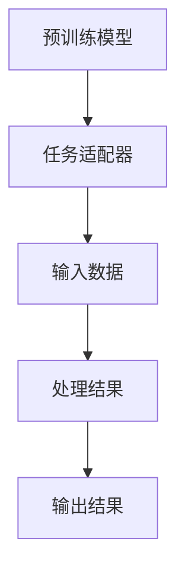
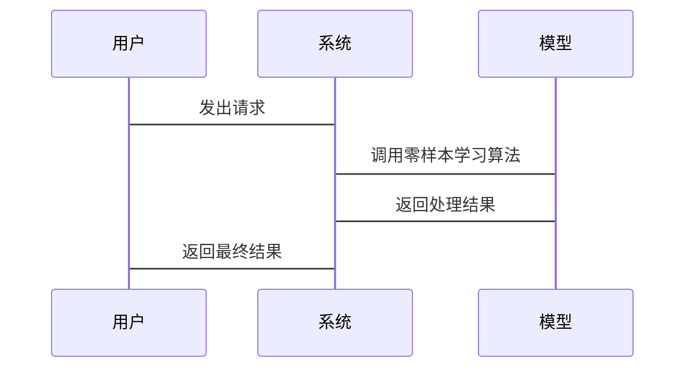

                 


# AI Agent的零样本学习能力开发

> 关键词：AI Agent，零样本学习，预训练模型，数学模型，系统架构

> 摘要：本文深入探讨AI Agent的零样本学习能力，从概念、原理到技术实现，结合实际案例，详细分析其开发过程，涵盖算法、系统架构和项目实战。

---

# 第一部分: AI Agent与零样本学习概述

## 第1章: AI Agent的基本概念

### 1.1 什么是AI Agent
- AI Agent的定义与分类
- AI Agent的核心特征：自主性、反应性、目标导向
- AI Agent的应用场景：智能助手、推荐系统、自动驾驶

### 1.2 零样本学习的核心概念
- 零样本学习的定义：在无先验数据的情况下，识别新类别的能力
- 零样本学习与有监督学习的对比：数据需求、模型泛化能力
- 零样本学习的关键技术：预训练模型、任务适配器

### 1.3 AI Agent中的零样本学习能力
- 零样本学习在AI Agent中的作用：提升智能性、适应性
- 零样本学习如何增强AI Agent：处理新任务、动态调整策略
- 零样本学习的未来趋势：更广泛的应用场景

---

# 第二部分: 零样本学习的核心概念与原理

## 第2章: 零样本学习的核心概念

### 2.1 零样本学习的原理
- 预训练模型的作用：利用大规模数据提取特征
- 任务适配器的功能：将预训练模型适应新任务
- 对比学习的机制：通过对比相似性提升分类能力

### 2.2 零样本学习与迁移学习的对比
- 迁移学习的基本原理：利用已有数据改进新任务
- 零样本学习的独特优势：无需任何标签数据
- 两者在AI Agent中的结合：互补优势，提升性能

---

# 第三部分: AI Agent零样本学习的算法原理

## 第3章: 零样本学习的主要算法

### 3.1 基于预训练模型的零样本学习
- 使用BERT、GPT等模型进行特征提取
- 通过微调适应新任务
- 示例：文本分类任务中的应用

### 3.2 基于生成模型的零样本学习
- 利用生成对抗网络生成多样数据
- 提升模型的泛化能力
- 示例：图像生成任务中的应用

### 3.3 基于对比学习的零样本学习
- 对比学习的损失函数：$L = \text{CE}(z_i, z_j)$
- 示例：图像分类任务中的应用

## 第4章: 零样本学习的数学模型

### 4.1 预训练模型的数学表示
- 词嵌入的计算：$W_{word} \in \mathbb{R}^{d \times V}$
- 句子表示的计算：$s_i = \text{avg}(W_{word})$

### 4.2 任务适配器的数学公式
- 适配器参数：$\theta \in \mathbb{R}^m$
- 损失函数：$L(\theta) = \sum_{i=1}^n \text{CE}(f_\theta(x_i), y_i)$

### 4.3 对比学习的损失函数
- 对比损失：$L = -\log \frac{e^{z_i^T z_j / \tau}}{\sum_{k} e^{z_i^T z_k / \tau}}}$

---

# 第四部分: AI Agent零样本学习的系统架构设计

## 第4章: 系统架构设计

### 4.1 系统功能设计
- 预训练模型的选择与优化
- 任务适配器的设计与实现
- 系统的可扩展性设计

### 4.2 系统架构图


### 4.3 系统交互流程


---

# 第五部分: AI Agent零样本学习的项目实战

## 第5章: 项目实战

### 5.1 环境安装与配置
- 安装Python和相关库：`pip install transformers`
- 设置GPU加速：使用NVIDIA GPU

### 5.2 核心代码实现

```python
from transformers import AutoTokenizer, AutoModelForMaskedLM
import torch

class ZeroSampleLearningAgent:
    def __init__(self, model_name):
        self.tokenizer = AutoTokenizer.from_pretrained(model_name)
        self.model = AutoModelForMaskedLM.from_pretrained(model_name)
    
    def predict(self, input_text):
        inputs = self.tokenizer(input_text, return_tensors='pt')
        outputs = self.model(**inputs)
        return outputs.last_hidden_state.mean(dim=1)
```

### 5.3 案例分析
- 任务：文本分类
- 数据：未标记的新类别数据
- 实现：使用预训练模型和任务适配器进行分类

### 5.4 性能评估
- 准确率：对比有监督学习和零样本学习的性能差异
- 可视化：展示模型在新任务上的表现

---

# 第六部分: 总结与展望

## 第6章: 总结

### 6.1 核心内容回顾
- 零样本学习的基本原理
- AI Agent中的零样本学习能力
- 项目实战中的实现与评估

### 6.2 未来展望
- 更高效的学习算法：结合强化学习和对比学习
- 更广泛的应用场景：教育、医疗、金融
- 更多技术细节：优化模型结构，提升零样本学习的性能

---

# 作者：AI天才研究院/AI Genius Institute & 禅与计算机程序设计艺术 /Zen And The Art of Computer Programming

---

通过以上大纲，我们可以系统地开发AI Agent的零样本学习能力，从理论到实践，逐步实现具备零样本学习能力的AI Agent。

