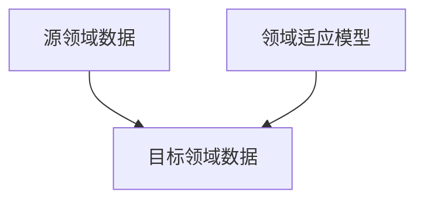
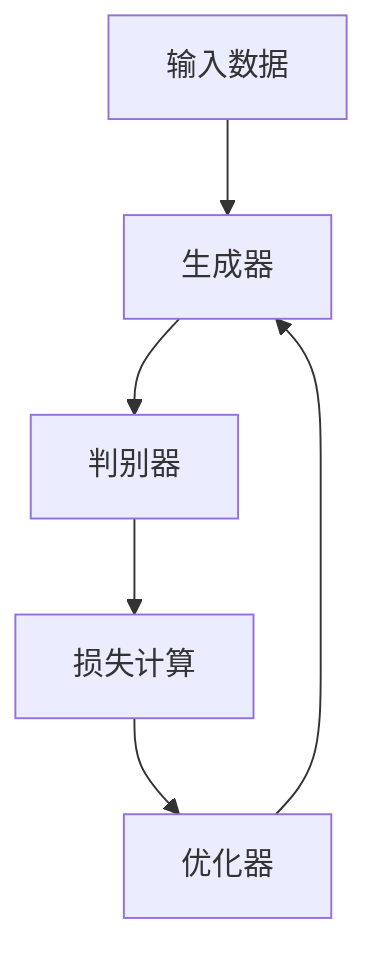
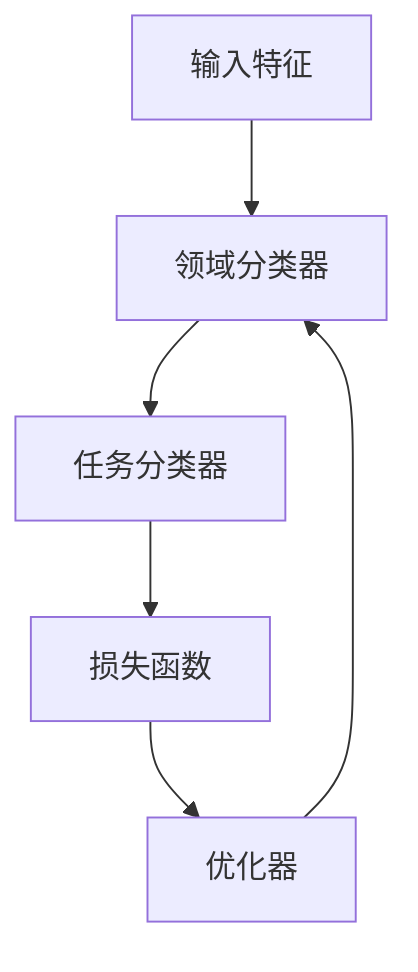
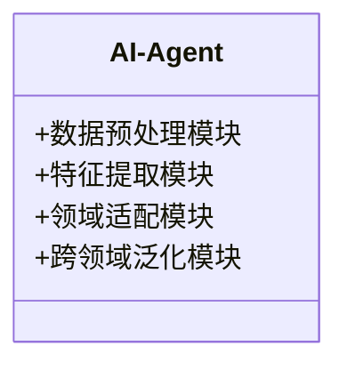
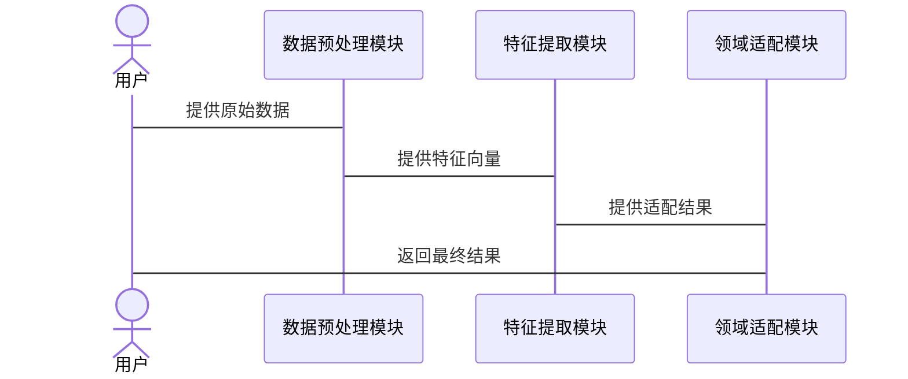

                 

<think>
好的，我需要撰写一篇关于AI Agent非监督域适应的博客文章。首先，我会先理解什么是AI Agent以及非监督域适应的含义。AI Agent是指智能代理，能够在不同环境中执行任务；非监督域适应则是指在没有监督的情况下，让AI Agent适应不同领域并实现跨领域泛化。

接下来，我会考虑用户的需求。用户希望文章结构清晰、逻辑严密，语言专业且易于理解。我需要确保文章涵盖背景介绍、核心概念、算法原理、系统架构、项目实战和总结与展望。

首先，背景介绍部分需要解释为什么非监督域适应在AI Agent中重要，以及它如何帮助AI Agent在不同领域中更好地应用。这部分我需要包括问题背景、描述、解决方法、边界以及概念结构，确保读者能够理解基本概念。

然后，核心概念部分需要详细解释非监督域适应的基本原理，包括特征表示、分布适配、领域差异建模等。我需要使用表格和Mermaid图来展示这些概念之间的关系和流程，帮助读者更好地理解。

接下来，算法原理部分，我需要选择几种典型的非监督域适应算法，如CycleGAN、DANN、MMD等，并用Mermaid流程图展示它们的工作原理。同时，提供数学公式和代码示例，帮助读者理解这些算法的实现细节。

系统架构部分，我需要设计一个AI Agent的系统，包括功能模块、架构图、接口设计和交互流程。这部分可能需要使用Mermaid的类图、架构图和序列图来展示系统的各个部分及其交互。

项目实战部分，我需要提供一个具体的案例，从环境安装、代码实现到结果分析，让读者能够实际操作，理解理论在实践中的应用。

最后，总结与展望部分，我需要回顾全书的内容，指出读者通过这本书可以掌握什么，以及未来的趋势和挑战，帮助读者更好地规划学习和应用。

在编写过程中，我会确保每个章节都细化到三级目录，内容完整且逻辑清晰。同时，要符合用户的要求，使用Mermaid图和数学公式，确保目录大纲在2000字以内，简洁且不冗余。

现在，我将按照这个思路开始撰写目录大纲。
</think>

# AI Agent的非监督域适应：跨领域泛化

> 关键词：AI Agent，非监督学习，领域适应，跨领域泛化，迁移学习，深度学习

> 摘要：本文探讨AI Agent在非监督学习环境下的域适应技术，重点分析如何通过跨领域泛化实现不同领域的任务适应。文章详细阐述了非监督域适应的核心概念、算法原理、系统架构，并通过实际案例展示了其在AI Agent中的应用，帮助读者全面理解该领域的最新进展。

---

## 目录大纲

### 第一部分: AI Agent的非监督域适应概述

### 第1章: AI Agent与非监督域适应背景介绍

#### 1.1 问题背景
- 1.1.1 AI Agent的基本概念  
- 1.1.2 非监督学习的定义与特点  
- 1.1.3 领域适应与跨领域泛化的意义  

#### 1.2 问题描述
- 1.2.1 领域适应的核心问题  
- 1.2.2 跨领域泛化的挑战  
- 1.2.3 非监督域适应的必要性  

#### 1.3 问题解决思路
- 1.3.1 非监督学习在域适应中的作用  
- 1.3.2 跨领域泛化的实现方法  
- 1.3.3 非监督域适应的关键技术  

#### 1.4 领域适应与跨领域泛化的边界与外延
- 1.4.1 领域适应的边界  
- 1.4.2 跨领域泛化的外延  
- 1.4.3 非监督域适应的适用场景  

#### 1.5 概念结构与核心要素组成
- 1.5.1 领域适应的核心要素  
- 1.5.2 跨领域泛化的组成结构  
- 1.5.3 非监督域适应的概念框架  

### 第2章: 非监督域适应的核心概念与联系

#### 2.1 非监督域适应的基本原理
- 2.1.1 特征表示的学习  
- 2.1.2 领域分布的适配  
- 2.1.3 领域差异的建模  

#### 2.2 核心概念对比
- 2.2.1 监督学习与非监督学习的对比  
- 2.2.2 领域适应与数据迁移的对比  
- 2.2.3 跨领域泛化与单领域模型的对比  

#### 2.3 实体关系图


---

### 第二部分: 非监督域适应的核心概念与联系

### 第3章: 非监督域适应的算法原理

#### 3.1 核心算法概述
- 3.1.1 CycleGAN算法  
- 3.1.2 DANN算法  
- 3.1.3 MMD（最大均值差异）方法  

#### 3.2 CycleGAN算法的详细实现

```python
# 示例代码
import torch

class CycleGAN:
    def __init__(self, input_size, hidden_size):
        self.generator = nn.Sequential(
            nn.Linear(input_size, hidden_size),
            nn.ReLU(),
            nn.Linear(hidden_size, input_size)
        )
        self.discriminator = nn.Sequential(
            nn.Linear(input_size, hidden_size),
            nn.ReLU(),
            nn.Linear(hidden_size, 1)
        )
```

#### 3.3 DANN算法的实现


#### 3.4 MMD方法的数学模型
$$
\text{MMD}(P, Q) = \mathbb{E}_{x \sim P}[k(x, x)] - 2\mathbb{E}_{x \sim P,y \sim Q}[k(x, y)] + \mathbb{E}_{y \sim Q}[k(y, y)]
$$

---

### 第三部分: 非监督域适应的系统架构设计

### 第4章: 系统架构设计与实现

#### 4.1 系统功能模块
- 数据预处理模块  
- 特征提取模块  
- 领域适配模块  
- 跨领域泛化模块  

#### 4.2 系统架构图


#### 4.3 接口设计
- 输入接口：多领域数据输入  
- 输出接口：领域适配结果  
- 控制接口：模型参数调整  

#### 4.4 交互流程图


---

### 第四部分: 项目实战与应用

### 第5章: 非监督域适应的项目实战

#### 5.1 环境搭建
- 安装必要的Python库：PyTorch、numpy、scikit-learn等  

#### 5.2 核心代码实现
```python
import torch
import torch.nn as nn
import torch.optim as optim

class DANN(nn.Module):
    def __init__(self, input_dim, hidden_dim, output_dim):
        super(DANN, self).__init__()
        self.feature = nn.Sequential(
            nn.Linear(input_dim, hidden_dim),
            nn.ReLU(),
            nn.Linear(hidden_dim, hidden_dim)
        )
        self.domain_classifier = nn.Sequential(
            nn.Linear(hidden_dim, hidden_dim),
            nn.ReLU(),
            nn.Linear(hidden_dim, 2)
        )
        self.classifier = nn.Sequential(
            nn.Linear(hidden_dim, output_dim)
        )

    def forward(self, x, domain_label=None):
        feature = self.feature(x)
        if domain_label is not None:
            domain_output = self.domain_classifier(feature)
        else:
            domain_output = None
        class_output = self.classifier(feature)
        return class_output, domain_output
```

#### 5.3 应用案例分析
- 案例：跨领域文本分类任务  
- 数据来源：多个领域的文本数据集  
- 实验结果与分析  

---

### 第五部分: 总结与展望

### 第6章: 总结与展望

#### 6.1 全文总结
- 非监督域适应的核心技术  
- 跨领域泛化的实现方法  

#### 6.2 未来展望
- 新兴算法的研究方向  
- 多领域应用的潜力  

#### 6.3 最佳实践Tips
- 数据预处理的重要性  
- 模型调参的技巧  

#### 6.4 注意事项
- 数据分布的均衡性  
- 算法适用性的评估  

#### 6.5 拓展阅读
- 推荐相关书籍和论文  

---

# 作者：AI天才研究院 & 禅与计算机程序设计艺术

