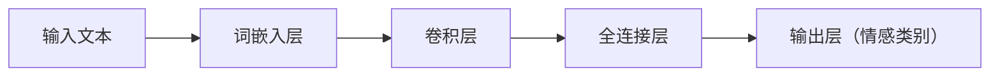
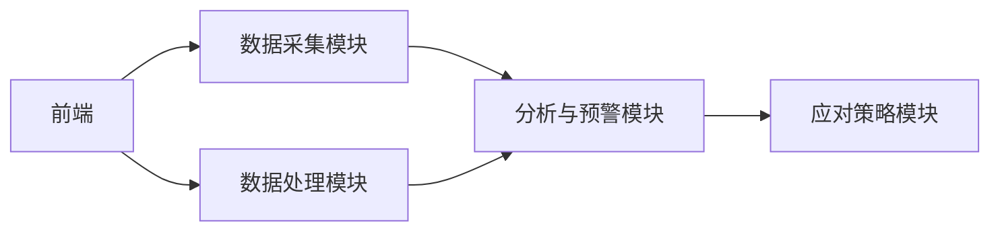
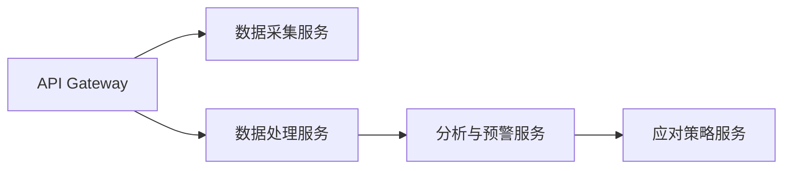
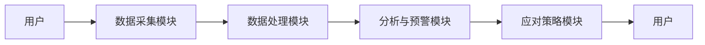

                 


# AI Agent辅助企业品牌声誉管理与危机应对

---

## 关键词：
AI Agent、品牌声誉管理、危机应对、自然语言处理、机器学习、情感分析

---

## 摘要：
在当今竞争激烈的商业环境中，企业品牌声誉的管理与危机应对能力变得至关重要。AI Agent作为一种智能化工具，能够实时监控和分析海量数据，帮助企业快速识别和应对声誉风险。本文从AI Agent的核心概念出发，结合品牌声誉管理的理论基础，详细探讨了AI Agent在情感分析、机器学习算法中的应用，以及其在系统架构设计中的优势。通过具体项目实战，展示了AI Agent如何在品牌声誉管理中实现预警、危机应对和修复，为企业提供高效、智能的解决方案。文章最后总结了AI Agent的优势，并展望了其在未来的发展潜力。

---

# 第1章: AI Agent与品牌声誉管理概述

## 1.1 AI Agent的基本概念

### 1.1.1 什么是AI Agent
AI Agent（人工智能代理）是指能够感知环境、自主决策并执行任务的智能实体。与传统软件不同，AI Agent具备以下核心特征：
- **自主性**：能够在没有外部干预的情况下独立运行。
- **反应性**：能够实时感知环境变化并做出响应。
- **目标导向**：具有明确的目标，并能够采取行动以实现目标。

### 1.1.2 AI Agent的核心特征
| 特征         | 描述                                                                 |
|--------------|----------------------------------------------------------------------|
| 自主性       | 能够独立执行任务，无需人工干预                                       |
| 反应性       | 能够实时感知环境变化，并根据变化调整行为                           |
| 目标导向     | 具有明确的目标，并通过行动实现目标                                   |
| 学习能力     | 能够通过数据和经验不断优化自身的性能                                   |

### 1.1.3 AI Agent与传统软件的区别
| 方面         | AI Agent                             | 传统软件                           |
|--------------|--------------------------------------|------------------------------------|
| 智能性       | 具备学习和推理能力                     | 仅执行预定义的程序逻辑               |
| 适应性       | 能够自适应环境变化                     | 无法根据环境变化调整自身行为         |
| 决策能力     | 能够自主决策                          | 依赖于预先设定的规则和逻辑           |

## 1.2 品牌声誉管理的定义与重要性

### 1.2.1 品牌声誉的定义
品牌声誉是消费者、媒体和利益相关者对品牌信任度、形象和价值的综合评价。它反映了品牌在市场中的地位和影响力。

### 1.2.2 品牌声誉管理的必要性
- **提升品牌形象**：通过管理声誉，企业可以增强品牌在市场中的竞争力。
- **降低风险**：及时发现和处理负面信息，避免声誉危机的发生。
- **提高客户忠诚度**：良好的声誉有助于建立与客户的长期信任关系。

### 1.2.3 品牌声誉管理的关键要素
| 要素         | 描述                                                                 |
|--------------|----------------------------------------------------------------------|
| 数据采集     | 收集来自社交媒体、新闻媒体等渠道的海量数据                         |
| 数据分析     | 对数据进行处理、分类和挖掘，提取有价值的信息                       |
| 危机预警     | 建立预警机制，及时发现潜在的声誉风险                               |
| 应对策略     | 制定并执行危机应对策略，最大限度地减少声誉损失                     |

## 1.3 AI Agent在品牌声誉管理中的作用

### 1.3.1 提高声誉管理效率
AI Agent能够实时监控海量数据，快速识别潜在风险，显著提高声誉管理的效率。

### 1.3.2 实现实时监控与反馈
通过AI Agent，企业可以实时跟踪品牌声誉的变化，并根据反馈调整管理策略。

### 1.3.3 优化危机应对策略
AI Agent能够基于历史数据和实时信息，提供最优的危机应对方案，帮助企业快速恢复声誉。

---

# 第2章: 品牌声誉管理的理论基础

## 2.1 品牌声誉的形成机制

### 2.1.1 品牌声誉的构成要素
| 要素         | 描述                                                                 |
|--------------|----------------------------------------------------------------------|
| 品质         | 产品的质量和服务水平                                                 |
| 可靠性       | 品牌的可信度和稳定性                                                 |
| 情感因素     | 消费者对品牌的情感倾向                                               |
| 竞争环境     | 行业竞争状况                                                       |

### 2.1.2 品牌声誉的影响因素
| 因素         | 描述                                                                 |
|--------------|----------------------------------------------------------------------|
| 产品质量     | 产品的质量直接影响消费者的满意度                                   |
| 客户服务     | 售后服务和客户支持的质量                                             |
| 媒体报道     | 正面或负面媒体报道对品牌声誉的影响                                   |
| 社交媒体影响 | 社交平台上的用户评论和互动对品牌声誉的影响                           |

### 2.1.3 品牌声誉的动态变化
品牌声誉并非一成不变，它会随着时间、市场环境和消费者行为的变化而波动。企业需要持续关注声誉的变化，并及时采取措施。

## 2.2 危机传播的理论模型

### 2.2.1 危机传播的阶段划分
| 阶段         | 描述                                                                 |
|--------------|----------------------------------------------------------------------|
| 前兆阶段     | 危机的初步迹象出现，尚未引起广泛关注                                   |
| 爆发阶段     | 危机迅速扩散，引起广泛关注                                             |
| 缓解阶段     | 采取应对措施，危机逐渐得到控制                                         |
| 停滞阶段     | 危机影响减弱，品牌声誉逐步恢复                                         |

### 2.2.2 危机传播的关键节点
| 节点         | 描述                                                                 |
|--------------|----------------------------------------------------------------------|
| 社交媒体     | 危机信息的主要传播渠道                                                 |
| 媒体报道     | 危机信息的放大器                                                       |
| 企业回应     | 企业对危机的官方回应                                                   |
| 消费者反应   | 消费者对危机的评论和行为                                               |

### 2.2.3 危机传播的特征分析
| 特征         | 描述                                                                 |
|--------------|----------------------------------------------------------------------|
| 快速扩散     | 危机信息通过社交媒体等渠道快速传播                                   |
| 不可预测性   | 危机的发生往往具有突发性和不可预测性                                   |
| 放大效应     | 负面信息在传播过程中会被放大，进一步加剧危机                           |

## 2.3 品牌声誉管理的策略框架

### 2.3.1 预警机制的建立
- **数据监控**：实时监控社交媒体、新闻媒体等渠道的品牌相关数据。
- **阈值设定**：设定情感指数的阈值，当指数超过阈值时触发预警。

### 2.3.2 危机应对的步骤
1. **信息收集与分析**：快速收集危机相关信息，并进行初步分析。
2. **制定应对策略**：根据分析结果，制定危机应对方案。
3. **执行与反馈**：执行应对策略，并实时跟踪危机的演变情况。

### 2.3.3 品牌修复的路径
- **公开道歉**：及时向公众道歉，并表明整改的决心。
- **形象重塑**：通过公益活动、产品升级等方式重塑品牌形象。
- **持续监测**：危机解决后，继续监测品牌声誉，防止危机复发。

---

# 第3章: AI Agent的核心算法与实现

## 3.1 自然语言处理技术

### 3.1.1 NLP的基本原理
自然语言处理（NLP）是研究人类语言表示、理解和生成的科学。其核心目标是让计算机能够像人类一样理解和处理自然语言。

### 3.1.2 常见的NLP算法
| 算法         | 描述                                                                 |
|--------------|----------------------------------------------------------------------|
| 分词         | 将文本分割成词语或短语                                             |
| 词性标注     | 标识每个词语的词性（名词、动词等）                                   |
| 命名实体识别 | 识别文本中的专有名词（人名、地名等）                                   |
| 情感分析     | 判断文本的情感倾向（正面、负面、中性）                                 |
| 文本摘要     | 从长文本中提取关键信息，生成摘要                                       |

### 3.1.3 NLP在声誉管理中的应用
- **情感分析**：分析消费者评论的情感倾向，判断品牌声誉的好坏。
- **关键词提取**：提取评论中的关键词，识别主要关注点。
- **主题建模**：分析评论的主题分布，了解消费者的主要诉求。

## 3.2 情感分析算法

### 3.2.1 情感分析的定义
情感分析是指通过自然语言处理技术，判断文本的情感倾向（正面、负面、中性）。

### 3.2.2 基于深度学习的情感分析模型
#### 模型结构


#### Python代码实现
```python
import tensorflow as tf
from tensorflow.keras import layers

model = tf.keras.Sequential([
    layers.Embedding(input_dim=10000, output_dim=16),
    layers.Conv1D(filters=16, kernel_size=5, padding='valid'),
    layers.MaxPooling1D(pool_size=4),
    layers.Dense(16, activation='relu'),
    layers.Dense(3, activation='softmax')
])
```

### 3.2.3 情感分析在品牌声誉中的应用
- **实时监控**：通过情感分析，实时判断消费者评论的情感倾向。
- **趋势分析**：分析情感变化趋势，预测品牌声誉的未来走势。
- **精准定位问题**：通过情感分析结果，快速定位品牌存在的问题。

## 3.3 机器学习与预测模型

### 3.3.1 机器学习的基本原理
机器学习是通过数据训练模型，使其能够从数据中学习规律，并对新数据进行预测。

### 3.3.2 基于机器学习的声誉预测模型
#### 模型公式
$$
y = w_1x_1 + w_2x_2 + \dots + w_nx_n + b
$$
其中，$y$ 是预测结果，$x_i$ 是输入特征，$w_i$ 是权重，$b$ 是偏置。

### 3.3.3 模型的训练与优化
- **数据预处理**：对数据进行清洗、归一化等处理。
- **模型训练**：使用训练数据训练模型，调整权重和偏置。
- **模型评估**：使用测试数据评估模型的性能，计算准确率、召回率等指标。
- **模型优化**：根据评估结果，优化模型结构和参数。

---

# 第4章: 品牌声誉管理的系统架构设计

## 4.1 系统功能模块划分

### 4.1.1 数据采集模块
- **功能**：从社交媒体、新闻媒体等渠道采集品牌相关数据。
- **工具**：使用API（如Twitter API、Google News API）进行数据采集。

### 4.1.2 数据处理模块
- **功能**：对采集的数据进行清洗、分词、去停用词等预处理。
- **工具**：使用Python的NLTK库或spaCy库进行文本处理。

### 4.1.3 分析与预警模块
- **功能**：对数据进行情感分析、主题建模，生成预警报告。
- **工具**：使用TensorFlow或PyTorch进行模型训练和预测。

### 4.1.4 应对策略模块
- **功能**：根据预警报告，生成危机应对策略。
- **工具**：使用规则引擎或机器学习模型生成应对策略。

## 4.2 系统架构设计

### 4.2.1 分层架构设计


### 4.2.2 微服务架构设计


### 4.2.3 可扩展性设计
- **横向扩展**：通过增加服务器数量，提高系统的处理能力。
- **纵向扩展**：通过升级服务器性能，提高系统的处理能力。

## 4.3 系统接口设计

### 4.3.1 数据接口
- **输入接口**：接收外部数据源的原始数据。
- **输出接口**：输出处理后的数据，供其他模块使用。

### 4.3.2 用户接口
- **输入接口**：接收用户的查询请求。
- **输出接口**：输出分析结果和应对策略。

### 4.3.3 第三方服务接口
- **输入接口**：接收第三方服务（如情感分析API）的请求。
- **输出接口**：输出第三方服务的响应结果。

## 4.4 系统交互设计

### 4.4.1 系统交互流程


---

# 第5章: 项目实战——AI Agent在品牌声誉管理中的应用

## 5.1 项目背景与目标

### 5.1.1 项目背景
某知名互联网公司面临品牌声誉危机，希望通过AI Agent实时监控和分析社交媒体上的评论，快速识别负面信息，并制定应对策略。

### 5.1.2 项目目标
- 实现实时品牌声誉监控。
- 建立危机预警机制。
- 提供危机应对策略。

## 5.2 系统核心实现

### 5.2.1 数据采集与清洗
- **数据采集**：通过API采集社交媒体上的评论数据。
- **数据清洗**：去除无效数据（如空值、重复值）。

### 5.2.2 情感分析模型训练
- **训练数据**：使用标注好的数据训练情感分析模型。
- **模型优化**：通过调整模型参数，提高情感分析的准确率。

### 5.2.3 危机预警与应对策略生成
- **预警机制**：当情感指数低于预设阈值时，触发预警。
- **应对策略**：根据预警结果，生成危机应对方案。

## 5.3 代码实现与解读

### 5.3.1 数据采集代码
```python
import requests

def get_comments(api_key, query):
    url = f"https://api.twitter.com/1.1/search/tweets.json?q={query}&lang=en"
    headers = {'Authorization': f'Bearer {api_key}'}
    response = requests.get(url, headers=headers)
    return response.json()
```

### 5.3.2 情感分析模型代码
```python
import tensorflow as tf
from tensorflow.keras import layers

def build_model(vocabulary_size, embedding_dim, input_length):
    model = tf.keras.Sequential([
        layers.Embedding(input_dim=vocabulary_size, output_dim=embedding_dim, input_length=input_length),
        layers.Conv1D(filters=16, kernel_size=5, padding='valid'),
        layers.MaxPooling1D(pool_size=4),
        layers.Dense(16, activation='relu'),
        layers.Dense(3, activation='softmax')
    ])
    return model
```

### 5.3.3 危机应对策略生成代码
```python
def generate_response(emotion_score):
    if emotion_score < -0.5:
        return "危机！建议立即采取行动。"
    elif emotion_score < 0:
        return "预警！建议密切监测。"
    else:
        return "正常！无需采取行动。"
```

## 5.4 实际案例分析

### 5.4.1 案例背景
某品牌因产品质量问题引发消费者不满，社交媒体上出现大量负面评论。

### 5.4.2 数据分析
- **情感指数**：-0.7（负面）
- **关键词提取**：质量问题、客服差

### 5.4.3 应对策略
1. **公开道歉**：通过官方渠道发布道歉声明。
2. **产品召回**：召回存在质量问题的产品。
3. **改进服务**：优化客户服务流程，提升客户满意度。

## 5.5 项目小结
通过AI Agent，企业能够快速识别和应对品牌声誉危机，显著提高声誉管理的效率和效果。

---

# 第6章: 总结与展望

## 6.1 总结
本文详细探讨了AI Agent在企业品牌声誉管理与危机应对中的应用。通过自然语言处理、机器学习等技术，AI Agent能够实时监控品牌声誉，快速识别潜在风险，并制定有效的应对策略。这种智能化的声誉管理模式，不仅提高了管理效率，还帮助企业更好地维护品牌形象。

## 6.2 展望
随着AI技术的不断发展，AI Agent在品牌声誉管理中的应用前景广阔。未来，可以通过以下方式进一步优化：
- **多模态分析**：结合图像、视频等多种数据源，提高分析的准确性。
- **自适应学习**：通过强化学习，使AI Agent能够自主优化应对策略。
- **全球化应用**：支持多语言分析，帮助企业在全球范围内管理品牌声誉。

---

# 作者：AI天才研究院/AI Genius Institute & 禅与计算机程序设计艺术 /Zen And The Art of Computer Programming

