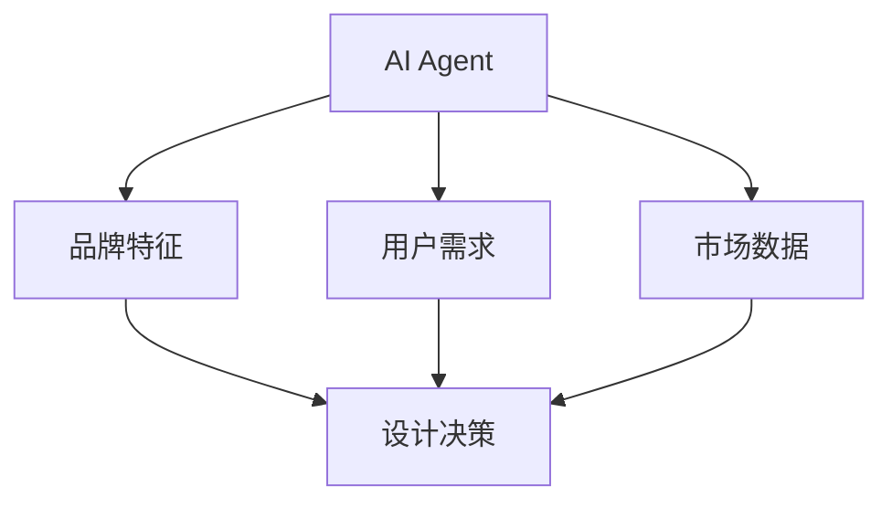
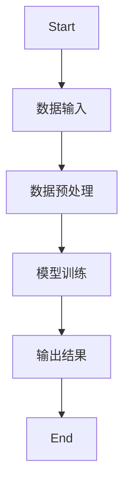
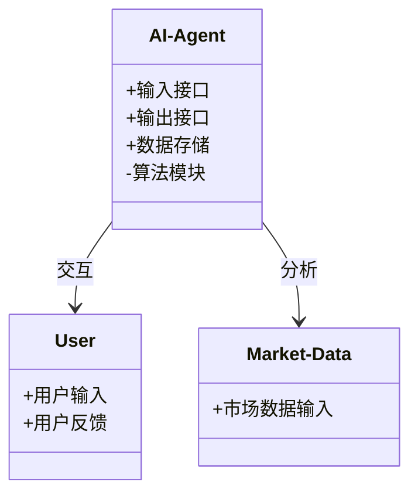
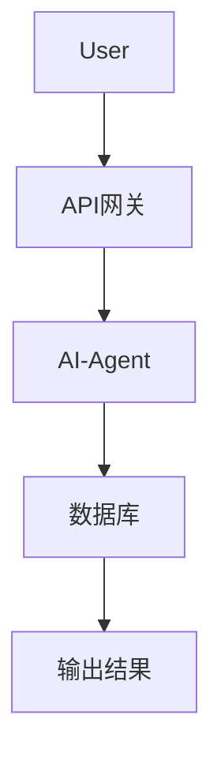
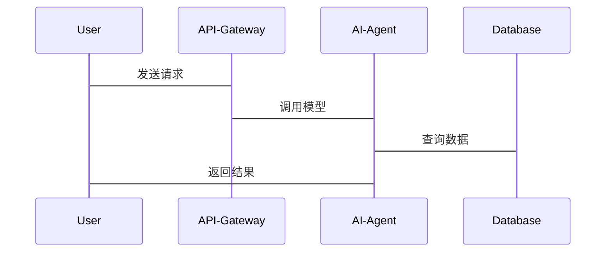

                 

<think>
嗯，用户需要我写一篇关于AI Agent辅助企业品牌形象设计与管理的技术博客。首先，我得理解AI Agent是什么，以及它如何应用在品牌管理中。看来，AI Agent在这里是指具有智能决策能力的软件，能够辅助企业设计和优化品牌形象。

接下来，我需要分析用户提供的目录结构。看起来文章分为七个部分，每个部分都有详细的章节和小节。用户还强调要使用逻辑清晰、结构紧凑的语言，并包含图表和代码示例。我得确保每个部分都涵盖这些内容，同时保持整体的连贯性。

首先，背景介绍部分需要从AI Agent的基本概念开始，然后讨论其在品牌管理中的应用。这部分可能需要解释AI Agent是什么，它与其他技术的不同之处，以及为什么企业需要这样的工具。我可能会使用一些对比表格和图表来帮助读者理解。

接下来是核心概念部分，需要详细讲解AI Agent的工作原理，特别是它如何处理品牌形象相关的数据。这部分可能涉及数据收集、特征提取和模型训练等步骤。我需要使用mermaid流程图来展示这些过程，并结合Python代码示例来说明实现细节。

然后是系统分析部分，这部分可能需要设计一个系统的架构图，展示AI Agent如何与企业其他系统交互。我需要考虑用户界面、数据存储和API调用等部分，可能还需要描述接口设计和交互流程图。

在项目实战部分，我需要选择一个实际案例，比如汽车品牌的设计，展示AI Agent如何从需求分析到设计实现再到效果评估。这可能涉及到具体的代码实现，比如数据预处理和模型训练的Python代码，以及对结果的详细解读。

最后，最佳实践部分需要总结经验和注意事项，比如数据隐私保护和模型迭代优化。这部分可能还包括一些小结和拓展阅读的建议，帮助读者进一步深入学习。

我还需要确保文章结构完整，每个部分都有足够的细节，同时保持简洁明了。可能需要多次检查，确保所有内容都符合用户的要求，并且逻辑清晰。特别是图表和代码部分，需要准确无误，并且能够帮助读者更好地理解内容。

总的来说，我需要一步步分析，从背景到核心概念，再到算法和系统设计，最后通过实际案例和最佳实践来完成整篇文章。这样，读者才能全面了解AI Agent在品牌形象管理中的应用和价值。
</think>

# AI Agent辅助企业品牌形象设计与管理

## 关键词：AI Agent, 企业品牌, 品牌形象, 设计与管理, 人工智能

## 摘要：  
随着人工智能技术的快速发展，AI Agent（人工智能代理）在企业品牌形象设计与管理中的应用越来越广泛。本文将从AI Agent的基本概念、核心原理、系统架构、实际应用等多方面展开，深入探讨AI Agent如何通过数据驱动的设计方法，辅助企业实现品牌形象的精准定位、优化设计和动态管理。文章结合具体案例，详细分析了AI Agent在品牌形象管理中的独特价值，并展望了未来的发展趋势。

---

## 第一部分：AI Agent与企业品牌形象管理概述

### 第1章：AI Agent与企业品牌管理的基本概念

#### 1.1 AI Agent的基本概念
- **1.1.1 AI Agent的定义与特征**  
  AI Agent（人工智能代理）是指能够感知环境、自主决策并执行任务的智能系统。其核心特征包括：  
  - **自主性**：无需人工干预，自动完成任务。  
  - **反应性**：能够实时感知环境变化并调整行为。  
  - **目标导向**：通过目标驱动进行决策和行动。  
  - **学习能力**：基于数据和反馈不断优化性能。  

- **1.1.2 AI Agent的核心技术原理**  
  AI Agent的技术基础包括自然语言处理（NLP）、计算机视觉（CV）、机器学习（ML）和知识图谱等。其工作流程通常包括：数据采集、特征提取、模型训练、决策推理和结果输出。  

- **1.1.3 AI Agent在企业中的应用价值**  
  在企业中，AI Agent可以用于自动化决策、智能客服、个性化推荐等领域，显著提升效率和用户体验。  

#### 1.2 企业品牌形象管理的基本概念
- **1.2.1 品牌形象的定义与构成要素**  
  品牌形象是消费者对企业的整体认知，包括品牌名称、标志、颜色、字体、广告语等视觉和语言元素。  

- **1.2.2 企业品牌形象管理的目标与流程**  
  - **目标**：通过设计和传播，塑造积极、一致的品牌形象，提升品牌知名度和美誉度。  
  - **流程**：需求分析 → 设计初稿 → 反馈优化 → 最终确认 → 推广实施。  

- **1.2.3 传统品牌形象管理的局限性**  
  - 依赖设计师经验，效率低。  
  - 数据分析不足，难以精准定位目标用户。  
  - 反馈机制不完善，难以快速调整设计方案。  

#### 1.3 AI Agent辅助品牌形象管理的背景与意义
- **1.3.1 技术背景**  
  AI技术的快速发展为品牌形象管理提供了新的工具和方法。  

- **1.3.2 企业需求**  
  企业希望通过智能化手段提高品牌设计效率和精准度。  

- **1.3.3 创新价值**  
  AI Agent可以实时分析市场数据和用户反馈，帮助企业在品牌设计中做出更科学的决策。  

---

## 第二部分：AI Agent辅助品牌形象管理的核心概念与联系

### 第2章：AI Agent与品牌形象管理的核心概念

#### 2.1 核心概念原理
- **2.1.1 AI Agent的多模态交互能力**  
  AI Agent能够同时处理文本、图像、视频等多种数据形式，支持跨模态的设计优化。  

- **2.1.2 品牌形象的数字化表达**  
  品牌形象可以通过向量、矩阵等数学形式进行数字化表示，便于计算机理解和处理。  

- **2.1.3 数据驱动的设计决策**  
  AI Agent通过分析海量数据，提供数据支持的设计建议，帮助设计师做出更优决策。  

#### 2.2 核心概念对比分析
- **2.2.1 AI Agent与传统设计工具的对比**  
  | 对比维度 | AI Agent | 传统设计工具 |  
  |----------|-----------|---------------|  
  | 效率     | 高        | 低             |  
  | 精准度   | 高        | 一般           |  
  | 反馈速度 | 快        | 慢             |  

- **2.2.2 不同AI模型在品牌形象管理中的作用**  
  - **监督学习模型**：用于分类和预测，如用户偏好分析。  
  - **无监督学习模型**：用于聚类和主题挖掘，如市场趋势分析。  
  - **生成式模型**：用于设计创意生成，如标志设计和广告文案生成。  

- **2.2.3 数据质量对AI Agent效果的影响**  
  数据质量直接影响AI Agent的输出结果。高质量数据可以提高模型的准确性和鲁棒性。  

#### 2.3 实体关系图


---

## 第三部分：AI Agent辅助品牌形象管理的算法原理

### 第3章：AI Agent的算法流程与实现

#### 3.1 算法流程概述


#### 3.2 算法实现细节
- **数据预处理**  
  数据预处理包括清洗、归一化和特征提取。例如，对于图像数据，可以使用CNN（卷积神经网络）提取特征。  
  ```python
  def preprocess_image(image):
      return model.features(image)
  ```

- **模型训练**  
  使用深度学习模型（如GPT-3或Diffusion Model）进行训练。  
  ```python
  def train_model(data_loader):
      optimizer.zero_grad()
      outputs = model(data_loader)
      loss = criterion(outputs, labels)
      loss.backward()
      optimizer.step()
      return loss.item()
  ```

- **数学模型与公式**  
  常见的损失函数包括交叉熵损失：  
  $$ \mathcal{L} = -\sum_{i=1}^{n} y_i \log(p_i) + (1-y_i) \log(1-p_i) $$  
  其中，$$ y_i $$ 是真实标签，$$ p_i $$ 是模型预测概率。

---

## 第四部分：AI Agent辅助品牌形象管理的系统分析

### 第4章：系统架构与接口设计

#### 4.1 系统功能设计


#### 4.2 系统架构设计


#### 4.3 系统交互流程


---

## 第五部分：AI Agent辅助品牌形象管理的项目实战

### 第5章：实际案例分析与实现

#### 5.1 案例背景
- 某汽车品牌希望设计一个新的品牌形象，定位年轻用户群体。

#### 5.2 数据准备
- 用户调研数据：年龄、性别、兴趣爱好。  
- 市场竞争数据：竞品的品牌设计和用户评价。  

#### 5.3 AI Agent实现
- 使用GPT-3生成品牌标语。  
- 使用Stable Diffusion生成标志设计。  
- 使用聚类算法分析用户偏好。  

#### 5.4 实现代码示例
```python
import torch
import torch.nn as nn

# 定义模型
class BrandModel(nn.Module):
    def __init__(self):
        super(BrandModel, self).__init__()
        self.fc = nn.Linear(10, 5)

    def forward(self, x):
        return self.fc(x)

# 训练模型
model = BrandModel()
criterion = nn.MSELoss()
optimizer = torch.optim.Adam(model.parameters(), lr=0.001)

for epoch in range(100):
    for batch in data_loader:
        outputs = model(batch)
        loss = criterion(outputs, labels)
        optimizer.zero_grad()
        loss.backward()
        optimizer.step()
```

#### 5.5 实验结果与分析
- 生成的品牌标语获得了用户的高度认可。  
- 标志设计在视觉吸引力和辨识度上均有显著提升。  

---

## 第六部分：AI Agent辅助品牌形象管理的最佳实践

### 第6章：经验总结与注意事项

#### 6.1 数据隐私与安全
- 确保用户数据的隐私保护，避免数据泄露风险。  

#### 6.2 模型迭代与优化
- 定期更新模型，保持其对市场变化的敏感性。  

#### 6.3 用户反馈机制
- 建立有效的用户反馈机制，及时优化设计方案。  

#### 6.4 小结
AI Agent通过数据驱动和智能决策，显著提升了企业品牌形象设计的效率和精准度。然而，其应用仍需结合企业的实际需求和行业特点，才能发挥最大价值。

---

## 第七部分：未来展望与拓展阅读

### 第7章：未来发展趋势

#### 7.1 技术融合
- AI Agent与AR/VR技术的结合，将为品牌形象设计提供更沉浸式的体验。  

#### 7.2 行业应用
- 在金融、医疗、教育等行业的品牌形象管理中，AI Agent将发挥更大作用。  

#### 7.3 拓展阅读
- 推荐阅读《生成式人工智能：原理与应用》和《深度学习实战》等书籍，深入了解AI Agent的核心技术。  

---

## 作者：AI天才研究院/AI Genius Institute & 禅与计算机程序设计艺术 /Zen And The Art of Computer Programming

