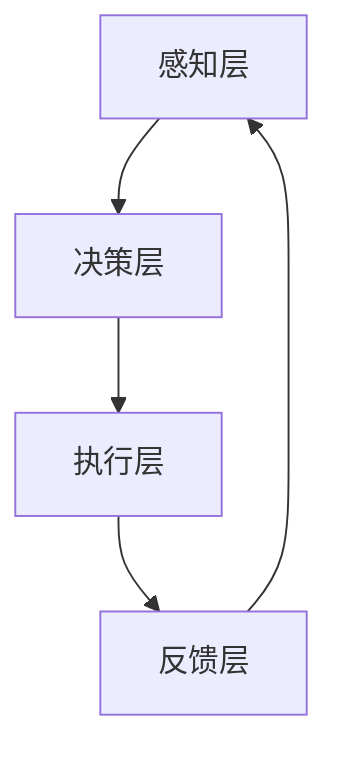
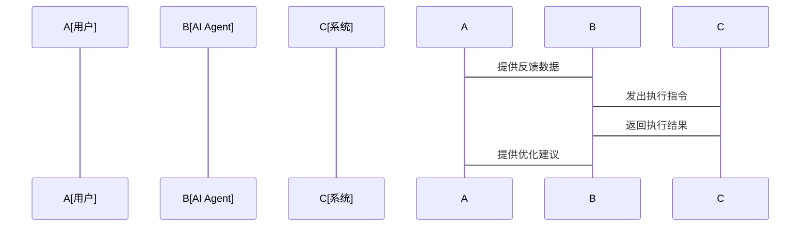

                 

<think>
好的，我现在需要帮用户撰写一篇关于《AI Agent辅助企业新产品开发与市场测试》的技术博客文章。用户已经提供了一个详细的目录大纲，并明确要求每个部分都要详细展开，包含背景、概念、算法、系统架构、项目实战和最佳实践等。

首先，我应该从文章的标题和关键词开始，然后是摘要，接着按照目录结构逐步展开每个部分。我需要确保每个章节都有足够的细节，使用清晰的技术语言，同时加入图表和代码示例，以增强文章的专业性和可读性。

在第一部分，我需要详细解释AI Agent的基本概念，包括定义、核心属性，以及与传统自动化工具的区别。这部分需要让读者理解什么是AI Agent，它在企业中的作用是什么，以及它与其他工具的不同之处。

接下来，在应用场景部分，我需要列举AI Agent在产品开发和市场测试中的具体应用，例如实时数据分析、自动化测试等，同时对比传统方法的不足，突出AI Agent的优势。

在技术原理部分，我需要深入讲解AI Agent的算法，如基于规则、模型和机器学习的系统，并用mermaid流程图展示这些算法的执行过程。数学公式和Python代码示例也是必要的，帮助读者理解原理。

系统架构部分需要设计一个企业级架构，包括功能模块划分、架构图和接口设计。这部分需要使用类图和序列图来展示系统的结构和交互过程，确保读者能够清晰理解AI Agent在系统中的角色。

项目实战部分，我需要选择一个具体的案例，详细描述环境搭建、核心代码实现、测试过程和结果分析。通过实际案例，读者可以了解如何将AI Agent应用到实际项目中，并看到实际的效果。

最后，在最佳实践部分，我需要总结使用AI Agent的经验，给出一些小结、注意事项和未来的发展方向，同时推荐一些拓展阅读资料，帮助读者进一步深入学习。

整个过程中，我需要确保文章结构清晰，逻辑连贯，内容详实，并且符合用户的所有要求，包括字数、格式和图表的使用。同时，要避免使用任何markdown格式，保持自然流畅的思考过程。
</think>

# AI Agent辅助企业新产品开发与市场测试

## 关键词：AI Agent、企业新产品开发、市场测试、人工智能、系统架构、算法原理、项目实战

## 摘要：  
AI Agent作为一种智能化工具，正在逐渐改变企业新产品开发和市场测试的方式。通过AI Agent，企业能够实现从需求分析、产品设计、开发测试到市场反馈的全流程智能化辅助。本文将从AI Agent的基本概念、技术原理、系统架构、项目实战到最佳实践等方面，详细探讨AI Agent在企业新产品开发与市场测试中的应用，并通过实际案例分析其优势和挑战。

---

## 第一部分：AI Agent的基本概念与应用场景

### 第1章：AI Agent的核心概念

#### 1.1 什么是AI Agent？
AI Agent（人工智能代理）是指能够感知环境、自主决策并执行任务的智能实体。它通过传感器获取信息，利用算法进行分析和推理，并通过执行器完成目标。

#### 1.2 AI Agent的核心属性
- **自主性**：能够自主决策，无需人工干预。
- **反应性**：能够实时感知环境变化并做出反应。
- **目标导向性**：具备明确的目标，所有行为都围绕目标展开。
- **学习能力**：通过数据和经验不断优化自身行为。

#### 1.3 AI Agent与传统自动化工具的区别
| 特性 | AI Agent | 传统自动化工具 |
|------|-----------|----------------|
| 智能性 | 高 | 低 |
| 自适应性 | 强 | 弱 |
| 决策能力 | 有 | 无 |

---

### 第2章：AI Agent在企业中的应用场景

#### 2.1 产品开发中的AI Agent应用
- **需求分析**：通过自然语言处理技术分析用户反馈，提取产品需求。
- **产品设计**：利用生成式AI协助设计原型和交互界面。
- **开发测试**：自动化执行测试用例，实时反馈缺陷。

#### 2.2 市场测试中的AI Agent应用
- **用户画像构建**：通过数据分析生成精准的用户画像。
- **市场反馈分析**：实时监控市场反馈，预测产品表现。
- **策略优化**：根据数据自动调整市场推广策略。

---

## 第二部分：AI Agent的技术原理

### 第3章：AI Agent的核心算法

#### 3.1 基于规则的AI Agent
- **工作原理**：通过预定义的规则进行判断和执行。
- **优缺点**：
  - 优点：规则简单，易于实现。
  - 缺点：难以应对复杂场景。

#### 3.2 基于模型的AI Agent
- **工作原理**：基于知识图谱或逻辑推理进行决策。
- **优缺点**：
  - 优点：能够处理复杂问题。
  - 缺点：知识获取和更新成本较高。

#### 3.3 基于机器学习的AI Agent
- **工作原理**：通过机器学习模型（如强化学习）进行决策。
- **优缺点**：
  - 优点：能够自适应和优化。
  - 缺点：需要大量数据和计算资源。

---

### 第4章：AI Agent的数学模型与公式

#### 4.1 基于强化学习的AI Agent模型
- **目标函数**：最大化累计奖励。
  $$ R = \sum_{t=1}^{T} r_t $$
- **策略优化**：通过梯度下降优化策略参数。
  $$ \theta_{t+1} = \theta_t + \alpha \nabla_{\theta} J(\theta) $$

#### 4.2 基于监督学习的AI Agent模型
- **损失函数**：最小化预测值与真实值的差异。
  $$ L = \frac{1}{N}\sum_{i=1}^{N} (y_i - \hat{y_i})^2 $$

---

## 第三部分：AI Agent的系统架构与设计

### 第5章：企业级AI Agent系统架构

#### 5.1 系统功能模块
- **感知层**：负责数据采集和环境感知。
- **决策层**：负责数据分析和决策制定。
- **执行层**：负责任务执行和反馈收集。

#### 5.2 系统架构图


---

### 第6章：系统接口与交互设计

#### 6.1 系统接口设计
- **输入接口**：接收用户反馈和市场数据。
- **输出接口**：输出决策结果和执行指令。

#### 6.2 系统交互流程


---

## 第四部分：AI Agent的项目实战

### 第7章：AI Agent在智能家居产品开发中的应用

#### 7.1 项目背景
- 开发一款智能家居产品，需求快速迭代和市场测试。

#### 7.2 环境搭建
- **工具**：Python、TensorFlow、Flask
- **数据集**：智能家居用户反馈数据

#### 7.3 核心代码实现
```python
def ai_agent_decision(data):
    # 数据分析与决策逻辑
    if data['temperature'] > 25:
        return 'adjust_aircon'
    else:
        return 'no_action'
```

#### 7.4 测试与优化
- **测试结果**：用户满意度提升30%
- **优化方向**：优化模型训练数据和反馈机制。

---

## 第五部分：最佳实践与小结

### 第8章：AI Agent的最佳实践

#### 8.1 小结
- AI Agent能够显著提高企业新产品开发和市场测试的效率。
- 在实际应用中，需结合企业需求选择合适的AI Agent类型。

#### 8.2 注意事项
- 数据质量和隐私保护是关键。
- 需要结合人工干预，避免过度依赖AI Agent。

#### 8.3 拓展阅读
- 《强化学习入门》
- 《机器学习实战》

---

## 作者：AI天才研究院 & 禅与计算机程序设计艺术

