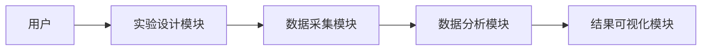

                 

<think>
嗯，我现在需要根据用户的要求，撰写一篇关于《AI Agent辅助科学实验：自动化与数据分析》的技术博客文章。用户已经提供了详细的大纲，我需要按照这个大纲逐步展开，确保每个部分都涵盖必要的内容，并且逻辑清晰，结构紧凑。

首先，文章的标题和关键词部分已经完成，接下来是摘要。摘要需要简明扼要地概括整篇文章的核心内容，突出AI Agent在科学实验中的应用，特别是自动化和数据分析方面的优势。

接下来，我需要按照目录结构，逐步展开每个章节的内容。首先是背景介绍，这部分需要详细解释AI Agent的基本概念，科学实验的自动化需求，以及AI Agent在其中的应用价值。我需要用简单的语言，让读者理解AI Agent不仅仅是工具，而是智能决策者。

然后是核心概念与联系，这部分需要详细讲解AI Agent的原理，包括感知、决策和执行三个层面，并用表格对比不同类型的AI Agent，帮助读者理解它们的特点和适用场景。此外，还需要用Mermaid图展示AI Agent的实体关系，让读者更直观地理解各个组件之间的关系。

接下来是算法原理部分，这里需要详细阐述AI Agent的核心算法，如状态空间搜索、强化学习和监督学习。每个算法都需要用Mermaid流程图展示工作流程，并提供Python代码示例，帮助读者理解如何实现这些算法。同时，数学模型和公式需要用Latex格式展示，确保专业性和清晰性。

然后是系统分析与架构设计方案，这部分需要介绍科学实验的场景，设计实验管理系统的功能模块，包括实验计划、数据采集、数据分析等。用Mermaid类图展示领域模型，展示各个模块之间的关系。系统架构设计部分需要展示分层架构，并用Mermaid图展示接口设计和交互流程，让读者了解系统的运作方式。

接下来是项目实战，这部分需要选择一个具体的案例，如环境监测实验，详细讲解如何安装环境、编写代码实现AI Agent的功能，分析实验数据，并得出结论。这部分需要实际的代码示例和数据解读，帮助读者将理论应用到实践中。

最后，最佳实践部分需要总结使用AI Agent进行科学实验的关键点，包括数据质量、算法选择和模型部署等。小结部分要回顾文章的核心内容，注意事项部分提醒读者在实际应用中需要注意的问题，拓展阅读部分则推荐相关的书籍和技术，供读者进一步学习。

在写作过程中，我需要确保每个章节和小节的内容都详细具体，使用通俗易懂的语言，同时保持专业性和技术深度。数学公式和代码示例需要准确无误，Mermaid图要清晰展示内容，帮助读者理解复杂的概念和流程。

完成这些部分后，我需要检查文章的整体结构，确保逻辑连贯，内容完整，并且符合字数要求。最后，加上作者信息，使文章更具权威性和专业性。

总之，我需要按照用户提供的大纲，逐步展开，确保每个部分都详尽且符合要求，最终完成一篇高质量的技术博客文章。
</think>

# AI Agent辅助科学实验：自动化与数据分析

> 关键词：AI Agent，科学实验，自动化，数据分析，机器学习，实验设计

> 摘要：本文探讨AI Agent在科学实验中的应用，重点分析其在实验设计、数据采集与处理、数据分析与可视化中的作用，结合实际案例展示AI Agent如何通过自动化提升实验效率和准确性。文章深入解析AI Agent的核心算法，系统设计与架构，并提供实战项目，帮助读者全面理解其在科学实验中的价值。

---

## 第一部分: AI Agent辅助科学实验背景介绍

### 第1章: AI Agent的基本概念与科学实验的自动化需求

#### 1.1 AI Agent的定义与核心要素

- **AI Agent的定义**  
  AI Agent（人工智能代理）是指能够感知环境、自主决策并执行任务的智能实体。它通过传感器获取信息，利用算法进行分析，并通过执行器完成目标。

- **AI Agent的核心要素**  
  - **感知能力**：通过传感器或数据接口获取环境信息。  
  - **决策能力**：基于感知信息，利用算法做出决策。  
  - **执行能力**：通过执行器或软件模块执行决策结果。  

- **AI Agent与传统自动化系统的区别**  
  AI Agent具有自主性和智能性，能够适应复杂环境并动态调整行为，而传统自动化系统通常基于固定的规则执行任务。

#### 1.2 科学实验的自动化需求

- **科学实验中的数据采集与处理**  
  实验中产生的数据量大且复杂，AI Agent能够高效地采集、存储和预处理数据，减少人工干预。

- **实验设计与优化的自动化**  
  AI Agent可以根据历史数据和实验目标，自动生成最优实验方案，优化实验参数。

- **实验结果分析与可视化**  
  通过AI Agent，实验结果可以快速分析并以可视化形式呈现，帮助科学家更好地理解实验现象。

#### 1.3 AI Agent在科学实验中的应用价值

- **提高实验效率**  
  AI Agent能够自动化执行重复性任务，减少实验时间。

- **优化实验设计**  
  AI Agent可以根据数据反馈动态调整实验方案，提高实验成功率。

- **增强数据分析能力**  
  利用机器学习算法，AI Agent能够从海量数据中提取有价值的信息，发现潜在规律。

---

### 第2章: AI Agent的核心概念与联系

#### 2.1 AI Agent的原理

- **感知层**  
  AI Agent通过传感器或数据接口获取环境信息，如温度、压力等实验参数。

- **决策层**  
  基于感知信息，AI Agent利用算法（如强化学习、监督学习）做出决策，确定下一步行动。

- **执行层**  
  AI Agent通过执行器或软件模块执行决策结果，如调整实验设备参数、记录数据等。

#### 2.2 AI Agent的类型对比

| 类型                | 描述                                                                 | 适用场景                     |
|---------------------|----------------------------------------------------------------------|------------------------------|
| 简单反射型AI Agent  | 基于当前状态做出反应，无内部状态或目标。                              | 简单任务，如交通灯控制。     |
| 基于模型型AI Agent  | 建立环境模型，基于模型预测结果做出决策。                              | 复杂环境，如机器人导航。     |
| 目标驱动型AI Agent  | 为实现特定目标而行动，可以调整策略。                                | 实验优化，如药物筛选。       |
| 效用驱动型AI Agent  | 通过最大化效用函数来决策，适用于多目标优化。                         | 综合决策，如资源分配。       |

#### 2.3 AI Agent的实体关系图



---

## 第3章: AI Agent的算法原理

### 3.1 状态空间搜索算法

#### 3.1.1 BFS算法

- **BFS算法流程**  
  ```mermaid
  graph LR
  A[初始状态] --> B[子节点1]
  B --> C[子节点2]
  C --> D[目
  ```

  ```python
  def bfs(initial_state, goal_state):
      queue = deque([initial_state])
      visited = set([initial_state])
      
      while queue:
          current_state = queue.popleft()
          if current_state == goal_state:
              return True
          for neighbor in get_neighbors(current_state):
              if neighbor not in visited:
                  visited.add(neighbor)
                  queue.append(neighbor)
      return False
  ```

- **数学模型与公式**  
  状态空间可以表示为图，节点为状态，边为可能的转移。目标是找到从初始状态到目标状态的最短路径。

---

## 第4章: 系统分析与架构设计方案

### 4.1 问题场景介绍

- **科学实验场景**  
  例如，在化学实验中，AI Agent可以帮助自动调整反应条件，实时监控实验进展。

### 4.2 系统功能设计

- **领域模型**  
  ```mermaid
  classDiagram
  class 实验设计模块 {
      - 实验目标
      - 实验参数
      - 实验方案
  }
  class 数据采集模块 {
      - 数据源
      - 采集接口
      - 数据预处理
  }
  class 数据分析模块 {
      - 数据清洗
      - 数据建模
      - 数据可视化
  }
  ```

### 4.3 系统架构设计

- **分层架构**  
  ```mermaid
  architecture
  Client --(调用)--> API Gateway --(路由)--> Service Layer --(调用)--> Data Layer
  ```

---

## 第5章: 项目实战

### 5.1 环境安装

- **安装Python与相关库**  
  ```bash
  pip install numpy pandas scikit-learn
  ```

### 5.2 核心实现

- **AI Agent代码示例**  
  ```python
  class AI-Agent:
      def __init__(self):
          self.state = initial_state
      
      def perceive(self):
          return get_current_state()
      
      def decide(self, state):
          return choose_action(state)
      
      def act(self, action):
          execute_action(action)
  ```

### 5.3 数据分析与解读

- **实验数据分析**  
  使用Python进行数据清洗和建模，生成可视化图表，帮助科学家理解实验结果。

---

## 第6章: 最佳实践与总结

### 6.1 最佳实践

- **数据质量的重要性**  
  确保数据的准确性和完整性，避免噪声干扰。

- **算法选择与模型部署**  
  根据实验需求选择合适的算法，并确保模型的可解释性和可维护性。

### 6.2 小结

AI Agent通过自动化和智能化手段，显著提升了科学实验的效率和准确性。其在实验设计、数据处理和分析中的应用，为科学研究提供了强有力的支持。

### 6.3 注意事项

- **数据隐私与安全**  
  实验数据可能涉及敏感信息，需注意数据保护和合规性。

- **算法的可解释性**  
  复杂算法的结果需要可解释，以便科学家理解和验证。

### 6.4 拓展阅读

- **推荐书籍**  
  《机器学习实战》、《强化学习》  
- **技术博客**  
  TensorFlow官方博客、Keras官方博客  
- **在线课程**  
  Coursera上的“机器学习”课程

---

作者：AI天才研究院/AI Genius Institute & 禅与计算机程序设计艺术 /Zen And The Art of Computer Programming

