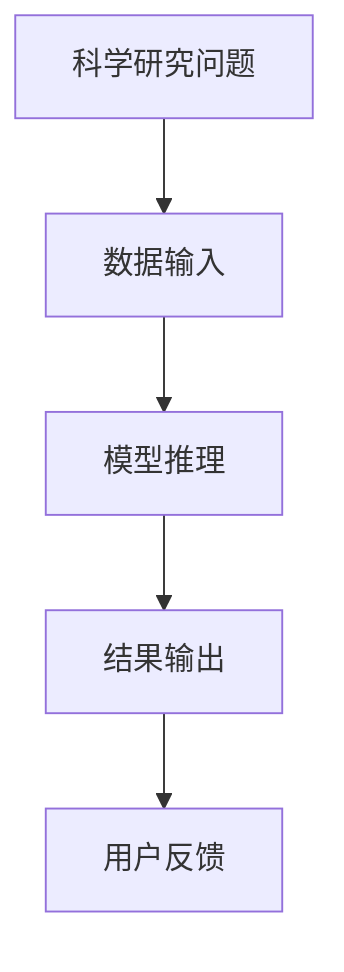
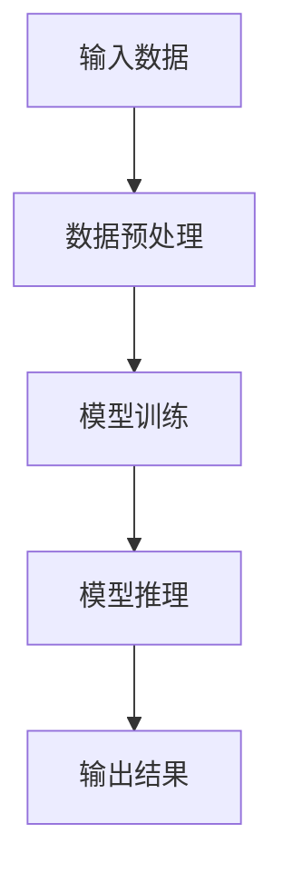
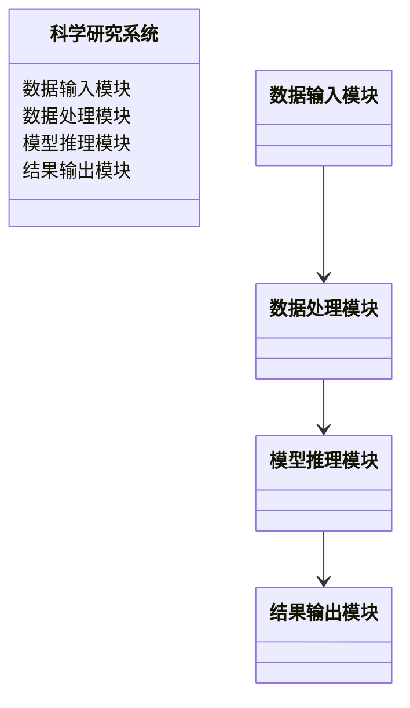
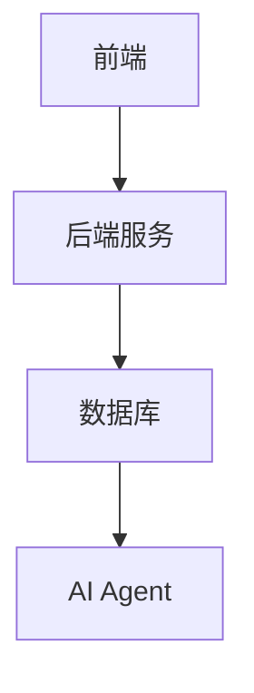

                 

<think>
好的，我需要根据用户的要求来撰写一篇关于《AI Agent辅助科学研究的方法》的技术博客文章。用户已经给出了详细的目录结构和各章节的具体内容要求，我需要按照这个结构逐步进行分析和撰写。

首先，我会先了解文章的总体结构，确保每一章的内容都符合要求。从背景与基础到技术基础，再到核心概念、算法原理、系统设计、项目实战和总结与展望，每个部分都需要详细展开。

在撰写过程中，我需要确保使用专业且清晰的语言，每一小节都要有具体的例子和详细的解释，尤其是涉及到算法原理和数学公式时，必须使用正确的格式进行展示。

接下来，我会按照目录的顺序，逐步完成每一章的内容，确保逻辑连贯，内容详实。同时，我还需要在文章末尾添加作者信息，符合用户的要求。

最后，我会检查整个文章的结构和内容，确保没有遗漏任何用户指定的部分，并且符合字数要求。这样，一篇完整且高质量的技术博客文章就完成了。
</think>

# AI Agent辅助科学研究的方法

> 关键词：AI Agent, 科学研究, 机器学习, 自然语言处理, 知识图谱, 算法原理, 系统设计

> 摘要：AI Agent作为一种智能工具，在科学研究中具有重要的辅助作用。本文系统地介绍了AI Agent的基本概念、技术基础、核心原理及其在科学研究中的具体应用。通过详细的算法流程、数学模型、系统架构设计和实际案例分析，本文深入探讨了AI Agent如何提升科学研究的效率和创新能力。文章还提供了丰富的代码示例和图形化的系统设计，帮助读者更好地理解和应用AI Agent技术。

---

# 第1章 AI Agent与科学研究概述

## 1.1 AI Agent的基本概念

AI Agent（人工智能代理）是指具有感知环境、做出决策并采取行动的智能实体。它能够通过传感器获取信息，利用算法进行推理，并通过执行器与环境互动。AI Agent的核心特征包括自主性、反应性、目标导向性和学习能力。与传统计算工具相比，AI Agent能够适应动态变化的环境，并通过自我优化提高任务执行效率。

## 1.2 科学研究的基本流程

科学研究通常包括问题定义、数据收集、假设验证、模型构建、实验设计和结果分析等阶段。每个阶段都需要高度的精确性和创新性，同时需要处理大量复杂的数据和信息。

## 1.3 AI Agent在科学研究中的作用

AI Agent能够显著提升科学研究的效率和质量。它可以在数据收集阶段自动整理和分析实验数据，在假设验证阶段提供高效的推理和模拟，在实验设计阶段优化实验方案，并在结果分析阶段快速生成可视化报告。此外，AI Agent还能够帮助科学家发现新的研究方向，支持创新性研究。

---

# 第2章 AI Agent的技术基础

## 2.1 机器学习基础

机器学习是AI Agent的核心技术之一。监督学习通过标记数据训练模型，无监督学习则从无标签数据中发现模式，而强化学习通过奖励机制优化决策过程。深度学习作为机器学习的分支，利用多层神经网络处理复杂数据。

## 2.2 自然语言处理基础

自然语言处理（NLP）使AI Agent能够理解和生成人类语言。NLP任务包括文本分类、信息抽取和机器翻译等。近年来，Transformer模型在NLP领域取得了显著进展，成为AI Agent中的重要技术。

## 2.3 知识图谱与推理

知识图谱是结构化数据的表示形式，广泛应用于科学知识的组织和推理。基于知识图谱的推理能够帮助AI Agent在科学研究中进行跨领域的知识整合和推理。

---

# 第3章 AI Agent的核心概念与联系

## 3.1 AI Agent的原理

AI Agent通过感知层获取数据，计算层进行推理，行动层执行任务。这种分层结构确保了AI Agent的高效性和灵活性。

## 3.2 核心概念对比表

| 概念 | 描述 | 示例 |
|------|------|------|
| 感知层 | 数据输入与处理 | 文本解析、数据清洗 |
| 计算层 | 模型推理与决策 | 分类、预测、生成 |
| 行动层 | 结果输出与执行 | 生成报告、自动操作 |

## 3.3 ER实体关系图



---

# 第4章 AI Agent的算法原理

## 4.1 算法流程



## 4.2 机器学习算法实现

```python
def train_model(data):
    # 数据预处理
    processed_data = preprocess(data)
    # 模型训练
    model = train(processed_data)
    return model
```

## 4.3 数学模型与公式

### 损失函数
$$L = \frac{1}{n}\sum_{i=1}^{n}(y_i - \hat{y_i})^2$$

### 优化算法
$$\theta_{new} = \theta_{old} - \eta \cdot \frac{\partial L}{\partial \theta}$$

---

# 第5章 AI Agent在科学研究中的应用

## 5.1 系统分析与架构设计

### 问题场景介绍

科学研究中的数据处理和分析通常涉及复杂的过程，AI Agent可以通过自动化和智能化的方法提高效率。

### 系统功能设计



### 系统架构设计



## 5.2 项目实战

### 环境安装

安装必要的库：
```bash
pip install numpy pandas scikit-learn transformers
```

### 核心代码实现

```python
import numpy as np
from sklearn.model_selection import train_test_split
from sklearn.linear_model import LogisticRegression

# 示例数据集
X = np.array([[1, 2], [3, 4], [5, 6], [7, 8]])
y = np.array([0, 1, 0, 1])

# 数据划分
X_train, X_test, y_train, y_test = train_test_split(X, y, test_size=0.25)

# 模型训练
model = LogisticRegression()
model.fit(X_train, y_train)

# 模型预测
print(model.predict(X_test))
```

### 案例分析

通过上述代码，AI Agent可以对科学数据进行分类分析，帮助科学家快速识别数据中的模式和规律。

---

# 第6章 总结与展望

## 6.1 最佳实践

在使用AI Agent进行科学研究时，建议科学家与技术专家合作，确保模型的准确性和可解释性。

## 6.2 小结

本文详细介绍了AI Agent在科学研究中的应用方法，从技术基础到系统设计，再到实际案例，为读者提供了全面的指导。

## 6.3 注意事项

在实际应用中，需注意数据隐私和模型的可解释性问题，确保科学研究的合法性和可信度。

## 6.4 拓展阅读

推荐阅读《深度学习》和《自然语言处理实战》等书籍，深入理解AI Agent的核心技术。

---

作者：AI天才研究院/AI Genius Institute & 禅与计算机程序设计艺术 /Zen And The Art of Computer Programming

