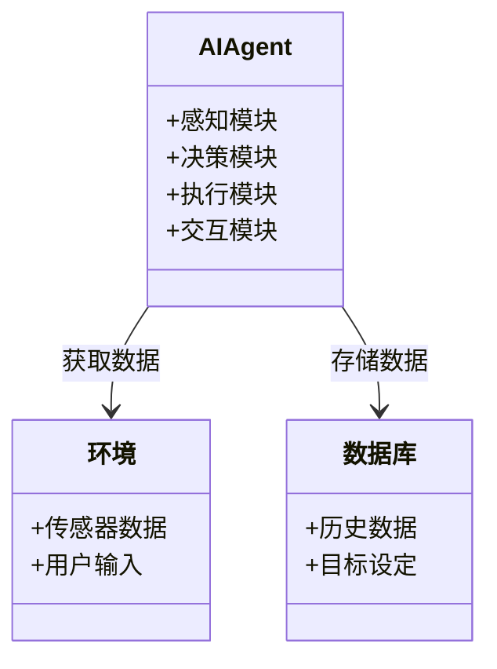
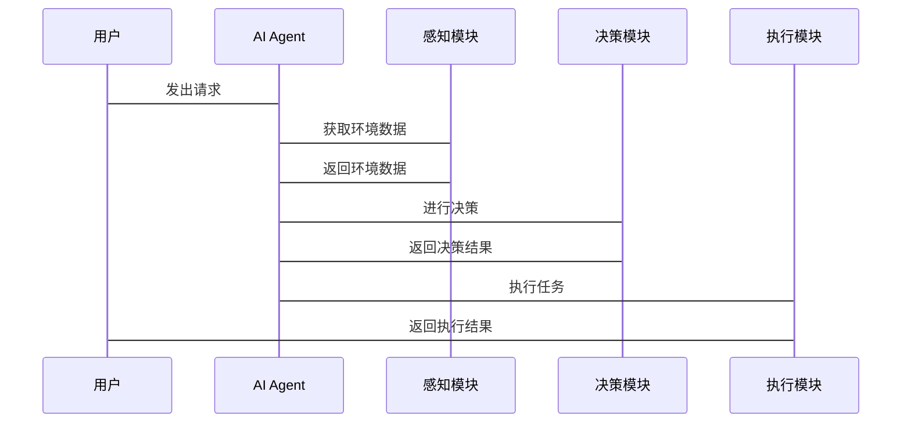

                 

<think>
嗯，用户需要设计一本名为《AI Agent项目的ROI分析方法》的书籍目录大纲。首先，我需要理解这本书的核心主题，即如何评估AI Agent项目的投资回报率。ROI分析在商业和技术项目中非常重要，所以这本书应该帮助读者理解如何从经济角度评估AI Agent项目的价值。

接下来，我要考虑这本书的结构。通常，技术书籍会分为几个主要部分，比如基础、核心概念、算法原理、系统架构、项目实战和总结等。根据用户的提示，这本书需要包含背景介绍、核心概念、算法、系统分析、项目实战以及最佳实践等内容。因此，我需要确保这些部分都被涵盖。

首先，我应该从背景介绍开始，这部分包括AI Agent的基本概念、其在企业中的应用，以及为什么ROI分析在这个领域如此重要。这部分需要让读者了解问题的背景和重要性，为后续内容打下基础。

然后是核心概念与联系，这里需要详细解释AI Agent和ROI分析的原理，可能还需要用表格和Mermaid图来展示它们之间的关系。这部分要确保读者能够理解两个概念如何相互作用。

接下来是算法原理，这部分需要详细讲解如何计算ROI。可能涉及到数学公式，比如净现值、内部收益率等，需要用Latex来展示。同时，还需要用Python代码来实现这些算法，帮助读者更好地理解。

系统分析与架构设计部分，应该包括问题场景介绍、系统功能设计、架构设计图等。这部分可能需要使用Mermaid的类图和序列图来展示系统结构和交互流程。

项目实战部分，需要提供一个具体的案例，从环境安装、代码实现到案例分析，让读者能够实际操作，理解如何在项目中应用这些方法。

最后，总结与最佳实践部分，要回顾整个内容，给出一些实用的建议和注意事项，帮助读者在实际项目中避免常见错误，提升分析效率。

在设计目录时，我需要确保每个章节都有足够的细节，比如每个章节下要有小节，甚至三级目录。同时，要遵循用户的要求，使用markdown格式，确保结构清晰，层次分明。

另外，用户强调内容要简洁，不要有多余的废话，所以每个部分都要直接切入主题，不拖泥带水。同时，总字数控制在2000字以内，这意味着每个部分不能太冗长，要恰到好处地覆盖所有关键点。

最后，我需要检查整个目录是否符合用户的所有要求，包括章节数量、内容完整性、格式正确性等。确保没有遗漏任何关键部分，比如数学公式、代码示例、图表等，这些都是用户特别强调的。

总结一下，我需要按照用户的要求，从背景到实战，逐步构建这本书的目录，确保每个部分都详细且逻辑清晰，帮助读者全面掌握AI Agent项目的ROI分析方法。
</think>

# AI Agent项目的ROI分析方法

> 关键词：AI Agent，ROI分析，投资回报率，人工智能项目，经济效益评估

> 摘要：本文系统地介绍了AI Agent项目的ROI分析方法，从基本概念、分析框架、系统设计到项目实战，全面阐述了如何从经济角度评估AI Agent项目的可行性与价值。文章结合理论与实践，提供了详细的数学模型、算法实现和实际案例，帮助读者掌握AI Agent项目ROI分析的核心技能。

---

# 第1章: AI Agent与ROI分析概述

## 1.1 AI Agent的基本概念
### 1.1.1 AI Agent的定义与特点
AI Agent（人工智能代理）是指能够感知环境、自主决策并执行任务的智能实体。其核心特点包括：
- **自主性**：能够在没有外部干预的情况下独立运行。
- **反应性**：能够实时感知环境变化并做出响应。
- **目标导向性**：具备明确的目标，并通过规划和优化实现目标。
- **学习能力**：能够通过数据学习和优化自身行为。

### 1.1.2 AI Agent的核心功能与应用场景
AI Agent的功能主要体现在以下几个方面：
- **信息处理**：能够处理和分析大量数据，提取有价值的信息。
- **决策优化**：通过算法优化决策过程，提高效率。
- **任务执行**：能够自动执行预设或动态调整的任务。
- **人机交互**：具备与人类用户进行自然交互的能力。

AI Agent的应用场景广泛，包括智能客服、自动驾驶、智能推荐系统、工业自动化等领域。

### 1.1.3 ROI分析的基本概念与方法
ROI（Return on Investment，投资回报率）是衡量投资项目经济效益的核心指标。计算公式为：
$$ ROI = \frac{净收益}{投资成本} \times 100\% $$

ROI分析的方法主要包括：
1. **净现值法（Net Present Value，NPV）**：将未来收益按现值计算，与初始投资进行比较。
2. **内部收益率法（Internal Rate of Return，IRR）**：计算项目投资的收益率，使其净现值为零。
3. **回收期法**：计算投资回收所需的时间。

---

## 1.2 AI Agent项目中的ROI分析意义
### 1.2.1 ROI分析在AI Agent项目中的重要性
AI Agent项目的ROI分析能够帮助企业评估项目的经济可行性，避免盲目投资。通过 ROI 分析，企业可以：
- 优化资源配置，优先投资高回报的项目。
- 评估技术的商业价值，避免技术与商业目标脱节。
- 量化项目的经济效益，为决策提供数据支持。

### 1.2.2 ROI分析的常见指标与方法
在AI Agent项目中，ROI分析的常见指标包括：
- **投资回收期（Payback Period）**：项目投资回收所需的时间。
- **净现值（NPV）**：未来收益的现值与初始投资的差值。
- **内部收益率（IRR）**：使净现值为零的收益率。

### 1.2.3 AI Agent项目ROI分析的独特性
AI Agent项目的ROI分析具有以下独特性：
- **技术复杂性**：AI Agent涉及复杂的技术架构和算法，影响 ROI 的计算难度。
- **数据依赖性**：AI Agent的性能高度依赖数据质量，数据获取成本需要纳入 ROI 分析。
- **长期性**：AI Agent的投资回报通常需要较长时间才能显现。

---

## 1.3 本章小结
本章介绍了AI Agent的基本概念、核心功能及应用场景，并重点阐述了ROI分析的基本概念与方法。通过分析AI Agent项目中ROI分析的意义，读者可以理解其在商业决策中的重要性。

---

# 第2章: AI Agent项目的背景与问题分析

## 2.1 AI Agent项目背景
### 2.1.1 当前AI技术的发展趋势
人工智能技术的快速发展为AI Agent的应用提供了技术支撑。深度学习、自然语言处理（NLP）和强化学习等技术的成熟，使得AI Agent能够实现更复杂的功能。

### 2.1.2 AI Agent在企业中的应用现状
目前，AI Agent已经在多个领域得到广泛应用，例如：
- **智能客服**：通过自然语言处理技术为用户提供自动化服务。
- **推荐系统**：基于用户行为数据推荐个性化内容。
- **工业自动化**：在制造业中实现智能化生产流程。

### 2.1.3 AI Agent项目 ROI分析的必要性
随着AI技术的普及，企业对AI Agent项目的投资不断增加。然而，许多项目由于缺乏科学的ROI分析，导致资源浪费或收益不佳。因此， ROI分析成为确保AI Agent项目成功的关键步骤。

---

## 2.2 AI Agent项目中的问题与挑战
### 2.2.1 技术实现的难点
AI Agent的实现涉及多个技术领域，包括：
- **感知与决策**：需要处理大量数据并实时做出决策。
- **人机交互**：要求自然语言理解和生成能力。
- **系统集成**：需要与现有系统无缝对接。

### 2.2.2 数据获取与处理的挑战
AI Agent的性能依赖于高质量的数据。然而，数据获取过程中可能存在以下问题：
- 数据来源复杂，难以整合。
- 数据隐私和安全问题。
- 数据质量参差不齐，影响模型性能。

### 2.2.3 ROI分析中的常见误区
在AI Agent项目的ROI分析中，常见的误区包括：
- **忽视数据成本**：未考虑数据获取和处理的成本。
- **过度乐观的收益预测**：基于理想情况预测收益，忽略实际风险。
- **忽略时间因素**：未考虑投资回收期对 ROI 的影响。

---

## 2.3 本章小结
本章从技术发展趋势和企业应用现状出发，分析了AI Agent项目 ROI 分析的必要性。同时，指出了项目实施中的主要挑战和常见误区，为后续分析提供了背景支持。

---

# 第3章: AI Agent项目的ROI分析框架

## 3.1 ROI分析的核心概念与原理
### 3.1.1 ROI的数学模型
ROI 的核心公式为：
$$ ROI = \frac{净收益}{投资成本} \times 100\% $$

其中，净收益等于未来收益的现值减去初始投资。

### 3.1.2 AI Agent项目 ROI分析的关键要素
AI Agent项目的 ROI 分析需要关注以下关键要素：
- **初始投资**：包括技术开发、数据获取和系统部署的成本。
- **未来收益**：包括节省的人力成本、提高的效率和新增的收入。
- **时间因素**：考虑资金的时间价值，通常采用净现值法或内部收益率法进行评估。

### 3.1.3 ROI分析的步骤与流程
ROI分析的步骤如下：
1. **确定目标**：明确 ROI 分析的目标和范围。
2. **收集数据**：获取与项目相关的成本和收益数据。
3. **计算净现值**：将未来收益折现，计算净现值。
4. **评估内部收益率**：计算项目的内部收益率。
5. **综合判断**：结合净现值和内部收益率，评估项目的可行性。

---

## 3.2 AI Agent项目 ROI 分析框架的设计
### 3.2.1 项目成本与收益的定义
项目成本包括：
- **开发成本**：AI Agent系统的设计、开发和测试成本。
- **数据成本**：数据获取、清洗和处理的成本。
- **部署成本**：系统部署和维护的成本。

项目收益包括：
- **直接收益**：通过AI Agent实现的效率提升和成本节约。
- **间接收益**：品牌价值提升和市场竞争力增强。

### 3.2.2 项目周期与收益预测模型
AI Agent项目的周期通常包括开发、测试和部署阶段。收益预测模型可以通过以下步骤建立：
1. **需求分析**：明确项目的预期目标和收益来源。
2. **数据建模**：基于历史数据建立收益预测模型。
3. **验证与优化**：通过实际数据验证模型的准确性，并进行优化。

### 3.2.3 ROI分析的指标体系
 ROI 分析的指标体系包括：
- **净现值（NPV）**：衡量项目的经济价值。
- **内部收益率（IRR）**：评估项目的投资回报能力。
- **投资回收期（Payback Period）**：反映项目资金回收的速度。

---

## 3.3 本章小结
本章详细阐述了 ROI 分析的核心概念与原理，并设计了适用于 AI Agent 项目的 ROI 分析框架。通过明确项目成本与收益的定义，以及建立科学的收益预测模型，为后续的 ROI 计算提供了理论基础。

---

# 第4章: AI Agent项目的系统分析与架构设计

## 4.1 系统分析与问题场景介绍
### 4.1.1 系统功能需求
AI Agent系统需要实现以下功能：
- **感知环境**：通过传感器或数据接口获取环境信息。
- **决策与规划**：基于感知信息进行决策，并制定执行计划。
- **执行任务**：根据决策结果执行具体任务。
- **与用户交互**：提供自然的人机交互界面。

### 4.1.2 系统的输入输出分析
系统的输入包括：
- **环境数据**：如传感器数据、用户输入等。
- **目标设定**：用户设定的决策目标。

系统的输出包括：
- **决策结果**：如动作指令、推荐结果等。
- **反馈信息**：如执行状态、错误信息等。

### 4.1.3 系统的边界与外部实体
AI Agent系统通常与其他系统或服务进行交互，如数据库、第三方API等。系统的边界需要清晰定义，以确保与其他系统的无缝对接。

---

## 4.2 系统功能设计
### 4.2.1 领域模型设计（Mermaid类图）
以下是AI Agent系统的领域模型设计：



### 4.2.2 功能模块划分与交互流程
AI Agent系统的功能模块包括：
- **感知模块**：负责数据的采集和初步处理。
- **决策模块**：基于感知数据进行决策。
- **执行模块**：根据决策结果执行具体任务。
- **交互模块**：提供用户交互界面，接收用户指令并反馈执行结果。

### 4.2.3 系统架构设计（Mermaid架构图）
以下是AI Agent系统的架构设计：


---

## 4.3 系统接口设计与交互流程
### 4.3.1 系统接口设计
AI Agent系统需要与外部系统进行交互，常见的接口包括：
- **数据接口**：与数据库或第三方API进行数据交互。
- **用户接口**：与用户进行交互，接收指令并反馈结果。

### 4.3.2 系统交互流程（Mermaid序列图）
以下是AI Agent系统的交互流程：



---

## 4.4 本章小结
本章通过对AI Agent系统的系统分析与架构设计，明确了系统的功能模块、交互流程和架构结构。这为后续的ROI分析提供了系统层面的支持。

---

# 第5章: AI Agent项目的项目实战

## 5.1 环境安装与配置
### 5.1.1 系统环境要求
- 操作系统：建议使用Linux或Windows 10及以上版本。
- 开发工具：推荐使用PyCharm、VS Code等IDE。
- 依赖库安装：需要安装Python的机器学习库（如scikit-learn、TensorFlow）和数据处理库（如Pandas、NumPy）。

### 5.1.2 数据准备与预处理
数据是AI Agent项目的核心，需要进行清洗和预处理：
- **数据清洗**：去除重复数据、处理缺失值。
- **数据预处理**：将数据转换为适合算法处理的形式。

---

## 5.2 系统核心实现
### 5.2.1 AI Agent算法实现
以下是AI Agent的核心算法实现：

```python
import numpy as np
import pandas as pd

class AIAgent:
    def __init__(self):
        self.model = self.load_model()
        self.data = self.load_data()

    def感知环境(self):
        # 获取环境数据
        return self.data

    def决策(self, 状态):
        # 基于状态进行决策
        return self.model.predict(状态)

    def执行任务(self, 动作):
        # 执行具体任务
        print(f"执行动作：{动作}")

    def交互(self, 用户输入):
        # 处理用户输入并反馈结果
        状态 = self.感知环境()
        动作 = self.决策(状态)
        self.执行任务(动作)
        return f"反馈：{动作}"

    def load_model(self):
        # 加载模型
        return np.random.rand(2,2)

    def load_data(self):
        # 加载数据
        return pd.DataFrame({'数据': [1, 2, 3, 4, 5]})
```

### 5.2.2 算法实现的代码解读
上述代码实现了一个简单的AI Agent系统，包括感知环境、决策、执行任务和与用户交互的功能。模型的加载和数据的预处理是实际项目中需要进一步优化的部分。

---

## 5.3 实际案例分析与ROI计算
### 5.3.1 案例背景
假设我们开发了一个智能客服AI Agent，用于自动响应用户的问题。初始投资为10万元，预计在未来三年内每年带来5万元的收益，且每年的收益增长率为10%。

### 5.3.2 ROI计算
使用净现值法进行计算，假设贴现率为10%。

第一年收益：5万元
第二年收益：5.5万元
第三年收益：6.05万元

净现值计算：
$$ NPV = \frac{5}{(1+0.1)^1} + \frac{5.5}{(1+0.1)^2} + \frac{6.05}{(1+0.1)^3} - 10 $$

计算结果：
$$ NPV ≈ 5/1.1 + 5.5/(1.1)^2 + 6.05/(1.1)^3 - 10 ≈ 4.5455 + 4.5505 + 4.3505 - 10 ≈ 3.4465 $$

由于NPV为正数，说明项目具有投资价值。

### 5.3.3 案例总结
通过实际案例分析，我们验证了AI Agent项目的ROI分析方法。结果显示，该项目具有较高的投资回报率，值得进一步投资。

---

## 5.4 本章小结
本章通过环境安装、代码实现和案例分析，展示了AI Agent项目的实际操作过程。通过具体案例的ROI计算，验证了分析方法的科学性和实用性。

---

# 第6章: 总结与最佳实践

## 6.1 总结
本文详细介绍了AI Agent项目的ROI分析方法，从基本概念到实际案例，全面阐述了如何从经济角度评估AI Agent项目的可行性。通过系统分析与架构设计，明确了项目的实现步骤和关键要素。最后，通过实际案例分析，验证了 ROI 分析方法的有效性。

---

## 6.2 最佳实践 Tips
1. **数据质量优先**：确保数据的准确性和完整性，这是 ROI 分析的基础。
2. **模型优化**：通过不断优化算法模型，提高AI Agent的决策效率和准确性。
3. **风险管理**：在 ROI 分析中，充分考虑项目的不确定性和风险因素。
4. **持续监控**：定期监控项目的 ROI 变化，及时调整策略。

---

## 6.3 注意事项
- ROI 分析需要结合项目的实际情况，避免过于理想化。
- 在实际应用中，建议采用多种 ROI 分析方法进行综合评估。

---

## 6.4 拓展阅读
- 《人工智能：一种现代方法》
- 《投资学原理》
- 《系统架构设计实践》

---

# 作者：AI天才研究院/AI Genius Institute & 禅与计算机程序设计艺术 /Zen And The Art of Computer Programming

---

本文系统地介绍了AI Agent项目的 ROI 分析方法，从理论到实践，为读者提供了全面的指导。通过科学的分析框架和实际案例分析，帮助读者掌握 AI Agent 项目经济价值评估的核心技能。

