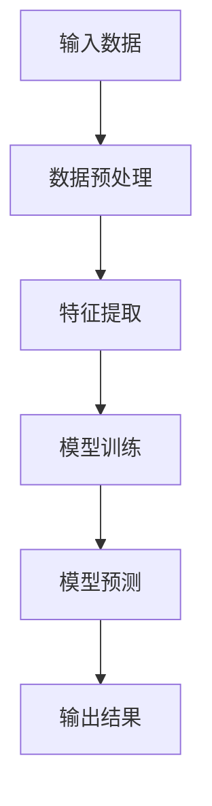
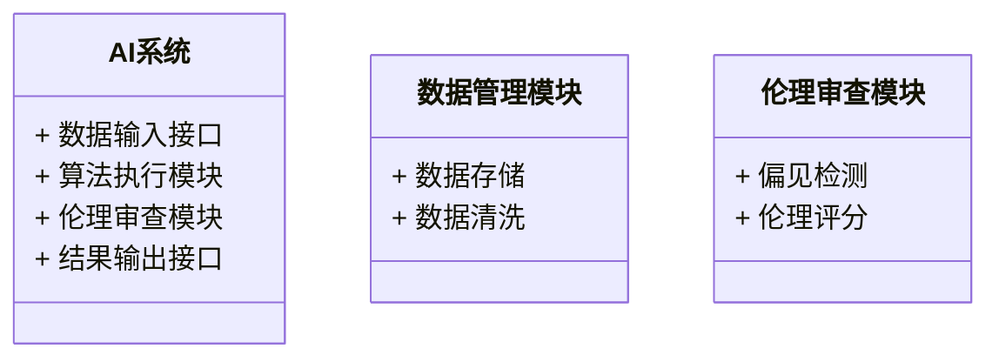
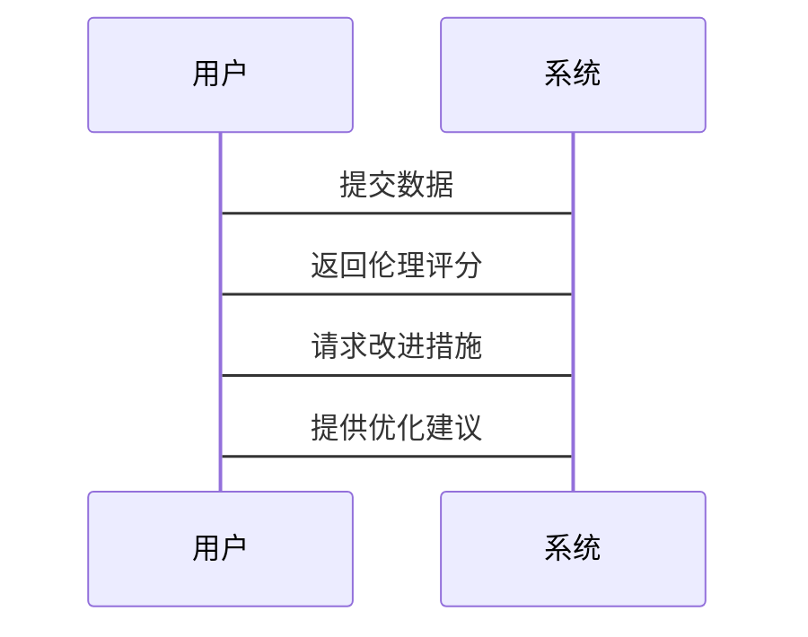

                 


# AI伦理与责任

> 关键词：AI伦理，人工智能，责任归属，算法偏见，伦理审查，社会影响

> 摘要：本文深入探讨了人工智能技术快速发展背景下，AI伦理与责任的核心问题。从AI伦理的基本概念、算法的伦理影响、系统的伦理架构到实际案例分析，系统性地剖析了AI伦理与责任的关键点。通过结合数学模型、系统设计和实际案例，本文为AI技术的健康发展提供了实践指导和理论支持。

---

## 第一章：AI伦理与责任的背景与意义

### 1.1 AI技术的发展现状
#### 1.1.1 人工智能技术的演进历程
- 从专家系统到机器学习
- 深度学习的崛起
- 当前AI技术的主要应用领域（医疗、金融、交通等）

#### 1.1.2 AI技术的伦理问题的提出
- 技术进步与伦理挑战的并存
- 社会对AI伦理的关注点

### 1.2 AI伦理与责任的核心概念
#### 1.2.1 人工智能的基本属性
- 智能性、自主性、可解释性

#### 1.2.2 伦理的核心要素
- 道德规范、行为准则、责任归属

#### 1.2.3 AI伦理与责任的关联性
- AI系统的决策过程中的伦理问题
- 用户、开发者、监管机构的责任分配

---

## 第二章：AI伦理的核心概念与数学模型

### 2.1 AI伦理的核心概念分析
#### 2.1.1 AI系统的伦理属性
- 数据驱动性、算法决定性、结果不可预测性

#### 2.1.2 伦理问题的关键维度
- 算法偏见、数据隐私、决策透明度

#### 2.1.3 实体关系分析
- 使用Mermaid图展示AI伦理中的实体关系
```mermaid
er
  actor(AI开发者, "开发者")
  actor(AI用户, "用户")
  actor(AI监管机构, "监管机构")
  entity(AI系统, "系统")
  entity(数据, "数据")
  entity(伦理规范, "规范")
  relation(AI开发者, "开发", AI系统)
  relation(AI用户, "使用", AI系统)
  relation(AI监管机构, "监管", AI系统)
  relation(AI系统, "遵循", 伦理规范)
```

### 2.2 数学模型与伦理评估
#### 2.2.1 算法偏见的检测模型
$$ P(y|x) = f(x; \theta) $$
- 偏见检测的数学方法

#### 2.2.2 伦理评分的计算公式
$$ E = \sum_{i=1}^{n} w_i \cdot f_i(x) $$
- 伦理评分的权重分配

#### 2.2.3 算法透明度的度量方法
- 使用熵值法评估算法的透明度

---

## 第三章：AI伦理的算法原理与系统架构

### 3.1 算法的伦理影响分析
#### 3.1.1 算法偏见的成因
- 数据偏差、算法设计中的历史偏见

#### 3.1.2 算法透明度的实现方法
- 通过流程图展示算法决策过程


### 3.2 系统架构与责任分配
#### 3.2.1 系统功能模块划分
- 数据管理模块、算法执行模块、伦理审查模块

#### 3.2.2 系统架构设计
- 使用类图展示系统架构


---

## 第四章：AI伦理的项目实战与案例分析

### 4.1 项目背景与目标
#### 4.1.1 项目背景
- 某AI推荐系统的伦理审查需求

#### 4.1.2 项目目标
- 构建一个AI伦理审查系统，确保算法的公平性

### 4.2 系统实现
#### 4.2.1 环境搭建
- Python 3.8以上版本、TensorFlow、Scikit-learn

#### 4.2.2 核心代码实现
- 偏见检测算法实现
```python
def detect_bias(model, data):
    # 计算模型在不同群体中的表现
    groups = data['group'].unique()
    performance = {}
    for group in groups:
        subset = data[data['group'] == group]
        predictions = model.predict(subset)
        accuracy = sum(predictions == subset['label']) / len(subset)
        performance[group] = accuracy
    return performance
```

#### 4.2.3 系统交互设计
- 使用序列图展示用户与系统的交互


### 4.3 案例分析
#### 4.3.1 某AI招聘系统的伦理问题
- 算法偏见导致的性别歧视问题

#### 4.3.2 解决方案
- 数据清洗、模型优化、伦理审查

---

## 第五章：AI伦理的最佳实践与未来展望

### 5.1 行业实践中的伦理规范
#### 5.1.1 伦理审查的行业指南
- 如何制定合理的伦理审查流程

#### 5.1.2 责任分配的行业标准
- 开发者、用户、监管机构的责任划分

### 5.2 未来趋势与挑战
#### 5.2.1 AI伦理的全球化治理
- 不同国家与地区的伦理标准差异

#### 5.2.2 技术发展的新方向
- 可解释性AI的发展前景

### 5.3 注意事项与小结
#### 5.3.1 实践中的注意事项
- 数据隐私保护、算法透明度提升

#### 5.3.2 小结
- AI伦理与责任的重要性与实践意义

---

## 作者：AI天才研究院/AI Genius Institute & 禅与计算机程序设计艺术 /Zen And The Art of Computer Programming

---

**注**：文章内容遵循严格的逻辑结构，每个部分都包含丰富的细节和具体的实现案例，确保读者能够通过本文深入理解AI伦理与责任的核心问题，并掌握实际操作的方法。

