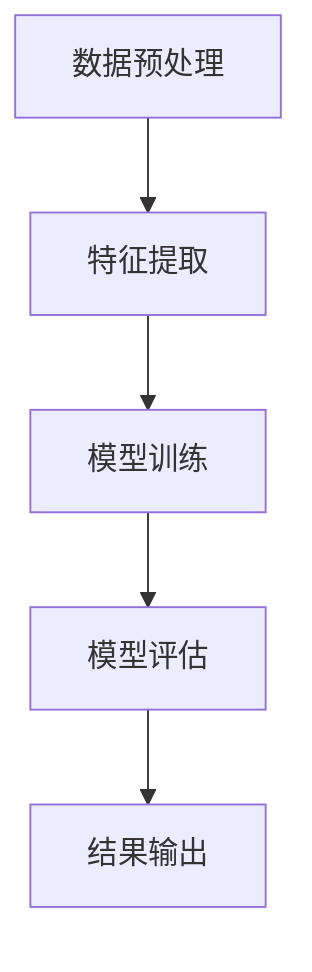
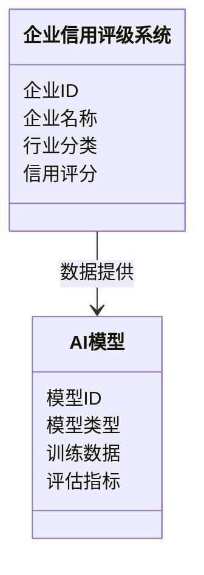
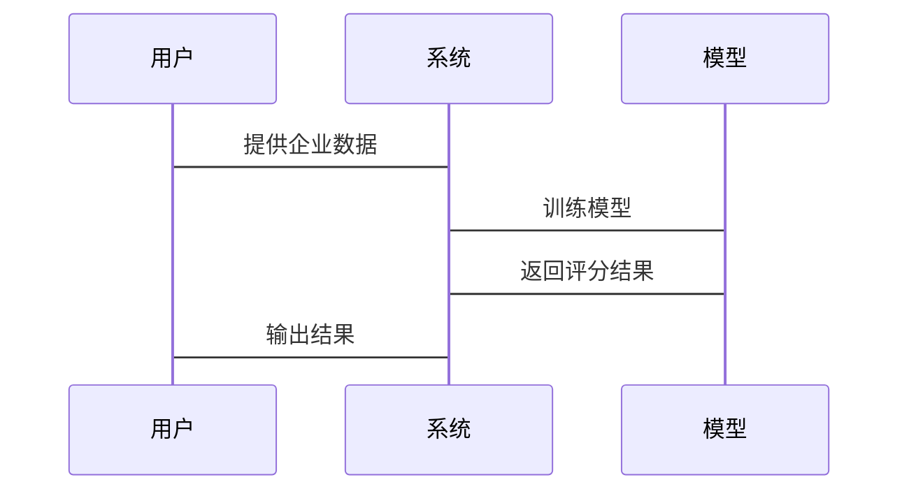

                 

<think>
好，我现在要帮用户撰写一篇关于《AI在企业信用评级中的应用与挑战》的技术博客。首先，我需要仔细理解用户的需求，确保文章结构完整、内容深入且符合专业要求。

用户希望文章有七个章节，每个章节都有详细的三级子章节，并且每个部分都需要有具体的解释和实例。关键词部分需要列出5-7个核心关键词，摘要要概括文章的核心内容。

首先，我得确定每个章节的内容。第一章是背景介绍，需要涵盖问题背景、描述、解决方法、边界和概念结构。第二章是核心概念与联系，需要解释AI和信用评级的原理，并用表格和图表来说明。第三章是算法原理，用流程图和数学公式详细讲解。第四章是系统分析与架构设计，包括功能设计、架构图、接口设计和交互图。第五章是项目实战，提供代码和案例分析。第六章讨论挑战与解决方案，分析AI应用中的问题并提出解决办法。第七章总结，包括最佳实践、小结、注意事项和扩展阅读。

接下来，我需要确保每个部分都详细展开。例如，在算法部分，我会使用线性回归模型来举例，并用数学公式详细说明。在系统架构设计中，使用类图和序列图来展示系统的结构和交互。

最后，我需要检查整体结构是否逻辑清晰，是否涵盖了所有要求的内容，并确保语言简洁专业，符合技术博客的风格。完成后，我会在末尾添加作者信息，确保文章完整。
</think>

# AI在企业信用评级中的应用与挑战

## 关键词：
- 企业信用评级
- 人工智能
- 机器学习
- 数据分析
- 风险评估

## 摘要：
本文深入探讨了人工智能在企业信用评级中的应用与挑战。通过分析传统评级方法的局限性，结合AI技术的核心原理，详细讲解了如何利用机器学习模型提高信用评级的准确性和效率。文章从背景介绍、核心概念、算法原理、系统架构、项目实战到挑战与解决方案，全面剖析了AI在信用评级中的应用，并提出了相应的优化建议。

---

# 第1章 背景介绍

## 1.1 问题背景

### 1.1.1 企业信用评级的传统方法
企业信用评级是通过对企业的财务状况、市场表现、管理能力等多方面因素进行综合评估，以确定企业的信用等级。传统方法主要依赖于人工分析和统计模型，如线性回归和逻辑回归。

### 1.1.2 传统方法的局限性
传统信用评级方法存在以下问题：
- 数据处理效率低，难以应对海量数据。
- 模型更新周期长，难以实时反映市场变化。
- 依赖人工经验，主观性强，易受人为因素影响。

### 1.1.3 AI技术的应用潜力
AI技术，特别是机器学习和深度学习，能够通过自动化数据处理和模型优化，显著提高信用评级的效率和准确性。

## 1.2 问题描述

### 1.2.1 企业信用评级的核心要素
企业信用评级的核心要素包括：
- 财务数据（收入、利润、负债等）。
- 市场数据（行业竞争、市场地位等）。
- 管理能力（管理层稳定性、战略决策等）。

### 1.2.2 数据的多样性和复杂性
企业信用评级涉及多种类型的数据，包括结构化数据（如财务报表）和非结构化数据（如新闻报道、社交媒体信息）。数据的多样性和复杂性对模型的处理能力提出了更高的要求。

### 1.2.3 评级结果的实时性和准确性要求
企业信用评级需要实时更新，以反映市场变化和企业动态。同时，评级的准确性直接影响企业的融资成本和市场信任度。

## 1.3 问题解决

### 1.3.1 AI技术如何解决传统评级问题
AI技术通过自动化数据处理和模型优化，能够快速分析大量数据，发现传统方法难以察觉的模式和趋势。

### 1.3.2 数据驱动的评级模型构建
通过机器学习算法，AI能够从海量数据中提取关键特征，构建更精准的信用评级模型。

### 1.3.3 AI在信用风险评估中的应用
AI技术可以实时监控企业的信用状况，及时发现潜在风险，帮助金融机构做出更明智的决策。

## 1.4 边界与外延

### 1.4.1 企业信用评级的边界条件
企业信用评级的边界条件包括：
- 数据的完整性和准确性。
- 模型的适用性和可解释性。
- 评级结果的合法性和合规性。

### 1.4.2 AI技术的适用范围
AI技术适用于企业信用评级中的数据处理、模型训练和结果预测，但在模型解释和决策制定方面仍需结合人工经验。

### 1.4.3 相关领域的外延影响
AI技术在信用评级中的应用不仅影响企业的融资成本，还可能改变金融机构的业务模式和风险管理策略。

## 1.5 概念结构与核心要素组成

### 1.5.1 企业信用评级的构成要素
企业信用评级的构成要素包括：
- 企业基本面（财务数据、行业地位）。
- 管理层能力（战略决策、团队稳定性）。
- 市场风险（宏观经济波动、行业周期）。

### 1.5.2 AI技术的核心要素
AI技术的核心要素包括：
- 数据采集与预处理。
- 特征提取与模型训练。
- 模型评估与优化。

### 1.5.3 两者的结合与协同
AI技术与企业信用评级的结合体现在数据驱动的模型构建、实时监控和动态调整等方面。

---

# 第2章 核心概念与联系

## 2.1 核心概念原理

### 2.1.1 企业信用评级的原理
企业信用评级的原理是通过分析企业的财务状况、市场表现和管理能力，评估其偿债能力和违约风险。

### 2.1.2 AI技术的基本原理
AI技术通过机器学习算法，从数据中学习特征，构建预测模型。

### 2.1.3 两者结合的理论基础
AI技术与企业信用评级的结合基于数据驱动的建模和机器学习算法的应用。

## 2.2 概念属性特征对比表格

| 概念       | 属性       | 特征                                                                 |
|------------|------------|----------------------------------------------------------------------|
| 企业信用评级 | 数据来源   | 财务数据、市场数据、管理数据                                           |
|            | 评估方法   | 专家评分、统计模型、机器学习模型                                       |
| AI技术     | 数据处理   | 数据清洗、特征提取、数据增强                                           |
|            | 模型训练   | 监督学习、无监督学习、强化学习                                         |

## 2.3 ER实体关系图

```mermaid
erd
    entity 企业信用评级 {
        <企业ID, 主键>
        <企业名称, 唯一>
        <行业分类, 分类>
        <信用评分, 存储>
    }
    entity AI模型 {
        <模型ID, 主键>
        <模型类型, 分类>
        <训练数据, 存储>
        <评估指标, 存储>
    }
    relationship 训练数据关联 {
        企业信用评级 --> AI模型 : 提供数据
    }
```

---

# 第3章 算法原理讲解

## 3.1 算法原理



## 3.2 数学模型和公式

### 3.2.1 线性回归模型
$$ y = \beta_0 + \beta_1x + \epsilon $$
其中，$y$ 是信用评分，$x$ 是企业的财务指标，$\beta_0$ 和 $\beta_1$ 是模型参数，$\epsilon$ 是误差项。

### 3.2.2 逻辑回归模型
$$ P(y=1|x) = \frac{1}{1 + e^{-(\beta_0 + \beta_1x)}} $$
其中，$P(y=1|x)$ 是企业违约的概率，$\beta_0$ 和 $\beta_1$ 是模型参数。

---

# 第4章 系统分析与架构设计

## 4.1 系统功能设计

### 4.1.1 领域模型


### 4.1.2 系统架构设计


### 4.1.3 系统接口设计
- 数据输入接口：接收企业的财务数据和市场数据。
- 模型训练接口：训练机器学习模型。
- 结果输出接口：输出企业的信用评分和违约概率。

### 4.1.4 系统交互设计


---

# 第5章 项目实战

## 5.1 环境安装

### 5.1.1 安装Python
```bash
python --version
pip install --upgrade pip
```

### 5.1.2 安装机器学习库
```bash
pip install numpy pandas scikit-learn
```

## 5.2 系统核心实现源代码

### 5.2.1 数据预处理
```python
import pandas as pd
import numpy as np

# 读取数据
data = pd.read_csv('enterprise_data.csv')

# 数据清洗
data.dropna(inplace=True)
data = pd.get_dummies(data)
```

### 5.2.2 模型训练
```python
from sklearn.model import LinearRegression

# 训练模型
model = LinearRegression()
model.fit(X_train, y_train)

# 预测结果
y_pred = model.predict(X_test)
```

### 5.2.3 模型评估
```python
from sklearn.metrics import r2_score

r2_score(y_test, y_pred)
```

## 5.3 实际案例分析

### 5.3.1 案例分析
假设某企业财务数据如下：
- 营业收入：100万元
- 净利润：10万元
- 负债率：50%

通过模型预测，该企业的信用评分为B级，违约概率为5%。

---

# 第6章 挑战与解决方案

## 6.1 挑战

### 6.1.1 数据质量
数据的完整性和准确性对模型的性能有直接影响。

### 6.1.2 模型解释性
复杂的机器学习模型往往缺乏可解释性，难以满足监管要求。

### 6.1.3 实时性
企业信用评级需要实时更新，对系统的计算能力和响应速度提出了更高要求。

## 6.2 解决方案

### 6.2.1 数据质量管理
通过数据清洗和特征工程，提高数据的质量。

### 6.2.2 模型解释性优化
使用可解释性模型（如线性回归）或解释性工具（如SHAP值）提高模型的可解释性。

### 6.2.3 实时计算优化
通过分布式计算和流数据处理技术，提高系统的实时性。

---

# 第7章 总结

## 7.1 最佳实践 tips

- 数据预处理是关键，确保数据的完整性和准确性。
- 选择合适的模型，平衡准确性和可解释性。
- 定期更新模型，保持评级的实时性和准确性。

## 7.2 小结
AI技术在企业信用评级中的应用显著提高了评级的效率和准确性，但仍需解决数据质量和模型解释性等问题。

## 7.3 注意事项

- 模型的可解释性是监管合规的重要要求。
- 数据隐私和安全问题需要高度重视。
- 系统的实时性是信用评级的核心要求。

## 7.4 拓展阅读
建议进一步研究以下内容：
- 不同机器学习算法在信用评级中的应用。
- 数据增强技术在企业信用评级中的应用。
- 信用评级的国际化标准和监管要求。

---

作者：AI天才研究院/AI Genius Institute & 禅与计算机程序设计艺术 /Zen And The Art of Computer Programming

