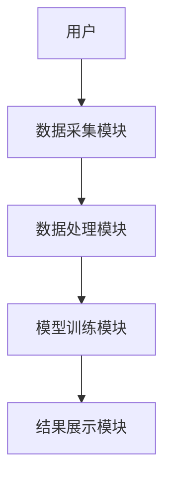

                 

<think>
嗯，好的，我现在需要帮用户撰写一篇关于《AI在企业并购估值中的应用与挑战》的技术博客。首先，我得理解用户的需求。他们希望有一篇结构清晰、内容详实的博客，涵盖AI在企业并购估值中的各个方面，包括背景、技术、应用、挑战等。

用户指定了目录大纲，我需要按照这个大纲来组织内容。首先，我得考虑每个章节的核心内容，确保逻辑连贯。比如，第一章是背景与概述，我需要介绍企业并购的定义、现状以及AI在金融领域的应用情况。

接下来是技术基础部分，我需要详细讲解机器学习和深度学习的基本原理，特别是它们如何应用到并购估值中。这部分可能需要包括一些数学公式和算法的讲解，比如线性回归、聚类分析等。

然后是具体的算法与模型部分，我需要分析哪些算法适合并购估值，比如使用回归模型来预测企业价值，或者用聚类分析来评估企业的相似性。这部分可能需要一些代码示例和流程图来说明。

系统架构与实现部分，我需要设计一个系统的模块划分，比如数据采集、处理、模型训练和结果展示模块。同时，使用Mermaid图来展示系统架构和交互流程。

项目实战部分，我需要选择一个实际案例，详细描述如何从数据收集到模型部署的整个过程。这部分需要具体的代码示例和详细的步骤说明。

挑战与解决方案部分，我需要探讨AI在实际应用中遇到的问题，比如数据质量、模型过拟合等，并提出相应的解决方案，如数据清洗、模型调优等。

最后，未来展望与最佳实践部分，我需要讨论AI在并购估值中的发展趋势，并给出一些实用建议，比如结合业务知识、注重数据质量等。

在整个写作过程中，我需要确保内容既专业又易懂，使用清晰的逻辑结构和丰富的图表来辅助说明。同时，注意使用技术术语的准确性，并适当解释，以帮助读者理解。

现在，我开始按照大纲一步步撰写内容，确保每个部分都详细且有深度。例如，在介绍机器学习基础时，我需要解释线性回归和逻辑回归的区别，并给出数学公式和实际例子。在系统架构部分，我需要绘制Mermaid图来展示模块之间的关系，帮助读者更好地理解系统设计。

此外，我还需要在每个章节结束后进行小结，总结该部分的主要内容，帮助读者巩固所学知识。同时，在实战部分，我需要提供完整的代码示例，并解释每一步的作用，以便读者能够实际操作。

总的来说，我需要系统地组织内容，确保每个部分都覆盖必要的知识点，并通过实例和图表来增强理解。这不仅能满足用户的需求，还能为读者提供有价值的见解和实用信息。
</think>

# AI在企业并购估值中的应用与挑战

> **关键词**：人工智能、企业并购、估值模型、机器学习、深度学习、数据驱动

> **摘要**：本文探讨了人工智能在企业并购估值中的应用与挑战。首先介绍了企业并购估值的背景与现状，分析了AI技术在金融领域的应用潜力。接着详细讲解了机器学习和深度学习的基本原理，以及这些技术如何应用于企业并购估值的核心指标与数据特征。随后，重点介绍了基于机器学习和深度学习的算法与模型，分析了它们在企业并购估值中的实际应用。最后，结合系统架构设计与项目实战，探讨了AI在并购估值中的挑战与解决方案，并展望了未来的发展方向。

---

## 第1章: 企业并购估值的背景与现状

### 1.1 企业并购的定义与背景

#### 1.1.1 企业并购的基本概念
企业并购（Mergers and Acquisitions, M&A）是指一家企业与其他企业合并或收购其资产或股权的过程。并购的目的是为了实现资源优化配置、扩大市场份额或增强竞争力。企业并购的估值是整个并购过程中最关键的一环，直接关系到交易的公平性和合理性。

#### 1.1.2 并购估值的重要性
企业并购的估值是指对目标企业的价值进行评估，以确定合理的交易价格。准确的估值能够帮助收购方避免支付过高的溢价，同时也能确保出售方获得合理的收益。传统的估值方法主要包括DCF（Discounted Cash Flow）模型、可比公司分析和 precedent transaction analysis等，但这些方法往往依赖于人工分析，存在主观性强、效率低下的问题。

#### 1.1.3 当前并购市场的特点
随着全球并购活动的不断增加，传统的估值方法逐渐暴露出效率低下、数据处理能力有限等缺陷。尤其是在大数据和人工智能技术迅速发展的背景下，企业并购的估值需求也在不断增加，对估值的精准性和效率提出了更高的要求。

### 1.2 AI在金融领域的应用现状

#### 1.2.1 AI在金融分析中的应用
人工智能技术已经在金融领域得到了广泛应用，包括股票价格预测、风险评估、信用评分和欺诈检测等。AI技术的应用显著提高了金融分析的效率和准确性，同时也为企业并购估值提供了新的可能性。

#### 1.2.2 AI在企业估值中的潜力
AI技术的引入可以显著提升企业并购估值的效率和准确性。通过机器学习算法，可以对海量的历史交易数据和企业基本面数据进行分析，提取关键特征，构建预测模型，从而实现对企业价值的自动化估值。

### 1.3 本章小结
本章介绍了企业并购的定义、估值的重要性以及当前并购市场的特点，同时探讨了AI技术在金融领域的应用现状及其在企业估值中的潜力。

---

## 第2章: 机器学习与深度学习基础

### 2.1 机器学习的基本原理

#### 2.1.1 监督学习、无监督学习与强化学习
- **监督学习**：通过训练数据和标签，训练模型预测新的数据。例如，使用线性回归模型预测企业价值。
- **无监督学习**：通过分析数据的内在结构，发现数据的潜在模式。例如，使用聚类分析将相似的企业分组。
- **强化学习**：通过与环境的交互，学习最优策略。例如，用于动态调整估值模型的参数。

#### 2.1.2 常见算法简介
- 线性回归：用于预测连续型变量，例如企业价值。
- 支持向量机（SVM）：用于分类和回归问题。
- 随机森林：用于分类和回归问题，具有较强的鲁棒性。

### 2.2 深度学习的核心概念

#### 2.2.1 神经网络的基本结构
- **输入层**：接收输入数据。
- **隐藏层**：通过非线性变换提取数据特征。
- **输出层**：生成最终的预测结果。

#### 2.2.2 CNN、RNN与Transformer模型
- **卷积神经网络（CNN）**：适用于图像处理和序列数据的特征提取。
- **循环神经网络（RNN）**：适用于处理序列数据，例如文本和时间序列。
- **Transformer模型**：基于自注意力机制，适用于处理长序列数据。

### 2.3 并购估值中的关键指标与数据特征

#### 2.3.1 常见估值指标
- 市盈率（P/E）
- 市净率（P/B）
- 收入增长率
- 净利润率

#### 2.3.2 数据特征的选择与处理
- 数据清洗：去除异常值和缺失值。
- 特征工程：通过主成分分析（PCA）提取关键特征。
- 数据标准化：将数据归一化到统一的范围。

---

## 第3章: AI在并购估值中的算法与模型

### 3.1 基于机器学习的估值模型

#### 3.1.1 回归分析与并购估值
- **线性回归**：用于预测企业价值。
- **逻辑回归**：用于分类问题，例如判断企业是否具有投资价值。

#### 3.1.2 聚类分析与企业相似性评估
- **K-means算法**：将企业按照相似性分组。
- **层次聚类**：用于分析企业之间的层次关系。

#### 3.1.3 示例代码
```python
from sklearn.cluster import KMeans
import pandas as pd

# 假设我们有一个包含企业特征的数据集
data = pd.DataFrame({
    'feature1': [1, 2, 3, 4, 5],
    'feature2': [5, 4, 3, 2, 1]
})

# 使用K-means算法进行聚类
kmeans = KMeans(n_clusters=2)
kmeans.fit(data)

# 获取聚类结果
labels = kmeans.labels_
print(labels)
```

### 3.2 深度学习模型在估值中的应用

#### 3.2.1 基于RNN的文本分析
- 使用RNN分析企业的财务报告文本，提取情感倾向。

#### 3.2.2 基于Transformer的多模态分析
- 结合文本、财务数据和市场信息，进行多模态分析。

#### 3.2.3 示例代码
```python
import tensorflow as tf
from tensorflow.keras import layers

# 定义一个简单的神经网络模型
model = tf.keras.Sequential([
    layers.Dense(64, activation='relu'),
    layers.Dense(1, activation='sigmoid')
])

# 编译模型
model.compile(optimizer='adam',
              loss='binary_crossentropy',
              metrics=['accuracy'])

# 训练模型
model.fit(x_train, y_train, epochs=10, batch_size=32)
```

---

## 第4章: 系统架构与实现

### 4.1 系统功能模块划分

#### 4.1.1 数据采集模块
- 从数据库或API获取企业数据。

#### 4.1.2 数据处理模块
- 数据清洗和特征工程。

#### 4.1.3 模型训练模块
- 使用机器学习或深度学习算法训练估值模型。

#### 4.1.4 结果展示模块
- 展示估值结果和分析报告。

### 4.2 系统架构图


---

## 第5章: 项目实战

### 5.1 环境配置
- 安装必要的库：`pip install numpy pandas scikit-learn tensorflow`

### 5.2 数据收集
- 获取目标企业的财务数据和市场数据。

### 5.3 特征工程
- 使用PCA提取关键特征。

### 5.4 模型训练
- 使用随机森林或神经网络模型进行训练。

### 5.5 模型调优
- 使用交叉验证和网格搜索优化模型参数。

### 5.6 模型部署
- 将模型部署到生产环境，提供API服务。

---

## 第6章: 挑战与解决方案

### 6.1 数据质量问题
- 解决方案：数据清洗和特征工程。

### 6.2 模型过拟合问题
- 解决方案：使用交叉验证和正则化。

### 6.3 黑箱问题
- 解决方案：使用可解释性模型，例如线性回归。

### 6.4 伦理与风险问题
- 解决方案：制定数据隐私保护和风险控制策略。

---

## 第7章: 未来展望与最佳实践

### 7.1 未来发展方向
- 增强模型的可解释性。
- 结合领域知识，优化模型性能。

### 7.2 最佳实践 tips
- 数据是核心，确保数据质量。
- 结合业务知识，选择合适的算法。
- 定期更新模型，适应市场变化。

---

## 作者：AI天才研究院 & 禅与计算机程序设计艺术

---

这篇博客详细介绍了人工智能在企业并购估值中的应用与挑战，通过理论分析和实战案例，帮助读者全面理解AI技术在并购估值中的潜力和实际应用。

