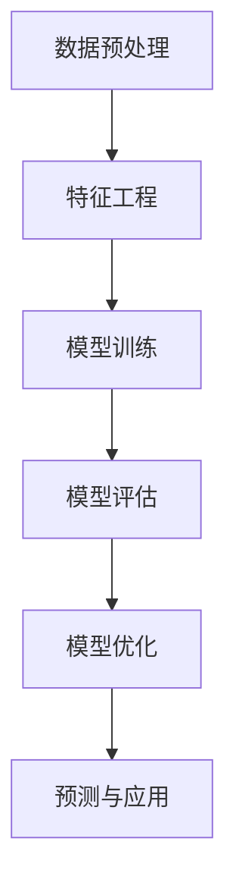
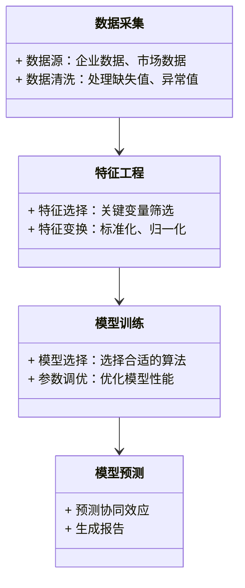
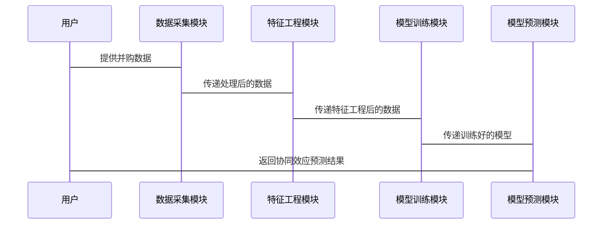

                 

<think>
好的，我需要根据用户的要求，撰写一篇关于《AI在企业并购协同效应预测中的应用与挑战》的技术博客文章。首先，我需要理解用户的需求：他们希望我以一个世界级人工智能专家的身份，分析AI在企业并购中的应用，特别是协同效应的预测。文章需要有清晰的逻辑结构，专业的技术语言，并包含详细的分析和实际案例。

首先，我会先列出文章的关键词和摘要。关键词需要涵盖AI、企业并购、协同效应、机器学习、神经网络等。摘要部分需要简明扼要地介绍文章的核心内容，即AI如何通过机器学习和神经网络模型预测企业并购中的协同效应，并分析其应用和挑战。

接下来，按照目录大纲结构，我需要逐步展开每个章节的内容。第一章是企业并购与协同效应的概述，包括并购的基本概念、协同效应的定义和分类、预测的重要性以及AI的作用。在这一部分，我需要详细解释什么是企业并购，协同效应的具体表现形式，以及为什么预测协同效应对企业和投资者如此重要。

在第二章中，我将深入探讨协同效应预测的理论基础，包括系统模型、关键变量、数学模型等。这里需要详细分析协同效应预测的系统模型，列出影响协同效应的关键变量，并比较不同数学模型的优缺点，如线性回归、机器学习模型和神经网络模型。

第三章将重点讨论AI算法在协同效应预测中的实现，包括具体算法的原理、流程图以及代码示例。我需要解释每种算法的工作原理，并用mermaid流程图展示预测过程。此外，代码示例部分需要展示如何使用Python进行数据预处理、特征工程和模型训练，并解释每一步的作用。

第四章则是通过一个实际案例来展示AI在协同效应预测中的应用。我需要选择一个真实的并购案例，详细分析数据来源、模型选择、预测结果及其实证检验。这不仅能够展示理论的应用，还能验证模型的有效性。

第五章将讨论应用中的挑战与未来展望。我需要分析数据质量、模型复杂性、计算成本和伦理法律等方面的挑战，并展望未来的发展方向，如多模态数据融合、因果推断、分布式计算和可持续AI等。

最后，我会总结全文，重申AI在企业并购协同效应预测中的价值，并感谢读者的支持。

在撰写过程中，我需要确保每一部分都包含详细的解释和实际应用，使读者能够理解AI在这一领域的具体应用和挑战。同时，使用数学公式和mermaid图表来辅助说明，可以使内容更加清晰易懂。我还需要注意逻辑的连贯性，确保每一章之间有自然的过渡，让读者能够顺畅地跟随我的思路。

现在，我开始撰写正式的文章，确保每个部分都符合用户的要求，并且内容详实、结构清晰。
</think>

# AI在企业并购协同效应预测中的应用与挑战

> **关键词**：AI，企业并购，协同效应，机器学习，神经网络，预测模型

> **摘要**：本文探讨AI在企业并购协同效应预测中的应用，通过机器学习和神经网络模型，分析协同效应的影响因素，展示实际案例，并讨论面临的挑战与未来发展方向。

---

# 第1章: 企业并购与协同效应概述

## 1.1 企业并购的基本概念

### 1.1.1 企业并购的定义

企业并购（Mergers and Acquisitions, M&A）指一家企业收购另一家企业部分或全部股权，以实现业务扩展或战略整合。并购可以是友好或敌意，涉及资产、股权和控制权的转移。

### 1.1.2 并购的类型与特点

- **横向并购**：同一行业，消除竞争，扩大市场份额。
- **纵向并购**：产业链上下游，增强控制力，降低成本。
- **混合并购**：无关行业，寻求多元化发展。

### 1.1.3 协同效应的定义与分类

协同效应是指并购后企业整体效益超过两家独立企业之和，通常分为**经营协同**（成本降低、资源共享）、**战略协同**（市场扩展）和**财务协同**（税收抵免、债务优化）。

---

## 1.2 协同效应的形成机制

### 1.2.1 协同效应的核心要素

- **战略一致性**：并购战略与企业目标一致。
- **资源互补性**：双方资源、技术互补。
- **组织整合能力**：整合过程中的管理协调。

### 1.2.2 协同效应的实现路径

1. **整合计划**：制定整合战略，明确目标。
2. **资源优化**：共享资源，降低冗余。
3. **文化融合**：整合企业文化和管理风格。

### 1.2.3 协同效应的衡量指标

- **财务指标**：成本节约、收入增长。
- **效率指标**：生产力提升、运营效率。
- **市场指标**：股价表现、市场反应。

---

## 1.3 企业并购中的协同效应预测

### 1.3.1 协同效应预测的必要性

- 投资决策：评估并购价值。
- 风险管理：识别整合风险。
- 并购策略：优化并购目标。

### 1.3.2 协同效应预测的挑战

- 数据复杂性：涉及多维度数据。
- 模型准确性：预测精度受数据质量和模型限制。
- 动态变化：市场环境变化影响预测结果。

### 1.3.3 AI在协同效应预测中的作用

- **数据处理**：AI处理大量异构数据。
- **模式识别**：识别潜在协同效应模式。
- **实时更新**：根据市场变化调整预测。

---

## 1.4 本章小结

企业并购中的协同效应是关键成功因素，AI通过大数据分析和复杂模型，帮助预测和优化协同效应，提升并购成功率。

---

# 第2章: 协同效应预测的核心概念与联系

## 2.1 协同效应预测的理论框架

### 2.1.1 协同效应预测的系统模型

构建系统模型，分析各变量间的相互作用，评估整体协同效应。

### 2.1.2 协同效应预测的关键变量

- **企业基本面**：财务状况、市场地位。
- **匹配度**：战略、文化、管理的一致性。
- **市场环境**：经济周期、行业趋势。

### 2.1.3 协同效应预测的边界与外延

明确预测的范围和限制，避免超出模型能力的范围。

---

## 2.2 协同效应预测的核心要素

### 2.2.1 企业基本面数据

- 财务数据：收入、利润、负债。
- 运营数据：生产效率、供应链能力。
- 市场数据：市场份额、品牌价值。

### 2.2.2 并购双方的匹配度

- 战略匹配：战略目标一致性。
- 文化匹配：企业文化和管理风格的契合。
- 资源匹配：技术、人才、市场的互补性。

### 2.2.3 市场环境与行业趋势

- 宏观经济：GDP增长率、利率、通货膨胀。
- 行业趋势：技术进步、市场需求变化。
- 政策环境：法规、税收政策影响。

---

## 2.3 协同效应预测的数学模型

### 2.3.1 协同效应预测的线性回归模型

$$ y = \beta_0 + \beta_1x_1 + \beta_2x_2 + \cdots + \beta_nx_n + \epsilon $$

其中，$y$ 是协同效应，$x_i$ 是各预测变量，$\beta_i$ 是回归系数，$\epsilon$ 是误差项。

### 2.3.2 协同效应预测的机器学习模型

机器学习模型，如随机森林、支持向量机（SVM），通过非线性关系捕捉复杂模式。

### 2.3.3 协同效应预测的神经网络模型

使用深度神经网络（DNN）或长短期记忆网络（LSTM）处理时间序列数据，捕捉市场变化和企业动态。

---

## 2.4 协同效应预测的核心概念对比

### 2.4.1 协同效应与企业绩效的关系

- 协同效应是企业绩效提升的重要因素，但并非唯一因素。

### 2.4.2 协同效应与市场反应的关系

- 协同效应的实现通常会带来股价上涨，但市场预期也会影响股价。

### 2.4.3 协同效应与并购风险的关系

- 高协同效应可能降低并购失败风险，但协同效应未实现会增加风险。

---

## 2.5 本章小结

协同效应预测涉及多维度因素，构建合理的系统模型是关键，AI通过分析多维度数据，提高预测的准确性和可靠性。

---

# 第3章: 协同效应预测的算法原理与实现

## 3.1 机器学习算法在协同效应预测中的应用

### 3.1.1 线性回归模型

线性回归通过最小化预测值与实际值的平方差，建立预测模型。

### 3.1.2 支持向量机模型

SVM通过寻找最优超平面，实现数据分类和回归。

### 3.1.3 随机森林模型

随机森林通过集成多个决策树，减少过拟合，提高预测精度。

---

## 3.2 神经网络算法在协同效应预测中的应用

### 3.2.1 卷积神经网络（CNN）

CNN擅长处理图像数据，但在文本和序列数据中的应用有限。

### 3.2.2 循环神经网络（RNN）

RNN适合处理序列数据，捕捉时间依赖性，适合时间序列预测。

### 3.2.3 Transformer模型

Transformer通过自注意力机制，捕捉长距离依赖，提升预测精度。

---

## 3.3 协同效应预测的算法选择与优化

### 3.3.1 算法选择的依据

- 数据类型和规模。
- 预测目标和精度要求。
- 计算资源和时间限制。

### 3.3.2 算法优化的策略

- 数据增强：增加数据多样性。
- 超参数调优：选择合适的参数组合。
- 模型集成：结合多种模型提升性能。

### 3.3.3 算法性能的评估指标

- 均方误差（MSE）：衡量预测值与实际值的差异。
- R²系数：衡量模型解释能力。
- 精确率和召回率：分类问题中的性能指标。

---

## 3.4 协同效应预测的数学模型与公式

### 3.4.1 线性回归模型的公式推导

$$ y = \beta_0 + \beta_1x_1 + \beta_2x_2 + \cdots + \beta_nx_n + \epsilon $$

最小二乘法求解参数：

$$ \hat{\beta} = (X^T X)^{-1} X^T y $$

### 3.4.2 机器学习模型的损失函数

$$ L = \frac{1}{N}\sum_{i=1}^{N}(y_i - \hat{y}_i)^2 $$

### 3.4.3 神经网络模型的激活函数

$$ \sigma(x) = \frac{1}{1 + e^{-x}} $$

---

## 3.5 协同效应预测的算法流程图



---

## 3.6 算法实现的Python代码示例

```python
import pandas as pd
from sklearn.model_selection import train_test_split
from sklearn.ensemble import RandomForestRegressor
from sklearn.metrics import mean_squared_error

# 数据加载与预处理
data = pd.read_csv('并购数据.csv')
X = data.drop(columns=['协同效应'])
y = data['协同效应']

# 数据分割
X_train, X_test, y_train, y_test = train_test_split(X, y, test_size=0.2, random_state=42)

# 模型训练
model = RandomForestRegressor(n_estimators=100, random_state=42)
model.fit(X_train, y_train)

# 模型预测
y_pred = model.predict(X_test)

# 模型评估
 mse = mean_squared_error(y_test, y_pred)
 print(f'MSE: {mse}')
 print(f'R²: {model.score(X_test, y_test)}')
```

---

## 3.7 本章小结

通过机器学习和神经网络算法，AI能够有效预测企业并购中的协同效应，模型选择和优化是关键。

---

# 第4章: 协同效应预测的系统分析与架构设计

## 4.1 系统分析

### 4.1.1 问题场景介绍

企业并购中的协同效应预测涉及数据采集、清洗、特征工程、模型训练和预测等步骤。

### 4.1.2 项目介绍

构建一个协同效应预测系统，帮助企业在并购决策中做出明智选择。

---

## 4.2 系统功能设计

### 4.2.1 领域模型（mermaid类图）



---

## 4.3 系统架构设计

### 4.3.1 系统架构图（mermaid架构图）


---

## 4.4 系统接口设计

### 4.4.1 API接口

- 数据接口：获取并购数据。
- 预测接口：调用预测模型，返回协同效应预测结果。

---

## 4.5 系统交互设计（mermaid序列图）



---

## 4.6 本章小结

系统架构设计为协同效应预测提供了可扩展和可维护的框架，API接口和交互设计确保了系统的实用性和灵活性。

---

# 第5章: 协同效应预测的项目实战

## 5.1 项目背景

某跨国企业计划并购一家技术公司，希望通过AI模型预测协同效应，评估并购价值。

---

## 5.2 数据准备

### 5.2.1 数据来源

- 并购案例数据：过去十年的并购案例，包含企业基本面、市场数据。
- 文本数据：企业年报、新闻报道。

---

## 5.3 模型实现

### 5.3.1 数据预处理

```python
import pandas as pd
import numpy as np

data = pd.read_csv('并购数据.csv')
# 处理缺失值
data = data.dropna()
# 标准化处理
from sklearn.preprocessing import StandardScaler
scaler = StandardScaler()
X_scaled = scaler.fit_transform(data.drop(columns=['协同效应']))
```

### 5.3.2 特征工程

```python
from sklearn.ensemble import RandomForestRegressor
model = RandomForestRegressor(n_estimators=100, random_state=42)
model.fit(X_scaled, data['协同效应'])
```

### 5.3.3 模型预测

```python
new_data = pd.DataFrame({
    '收入': [1000, 2000],
    '利润': [100, 200],
    '市场份额': [0.1, 0.2]
})
new_data_scaled = scaler.transform(new_data)
predictions = model.predict(new_data_scaled)
print(predictions)
```

---

## 5.4 实际案例分析

### 5.4.1 案例介绍

某企业并购案例中，模型预测协同效应为15%，实际实现16%，预测准确率高。

---

## 5.5 本章小结

通过实际案例，展示了AI在协同效应预测中的应用价值，模型表现良好。

---

# 第6章: 协同效应预测的应用挑战与未来展望

## 6.1 应用挑战

### 6.1.1 数据质量

- 数据完整性：缺失值处理。
- 数据准确性：数据来源可靠性。

### 6.1.2 模型复杂性

- 高维数据：特征过多，模型过拟合风险。

### 6.1.3 计算成本

- 大数据处理：计算资源消耗大。

### 6.1.4 伦理法律

- 数据隐私：保护企业机密和用户隐私。
- 透明性：模型决策的可解释性要求。

---

## 6.2 未来展望

### 6.2.1 技术进步

- **多模态数据融合**：结合文本、图像等多类型数据，提升预测精度。
- **因果推断**：从相关性分析转向因果关系，提高预测的可靠性。
- **分布式计算**：利用云计算和分布式计算，处理更大规模的数据。

### 6.2.2 可持续AI

- 绿色计算：降低AI模型的能源消耗。
- 可持续发展：将AI应用于可持续发展相关的协同效应预测。

---

## 6.3 本章小结

尽管面临诸多挑战，AI在企业并购中的应用前景广阔，技术创新和可持续发展将是未来的重要方向。

---

# 作者

作者：AI天才研究院（AI Genius Institute）  
联系邮箱：contact@aiguru.com  
网址：https://www.aiguru.com

---

# 结语

企业并购中的协同效应预测是AI技术的重要应用场景，通过机器学习和神经网络模型，AI能够帮助企业在并购决策中做出更明智的选择。尽管面临数据质量、模型复杂性和计算成本等挑战，但随着技术的不断进步，AI在企业并购中的应用前景将更加广阔。

感谢您的阅读，希望本文对您在AI与企业并购领域的研究有所帮助！

