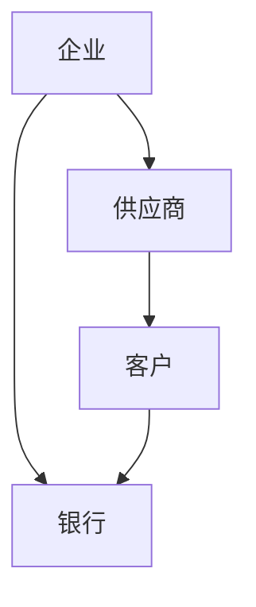
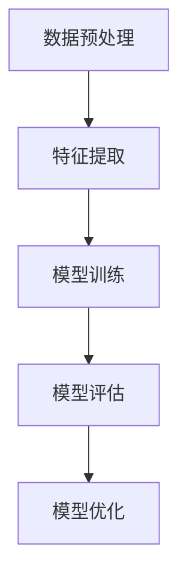
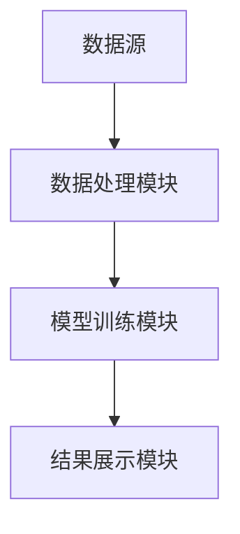
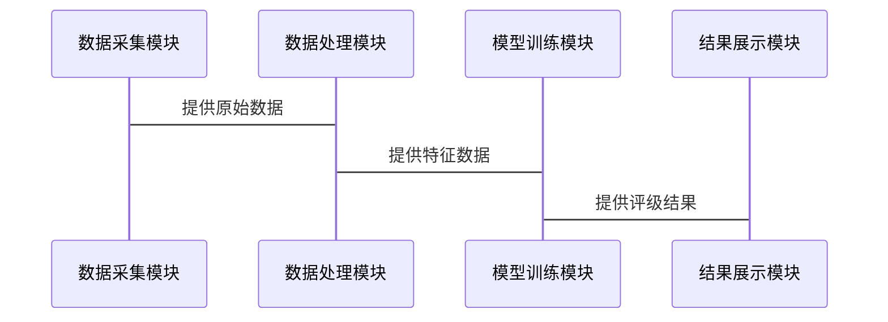

                 

<think>
好的，我现在需要帮助用户完成一个技术博客文章的撰写，主题是《AI在供应链金融信用评级中的深度应用》。用户已经提供了一个详细的目录大纲，现在需要我按照这个大纲逐步完成文章的各个部分。

首先，我需要理解用户的需求。用户希望文章结构清晰，逻辑严密，内容专业且详细。文章需要包括背景介绍、核心概念、算法原理、系统分析、项目实战等多个部分，并且每个部分都有具体的细节和实例。

接下来，我需要按照用户提供的目录结构，逐一完成每个章节的内容。每个章节都需要详细的解释和具体的例子，确保读者能够理解并应用这些知识。同时，用户强调使用Markdown格式，并且每个部分要有详细的代码、图表和公式。

首先，我会处理第一章的背景介绍。这部分需要涵盖供应链金融的定义、特点，以及AI技术在信用评级中的应用背景。我需要确保内容详细，解释清楚每个概念，并且使用适当的术语。

然后，进入第二章的核心概念与联系，这部分需要解释AI技术在信用评级中的核心概念，并绘制实体关系图。我需要使用Mermaid工具来创建图表，确保图表清晰易懂。

接下来是第三章的算法原理，我需要详细解释逻辑回归模型，并使用Mermaid流程图展示算法步骤，同时提供Python代码实现。这部分需要确保代码正确，并且解释清楚每一步的作用。

第四章是系统分析与架构设计，这部分需要描述问题场景，设计系统功能，使用Mermaid类图展示领域模型，并绘制系统架构图。我需要确保系统架构设计合理，并且接口设计清晰。

第五章是项目实战，我需要指导读者如何安装环境，实现核心功能，并提供代码示例。同时，还需要进行案例分析和项目总结，确保读者能够实际操作。

最后，第六章是最佳实践、小结、注意事项和拓展阅读，这部分需要提供实用的建议和进一步的学习方向。

在整个过程中，我需要确保语言简洁专业，逻辑清晰，内容详实。同时，要注意使用适当的数学公式和图表，增强文章的可读性和专业性。如果遇到复杂的概念，需要通过例子和图表来辅助解释，确保读者能够轻松理解。

现在，我开始按照目录大纲逐步完成每个章节的内容，确保每个部分都符合用户的要求，并且内容详尽，结构合理。
</think>

# AI在供应链金融信用评级中的深度应用

> 关键词：供应链金融、信用评级、人工智能、机器学习、深度学习

> 摘要：本文深入探讨了人工智能技术在供应链金融信用评级中的应用，从理论基础到实际案例，全面分析了AI如何优化供应链金融的信用评估过程，提升风险控制能力。文章结合具体算法和系统架构设计，展示了AI技术在供应链金融中的深度应用潜力。

---

# 第一章: 供应链金融信用评级的背景与问题

## 1.1 供应链金融的定义与特点

供应链金融是指通过整合供应链上的商流、物流、信息流和资金流，为核心企业及其上下游供应商和客户提供融资服务的金融模式。其特点包括：

- **系统性**：供应链金融涉及多个参与方，包括核心企业、供应商、客户和金融机构。
- **动态性**：供应链中的交易频繁，数据更新快。
- **数据密集性**：依赖于大量的结构化和非结构化数据。

## 1.2 信用评级的定义与重要性

信用评级是对企业或个人的信用状况进行评估，确定其偿还债务的能力和意愿。在供应链金融中，信用评级直接关系到融资成本和风险控制。

## 1.3 AI技术在供应链金融中的应用背景

随着AI技术的发展，其在金融领域的应用越来越广泛。供应链金融中的信用评级依赖于大量数据，AI技术能够高效处理这些数据，提高评估的准确性和效率。

## 1.4 本章小结

供应链金融是一个复杂的系统，信用评级在其运行中起着关键作用。AI技术的应用为供应链金融带来了新的可能性，特别是在数据处理和风险控制方面。

---

# 第二章: 核心概念与技术原理

## 2.1 AI技术在信用评级中的核心概念

- **数据特征提取**：从供应链数据中提取关键特征，如交易频率、供应商信用历史等。
- **模型训练与优化**：使用机器学习算法训练模型，并进行优化以提高准确性。
- **结果解释与反馈**：对模型输出结果进行解释，并提供反馈以改进模型。

## 2.2 供应链金融信用评级的实体关系图



## 2.3 AI模型在信用评级中的对比分析

| 模型类型       | 输入数据       | 输出结果       | 优势             | 劣势             |
|----------------|----------------|----------------|------------------|------------------|
| 逻辑回归       | 结构化数据       | 概率值         | 简单易解释       | 非线性关系处理差 |
| 决策树         | 结构化数据       | 分类结果       | 高准确性         | 易过拟合         |
| 神经网络       | 结构化+非结构化数据 | 概率值         | 高准确性         | 需大量计算资源   |

## 2.4 本章小结

AI技术在供应链金融信用评级中的应用需要结合多个核心概念，选择合适的模型，并通过数据处理和模型优化提升评估效果。

---

# 第三章: 基于机器学习的信用评级算法

## 3.1 算法原理概述

### 3.1.1 逻辑回归模型

逻辑回归是一种常用的分类算法，适用于二分类问题。其核心思想是通过logit函数将线性组合映射到概率空间。

### 3.1.2 决策树模型

决策树是一种基于树结构的分类算法，能够处理复杂的非线性关系。常用算法包括ID3、C4.5和CART。

### 3.1.3 神经网络模型

神经网络是一种模仿人脑结构的算法，能够处理复杂的模式识别问题。常用的神经网络模型包括卷积神经网络（CNN）和循环神经网络（RNN）。

## 3.2 算法实现步骤



## 3.3 逻辑回归模型的数学公式

逻辑回归的损失函数为：
$$ L(y, \hat{y}) = -\sum_{i=1}^{n} [y_i \ln(\hat{y}_i) + (1 - y_i) \ln(1 - \hat{y}_i)] $$

其中，$\hat{y}_i$ 是模型预测的概率，$y_i$ 是真实标签。

---

# 第四章: 供应链金融信用评级的系统分析与架构设计

## 4.1 问题场景介绍

供应链金融信用评级系统需要处理大量数据，包括企业财务数据、交易记录、市场信息等。

## 4.2 系统功能设计

- 数据采集模块：负责采集供应链各参与方的数据。
- 数据处理模块：对数据进行清洗和特征提取。
- 模型训练模块：基于机器学习算法训练信用评级模型。
- 结果展示模块：将模型输出结果以可视化形式展示。

## 4.3 系统架构设计



## 4.4 接口设计与交互流程



---

# 第五章: 项目实战

## 5.1 环境安装与配置

安装必要的Python库，如scikit-learn、pandas、numpy等。

## 5.2 核心功能实现

### 5.2.1 数据预处理

```python
import pandas as pd
data = pd.read_csv('supply_chain_data.csv')
```

### 5.2.2 特征提取

```python
from sklearn.preprocessing import StandardScaler
scaler = StandardScaler()
data_scaled = scaler.fit_transform(data)
```

### 5.2.3 模型训练与评估

```python
from sklearn.linear_model import LogisticRegression
model = LogisticRegression()
model.fit(data_scaled, labels)
```

## 5.3 实际案例分析

以某企业为例，分析其信用评级结果，并解释模型输出。

---

# 第六章: 最佳实践与拓展阅读

## 6.1 最佳实践

- 数据质量控制
- 模型定期更新
- 结果解释与反馈

## 6.2 小结

本文详细探讨了AI技术在供应链金融信用评级中的应用，从理论到实践，展示了AI技术的强大潜力。

## 6.3 注意事项

- 数据隐私保护
- 模型可解释性
- 算法的适用性

## 6.4 拓展阅读

- 《机器学习实战》
- 《供应链金融与风险管理》

---

# 结语

AI技术正在深刻改变供应链金融的信用评级方式，未来随着技术的进步，其应用将更加广泛和深入。

---

# 作者

作者：AI天才研究院 & 禅与计算机程序设计艺术

